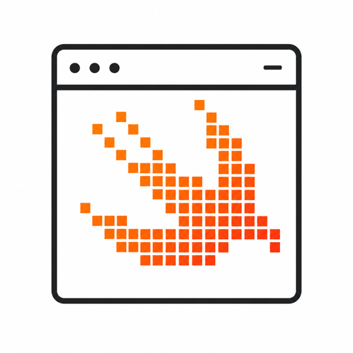

<!-- LOGO -->

<!-- markdownlint-disable MD033 -->

<p align="center">
  
</p>

<h1 align="center">Tessera</h1>

<p align="center">
  <strong>A modern Swift foundation for building terminal applications.</strong>
  <br />
  Cell-buffer rendering and an emerging compositional view layer, built for Swift 6 strict concurrency.
  <br />
  <a href="#why-tessera">Why Tessera</a>
  ·
  <a href="#documentation">Documentation</a>
  ·
  <a href="#quick-start">Quick start</a>
  ·
  <a href="#contributing">Contributing</a>
  ·
  <a href="#community">Community</a>
</p>

<p align="center">
  <a href="https://github.com/robfeldmann/tessera/actions/workflows/ci.yml?query=branch%3Amain"></a>
  <a href="https://robfeldmann.com/tessera/documentation/"></a>
  <a href="https://www.swift.org/"></a>
  <a href="#requirements-and-supported-platforms"></a>
  <a href="LICENSE"></a>
</p>

<!-- markdownlint-enable MD033 -->

<!-- prettier-ignore -->
> [!WARNING]
> Tessera is new, actively developed, and incomplete — not ready for production use. The
> terminal substrate (`TesseraTerminal`) is usable today; the view and
> application-programming layer (`Tessera`) is still under construction and has no stable
> public API yet. APIs may change without notice before 1.0.

## Why Tessera

- **🔒 Safe by construction.** Illegal terminal operations are unrepresentable. Rendering
  happens inside scoped, non-escapable frame transactions (`~Copyable`/`~Escapable`); raw
  file descriptors and platform handles never leak into public API; and the terminal is
  restored on _every_ exit path — normal return, thrown error, or signal. The design goal
  is a SQLite-wrapper-grade seal around raw terminal authority.
- **⚡ Modern Swift 6, not a port.** Written for Swift 6 language mode and strict
  concurrency: actor-serialized output, semantic bounded input streams, and borrowed
  capabilities enforced by the compiler rather than by documentation.
- **🎨 Modern terminal protocols, done right.** Bracketed paste, focus events, SGR mouse
  tracking, the Kitty keyboard protocol, Kitty graphics, OSC 8 hyperlinks, OSC 52
  clipboard, synchronized output, cursor styling, and extended underlines — with runtime
  capability detection and graceful degradation (`NO_COLOR`, `COLORTERM`, nested
  tmux/screen). Tessera aims to be a good terminal citizen: never the layer that strips a
  feature.
- **👻 Verified against a real terminal.** Output snapshots are rendered through Ghostty's
  VT engine (via `libghostty-vt`), so what Tessera emits is validated against a real
  emulator — not a hand-rolled model.
- **🖥️ Truly multi-platform.** macOS, Linux, and Windows (ConPTY), exercised in
  reproducible project VMs so cross-platform behavior is tested, not assumed.
- **🧱 Layered on purpose.** A hardened terminal _producer_ substrate (`TesseraTerminal`)
  sits beneath the emerging _view_ layer (`Tessera`), so you can build directly on the
  substrate today and adopt the higher-level API as it lands.

## Documentation

Start here — the DocC catalogs are the API reference and article home:

- 🌐 [Hosted API documentation](https://robfeldmann.com/tessera/documentation/) — combined
  module reference and articles.

- 📘 [**Tessera** DocC catalog](Sources/Tessera/Tessera.docc/Tessera.md) — umbrella API
  and module map.
- 📗
  [**TesseraTerminal** DocC catalog](Sources/TesseraTerminal/TesseraTerminal.docc/TesseraTerminal.md)
  — the terminal substrate, sessions, and
  [Modern Terminal Protocols](Sources/TesseraTerminal/TesseraTerminal.docc/Articles/Modern-Terminal-Protocols.md).
- 🗺️ [Project status](docs/ProjectStatus.md) — maturity, roadmap, and documentation
  boundaries.
- 🛠️ [Contributing](CONTRIBUTING.md) — dev loop, quality gates, and VM guides.

## Quick start

Add Tessera to your `Package.swift` (use the `main` branch while pre-1.0):

```swift
let package = Package(
  name: "MyApplication",
  dependencies: [
    .package(url: "https://github.com/robfeldmann/tessera.git", branch: "main")
  ],
  targets: [
    .executableTarget(
      name: "MyApplication",
      dependencies: [
        .product(name: "TesseraTerminal", package: "tessera")
      ]
    )
  ]
)
```

This minimal program draws one line and restores the terminal when its scoped session
ends:

```swift
import TesseraTerminal

@main
enum TerminalGreeting {
  static func main() async throws {
    try await TerminalSession.withApplicationTerminal(configuration: .default) { terminal in
      try await terminal.draw { frame in
        frame.write(
          "Hello, Tessera!",
          at: TerminalPosition(column: 0, row: 0)
        )
      }
    }
  }
}
```

Want to see more from a checkout? Run the Showcase:

```sh
just core showcase        # or: swift run --package-path Examples TesseraShowcase
```

## Architecture

Tessera is split into two cooperating layers:

- **`TesseraTerminal` — the producer substrate (available now).** Owns raw terminal
  authority: scoped sessions, mode lifecycle, semantic input, the cell buffer and
  damage-tracking renderer, ANSI/OSC encoding, and modern-protocol support. It turns
  application intent into bytes and coexists politely with the surrounding terminal
  session.
- **`Tessera` — the view and application layer (in progress).** A `View` protocol, layout
  primitives, and widgets in the Ratatui/Lip Gloss tradition, plus an optional
  architecture-agnostic runtime. Not yet a stable public API.

This mirrors the spec's two theses: **terminal citizenship** (be composable, never a
compatibility ceiling) and **ownership/isolation** (safe usage is the natural usage).

## Modern terminal protocols

| Capability                               | Support |
| ---------------------------------------- | ------- |
| Bracketed paste, focus events            | ✅      |
| SGR mouse tracking                       | ✅      |
| Kitty keyboard protocol                  | ✅      |
| Kitty graphics protocol                  | ✅      |
| OSC 8 hyperlinks                         | ✅      |
| OSC 52 clipboard                         | ✅      |
| Synchronized output                      | ✅      |
| Cursor styling & extended underlines     | ✅      |
| Capability detection & color degradation | ✅      |

All protocol enablement is explicit session/runtime policy, and unmodeled sequences can be
emitted through a scoped raw-payload escape hatch — no forking required.

## Requirements and supported platforms

- Swift 6.3 or later
- macOS, Linux, and Windows. Current testing covers:
  - macOS 26.5.2
  - Ubuntu 24.04 (project Linux VM)
  - Windows 11 ARM64 25H2 (project Windows VM)

The supported/tested OS-version range widens as the view layer matures. Contributions that
validate other OS versions are welcome.

## Public products

| Product                          | Use it for                                                                         |
| -------------------------------- | ---------------------------------------------------------------------------------- |
| `TesseraTerminal`                | Terminal session lifecycle, input, buffers, ANSI/OSC output, and modern protocols. |
| `Tessera`                        | Umbrella product for the emerging shared view/app abstractions (pre-API).          |
| `TesseraTerminalSnapshotSupport` | Ghostty-backed virtual-terminal support for output snapshot testing.               |
| `TesseraTerminalTestSupport`     | Fixtures and utilities for terminal-behavior tests.                                |
| `TesseraTestSupport`             | General Tessera test and snapshot support.                                         |

## Roadmap

The next body of work completes the view and application-programming layer, then uses it
to exercise the substrate in integrated applications — including the Showcase app — and to
broaden the OS versions Tessera supports and tests. See
[Project status](docs/ProjectStatus.md).

## Contributing

Contributions are welcome — please read [CONTRIBUTING.md](CONTRIBUTING.md) first. The dev
loop is driven by [`just`](https://github.com/casey/just):

```sh
just core build       # build the package (prepares libghostty-vt)
just core test        # full Swift test suite
just core showcase    # run the Showcase example
just docs preview     # build and serve DocC locally
just quality format   # auto-apply formatting
just quality lint     # strict format + lint gate
```

Cross-platform work runs in reproducible VMs:

- 🐧 [Linux (Lima) test runs](CONTRIBUTING.md#linux) and `just linux …`
- 🪟 [Windows VM with Frost](docs/WindowsFrostVM.md) /
  [manual UTM setup](docs/WindowsVM.md) and `just windows-frost …` / `just windows-utm …`

Start in the appropriate Discussion category before opening a pull request so we can agree
on the problem and direction. First-time contributors then use the
[Vouch Request form](https://github.com/robfeldmann/tessera/discussions/new?category=vouch-request).

## Community

- ❓ [Q&A](https://github.com/robfeldmann/tessera/discussions/categories/q-a) — usage and
  development questions.
- 💡
  [Feature Requests and Ideas](https://github.com/robfeldmann/tessera/discussions/categories/feature-requests-ideas)
  — user needs and proposed behavior before implementation.
- 🔎
  [Issue Triage](https://github.com/robfeldmann/tessera/discussions/categories/issue-triage)
  — help confirming or minimizing behavior that may be a bug.
- 🐛 [Bug reports](https://github.com/robfeldmann/tessera/issues/new?template=bug.yml) —
  confirmed reproducible defects with environment and revision details.
- 📜 [Code of Conduct](CODE_OF_CONDUCT.md) — community standards and private incident
  reporting.
- 🔒 [Security Policy](SECURITY.md) — private vulnerability reporting. Never disclose a
  vulnerability in a public issue or Discussion.

Tessera is early and solo-maintained. Public questions and reports are welcome, but triage
may be slow and the project does not provide guaranteed support.

## Terminal recovery

Tessera restores the terminal on normal exits, thrown errors, and supported signals. If a
development build still leaves your terminal in a bad state, type the recovery command for
your platform even if input is invisible, then press Enter.

macOS / Linux:

```sh
reset      # or, if echo is still broken: stty sane
```

Windows PowerShell (no native `reset`/`stty`):

```powershell
[Console]::Write([char]27 + '[?1049l' + [char]27 + '[?25h' + [char]27 + 'c')
```

## Releases

The [changelog](CHANGELOG.md) records unreleased development history. The first public
source release will follow the release gate.

## License

Tessera is licensed under the [Apache License 2.0](LICENSE). See
[THIRD_PARTY_NOTICES.md](THIRD_PARTY_NOTICES.md) for third-party component notices.
