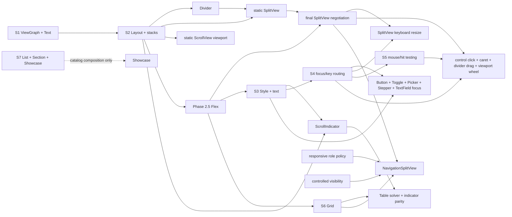

## Framing

Tessera is the Swift counterpart to Ratatui — a cell-buffer rendering and view layer for
terminal apps — with a compositional layout API inspired by Lip Gloss's Join/Place/Compose
primitives. Architecture-agnostic; bring your own state management.

- A cell buffer ✓
- A renderer with damage tracking ✓
- A View protocol and built-in views ✓
- Layout primitives ✓
- Input parsing ✓
- An optional runtime, architecture-agnostic ✓

## How to use this spec

This spec is both a design document and an implementation plan. It is intentionally more
verbose than a normal roadmap because future-you and future agents need enough context to
make local changes without re-litigating terminal architecture from scratch.

Use it selectively:

- **Implementing a slice:** read the current phase intro, the current slice, and any
  referenced prior slices. Follow the Ratatui/crossterm callouts for comparable designs.
- **Changing a public type:** search the whole spec for that type first. Many Phase 2
  types are intentionally extended by Phase 3 and consumed by Phase 4.
- **Debugging behavior:** start with the slice that introduced the behavior, then read its
  tests section and references. Avoid loading unrelated phases unless the bug crosses a
  boundary.
- **Planning a phase boundary:** read the whole previous phase, the next phase intro, and
  the risk/decision notes near the end of relevant slices.
- **Using AI assistance:** give the model the smallest relevant slice plus referenced type
  definitions. Do not ask it to ingest the whole spec unless the task is architectural.
- **Implementing early phases:** prefer the real public API shape as soon as it is
  knowable. Keep behavior small and incomplete, but do not introduce placeholder,
  temporary, or phase-named public API unless there is a specific bootstrap reason.

## Table of contents

- [Framing](#framing)
- [How to use this spec](#how-to-use-this-spec)
- [Terminal citizenship thesis: be composable, not a compatibility ceiling](#terminal-citizenship-thesis-be-composable-not-a-compatibility-ceiling)
- [Ownership and isolation thesis: illegal terminal operations should be unrepresentable](#ownership-and-isolation-thesis-illegal-terminal-operations-should-be-unrepresentable)
- [Phase 0: Foundation](#phase-0-foundation)
- [Phase 1: The Walking Skeleton](#phase-1-the-walking-skeleton)
- [Phase 2: Real terminal foundation](#phase-2-real-terminal-foundation)
  - [Slice 1: The snapshot harness](#slice-1-the-snapshot-harness)
  - [Slice 2: ANSI Encoder](#slice-2-ansi-encoder)
  - [Slice 3: Mode lifecycle + PlatformIO](#slice-3-mode-lifecycle--real-platformio--signal-handling)
  - [Slice 4: Width-aware Buffer + renderer](#slice-4-width-aware-buffer--damage-tracking-renderer)
  - [Slice 5: Legacy input parser](#slice-5-legacy-input-parser-escape-sequences-arrow-keys-function-keys-modifiers)
  - [Slice 6: Windows support](#slice-6-windows-support-for-platformio-setconsolemode-readconsoleinput-windows-signal-equivalents)
- [Phase 3: Modern terminal protocols](#phase-3-modern-terminal-protocols)
  - [Slice 1: Bracketed paste mode](#slice-1-bracketed-paste-mode)
  - [Slice 2: Focus events](#slice-2-focus-events)
  - [Slice 3: SGR mouse tracking](#slice-3-sgr-mouse-tracking)
  - [Slice 4: Kitty keyboard protocol](#slice-4-kitty-keyboard-protocol)
  - [Slice 5: OSC 8 hyperlinks](#slice-5-osc-8-hyperlinks)
  - [Slice 6: Terminal capability detection](#slice-6-terminal-capability-detection)
  - [Slice 7: Kitty graphics protocol](#slice-7-kitty-graphics-protocol)
  - [Slice 8: Color degradation baseline](#slice-8-color-degradation-baseline)
  - [Slice 9: OSC 52 clipboard](#slice-9-osc-52-clipboard)
  - [Slice 10: Cursor styling](#slice-10-cursor-styling)
  - [Slice 11: Underline extensions](#slice-11-underline-extensions)
  - [Slice 12: Runtime protocol control](#slice-12-runtime-protocol-control)
- [Phase 4 — View layer](#phase-4--view-layer-the-tessera-module)
  - [Slice 1: TesseraCore — View, ViewGraph, reconciliation, Text](#slice-1-tesseracore--view-viewgraph-reconciliation-text)
  - [Slice 2: The Layout protocol and stack containers](#slice-2-the-layout-protocol-and-stack-containers)
  - [Phase 2.5: Flex and final SplitView negotiation](#phase-25-flex-and-final-splitview-negotiation)
  - [Slice 3: Styling, text wrapping, and decoration](#slice-3-styling-text-wrapping-and-decoration)
  - [Slice 4: Focus and key routing](#slice-4-focus-and-key-routing-the-responder-system)
  - [Slice 5: Mouse and hit testing](#slice-5-mouse-and-hit-testing)
  - [Slice 6: Grid, Table, and NavigationSplitView composition](#slice-6-grid-table-and-navigationsplitview-composition)
  - [Slice 7: Catalog integration — List, Section, widgets, and the Showcase](#slice-7-catalog-integration--list-section-controlled-widgets-and-the-showcase)
- [Phase 5 — Runtime + polish](#phase-5--runtime--polish)
- [Risk register](#risk-register)
- [Proposed module and file layout](#proposed-module-and-file-layout)

## Terminal citizenship thesis: be composable, not a compatibility ceiling

Tessera is a terminal **producer**: it turns application/view intent into bytes. It is not
an emulator, a PTY host, or a tmux-class multiplexer. The goal is therefore not “support
every terminal standard ever emitted by arbitrary guest programs.” That is the decoder and
screen-model problem that belongs to terminal emulators and multiplexers.

Tessera's citizenship goal is narrower and more important: **never be the layer that
needlessly strips, blocks, or hides a terminal feature.** For a producer library, that
means four design rules:

1. **Restore the terminal on every exit path.** Raw mode, alternate screen, cursor
   visibility, mouse tracking, bracketed paste, focus events, Kitty keyboard, synchronized
   output, and future protocol modes must have symmetric teardown owned by the session.
2. **Expose a scoped raw-output escape hatch.** Users need a way to emit a protocol
   Tessera does not model yet — sixel, iTerm2 inline images, a future OSC, vendor
   extensions — without forking the library. This must be rendered data inside a frame,
   paired with explicit damage-tracking policy, not a public file descriptor or arbitrary
   live write.
3. **Treat capabilities as advisory and degrade gracefully.** Respect environment and user
   policy (`NO_COLOR`, color depth, `TERM`/`COLORTERM`, nested tmux/screen, Windows VT
   mode), observe protocols that actually respond, and let apps inspect what Tessera
   assumed or detected. Capability uncertainty should reduce feature use, not break
   startup.
4. **Coexist with the surrounding terminal session.** Support alternate-screen apps and
   future inline rendering, keep signal/suspend/resume behavior polite, avoid hidden
   global state, and make advanced protocol enablement explicit in session/runtime policy.

The escape hatch is intentionally modeled after the lesson in Ratatui's current buffer
layer: `CellDiffOption` exists because raw ANSI/OSC payloads can affect the screen without
matching the bytes or width of a normal grapheme. Tessera should start with a richer
per-cell/region diff policy instead of retrofitting a boolean later.

If a future Tessera sibling project hosts guest applications in panes, that project is a
terminal emulator/multiplexer. It should embed or delegate to a real VT engine for the
per-pane decode/screen model and keep Tessera for producer-side chrome. Do not let that
future scope leak into Tessera's Phase 1–3 terminal producer substrate.

## Ownership and isolation thesis: illegal terminal operations should be unrepresentable

Tessera's safety goal is to make invalid terminal operations unrepresentable in ordinary
API use. A terminal UI framework should not rely on documentation to prevent writes
outside a render transaction, concurrent rendering, leaked file descriptors, escaped frame
contexts, or app-state mutation from the wrong isolation domain. The public API should
make safe usage the natural usage.

The guiding analogy is a SQLite wrapper that never leaks its raw connection pointer and
only lends transaction-local capabilities inside scoped closures:

- `Database` owns a connection pool; `TerminalSession` owns terminal mode, raw handles,
  input production, and output serialization.
- An actor-backed database writer serializes writes; terminal output is serialized by the
  session/output actors.
- Scoped database read/write closures lend a `Reader` or `Writer`; scoped terminal
  operations lend a `Frame`, `Screen`, event context, or responder context.
- `Reader: ~Copyable, ~Escapable` cannot be stored or escaped; borrowed terminal
  capabilities should have the same shape.
  - Implementation note: a `~Escapable` type (`Reader`, `Frame`, and any future borrowed
    capability) needs a lifetime-dependency source on its initializer, written with
    `@_lifetime(borrow …)` on a stored borrow (typically an `UnsafeMutablePointer` to
    caller-owned storage). `@_lifetime` requires `.enableExperimentalFeature("Lifetimes")`
    in `Package.swift`, which is already enabled package-wide. Without it the compiler
    rejects the initializer with `an initializer cannot return a ~Escapable result`. The
    lending scope (e.g. `TerminalSession.draw`) owns storage that outlives the synchronous
    borrowed body and calls the body directly so a `sending` result is preserved. Types
    that only need to forbid copying/storing (`RenderRegion`, `ResponderContext`) can be
    plain `~Copyable` and do not require this machinery.
- Raw `OpaquePointer` values are private; raw file descriptors and platform handles are
  private and never public API.

This thesis shows up throughout the spec:

1. **Terminal lifecycle owns raw authority.** Phase 2's terminal foundation owns raw
   handles, terminal modes, cleanup, input production, output serialization, and the
   public session capability. Public users get scoped operations, not file descriptors or
   arbitrary live-terminal writes.
2. **Rendering is a scoped transaction.** Phase 2's renderer opens synchronous borrowed
   frame transactions. `draw` may be async to enter the actor, but the render body does
   not suspend while a borrowed frame is live.
3. **Input is semantic and bounded.** Phase 2/3 input design preserves ordered semantic
   input, coalesces latest-value events such as resize, and bounds noisy streams such as
   mouse movement.
4. **Raw terminal output is scoped data, not raw authority.** The producer escape hatch is
   a `RawTerminalPayload` rendered through a borrowed frame and paired with explicit
   diff/opaque-region policy. It must not expose file descriptors, platform handles, or a
   way to write arbitrary bytes outside a render transaction.
5. **Views declare requirements; they do not mutate terminal modes.** Phase 4 view APIs
   can express focus, layout/display invalidation, and terminal requirements
   declaratively. The session/runtime arbitrates and applies mode changes centrally.
6. **Optional runtime isolation is UI-oriented, not business-state ownership.** Phase 5
   may provide an `@MainActor` runtime for event delivery, responder routing,
   invalidation, and render scheduling, but users remain free to bring TCA or any other
   state architecture.
7. **Tests are deterministic by construction.** Test support should provide explicit input
   sources, test terminals, snapshots, stepping, bounded drains, and injected clocks
   rather than relying on `Task.yield()` or wall-clock sleeps.

Do not solve concurrency warnings by making everything `Sendable`. Use `Sendable` for
semantic values that cross isolation domains. Keep views, widgets, app state, dependency
containers, caches, and scoped capabilities inside the isolation domain where they are
valid. Non-sendability is a feature when it prevents invalid cross-domain use.

## Phase 0: Foundation

Phase 0 has exactly one job: **prove your development loop works before you write anything
interesting.** That's it. Every minute you spend in Phase 0 is a minute you're not
learning about terminals, so the goal is to get _out_ of Phase 0 as fast as possible while
still having a foundation you won't have to rebuild.

A useful test: when you finish Phase 0, you should be able to say "I can edit a Swift
file, run `swift test`, see it pass locally, push to GitHub, see CI pass on three OSes,
and generate DocC — all without thinking about it." If any of those friction-causes you,
Phase 0 isn't done. If all of them are smooth, Phase 0 _is_ done, even if your library
does literally nothing yet.

### Repo and package structure

- [x] Git repo initialized
- [x] `Package.swift` with two library products declared: `TesseraTerminal` and `Tessera`
      plus associated test targets.
- [x] A Phase 0-only bootstrap public symbol in each module so each product exports
      _something_ and DocC has something to render. This is the explicit bootstrap
      exception: delete these as soon as a target has real API.
- [x] A trivial test per target that imports the module and asserts on the bootstrap
      symbol, proving the test target is wired correctly
- [x] Swift 6 strict concurrency settings
- [x] Formatting (swift-format?) and linting (SwiftLint?) configured
- [x] DocC generation configured
- [x] `README.md` with the pitch
- [x] A `CONTRIBUTING.md` or equivalent if you want one, though this can wait
- [x] GitHub Actions matrix running `swift build` and `swift test` on macOS, Ubuntu, and
      Windows

### Setup Github CI

For Phase 0 done, the matrix needs `swift build` and `swift test` passing on:

- **macOS** — latest runner, Swift 6.x toolchain (whatever ships with current Xcode)
- **Ubuntu** — latest LTS, official Swift toolchain
- **Windows** — Server 2022 runner, official Swift toolchain

The Windows one is the one most likely to bite you. Swift on Windows has matured a lot but
SwiftPM behavior, path handling, and toolchain installation still have rough edges
compared to Apple platforms. Worth getting it working _now_ with an empty package, because
debugging "why doesn't my termios shim compile on Windows" is much harder when CI itself
is also broken.

#### Concrete workflow shape

A minimal `.github/workflows/ci.yml` that I'd suggest for Phase 0:

```yaml
name: CI
on:
  push:
    branches: [main]
  pull_request:

jobs:
  test:
    strategy:
      fail-fast: false
      matrix:
        os: [macos-latest, ubuntu-latest, windows-latest]
    runs-on: ${{ matrix.os }}
    steps:
      - uses: actions/checkout@v4
      - uses: SwiftyLab/setup-swift@latest
        with:
          swift-version: "6.1" # or whatever your Package.swift requires
      - run: swift build
      - run: swift test

  lint:
    runs-on: macos-latest
    steps:
      - uses: actions/checkout@v4
      - run: swift format lint --recursive --strict Sources Tests
      # plus SwiftLint if you're using it

  docs:
    runs-on: macos-latest
    steps:
      - uses: actions/checkout@v4
      - run: swift package generate-documentation --target Tessera
      - run: swift package generate-documentation --target TesseraTerminal
```

`fail-fast: false` is important — when Windows breaks, you want to see whether Linux and
macOS still pass, not have the whole matrix abort.

#### A note on `SwiftyLab/setup-swift`

It's the de facto community action for installing Swift toolchains across all three OSes.
Apple doesn't ship an official one. There's also `swift-actions/setup-swift` which is
older and less maintained. Either works; `SwiftyLab` is the safer current choice as
of 2026.

#### Things to consciously _not_ do in Phase 0 CI

- **No release builds.** `swift build -c release` is slower and you don't need it yet.
- **No code coverage.** Adds setup time, irrelevant when you have one bootstrap wiring
  test.
- **No DocC _publishing_.** Generating in CI is fine (it catches broken doc comments
  early); deploying to Pages can wait until you have something worth documenting.
- **No caching.** Tempting, but premature. The build is empty; there's nothing to cache.
  Add it in Phase 2 when builds get slow.
- **No branch protection rules requiring green CI.** Set those up _after_ you've seen the
  matrix go green at least once organically.

### What "Phase 0 done" looks like, concretely

When you can do all of the following without thinking, Phase 0 is done:

1. `git push` to main, CI runs and goes green on macOS + Linux + Windows within ~5
   minutes.
2. `swift test` locally produces a passing test (the bootstrap wiring test).
3. `swift package generate-documentation` produces DocC output without warnings.
4. `swift format lint` exits 0.
5. A new contributor (or future-you on a new machine) can clone, run `swift test`, and
   have it work.

If any of these are not yet smooth, that's the work. If all of them are smooth, **stop and
move to Phase 1.** Don't gild Phase 0.

### A heads-up about a likely Windows snag

When you do push and Windows CI runs for the first time, the most common failure is one
of:

- **Toolchain install timing out** — sometimes the Swift Windows installer is slow.
  Usually fixes itself on retry; not a real problem.
- **Path separator issues in `Package.swift`** — unlikely with a fresh package, but if
  you've hand-written any paths with `/` they may misbehave. SwiftPM mostly handles this,
  but watch for it.
- **Line ending issues** — if your repo doesn't have a `.gitattributes` enforcing LF for
  `.swift` files, Windows may check out CRLF and confuse the toolchain. Worth adding:

  ```ini
  # .gitattributes
  * text=auto eol=lf
  *.swift text eol=lf
  ini
  ```

None of these are blocking; they're just the usual "first time on Windows CI" papercuts.
If something else weird shows up, paste me the error and we'll work through it.

### Explicitly NOT in Phase 0

- ❌ No Ghostty / libghostty-vt integration
- ❌ No snapshot test harness
- ❌ No termios code
- ❌ No ANSI encoder
- ❌ No buffer type
- ❌ No view protocol
- ❌ Nothing that touches a terminal

---

## Phase 1: The Walking Skeleton

Phase 1 is the **walking skeleton**: the smallest end-to-end slice that proves the
architecture works. You should be able to run a tiny program, see a character on screen,
press `a` key, see it acknowledged, press `q`, and exit cleanly with your terminal
restored.

The goal is _not_ a usable library. The goal is to have touched every layer of the stack
at least once, in its crudest possible form, so you understand what each layer is for
before you build it properly in Phase 2.

Concretely, when Phase 1 is done you can:

1. Run `swift run HelloTessera` in your example app.
2. See "Hello, Tessera. Press q to quit." rendered in the alt screen.
3. Press any key and see "You pressed: X" update.
4. Press `q` and exit — your shell prompt comes back, your terminal is sane, scrollback is
   intact.
5. If you `kill -9` the process mid-run, your terminal is _not_ sane (we don't fix that
   until Phase 2 with proper signal handling). That's fine for now.

This is deliberately the _minimum viable version_ of each layer. The discipline is: build
the smallest correct version that works, prove it works, then refine and extend it in
later phases. Where feasible, the public API should still use names and shapes that can
survive later phases; keep the implementation small, not artificially phase-named. Use
phase-specific names only for private helpers with a clear migration path.

### PlatformIO — minimum viable

> [!note] Ratatui References
>
> - Ratatui separates terminal I/O into a `Backend` trait (`ratatui-core/src/backend.rs`,
>   line 158) and concrete backend implementations.
> - The crossterm backend (`ratatui-crossterm/src/lib.rs`, line 123) wraps a `Write` and
>   delegates to crossterm for raw mode, alt screen, cursor, and size.
> - The `init` module (`ratatui/src/init.rs`, lines 396–404 for `try_init`, lines 554–559
>   for `try_restore`) shows the setup/teardown order: `enable_raw_mode` →
>   `EnterAlternateScreen` → backend → `Terminal`. Restore reverses: `disable_raw_mode` →
>   `LeaveAlternateScreen`.
> - The crossterm commands behind those calls are useful byte-level references:
>   `enable_raw_mode()` / `disable_raw_mode()` delegate to platform sys modules
>   (`crossterm` `src/terminal.rs`, lines 122–130), and `EnterAlternateScreen` /
>   `LeaveAlternateScreen` write `CSI ? 1049 h/l` (`crossterm` `src/terminal.rs`, lines
>   218–262).
> - The `Backend::size()` trait method (`ratatui-core/src/backend.rs`, line 315) maps to
>   `terminal::size()` in crossterm (`crossterm` `src/terminal.rs`, line 136) or
>   `termion::terminal_size()` in termion (`ratatui-termion/src/lib.rs`, line 259), both
>   ultimately platform terminal-size calls. Input events in examples use
>   `crossterm::event::read()` — in Phase 1 we bypass that library and read raw bytes from
>   stdin directly.

- **POSIX only.** No Windows yet. (`#if os(macOS) || os(Linux)`.)
- Raw mode via `termios`: save current, set `ICANON`/`ECHO` off, apply. Restore on exit.
- Alt screen enter/exit via hardcoded byte strings (`\x1b[?1049h` / `\x1b[?1049l`). The
  ANSI encoder isn't built yet, so these stay a scoped implementation detail rather than a
  public encoder API.
- Stdin reads: blocking read of single bytes in a task. This is a temporary bridge to get
  bytes flowing; Phase 2 replaces it with poll/nonblocking input handling for real event
  streams and ESC-timeout behavior.
- Stdout writes: direct `write(2)` calls, no buffering.
- Terminal size: one `TIOCGWINSZ` call at startup. No resize handling yet — if the user
  resizes mid-run, things look broken until restart.
- **No signal handling.** This is the deliberate scary part. If the user Ctrl-C's, their
  terminal stays in raw mode. We accept this in Phase 1 and fix it in Phase 2.

### ControlSequence — skip entirely

In Phase 1, you have maybe 4-5 ANSI sequences to emit, all hardcoded:

- `\x1b[?1049h` — enter alt screen
- `\x1b[?1049l` — exit alt screen
- `\x1b[2J` — clear screen
- `\x1b[H` — move cursor home
- `\x1b[{row};{col}H` — move cursor (one `String(format:)` call)

Resist the urge to start building the encoder enum yet. You don't know enough about what
shape it wants. Phase 2 introduces the real public `ControlSequence` API, informed by the
bytes you actually emitted in Phase 1.

### Buffer — real, but minimal

> [!note] Ratatui References
>
> - `Buffer` is a flat `Vec<Cell>` backed by a `Rect` area
>   (`ratatui-core/src/buffer/buffer.rs`, line 48). `Index`/`IndexMut` impls (lines
>   279–296) provide subscript-style access via `Position`. `set_string` (line 220)
>   iterates graphemes with width clamping.
> - `Cell` stores `symbol: Option<CompactString>` to support grapheme clusters, plus `fg`,
>   `bg`, and `modifier` fields (`ratatui-core/src/buffer/cell.rs`, line 44).
>   `Cell::EMPTY` is the blank default (line 74). `PartialEq` treats `None` and
>   `Some(" ")` as equal (line 196).
> - `CellWidth` trait on `str` and `Cell` (`ratatui-core/src/buffer/cell_width.rs`,
>   line 16) uses the `unicode_width` crate. For Phase 1, naive `width = 1` is sufficient.
> - `Size` is a simple `width: u16`, `height: u16` struct with `area()` method
>   (`ratatui-core/src/layout/size.rs`, line 42).
> - `Position` is `x: u16`, `y: u16` — maps to the spec's `TerminalPosition` type
>   (`ratatui-core/src/layout/position.rs`, line 46).
> - `Style` is a full struct with `fg: Option<Color>`, `bg: Option<Color>`,
>   `add_modifier`, `sub_modifier` (`ratatui-core/src/style.rs`, line 157). For Phase 1
>   the spec calls for an empty struct — just the type shell.

This one I think you should build _properly_ in Phase 1, because the buffer is the central
abstraction everything else hangs off, and a half-built buffer will warp every layer above
it.

Minimum viable but real:

```swift
public struct TerminalSize: Sendable, Equatable, Hashable {
    public let columns: Int
    public let rows: Int

    public init(columns: Int, rows: Int)
}

public struct TerminalPosition: Sendable, Equatable, Hashable {
    public let column: Int
    public let row: Int

    public init(column: Int, row: Int)
}

public struct Buffer: Sendable, Equatable {
    public let size: TerminalSize
    private var cells: [Cell]

    public init(size: TerminalSize, fill: Cell = .blank)
    public subscript(row: Int, column: Int) -> Cell { get set }
    public mutating func write(_ string: String, at position: TerminalPosition, style: Style)
}

public enum CellDiffPolicy: Sendable, Equatable {
    case normal
    case opaque
    case alwaysRepaint
}

public struct Cell: Sendable, Equatable {
    public var character: Character
    public var style: Style
    public var width: Int  // 1 for now; CJK/emoji is Phase 2
    public var diffPolicy: CellDiffPolicy

    public init(
        character: Character,
        style: Style = Style(),
        width: Int = 1,
        diffPolicy: CellDiffPolicy = .normal
    )
}

public struct Style: Sendable, Equatable {
    // Empty for Phase 1; just the type exists.
    public init()
}
```

Width handling can be naive (assume 1 column per character — broken for CJK, fine for
"Press q to quit"). Style can be an empty struct. `CellDiffPolicy` is inert until Phase
2's renderer, but the public shape should exist from day one so the raw-output escape
hatch and damage tracker do not require a later cell migration. The _shape_ of the type —
value semantics, `subscript`, `write(at:)`, and diff policy — should be right.

### Renderer — naive, no diff

> [!note] Ratatui References
>
> - `Terminal::try_draw` (`ratatui-core/src/terminal/render.rs`, line 118) is the full
>   render pipeline: autoresize → render callback → flush → cursor → swap buffers →
>   backend flush. Phase 1 skips all of this and writes bytes directly.
> - `Terminal::flush` (`ratatui-core/src/terminal/buffers.rs`, line 96) computes the diff
>   between previous and current buffer via `Buffer::diff_iter`, then passes changed cells
>   to `Backend::draw`. Phase 1 does no diffing — it repaints every cell.
> - `BufferDiff` iterator (`ratatui-core/src/buffer/diff.rs`, line 10) yields
>   `(x, y, &Cell)` for changed cells. Phase 2 evolves the naive renderer toward this
>   diff-based approach.
> - `CrosstermBackend::draw` (`ratatui-crossterm/src/lib.rs`, line 213) iterates
>   `(x, y, &Cell)` tuples, queues `MoveTo(x, y)` + style attrs + `Print(symbol)` for
>   each. Shows the pattern of cursor movement + character output that Phase 1 mimics with
>   raw `\x1b[H` and CR/LF.

The Phase 1 renderer is dead simple:

```swift
private func render(_ buffer: Buffer, to io: PlatformIO) async {
    var bytes: [UInt8] = []
    bytes.append(contentsOf: "\x1b[H".utf8)  // home
    for row in 0..<buffer.size.rows {
        for col in 0..<buffer.size.cols {
            bytes.append(contentsOf: String(buffer[row, col].character).utf8)
        }
        if row < buffer.size.rows - 1 {
            bytes.append(0x0d)  // CR
            bytes.append(0x0a)  // LF
        }
    }
    await io.write(bytes)
}
```

Full repaint every frame. No diffing. No damage tracking. No synchronized output. It'll
flicker. That's _fine_ — Phase 2 fixes it. The point of Phase 1's renderer is to prove
that "buffer in, bytes out" works end-to-end.

Renderer tests should stay split by surface area. Small renderer unit tests assert exact
byte sequences and may snapshot a semantic byte dump with chunks like `[home]`, `[row 0]`,
and `[row 1]`, showing both hex bytes and readable terminal text. Medium integration tests
should feed bytes into a virtual terminal and snapshot final screen state rather than
every emitted byte. Large app-like tests should avoid full-screen byte snapshots unless
they are specifically valuable; prefer focused regions, semantic state, or golden fixtures
that remain reviewable.

### InputParser — only `q` and one other key

> [!note] Ratatui References
>
> - Ratatui has no input layer of its own — it delegates entirely to crossterm's `event`
>   module. The demo app (`examples/apps/demo/src/crossterm.rs`, line 45) shows the
>   canonical event loop: `event::poll(timeout)` → `event::read()` → match on `KeyCode`.
>   Phase 1 replaces all of this with raw byte reads from stdin.
> - `crossterm::event::Event` and `KeyCode::Char` are the types used in the demo; the
>   source definitions are in crossterm's public event model (`crossterm` `src/event.rs`,
>   lines 550 and 1221). Phase 1's `InputEvent` is a minimal subset — just `.quit` and
>   `.character(Character)`.
> - Raw mode via `enable_raw_mode()` (`ratatui/src/init.rs`, line 396) puts stdin into
>   character-at-a-time mode so `read()` returns immediately. Phase 1 does this manually
>   with `termios` (see the Mode section), which is what makes single-byte reads possible.
> - crossterm's real Unix parser starts at `parse_event(buffer, input_available)`
>   (`crossterm` `src/event/sys/unix/parse.rs`, line 26). Phase 1 intentionally avoids
>   that whole state machine and handles only printable bytes plus `q`.

You need exactly two things working:

1. Detect a `q` byte (0x71) and signal "quit."
2. Detect any other printable byte and signal "user pressed X."

Don't build a state machine yet. Don't handle escape sequences. Don't think about
modifiers. If the user presses an arrow key in Phase 1, they get garbage on screen (the
raw `\x1b[A` bytes). That's _fine_. Phase 2 extends `InputParser` into a real state
machine.

```swift
public enum InputEvent {
    case character(Character)
    case quit
}

public enum InputParser {
    public static func parse(_ byte: UInt8) -> InputEvent? {
        if byte == 0x71 { return .quit }
        if let scalar = Unicode.Scalar(byte), scalar.isASCII {
            return .character(Character(scalar))
        }
        return nil  // ignore everything else
    }
}
```

### Mode lifecycle — none

No `ModeLifecycle` type yet. Mode management is "main function turns alt screen on at
startup and off at exit, hopes nothing goes wrong." Phase 2 builds the real lifecycle
manager with proper teardown discipline.

### View layer — one `Text` view, no protocol yet

You don't even need the `View` protocol in Phase 1. The example app can just write
directly into the buffer:

```swift
// HelloTessera/main.swift
var buffer = Buffer(size: terminalSize)
buffer.write(
    "Hello, Tessera. Press q to quit.",
    at: TerminalPosition(column: 0, row: 0),
    style: Style()
)
buffer.write("You pressed: \(lastKey)", at: TerminalPosition(column: 0, row: 1), style: Style())
await renderer.render(buffer)
```

This feels wrong — "but we're building a _view_ library!" — but it's deliberate. In Phase
1 you don't yet know what the right `View` protocol shape is. Phase 3 builds it informed
by what you learned writing to the buffer directly. Resisting premature abstraction here
is important.

### The run loop — a single `while`

```swift
let io = try PlatformIO()
try await io.enterRawMode()
try await io.enterAltScreen()
defer { Task { try? await io.exitAltScreen(); try? await io.exitRawMode() } }

var lastKey: Character = " "
var buffer = Buffer(size: try await io.size)

renderLoop: while true {
    buffer.clear()
    buffer.write(
        "Hello, Tessera. Press q to quit.",
        at: TerminalPosition(column: 0, row: 0),
        style: Style()
    )
    buffer.write(
        "You pressed: \(lastKey)",
        at: TerminalPosition(column: 0, row: 1),
        style: Style()
    )
    await renderer.render(buffer, to: io)

    for await byte in io.bytes {
        switch InputParser.parse(byte) {
        case .quit: break renderLoop
        case .character(let c): lastKey = c; continue renderLoop
        case nil: continue
        }
    }
}
```

Crude, single-threaded-feeling, no concurrency story yet. That's intentional. Phase 2
introduces the real actor-based runtime.

### Definition of done for Phase 1

When all of these are true:

1. `swift run HelloTessera` runs and shows the greeting in the alt screen on macOS and
   Linux.
2. Typing letters updates the "You pressed" line.
3. Pressing `q` exits cleanly; terminal is restored, scrollback intact.
4. The `Buffer` type has tests covering: init, subscript get/set, write at position, write
   past end (clips).
5. The naive renderer has tests covering: empty buffer produces N newlines worth of
   spaces, buffer with text produces expected bytes (golden fixture).
6. Total LOC across `Sources/` is somewhere around 300-500. If it's much more, you've
   over-built.

### What you'll learn in Phase 1 (the real point)

Phase 1's deliverable isn't the code — it's the _understanding_. By the time you're done
you'll have first-hand answers to:

- What does `termios` actually feel like to set up and tear down?
- How quickly does naive full-repaint flicker, and at what terminal sizes does it become
  unbearable?
- What's the latency between a keystroke and a visible change? Does it feel responsive?
- What goes wrong when you forget to restore raw mode? (You _will_ forget at least once
  during development. This is educational.)
- How do you actually feed bytes from `read(2)` into an async Swift program?

These are the questions Phase 2 needs answers to. Phase 1 is the field research that makes
Phase 2's design decisions concrete instead of theoretical.

### Three things to flag

1. **The "no `View` protocol yet" decision.** Some people will hate this — it feels
   backwards to build a view library by _not_ building the view abstraction. I think it's
   correct, but I want to check that you're comfortable with deferring it. The alternative
   is a hand-wavy `View` protocol in Phase 1 that churns heavily once real layout and
   rendering needs are known.

2. **The "no signal handling, terminal can be left broken" decision.** This is the
   spiciest call. The original spec was emphatic that this is _non-negotiable_. I'm
   proposing to violate it in Phase 1 to keep the phase small. Defensible argument: "Phase
   1 is a learning exercise, not a release; we add signal handling immediately in Phase 2
   before anything ships." Counterargument: "Get it right from the start so you build the
   muscle memory." Your call — I lean toward deferring, but it's defensible either way.

3. **The Phase 1 LOC estimate (300-500).** If you find yourself blowing past this, it's
   almost always because you started building Phase 2 features. Treat the LOC budget as a
   smell detector, not a hard limit.

---

## Phase 2: Real terminal foundation

Snapshot harness, ANSI encoder, damage-tracking renderer, mode lifecycle, signal handling,
real PlatformIO with `AsyncStream`, Windows support, width handling, and the _legacy_
input parser (just escape sequences for arrow keys, function keys, basic stuff — no Kitty,
no mouse, no paste yet).

### Slice 1: The snapshot harness

#### Why this is first

By the end of Phase 1 you have a naive renderer emitting raw bytes you wrote by hand.
You're about to evolve that into a damage-tracking renderer that emits _minimal_ bytes —
exactly the situation where regression risk is highest. Unit tests on the buffer don't
catch encoder bugs. Unit tests on the encoder catch individual-sequence bugs but not "the
renderer emitted a sequence of correct sequences that interact badly." Snapshot tests
catch all of these by feeding the bytes through a real VT and asserting on the resulting
screen state.

Building the harness first means **every renderer change in Phase 2 lands with a screen
snapshot or focused screen assertion**. That's the discipline the original spec was
reaching for, and it's right — it was just mis-scheduled into Phase 0.

#### Testing strategy: libghostty-vt for rendering tests

Tessera's renderer contract is not "emit this exact byte sequence." Its contract is "emit
bytes that a terminal interprets into the intended screen." Many byte streams can be
visually equivalent: redundant SGR resets, different cursor paths, or a later
minimal-damage renderer replacing a naive full repaint. Renderer tests that assert only on
raw bytes are brittle because they lock in _how_ Tessera draws rather than _what_ the user
sees.

The harness closes the loop with Ghostty's standalone VT library:

```text
Buffer/view intent → Tessera renderer → terminal bytes → libghostty-vt → screen state
```

`libghostty-vt` parses terminal bytes and maintains terminal state: visible cells, styles,
cursor position, modes, scrollback, and render-state metadata. Tessera encodes intent into
bytes; Ghostty independently decodes those bytes into a screen. Agreement between the
expected screen and Ghostty's reconstructed screen is strong evidence that Tessera's
output is correct for the behavior being tested.

Phrase the role carefully: Ghostty is not a proof that every terminal in existence will
behave identically in every edge case. It is a high-quality, shipping terminal parser and
a much better reference than byte equality for screen-level behavior.

This strategy applies only to **output**. Input parsing is the opposite direction — bytes
from the terminal to Tessera events — and remains plain byte-in/event-out tests for
`InputParser`.

Raw byte tests still have a place. The ANSI encoder should have exact byte tests for
small, scalar API behavior:

```text
ControlSequence → ANSIEncoder → exact bytes
```

Renderer and view tests should prefer Ghostty-backed screen assertions unless the test is
specifically about the byte-level encoder contract.

#### Harness shape and package boundaries

The durable Swift API is `VirtualTerminal`, not `GhosttyScreen` or another Ghostty-named
public type. Ghostty is an implementation detail behind a test-support boundary:

```text
TesseraTerminalRenderingTests
  └─ TesseraTerminalSnapshotSupport
       └─ VirtualTerminal
            └─ CGhosttyVT
                 └─ libghostty-vt
```

`Tessera` and `TesseraTerminal` must not re-export the harness. App authors should never
see `VirtualTerminal` from normal imports. The target may use `public` Swift access
control because tests and helper targets need to import it, but it remains test/support
API unless a deliberate `TesseraTerminalSnapshotSupport` product is added later for
downstream test authors.

The harness API should stay small, but separate **how tests request a terminal** from the
**mutable terminal session** itself.

Model the seam as a plain struct of `@Sendable` endpoint closures. This support module is
test-only and is never re-exported, so it needs no dependency-injection framework: tests
construct a terminal directly through a factory. Keep the endpoint closures public, with
`unimplemented` defaults so an unexpected call reports an issue:

```swift
import IssueReporting

public struct VirtualTerminal: Sendable {
    public var feed: @Sendable ([UInt8]) -> Void
    public var text: @Sendable (Int) -> String
    public var cell: @Sendable (_ row: Int, _ column: Int) -> RenderedCell
    public var cursor: @Sendable () -> TerminalPosition
    public var snapshot: @Sendable () -> ScreenSnapshot

    public init(
        feed: @escaping @Sendable ([UInt8]) -> Void =
            unimplemented("VirtualTerminal.feed"),
        text: @escaping @Sendable (Int) -> String =
            unimplemented("VirtualTerminal.text", placeholder: ""),
        cell: @escaping @Sendable (_ row: Int, _ column: Int) -> RenderedCell =
            unimplemented("VirtualTerminal.cell", placeholder: .blank),
        cursor: @escaping @Sendable () -> TerminalPosition =
            unimplemented("VirtualTerminal.cursor", placeholder: .zero),
        snapshot: @escaping @Sendable () -> ScreenSnapshot =
            unimplemented("VirtualTerminal.snapshot", placeholder: .empty)
    )
}
```

A factory builds a Ghostty-backed terminal at the requested size, falling back to a
loudly-`unimplemented` terminal on platforms without libghostty-vt:

```swift
extension VirtualTerminal {
    public static func ghosttyOrPlatformUnsupported(cols: Int, rows: Int) -> Self {
        #if os(Windows)
            platformUnsupported
        #else
            ghostty(cols: cols, rows: rows)
        #endif
    }
}
```

Each test constructs the size it needs and skips where the backing is unavailable:

```swift
@Test(
    .disabled(
        if: VirtualTerminal.isPlatformUnsupported,
        "Windows snapshot coverage is deferred until libghostty-vt builds on Windows.")
)
func `text writes into cells`() {
    let terminal = VirtualTerminal.ghosttyOrPlatformUnsupported(cols: 5, rows: 2)
    terminal.feed("Hello")
    #expect(terminal.text(row: 0) == "Hello")
}
```

The screen-state values remain plain data:

```swift
public struct RenderedCell: Sendable, Equatable {
    public let character: Character
    public let foreground: RenderedColor
    public let background: RenderedColor
    public let bold, italic, underline, reverse: Bool
}

public enum RenderedColor: Sendable, Equatable {
    case `default`
    case indexed(UInt8)
    case rgb(UInt8, UInt8, UInt8)
}

public struct ScreenSnapshot: Sendable, Equatable {
    public let cells: [[RenderedCell]]
    public let cursor: TerminalPosition
}
```

That is the whole API tests need. Whatever C interop or build machinery sits behind it
should remain private to `TesseraTerminalSnapshotSupport`.

#### Direct libghostty-vt integration, not GhosttyKit

The Phase 2 Slice 1 spike validated two approaches:

1. Existing SwiftPM wrappers such as `libghostty-spm` / `GhosttyKit`.
2. A direct `libghostty-vt` build owned by Tessera.

Use the direct `libghostty-vt` path.

The existing wrappers package the broader Ghostty app/surface embedding API and Apple
binary artifacts. That API can write bytes and read viewport text, but it pulls in
surface/rendering/platform concerns that are unnecessary for a headless test harness. The
harness needs the standalone VT API instead:

- `ghostty_terminal_new`
- `ghostty_terminal_resize`
- `ghostty_terminal_vt_write`
- `ghostty_render_state_update`
- render-state row/cell iteration
- cell graphemes, style flags, resolved colors, and cursor data

A tiny `CGhosttyVT` system-library-style module should expose the C headers to Swift.
Tessera can then implement `VirtualTerminal` in Swift on top of those C calls.

`libghostty-vt` is cross-platform in principle. Platform support for Tessera's snapshot
tests should be based on the actual build path we wire into CI, not on SwiftPM's
`platforms` array and not on assumptions from Apple-only wrapper packages. This slice must
make the Ghostty harness work on both macOS and Linux. Windows snapshot coverage can wait
until Phase 2 Slice 6 or until the libghostty-vt build path is proven there.

#### Concurrency model

Treat a `VirtualTerminal` instance as isolated mutable terminal state. Do not share one
Ghostty terminal handle across concurrent tests or tasks.

Preferred design:

- Keep `VirtualTerminal` synchronous and non-`Sendable` if Swift accepts the usage.
- Keep `VirtualTerminal` as a stateless dependency/factory; do not store a shared Ghostty
  handle in the dependency value.
- If isolation becomes necessary, wrap each Ghostty handle in an actor or provide an
  actor-backed test helper.
- Avoid `@unchecked Sendable` unless there is a documented invariant proving the handle is
  never used concurrently.

Swift Testing may run tests in parallel, but each test should create and own its own
`VirtualTerminal`. That is enough isolation for the normal harness use case.

#### Snapshot representations

A terminal screen is a 2D text grid, which makes it unusually well suited to text
snapshots. Use multiple readable representations rather than one giant dump for every
test:

| Strategy    | Captures                                | Use for                               |
| ----------- | --------------------------------------- | ------------------------------------- |
| text grid   | characters only                         | layout and everyday renderer behavior |
| styled grid | characters + parallel style glyph grid  | color/bold/underline behavior         |
| debug dump  | cells, cursor, modes, selected metadata | complex failures and diagnostics      |

The text-grid strategy should have an explicit whitespace policy:

```swift
.terminalText(trim: .trailing)
.terminalText(trim: .none)
```

Trailing trim is friendlier for layout snapshots. Exact rows are better when spaces are
semantically important.

A styled-grid snapshot should keep character and attribute positions aligned, for example:

```text
── chars ──
OK
── style ──
GG....
```

where `G` could mean green + bold and `.` means default. For precise style checks, prefer
focused scalar assertions against `cell(row:column:)`.

Snapshot helpers belong in `TesseraTerminalTestSupport`, not ad hoc test files, when they
are likely to be reused.

#### Example test shapes

Harness smoke tests should land before renderer integration tests. They prove the harness
itself works without depending on Tessera rendering code:

```swift
@Test
func `plain text lands on row zero`() {
    let terminal = VirtualTerminal(cols: 80, rows: 24)

    terminal.feed("Hello, Tessera!")

    #expect(terminal.text(row: 0) == "Hello, Tessera!")
}

@Test
func `cursor movement is reflected in inspected cells`() {
    let terminal = VirtualTerminal(cols: 80, rows: 24)

    terminal.feed("\u{1B}[3;5HX")

    #expect(terminal.cell(row: 2, column: 4).character == "X")
}

@Test
func `sgr style is reflected in inspected cells`() {
    let terminal = VirtualTerminal(cols: 8, rows: 2)

    terminal.feed("\u{1B}[1;4;38;5;196;48;2;1;2;3mXY")
    let x = terminal.cell(row: 0, column: 0)

    #expect(x.character == "X")
    #expect(x.bold)
    #expect(x.underline)
    #expect(x.foreground == .indexed(196))
    #expect(x.background == .rgb(1, 2, 3))
}
```

Renderer tests then feed real Tessera output through the same harness:

```swift
@Test
func `renderer output can be inspected as terminal state`() {
    var buffer = Buffer(size: TerminalSize(columns: 4, rows: 2))
    buffer.write("Hi", at: TerminalPosition(column: 1, row: 0))
    buffer.write("q", at: TerminalPosition(column: 3, row: 1))

    let terminal = VirtualTerminal(cols: 4, rows: 2)
    terminal.feed(Renderer.render(buffer))

    #expect(terminal.text(row: 0) == " Hi ")
    #expect(terminal.text(row: 1) == "   q")
}
```

The key Phase 2 damage-tracking test compares screens, not bytes:

```swift
@Test
func `damage tracking is visually identical to a full repaint`() {
    let full = VirtualTerminal(cols: 10, rows: 1)
    full.feed(Renderer.renderFull(frame2))

    let diffed = VirtualTerminal(cols: 10, rows: 1)
    diffed.feed(Renderer.renderFull(frame1))
    diffed.feed(Renderer.renderDiff(previous: frame1, current: frame2))

    #expect(diffed.snapshot() == full.snapshot())
}
```

The two byte streams are deliberately different. The final screen snapshots must be the
same. This is the correctness property that justifies the test.

#### Build order for this slice

1. Add the direct `libghostty-vt` build/link path and `CGhosttyVT` module boundary for
   macOS and Linux.
2. Add `VirtualTerminal` as a closure-based factory seam, with a Ghostty live
   implementation.
3. Replace the `VirtualTerminal` placeholder with the durable per-terminal inspection API.
4. Add harness smoke tests: text, cursor movement, erase behavior, SGR style/color.
5. Add reusable text/styled/debug snapshot strategies in `TesseraTerminalTestSupport`.
6. Add one renderer integration test: Phase 1 renderer bytes → `VirtualTerminal` →
   asserted screen state.
7. Keep encoder byte tests separate for exact `ControlSequence` output.
8. Prove the harness in local/CI macOS and Linux test runs; document Windows as future
   work unless it is also proven.

#### Definition of done for the snapshot harness

1. `CGhosttyVT` or equivalent C module exposes the direct `libghostty-vt` API to Swift.
2. The direct `libghostty-vt` build path is documented, scripted, and validated on macOS
   and Linux.
3. `VirtualTerminal` exists as a macro-free closure-based client with a Ghostty live
   implementation.
4. `VirtualTerminal`, `RenderedCell`, `RenderedColor`, and `ScreenSnapshot` exist in
   `TesseraTerminalSnapshotSupport` and are not exported by `Tessera` or
   `TesseraTerminal`.
5. Harness smoke tests prove plain text, cursor movement, erase behavior, SGR style/color,
   and cursor inspection.
6. Reusable SnapshotTesting strategies exist for text-grid, styled-grid, and debug output.
7. At least one real renderer integration test feeds Tessera renderer bytes through
   `VirtualTerminal` and asserts the resulting screen.
8. CI runs the harness on macOS and Linux. Windows skips are documented as future work.

---

### Slice 2: ANSI Encoder

Slice 2 is where you start building the only piece of the codebase that's allowed to know
what an ANSI escape sequence looks like. Get the encoder's _shape_ right and the rest of
`TesseraTerminal` falls into place; get it wrong and you'll be plumbing escape codes
through five layers forever.

#### What the encoder is, in one sentence

> [!note] Ratatui References
>
> - The `Backend` trait (`ratatui-core/src/backend.rs`, line 157) defines the contract for
>   drawing, cursor movement, and clearing — the encoder is what fulfills this contract by
>   producing the bytes that each backend method emits.
> - `CrosstermBackend` (`ratatui-crossterm/src/lib.rs`, line 160) wraps a `Write` and
>   delegates to crossterm's `queue!`/`execute!` macros (line 85) to emit sequences. The
>   Tessera encoder replaces this delegation: instead of calling into crossterm, we
>   produce the bytes ourselves.
> - The `Backend::draw` method (`ratatui-crossterm/src/lib.rs`, line 232) iterates cells
>   and emits `MoveTo`, `SetColors`, and `Print` — exactly the kind of "semantic operation
>   → bytes" mapping the encoder encapsulates.

A pure, synchronous, zero-I/O module that turns semantic terminal operations
(`cursorPosition(TerminalPosition(column: 10, row: 5))`, `setForeground(.red)`,
`enterAltScreen`) into the exact bytes that produce them. **It does not write anywhere. It
does not allocate file handles. It does not know what a `PlatformIO` is.** Bytes in, bytes
out — that's the whole interface to the rest of the system.

This isolation is what makes the encoder testable against golden fixtures and what lets
the snapshot harness exist: every normal byte your program emits flows through this
module, so testing this module covers everything downstream. The one deliberate exception
is `RawTerminalPayload`, which still flows through the renderer/session but carries bytes
Tessera does not semantically understand yet.

#### The shape question: enum vs. free functions vs. builder

> [!note] Ratatui References
>
> - Ratatui delegates to crossterm's `Command` trait, whose load-bearing API is
>   `write_ansi(&self, ...)` plus a Windows-only `execute_winapi` fallback (`crossterm`
>   `src/command.rs`, lines 12–27). Concrete command types like `MoveTo`, `Hide`, `Show`,
>   `SetColors`, `Clear`, and `Print` are the closest analogue to Option A (enum with
>   associated values): each is semantic data that knows how to encode itself.
> - The `CrosstermBackend::draw` method (`ratatui-crossterm/src/lib.rs`, lines 232–292)
>   builds a sequence of commands per cell — `MoveTo`, modifier diffs, color changes,
>   `Print` — and queues them into a single buffer. This is exactly the "compose sequences
>   as data" pattern Option A enables.
> - `ModifierDiff` (`ratatui-crossterm/src/lib.rs`, line 535) computes the minimal set of
>   attribute changes between two `Modifier` states and queues only the deltas. The
>   Tessera renderer (slice 4) will need equivalent diffing logic, which is natural when
>   sequences are data (Option A) rather than side effects.

There are three reasonable Swift idioms here, and the choice matters because every other
layer of the stack will be calling into this one.

**Option A: enum with associated values + a single `encode` function.**

```swift
public enum EraseMode: Sendable, Equatable {
    case toEnd
    case toBeginning
    case all
    case allAndScrollback
}

public enum ControlSequence: Sendable, Equatable {
    case cursorPosition(TerminalPosition)
    case cursorVisible(Bool)
    case eraseInDisplay(EraseMode)
    case setForeground(Color)
    case enterAltScreen
    // ... ~30 cases total for Phase 2
}

public enum ANSIEncoder {
    public static func encode(_ sequence: ControlSequence, into buffer: inout [UInt8])
}
```

**Option B: free functions returning bytes.**

```swift
public enum ControlSequence {
    public static func cursorPosition(_ position: TerminalPosition, into: inout [UInt8])
    public static func enterAltScreen(into: inout [UInt8])
    // ...
}
```

**Option C: a builder/writer type.**

```swift
public struct SequenceWriter {
    public mutating func cursorPosition(_ position: TerminalPosition)
    public mutating func enterAltScreen()
    public func finish() -> [UInt8]
}
```

**My recommendation: Option A.** Reasons:

1. **The renderer wants to compose sequences as data, not effects.** A damage-tracking
   renderer in slice 4 will build up a `[ControlSequence]` representing "what changed this
   frame" before emitting bytes. That's natural with an enum, awkward with free functions,
   and a category error with a builder.
2. **Equatable enum cases make tests legible.**

   ```swift
   #expect(sequences == [
       .cursorPosition(TerminalPosition(column: 0, row: 0)),
       .setForeground(.red),
       .text("hi"),
   ])
   ```

   That reads beautifully. Comparing byte arrays in tests is much worse.

3. **Exhaustive `switch` in the encoder.** When you add a new sequence in Phase 3 (Kitty
   keyboard, say), the compiler tells you exactly where to handle it. Free functions
   silently let you forget.
4. **It mirrors how every mature terminal library models this** — Ratatui's `Command`,
   crossterm's `Command`, vty libraries' opcodes. It's the load-bearing abstraction in
   this domain.

The one downside is allocation: building `[ControlSequence]` per frame is more allocation
than streaming directly to a byte buffer. Premature concern. If profiling later shows it
matters, you can add a streaming fast-path alongside without breaking the enum API.

#### The encoding interface

> [!note] Ratatui References
>
> - The `Backend::draw` signature (`ratatui-core/src/backend.rs`, line 183) takes an
>   iterator of `(u16, u16, &Cell)` — the crossterm backend consumes this and queues
>   commands into the writer's internal buffer via `queue!`
>   (`ratatui-crossterm/src/lib.rs`, line 85). The `encode(into: inout [UInt8])` pattern
>   mirrors this: accumulate into a shared buffer rather than return new allocations per
>   call.
> - `crossterm::queue!` vs `crossterm::execute!` (`ratatui-crossterm/src/lib.rs`, line
>   85): `queue!` buffers without flushing (used in `draw`), `execute!` flushes
>   immediately (used in `hide_cursor`, `clear`). The Tessera encoder's `inout [UInt8]` is
>   the queue! side — flush is the caller's responsibility.

```swift
public enum ControlSequence: Sendable, Equatable {
    // ... cases ...
}

public extension ControlSequence {
    /// Appends the bytes for this sequence to `buffer`.
    /// Pure function. Does not allocate beyond growing `buffer`.
    public func encode(into buffer: inout [UInt8])

    /// Convenience for tests and ad-hoc use.
    public var bytes: [UInt8] {
        var b: [UInt8] = []
        encode(into: &b)
        return b
    }
}
```

The `inout [UInt8]` is load-bearing — the renderer will build one big byte buffer per
frame and `encode(into:)` many sequences into it. Returning fresh `[UInt8]` per call would
mean N small allocations per frame. This shape costs nothing and scales.

#### The Phase 2 sequence catalog

> [!note] Ratatui References
>
> - Cursor control maps to `Backend::set_cursor_position` (`ratatui-core/src/backend.rs`,
>   line 229) and `hide_cursor`/`show_cursor` (lines 188, 202). The crossterm backend uses
>   `MoveTo(x, y)` (`ratatui-crossterm/src/lib.rs`, line 245), `Hide` (line 295), and
>   `Show` (line 299). The exact coordinate conversion lives in crossterm: `MoveTo` writes
>   `CSI row;col H` and adds 1 to both zero-based fields (`crossterm` `src/cursor.rs`,
>   lines 60–65).
> - Erase maps to `Backend::clear` (`ratatui-core/src/backend.rs`, line 259) and
>   `clear_region` with `ClearType` (`ratatui-core/src/backend.rs`, line 121). The
>   crossterm backend uses `Clear` from crossterm (`ratatui-crossterm/src/lib.rs`, lines
>   313–322); crossterm's `Clear` command maps clear types to `CSI 2J`, `CSI 3J`, `CSI J`,
>   `CSI 1J`, `CSI 2K`, and `CSI K` (`crossterm` `src/terminal.rs`, lines 341–352).
> - SGR styling maps to the `Color` enum (`ratatui-core/src/style/color.rs`, line 69) and
>   `Modifier` bitflags (`ratatui-core/src/style.rs`, line 104). The crossterm backend
>   emits `SetColors` (line 259), `SetForegroundColor`/`SetBackgroundColor` (lines
>   280–289), and `SetAttribute` via `ModifierDiff` (line 535). The underlying crossterm
>   commands encode colors and attributes as SGR (`crossterm` `src/style.rs`, lines
>   206–339).
> - Alt screen is handled by crossterm's `EnterAlternateScreen`/`LeaveAlternateScreen`
>   (`ratatui-crossterm/src/lib.rs`, lines 127, 145) — the backend itself doesn't expose
>   these as `Backend` trait methods; they're applied at the application level. The actual
>   bytes are `CSI ? 1049 h/l` (`crossterm` `src/terminal.rs`, lines 218–262).
> - `Print` (`ratatui-crossterm/src/lib.rs`, line 274) is crossterm's command for literal
>   text output — the analogue of `text(String)` as a `ControlSequence` case. Its command
>   impl writes the display value directly (`crossterm` `src/style.rs`, line 501).

Concrete list of cases the encoder needs for Phase 2 (informed by the layer-by-layer Phase
1 work; nothing speculative):

##### Cursor control

- `cursorPosition(TerminalPosition)` — CSI `row;colH` (1-indexed in the wire format;
  convert from 0-indexed at the boundary)
- `cursorUp(Int)`, `cursorDown(Int)`, `cursorForward(Int)`, `cursorBack(Int)`
- `cursorVisible(Bool)` — DEC private modes 25
- `cursorSave`, `cursorRestore` — DECSC/DECRC

##### Erase

- `eraseInDisplay(EraseMode)` where `EraseMode` is
  `.toEnd | .toBeginning | .all | .allAndScrollback`
- `eraseInLine(LineEraseMode)` where `LineEraseMode` is `.toEnd | .toBeginning | .all` — a
  separate enum, because EL (`CSI Ps K`) has no scrollback variant and sharing `EraseMode`
  would make `eraseInLine(.allAndScrollback)` representable but meaningless (the
  unrepresentability thesis applies to the encoder too)

##### SGR (styling)

- `resetAttributes` — SGR 0 (worth a dedicated case; emitted constantly)
- `setForeground(Color)`, `setBackground(Color)` — 16-color, 256-color, and truecolor
  variants behind a single `Color` enum
- `setBold(Bool)`, `setItalic(Bool)`, `setUnderline(Bool)`, `setReverse(Bool)`,
  `setDim(Bool)`, `setStrikethrough(Bool)` (Phase 3 Slice 11 replaces `setUnderline(Bool)`
  with `setUnderlineStyle(UnderlineStyle)` plus `setUnderlineColor(Color)`)

##### Modes

- `enterAltScreen`, `exitAltScreen` — DEC private mode 1049
- `enterSynchronizedOutput`, `exitSynchronizedOutput` — DEC private mode 2026 (critical
  for flicker-free updates; we'll lean on this hard in the renderer)
- `enableLineWrap(Bool)` — DECAWM

##### Misc

- `setWindowTitle(String)` — OSC 0/2
- `text(String)` — literal text (just appends UTF-8 bytes; included as a case so a
  `[ControlSequence]` can fully represent a frame's output)
- `raw(RawTerminalPayload)` — explicit escape hatch for bytes Tessera does not model yet;
  only emitted from a render transaction and always paired with diff policy in the buffer
  or frame API
- `bell` — 0x07, occasionally useful

That's roughly 25-30 semantic cases plus the raw escape hatch. Resist adding more "just in
case." Phase 3 will add bracketed paste, focus, mouse, Kitty, OSC 8 as their own cases —
that's the right time.

#### The `Color` type

> [!note] Ratatui References
>
> - Ratatui's `Color` enum (`ratatui-core/src/style/color.rs`, line 69) has cases:
>   `Reset`, 16 named ANSI colors (`Black` through `White`, lines 75–112),
>   `Rgb(u8, u8, u8)` (line 118), and `Indexed(u8)` (line 124). This closely matches the
>   spec's four-case design (`default` → `Reset`, `ansi` → named cases, `rgb`, `indexed`).
> - The `IntoCrossterm<CrosstermColor>` impl (`ratatui-crossterm/src/lib.rs`, line 408)
>   shows the encoding mapping: `Reset` → `CrosstermColor::Reset`, named colors →
>   crossterm's `DarkRed`/`Red` etc., `Indexed(i)` → `AnsiValue(i)`, `Rgb(r,g,b)` →
>   `Rgb { r, g, b }`.
> - The `anstyle` conversion module (`ratatui-core/src/style/anstyle.rs`, line 1) provides
>   bidirectional conversion between Ratatui's `Color` and `anstyle`'s
>   `AnsiColor`/`Ansi256Color`/ `RgbColor`, confirming the three color spaces (16-color,
>   256-color, truecolor) are a standard split.

This is the one place where modeling decisions get fiddly. ANSI has three color spaces and
they're not unified:

```swift
public enum Color: Sendable, Equatable {
    case `default`              // SGR 39 / 49
    case ansi(ANSIColor)        // 16-color: black, red, ..., brightWhite
    case indexed(UInt8)         // 256-color: any 0-255
    case rgb(UInt8, UInt8, UInt8)  // truecolor
}

public enum ANSIColor: Sendable, Equatable, CaseIterable {
    case black, red, green, yellow, blue, magenta, cyan, white
    case brightBlack, brightRed, ..., brightWhite
}

public struct TextAttributes: OptionSet, Sendable {
    public let rawValue: UInt16

    public init(rawValue: UInt16)

    public static let bold = TextAttributes(rawValue: 1 << 0)
    public static let dim = TextAttributes(rawValue: 1 << 1)
    public static let italic = TextAttributes(rawValue: 1 << 2)
    public static let underline = TextAttributes(rawValue: 1 << 3)
    public static let reverse = TextAttributes(rawValue: 1 << 4)
    public static let strikethrough = TextAttributes(rawValue: 1 << 5)
}
```

A few decisions baked in here worth flagging:

- **`default` is a first-class case**, not "fall back to ANSI 0". Resetting to default fg
  is a different SGR code than setting black, and confusing the two creates subtle
  rendering bugs.
- **`ansi` and `indexed(0..<16)` are kept distinct** even though they overlap.
  `ansi(.red)` emits SGR 31; `indexed(1)` emits SGR 38;5;1. Terminals may render these
  slightly differently (ANSI 16 typically respects user palette; indexed always uses the
  256-color cube), and being explicit matters.
- **No 256-color named constants.** If a user wants `indexed(208)`, they pass 208. Naming
  256 colors is a job for a _theme_ library, not the encoder.
- **No silent down-conversion inside the encoder.** If the caller asks the encoder for
  `rgb(...)`, the encoder emits the truecolor sequence. Capability policy belongs above
  the encoder: the renderer/session can choose an already-downsampled `Color` based on
  `NO_COLOR`, detected color depth, or user configuration before encoding.

#### Raw payload escape hatch

The raw escape hatch is how Tessera avoids becoming a compatibility ceiling. It exists for
terminal protocols Tessera has not modeled yet and for application-specific extensions:
sixel, iTerm2 OSC 1337 inline images, future OSCs, vendor DCS payloads, or experiments.

```swift
public struct RawTerminalPayload: Sendable, Equatable {
    public let bytes: [UInt8]
    public let declaredWidth: Int?

    public init(bytes: [UInt8], declaredWidth: Int? = nil)
}
```

Rules:

- `RawTerminalPayload` is bytes, not authority. It can be encoded only as part of a render
  transaction; it does not expose `PlatformIO`, file descriptors, or immediate writes.
- Callers that emit raw bytes must also declare the cells or region whose display is now
  foreign/opaque to Tessera's normal cell model. Slice 4 defines the corresponding
  `CellDiffPolicy` and `Frame.writeRaw` behavior.
- Prefer a first-class semantic `ControlSequence` once Tessera intentionally supports a
  protocol. For example, OSC 8 becomes `openHyperlink`/`closeHyperlink` in Phase 3 rather
  than staying raw forever. Kitty graphics graduates the same way in Phase 3 Slice 7 —
  `ControlSequence.kittyGraphics` replaces raw APC transmit/place bytes once Tessera
  decided to support the protocol directly; sixel and iTerm2 inline images stay on this
  escape hatch until a future slice does the same.
- Tests should include at least one raw payload that has zero display width (an OSC-like
  sequence) and one that claims visible width/area, proving the diff policy rather than
  string width drives repaint behavior.

#### What the encoder does _not_ do

> [!note] Ratatui References
>
> - The crossterm backend's `draw` method (`ratatui-crossterm/src/lib.rs`, lines 232–292)
>   tracks state across the loop (`fg`, `bg`, `modifier`, `last_pos`) to minimize
>   redundant SGR emissions. This is the "buffering of state" that the Tessera encoder
>   deliberately pushes to the renderer layer — the encoder itself is stateless, the
>   renderer decides what to emit.
> - `ModifierDiff` (`ratatui-crossterm/src/lib.rs`, line 535) computes minimal attribute
>   deltas between frames. Tessera's renderer will need equivalent logic, not the encoder.
> - `BufferDiff` (`ratatui-core/src/buffer/diff.rs`, line 10) and `Buffer::diff_iter`
>   (`ratatui-core/src/buffer/buffer.rs`, line 506) compute which cells changed between
>   frames. This is the "no batching" / "no clamping" boundary: the diff layer decides
>   what changed, the encoder just produces bytes for what it's told.
> - `TestBackend` (`ratatui-core/src/backend/test.rs`, line 32) is Ratatui's in-memory
>   backend for golden-byte-style testing — it records what was drawn and lets you assert
>   on the resulting `Buffer`. The Tessera `VirtualTerminal` (libghostty) plays a similar
>   role but at a lower level (byte → terminal state, not cell → buffer).

This list matters as much as the catalog:

- **No buffering of state.** The encoder doesn't remember "the current foreground is red,
  don't re-emit the SGR." That's the renderer's job (and the renderer will need to do it
  carefully to minimize bytes). The encoder is stateless.
- **No batching.** `encode(into:)` produces exactly the bytes for the one sequence it's
  called with. Sequencing is the caller's problem.
- **No clamping.** If you ask for an out-of-range cursor position, the encoder emits
  exactly those bytes. Validation belongs at a higher layer if it belongs anywhere.
- **No querying.** Sequences that request a response from the terminal (DA1, cursor
  position report) are not Phase 2. They need a response-parsing infrastructure that's
  better designed later.
- **No assumptions about the I/O sink.** The encoder writes bytes into a `[UInt8]`;
  whether those bytes go to stdout, a pipe, a `VirtualTerminal` in tests, or `/dev/null`
  is not its concern.

#### Testing strategy for the encoder

> [!note] Ratatui References
>
> - `TestBackend` (`ratatui-core/src/backend/test.rs`, line 32) provides an in-memory
>   implementation of `Backend` that records all draw operations into a `Buffer`.
>   Ratatui's widget tests use it for golden-buffer assertions: draw a widget, compare the
>   resulting buffer to expected output. This is the "golden byte fixture" pattern at the
>   cell level.
> - The buffer diff tests (`ratatui-core/src/buffer/buffer.rs`, lines 1094–1121) test
>   `diff_iter` against known inputs — `diff_empty_empty`, `diff_empty_filled`, etc. This
>   is the structural analogue of Tessera's golden-byte tests: known input → known output,
>   no terminal involved.
> - Ratatui does not have a byte-level encoder test suite because encoding is delegated to
>   crossterm. Tessera's encoder _is_ the encoding layer, so the golden-byte +
>   VirtualTerminal round-trip strategy fills the gap that Ratatui's delegation model
>   sidesteps.

This is the part that pays the harness back. For every `ControlSequence` case, two tests:

1. **Golden byte fixture.**

   ```swift
   #expect(
       ControlSequence.cursorPosition(TerminalPosition(column: 0, row: 0)).bytes ==
           [0x1b, 0x5b, 0x31, 0x3b, 0x31, 0x48]
   )
   ```

   That is `\e[1;1H`: tedious to write the first time, immortal regression coverage
   forever.

2. **Round-trip through `VirtualTerminal`.** Feed the bytes to libghostty, assert the
   terminal state changed as expected. This catches "I emitted bytes that _look_ right but
   the actual escape sequence does something else."

Together these cover both "the bytes are what I think they are" and "the bytes do what I
think they do." Either alone is insufficient.

I'd also write **one negative test per ambiguous case** — e.g., assert that
`setForeground(.default)` emits SGR 39, not SGR 30. The cases where you might guess wrong
are exactly the cases worth pinning down.

#### Definition of done for slice 2

1. `ControlSequence` enum with the ~25-30 cases listed above.
2. `Color` and `ANSIColor` types.
3. `encode(into:)` implementation for every case.
4. ~60 tests: one golden-byte test per case (~30) plus one `VirtualTerminal` round-trip
   per case (~30).
5. Documentation comments on every case linking to the relevant VT100/xterm/DEC reference.
   (The encoder is the project's institutional memory for "why is this byte 0x1b and not
   0x9b" — it deserves comments.)
6. The Phase 1 walking skeleton is rewritten to use `ControlSequence` instead of hardcoded
   byte strings. This is a small refactor and proves the encoder is usable from the
   renderer's perspective.

Roughly another couple of evenings of work. Most of it is mechanical; the design decisions
are all up front, which is why we're spending so much time on them now.

#### Three things to flag

> [!note] Ratatui References
>
> - Ratatui does not currently emit synchronized output (DEC 2026) sequences. The
>   `CrosstermBackend::draw` method (`ratatui-crossterm/src/lib.rs`, line 232) queues
>   commands directly without wrapping in `DEC private mode 2026`. This is a known gap —
>   crossterm itself has `EnableLineWrap`/`DisableLineWrap` but no sync output command in
>   the versions Ratatui supports.

1. **Synchronized Output (DEC 2026) is in the Phase 2 catalog.** This is a relatively new
   mode — not all terminals support it, but the ones that do (Ghostty, iTerm2, Kitty,
   modern Alacritty, WezTerm) make a huge difference for flicker. Terminals that don't
   support it just ignore the sequence, so emitting it is always safe. The damage-tracking
   renderer in slice 4 will wrap every frame in
   `enterSynchronizedOutput`/`exitSynchronizedOutput`. Worth knowing now so the encoder
   API supports it.

2. **`text(String)` as a case feels weird but is correct.** It lets a `[ControlSequence]`
   be a complete representation of a frame's output (styling + cursor moves + actual text
   content interleaved). The alternative — text is "outside" the encoder — fragments the
   model and makes the renderer ugly. Worth pushing back on if it bothers you, but I think
   it's the right call.

3. **The `Color` type is going to be load-bearing across the whole stack** — `Style` will
   hold one, themes will produce them, view APIs will accept them. The shape we pin down
   here is hard to change later. The four-case design above (`default`, `ansi`, `indexed`,
   `rgb`) is what every serious terminal library converges on, but worth confirming you're
   happy with it before we move on.

---

### Slice 3: mode lifecycle + real PlatformIO + signal handling

This slice is where Tessera grows up. Phase 1's "main function turns alt screen on, hopes
nothing goes wrong" grows into a real lifecycle manager that **guarantees** the terminal
is restored no matter how the program exits — clean exit, thrown error, `Ctrl-C`,
`SIGTERM`, `SIGHUP` from a disconnected ssh session, panic, anything. The promise is: _if
Tessera ever touches the terminal, Tessera puts it back._

This is the load-bearing reliability commitment of the whole library. Get this wrong and
every user has to know how to type `reset` in a broken terminal. Get it right and Tessera
disappears.

#### The three problems this slice solves

1. **Mode lifecycle.** Raw mode and alt screen aren't booleans you flip; they're nested
   state with strict ordering. Enter raw mode _then_ alt screen; exit alt screen _then_
   raw mode. Doing it in the wrong order leaves the terminal subtly broken. We need a type
   that enforces this.

2. **Async I/O.** Phase 1's "blocking `read(2)` in a `Task`" is fine for a walking
   skeleton but doesn't compose with the rest of an async program. We need `bytes` as an
   `AsyncSequence<UInt8>` and `write(_:)` as an async function — both backed by
   non-blocking I/O with proper cancellation.

3. **Catastrophic-exit recovery.** Swift's `defer` runs on normal scope exit and thrown
   errors. It does _not_ run on signal-induced termination. `SIGINT`, `SIGTERM`, `SIGHUP`,
   `SIGQUIT` will kill the process with the terminal still in raw mode unless we install
   handlers.

Each problem has a tidy solution; the work is in getting them to compose.

#### The `ModeLifecycle` type

> [!note] Ratatui References
>
> - Ratatui's `init` module (`ratatui/src/init.rs`) provides `try_init` (line 397) and
>   `try_restore` (line 554) which encode the enter/exit ordering: `enable_raw_mode` →
>   `EnterAlternateScreen` on enter, `disable_raw_mode` → `LeaveAlternateScreen` on exit.
> - The crossterm pieces underneath are the same mode primitives Tessera will encode or
>   implement directly: raw mode delegates through `crossterm` `src/terminal.rs`, lines
>   122–130; alternate screen writes `CSI ? 1049 h/l` in `crossterm` `src/terminal.rs`,
>   lines 218–262.
> - The `run` function (`ratatui/src/init.rs`, line 318) wraps a closure with setup and
>   guaranteed cleanup — the closest Rust analogue to Tessera's `enter`/`exit` contract.
> - Unlike Tessera's all-or-nothing set semantics, Ratatui's `try_init` enables modes
>   sequentially without rollback; a failure midway leaves the terminal partially
>   modified. Tessera's `ModeLifecycle.enter` improves on this by rolling back on partial
>   failure.

This is the user-facing entry point. The shape:

```swift
public actor ModeLifecycle {
    public enum Mode: Sendable {
        case rawMode
        case altScreen
        case mouseTracking                  // Phase 3
        case bracketedPaste                 // Phase 3
        case focusEvents                    // Phase 3
        case kittyKeyboard                  // Phase 3
    }

    public init(io: PlatformIO)

    public func enter(_ modes: Set<Mode>) async throws
    public func exit() async throws

    public var activeModes: Set<Mode> { get async }
}
```

A few load-bearing properties of this design:

- **Modes are entered as a set, all-or-nothing.** Either every requested mode is active or
  none are. If entering alt screen succeeds but enabling mouse tracking fails, the
  lifecycle rolls back the alt screen before throwing. This is critical — partial states
  are how terminals end up broken.

- **`enter` is idempotent-ish.** Calling `enter` twice with overlapping mode sets is an
  error, not a no-op. Tessera applications enter modes once at startup; if you find
  yourself wanting to call `enter` mid-run, something is wrong with your design. (The
  exception is Phase 3's `mouseTracking`, which you may legitimately toggle. We'll handle
  that when we get there.)

- **`exit` always works.** Even if state tracking gets confused, `exit` emits the disable
  sequence for every mode it _believes_ might be active _and_ the mode it _requested_ be
  active. Over-cleaning is fine; under-cleaning is what causes broken terminals. We bias
  hard toward over-cleaning.

- **It's an actor, not a struct.** Mode state is shared mutable state by definition (the
  terminal is the state). Wrapping it in an actor gets Swift 6's strict concurrency happy
  and serializes mode transitions, which is exactly the semantics you want.

#### The teardown discipline (the spicy part)

> [!note] Ratatui References
>
> - Ratatui installs a panic hook via `set_panic_hook()` (`ratatui/src/init.rs`, line 566)
>   that calls `restore()` before delegating to the previous hook. This covers panics but
>   not signal-induced termination — Tessera's layered approach (defer + signal handlers +
>   atexit) goes further.
> - The `Terminal` struct implements `Drop` (`ratatui-core/src/terminal.rs`, line 473) to
>   restore cursor visibility on scope exit, analogous to Tessera's `defer` layer.
> - Ratatui's `restore()` (`ratatui/src/init.rs`, line 524) and `try_restore()` (line 554)
>   perform the actual teardown (`disable_raw_mode` → `LeaveAlternateScreen`). Tessera's
>   signal handler must replicate this logic using only signal-safe syscalls.

`defer` is not enough. Here's the layered approach:

**Layer 1: Swift `defer` for normal and thrown exits.**

```swift
let configuration = TerminalApplicationConfiguration.default
try await TerminalSession.withApplicationTerminal(configuration: configuration) { terminal in
    try await terminal.runApplicationBody()
}
```

Do not make unstructured cleanup the primary guarantee. A `defer { Task { ... } }` helper
is acceptable only as a last-ditch internal fallback because the task can race process
exit. The public API should be scoped: load application terminal configuration, enter the
configured lifecycle modes, run the awaited body, then perform structured async cleanup
before returning or rethrowing.

**Layer 2: signal handlers for SIGINT, SIGTERM, SIGHUP, SIGQUIT.**

The handler does the _bare minimum_ to restore the terminal, then re-raises the signal so
the process dies with the right exit status. This means: write the mode-exit byte
sequences directly to stdout using `write(2)`, then `signal(sig, SIG_DFL); raise(sig)`.

Critical constraint: **signal handlers run in a _very_ restricted context.** No Swift
runtime, no `String` allocation, no async, no actor hops. Just `write(2)` of a
pre-computed byte buffer of disable sequences. The bytes are computed at `lifecycle.enter`
time and stored in a global atomic pointer; the handler reads the pointer and writes the
bytes.

This is the only place in Tessera that touches a global. It's unavoidable — POSIX signal
handlers are inherently global. Containing the ugliness to one file is the best you can
do.

**Layer 3: `atexit` as a backstop.**

`atexit` is called on normal process exit _and_ on `exit()` calls but _not_ on signals.
Used as belt-and-braces for the case where the program calls `Foundation.exit()` directly
(bypassing `defer`). Same restricted-context constraints as signal handlers: just write
pre-computed bytes.

**Layer 4: documented escape hatch.**

For users whose programs _do_ die without running our handlers (segfault, `kill -9`, power
outage), Tessera documents the per-platform terminal-recovery incantation prominently. You
can't catch every failure mode; you can make recovery a one-command operation. Tessera is
a library, not a CLI, so it does **not** ship a `tessera-reset` executable — an executable
has no coherent distribution path to either end users (who never know Tessera exists) or
app developers (who already have the platform command), and `swift run`-ing a binary is
worse than typing the command. Instead: on POSIX, `reset` (or `stty sane`); on Windows,
which has no native equivalent, a PowerShell one-liner that emits RIS (`ESC c`), e.g.
`[Console]::Write([char]27 + 'c')`.

#### The real `PlatformIO`

> [!note] Ratatui References
>
> - The `Backend` trait (`ratatui-core/src/backend.rs`, line 157) defines the contract for
>   terminal I/O: `draw`, `flush`, `size`, `window_size`, cursor ops. Tessera's
>   `PlatformIO` combines this with input — Ratatui splits input into the crossterm event
>   system.
> - `CrosstermBackend` (`ratatui-crossterm/src/lib.rs`, line 160) wraps a `Write` and
>   implements `Backend`. Its `flush` (line 358) delegates to `self.writer.flush()` —
>   analogous to Tessera's explicit `flush()` after buffered writes.
> - `Backend::size()` (`ratatui-core/src/backend.rs`, line 315) and
>   `Backend::window_size()` (line 322) map to `terminal::size()` in crossterm, ultimately
>   `TIOCGWINSZ`. Tessera's `PlatformIO.size()` and `sizeChanges` stream serve the same
>   purpose.
> - `WindowSize` (`ratatui-core/src/backend.rs`, line 139) carries both character
>   dimensions (`columns_rows: Size`) and pixel dimensions (`pixels: Size`). Tessera's
>   `TerminalSize` starts with just columns/rows.
> - Input events in Ratatui use `crossterm::event::poll()` and `event::read()` (see
>   `examples/apps/demo/src/crossterm.rs`, lines 57, 62). Tessera replaces this with a
>   non-blocking `AsyncStream<[UInt8]>` backed by `poll` + `read(2)`.

Phase 1's `PlatformIO` was intentionally thin. Slice 3 is where it gains the full terminal
I/O API.

```swift
package actor PlatformIO {
    package init(handles: consuming PlatformHandles) throws

    // Output: package only. Public arbitrary writes make it possible to write
    // outside a render transaction. `write` buffers; `flush` performs the actual syscall.
    package func write(_ bytes: [UInt8])
    package func write(_ bytes: ArraySlice<UInt8>)
    package func flush() async throws

    // Input. Chunked rather than per-byte; an empty chunk is an input-idle
    // notification used internally for ESC-timeout handling.
    package nonisolated var bytes: AsyncStream<[UInt8]> { get }

    // Terminal queries
    package func size() async throws -> TerminalSize
    package nonisolated var sizeChanges: AsyncStream<TerminalSize> { get }

    // Mode primitives (called by ModeLifecycle/TerminalSession, not directly by users)
    package func enableRawMode() async throws
    package func disableRawMode() async throws
    package func savedTermios() async -> termios?  // POSIX only; for the signal handler
}

// `FileDescriptor` is swift-system's noncopyable wrapper.
package struct PlatformHandles: ~Copyable {
    package let stdin: FileDescriptor
    package let stdout: FileDescriptor
    // Windows console handles live behind equivalent noncopyable wrappers on Windows.
}
```

The public facade should be `TerminalSession`, not `PlatformIO`. `PlatformIO` is the owned
low-level capability; `TerminalSession.draw { frame in ... }` is the operation users get.
Public code must not be able to write arbitrary bytes to a live terminal, flush output,
read raw file descriptors, or construct platform handles.

`TerminalSession` is the live-terminal capability users receive from the scoped
application entry point:

```swift
public actor TerminalSession {
    public static func withApplicationTerminal<R>(
        configuration: TerminalApplicationConfiguration,
        _ body: (isolated TerminalSession) async throws -> sending R
    ) async throws -> sending R

    public func draw<R>(
        _ body: (borrowing Frame) throws -> sending R
    ) async throws -> sending R

    public func nextEvent() async throws -> InputEvent
}
```

`TerminalOutput` remains internal/package-level. It is the only owner allowed to flush
bytes to stdout/stderr/Windows console; renderers and mode lifecycle code reach it through
scoped package APIs, not public byte-writing APIs.

Design notes:

- **Writes are buffered, with explicit `flush`.** Each `write` appends to an internal
  buffer; `flush` issues the actual `write(2)` syscall(s). The renderer in slice 4 will
  compose a whole frame, then flush once — one syscall per frame is the target.
  Per-`encode(into:)` syscalls would be catastrophic for performance.

- **`bytes` is an `AsyncStream`, not an `AsyncSequence` protocol.** Concrete type, single
  owner, no generic gymnastics. Created in `init`, lives for the lifetime of the
  `PlatformIO`. The producer is a detached task doing non-blocking `read(2)` calls with
  `EAGAIN` handling and a self-pipe for cancellation.

- **`sizeChanges` is driven by SIGWINCH.** Same global-atomic + signal-handler trick as
  the teardown: handler sets a flag, a polling task in `PlatformIO` notices, queries the
  new size via `TIOCGWINSZ`, yields to the stream.

- **No Windows yet.** All of the above is POSIX-specific. Slice 3 is POSIX-only; Windows
  is a separate slice later in Phase 2. Conditional compilation guards the
  Windows-incompatible bits; on Windows, `PlatformIO.init()` throws `.unsupportedPlatform`
  for now.

#### The non-blocking read loop

> [!note] Ratatui References
>
> - Ratatui delegates input to crossterm's event system: `crossterm::event::poll(timeout)`
>   followed by `event::read()` (`examples/apps/demo/src/crossterm.rs`, lines 57, 62).
>   Crossterm internally uses `poll`/`epoll`/`kqueue` depending on platform — Tessera
>   re-implements this directly with POSIX `poll` for full control.
> - The crossterm event loop is synchronous and blocking within `poll`'s timeout.
>   Tessera's `AsyncStream<[UInt8]>` approach is async-native, yielding byte chunks via an
>   `AsyncStreamContinuation` from the input loop.
> - Crossterm's cancellation is implicit (the `poll` timeout bounds the block). Tessera
>   uses an explicit self-pipe trick so cancellation returns immediately without waiting
>   for the timeout.

This is the one place where the implementation details genuinely matter, because getting
it wrong leads to either CPU-spinning or dropped keystrokes. The shape:

```swift
// Inside PlatformIO, a detached Task started in init():
private func inputLoop() async {
    let fd = STDIN_FILENO
    // Set O_NONBLOCK once at startup.

    var buffer = [UInt8](repeating: 0, count: 256)

    while !Task.isCancelled {
        // poll() on stdin + self-pipe-for-cancellation, with timeout
        let readable = await poll(fds: [stdin, cancelPipe], timeoutMs: 100)

        guard readable.contains(stdin) else { continue }

        let n = read(fd, &buffer, buffer.count)
        if n > 0 {
            for i in 0..<n {
                bytesContinuation.yield(buffer[i])
            }
        } else if n == -1 && errno == EAGAIN {
            continue  // shouldn't happen after poll, but defensive
        } else if n == 0 {
            // EOF; finish the stream
            bytesContinuation.finish()
            return
        }
        // Other errors: log and continue, or finish — TBD.
    }
}
```

Three details worth pinning down here:

1. **`poll` over `select`.** `poll` has saner FD-set semantics and is fine on macOS/Linux.
   `epoll`/`kqueue` would be lower-overhead but the difference is irrelevant for one or
   two FDs.
2. **A 100ms `poll` timeout.** Lets the loop check `Task.isCancelled` periodically without
   busy-waiting. 100ms is a totally arbitrary number; it just needs to be small enough
   that cancellation feels responsive and large enough that we're not waking up
   constantly. Tune later if profiling cares.
3. **The self-pipe for cancellation.** Standard POSIX trick: a pipe whose write end is
   touched when we want `poll` to return immediately. Otherwise cancellation has to wait
   for the timeout. Worth implementing properly.

#### The `Cleanup` registration mechanism

> [!note] Ratatui References
>
> - Ratatui's `set_panic_hook()` (`ratatui/src/init.rs`, line 566) captures the cleanup
>   logic in a closure via `std::panic::take_hook` / `set_hook`. Tessera's
>   `CleanupRegistry` uses a global atomic pointer instead, because POSIX signal handlers
>   cannot invoke Swift closures or the Swift runtime.
> - Ratatui's `restore()` (`ratatui/src/init.rs`, line 524) calls `try_restore()`
>   (line 554) which runs `disable_raw_mode()` then `LeaveAlternateScreen`. Tessera's
>   `performEmergencyCleanup` must replicate this with only `tcsetattr` + `write(2)` — no
>   crossterm library calls, no allocation.
> - The `Terminal::drop` impl (`ratatui-core/src/terminal.rs`, line 473) restores cursor
>   visibility as a best-effort cleanup. Tessera has no equivalent in its signal handler;
>   cursor state is restored as part of the broader termios restoration.

To support layer 2 (signal handlers) and layer 3 (`atexit`), `ModeLifecycle` needs to
publish the current "if we die right now, what bytes should we emit" to a global location.
Sketch:

```swift
// Internal to TesseraTerminal.
internal enum CleanupRegistry {
    internal static let current = AtomicReference<CleanupState?>(nil)

    internal struct CleanupState {
        internal let teardownBytes: [UInt8]  // pre-encoded mode-exit sequences
        internal let savedTermios: termios   // for tcsetattr restoration
    }

    internal static func install(_ state: CleanupState)
    internal static func clear()
    internal static func performEmergencyCleanup()  // called from signal handler
}
```

`performEmergencyCleanup` is the signal-safe function: it reads the atomic pointer, calls
`tcsetattr` to restore termios, calls `write(2)` with the teardown bytes. No allocation,
no Swift runtime calls, no async. Just syscalls.

This is the single ugliest file in the library. It deserves a long doc comment explaining
what's safe to do in a signal handler context and why.

#### Definition of done for slice 3

1. `ModeLifecycle` actor with `enter`/`exit`/`activeModes` for `rawMode` and `altScreen`.
   (Other modes deferred to Phase 3.)
2. Real internal `PlatformIO` actor: buffered writes, `AsyncStream<[UInt8]>` input,
   `size()` query, `sizeChanges` stream, and noncopyable platform handles.
3. Signal handlers installed for SIGINT, SIGTERM, SIGHUP, SIGQUIT that restore the
   terminal and re-raise.
4. `atexit` backstop installed.
5. Documented per-platform terminal-recovery commands (POSIX `reset`/`stty sane`) — no
   shipped executable; Tessera is a library, not a CLI.
6. Public `TerminalSession.withApplicationTerminal(configuration:)` entry point that owns
   structured setup/teardown and exposes no arbitrary live-terminal write API.
7. The Phase 1 walking skeleton is rewritten to use `ModeLifecycle`, `TerminalSession`,
   and the real `PlatformIO`. Manually verifying: `Ctrl-C` mid-run leaves the terminal
   sane. Sending `SIGTERM` from another shell leaves the terminal sane. Closing the
   terminal tab while the program runs leaves... nothing, because the terminal is gone,
   but the process exits cleanly.
8. Tests:
   - Unit test for `ModeLifecycle`'s rollback: inject a `PlatformIO` that fails on the
     second mode-enable, assert that the first mode is rolled back.
   - Unit test for the buffered-write semantics: many writes, one flush, one underlying
     syscall (use a mock `PlatformIO` for this).
   - Snapshot test for `ModeLifecycle.enter([.rawMode, .altScreen])` followed by `exit()`:
     feed the emitted bytes into the `VirtualTerminal`, assert the terminal ends in the
     default state.
   - **No automated test for signal handling.** Spawning a subprocess and signalling it
     from a test is fragile across platforms; this corner gets manual verification.
     Document the manual test procedure in `CONTRIBUTING.md`.

#### What's _not_ in this slice

For clarity, things that look like they belong here but don't:

- **Windows support.** Separate slice. POSIX-only for now.
- **The damage-tracking renderer.** That's slice 4. The renderer uses `PlatformIO.write`
  and `flush`; it doesn't change `PlatformIO` itself.
- **The full input parser.** Slice 5 reads from `bytes` and produces `InputEvent`s. Slice
  3 just delivers raw `UInt8`s.
- **Width handling for CJK/emoji.** That's a buffer concern, slice 4 territory.
- **Mode toggling mid-run.** Slice 3 establishes the lifecycle; Phase 3's modes introduce
  the dynamic-toggle patterns when they're needed.

#### Three things to flag

1. **The "ModeLifecycle is an actor" decision.** The actor is still the right default, but
   do not expose an API that requires users to invent unstructured cleanup. Prefer a
   scoped `TerminalSession.withApplicationTerminal(configuration:) { ... }` entry point. A
   class plus a lock would make some syntax easier while making ownership and teardown
   less explicit; it should not be the default design.

2. **The signal handler approach is genuinely subtle and easy to get wrong.** I'd plan to
   write that one file very carefully, with citations to async-signal-safe function lists
   in the doc comments, and have it reviewed by anyone you trust who knows POSIX well.
   It's the part of Tessera most likely to have a latent bug that bites someone six months
   from now.

3. **Documented terminal recovery is a small detail that punches above its weight for user
   trust.** When (not if) someone's terminal ends up in a weird state during early
   development, a prominently documented one-command fix turns a class of bad first
   impressions into a non-issue. On POSIX that command already exists (`reset`,
   `stty sane`); on Windows there is no native equivalent, so document the PowerShell RIS
   one-liner. A shipped `tessera-reset` executable was considered and rejected: Tessera is
   a library, not a CLI, so it has no distribution path to the people who would run it.

### Slice 4: Width-aware `Buffer` + damage-tracking renderer

Slice 4 is the conceptual heart of `TesseraTerminal`. Everything before it was plumbing —
bytes in, bytes out, modes managed. Slice 4 is where Tessera starts being _good_ at what
it does. The buffer becomes faithful to the terminal's grid model (wide characters,
combining marks, emoji), and the renderer learns to emit _only what changed_ — turning the
Phase 1 "full repaint, visible flicker" into "smooth, responsive updates indistinguishable
from a native app."

This is also the slice where snapshot tests start paying for themselves daily.
Damage-tracking renderers are notoriously easy to break in subtle ways — an off-by-one in
the diff produces a tearing artifact you'd never catch by reading the code, but a snapshot
test catches instantly.

#### The four problems this slice solves

1. **Width is not 1.** A buffer that assumes one character per column is correct for ASCII
   and lies about everything else. CJK characters are 2 cells wide. Emoji are 2 cells. A
   flag emoji is one grapheme made of two scalars and is 2 cells. The skin-toned thumbs-up
   "👍🏽" is one grapheme made of two scalars joined by a variation selector and is 2 cells.
   Getting this right is the difference between "looks fine in English" and "actually
   usable for real applications."

2. **Full repaint is unacceptable.** Phase 1's renderer flickers because it rewrites every
   cell every frame. A typing app updates one cell per keystroke; emitting bytes for
   200×60 = 12,000 cells per keystroke is comically wasteful and visibly bad. The renderer
   needs to emit the bytes for the ~1 cell that actually changed.

3. **Naive diff is also wasteful.** Even per-cell diffing produces too many bytes if done
   naively: every cell change emits a cursor-move + SGR + character + SGR-reset. For a row
   of consecutive changes that's 4× the bytes it needs to be. The renderer needs to
   _coalesce_ — when adjacent cells change, batch them; when style is the same as the last
   cell emitted, skip the SGR; when the cursor is already where you want it, skip the
   move.

4. **Tearing.** Even with damage tracking, if the terminal redraws mid-update, you see a
   half-rendered frame. Synchronized Output (DEC 2026) solves this — wrap each frame in
   `enter`/`exit` synchronized output, and conformant terminals show the frame atomically.

These four problems compose into a single design: a buffer that tracks width per cell, a
renderer that compares two buffers and emits a minimized byte stream, all wrapped in
synchronized-output discipline.

#### The width-aware `Buffer`

> [!note] Ratatui References
>
> - `Buffer` (`ratatui-core/src/buffer/buffer.rs`, line 67) is a flat `Vec<Cell>` keyed by
>   `row * width + col` over a `Rect` area — the same layout choice Tessera bakes into its
>   design. `set_stringn` (line 336) iterates graphemes via `unicode_segmentation`,
>   advances by each grapheme's `cell_width()`, and resets trailing cells for multi-width
>   graphemes (line 356) — the "continuation cell" pattern Tessera makes explicit with
>   `.continuation`.
> - `Cell` (`ratatui-core/src/buffer/cell.rs`, line 37) stores
>   `symbol: Option<CompactString>` (a grapheme cluster), `fg`, `bg`, `modifier`, and
>   `diff_option`. Ratatui resets trailing cells to `Cell::EMPTY` (blank + Reset style)
>   rather than using a dedicated continuation enum case — Tessera's `.continuation`
>   variant is a stricter invariant that the type system enforces.
> - `CellWidth` trait (`ratatui-core/src/buffer/cell_width.rs`, line 19) computes display
>   width via `unicode-width` with a correction for halfwidth katakana dakuten/handakuten
>   (U+FF9E/U+FF9F) — Ratatui's answer to the "width is not 1" problem. Tessera uses
>   `swift-displaywidth` for the same purpose.
> - `StyledGrapheme` (`ratatui-core/src/text/grapheme.rs`, line 12) pairs a `&str` symbol
>   with a `Style` — Ratatui's intermediate representation between text and buffer,
>   analogous to Tessera's `Cell.Content.grapheme(String)` + `Style`.

Building on Phase 1's minimal `Buffer`, we add width awareness at the _cell_ level, not
the buffer level.

```swift
public enum CellDiffPolicy: Sendable, Equatable {
    /// Normal cell: diff by equality and emit when changed.
    case normal

    /// Foreign/opaque cell: skip during ordinary diffing because something outside
    /// Tessera's grapheme model owns this screen region.
    case opaque

    /// Emit even when equal to the previous buffer. Use to reclaim or refresh regions
    /// that may have been affected by raw terminal payloads or external drawing.
    case alwaysRepaint
}

public struct Cell: Sendable, Equatable {
    public enum Content: Sendable, Equatable {
        case grapheme(String)       // 1- or 2-cell-wide grapheme cluster
        case raw(RawTerminalPayload) // bytes Tessera does not semantically model
        case continuation           // right half of a wide grapheme/raw region
        case blank                  // empty cell, no styling baggage
    }

    public var content: Content
    public var style: Style
    public var diffPolicy: CellDiffPolicy

    public init(
        content: Content = .blank,
        style: Style = Style(),
        diffPolicy: CellDiffPolicy = .normal
    )

    public var width: Int {
        switch content {
        case .grapheme(let g): return g.terminalWidth  // from swift-displaywidth
        case .raw(let payload): return payload.declaredWidth ?? 0
        case .continuation: return 0                   // not "1" — it's a phantom
        case .blank: return 1
        }
    }
}
```

A few design choices worth pinning down:

- **A wide character occupies two cells, not one.** Cell `[r, c]` holds the grapheme; cell
  `[r, c+1]` holds `.continuation`. This makes width a _property of the grid_, not just of
  the data — which is correct, because the terminal _does_ allocate two display columns
  for it.
- **Continuation cells are first-class.** Reading `[r, c+1]` doesn't error and doesn't
  lie; it tells you "this column is the right half of the grapheme at column c." Renderer
  logic depends on this.
- **`Content.grapheme` holds a `String`, not a `Character`.** Swift's `Character` is a
  grapheme cluster _as defined by Swift's Unicode tables_, which doesn't always match the
  terminal's notion of "one printable unit." Storing the raw grapheme `String` (e.g.,
  `"👨‍👩‍👧"` as a 5-scalar ZWJ sequence) preserves what we got. The encoder writes whatever
  bytes UTF-8 produces.
- **`Content.raw` is the compatibility escape hatch, not the normal path.** It anchors raw
  bytes in the grid so the renderer can emit them at a known cursor position and pair them
  with `diffPolicy`. First-class Tessera features should graduate to semantic content or
  control-sequence cases.
- **Width is computed, not stored.** Recomputing on access is cheap and avoids "what if
  `style` changes but `width` doesn't update" bugs. `swift-displaywidth` is built for this
  and is one of the spec's load-bearing dependencies. Raw payload width comes from an
  explicit declaration because byte length and display width are unrelated.

The buffer mutation API gets one new responsibility: maintaining the cell/continuation
invariant.

```swift
public extension Buffer {
    /// Writes a string starting at `point`, advancing by each grapheme's width.
    /// Wide graphemes write both the grapheme cell and the continuation cell.
    /// Writes past the right edge are clipped at the row boundary (no wrap).
    public mutating func write(_ string: String, at position: TerminalPosition, style: Style)

    /// Writes a single grapheme at `point`, returning the next column.
    /// Returns `nil` if the grapheme doesn't fit.
    public mutating func write(
        grapheme: String,
        at position: TerminalPosition,
        style: Style
    ) -> Int?

    /// Anchors raw terminal bytes at `position` and marks `occupied` as foreign to normal
    /// diffing. The anchor cell stores `.raw(payload)`; the remaining occupied cells are
    /// `.continuation`/`.blank` with `.opaque` policy.
    public mutating func writeRaw(
        _ payload: RawTerminalPayload,
        at position: TerminalPosition,
        occupying occupied: Rect,
        repaintPolicy: CellDiffPolicy = .alwaysRepaint
    )

    /// Marks a region as foreign without emitting bytes in this buffer. Useful when an
    /// app-level subsystem drew an image or protocol payload through `writeRaw` and wants
    /// Tessera to leave the covered cells alone until explicitly reclaimed.
    public mutating func markOpaque(_ region: Rect)
}
```

The "no wrap" behavior is deliberate. The view layer (Phase 4) handles wrapping as a
layout concern; the buffer is a _grid_, and grids don't wrap, they clip. Decoupling the
two means `HStack` and `VStack` can do their work without fighting the buffer.

##### The edge cases that will bite you

> [!note] Ratatui References
>
> - `Buffer::set_stringn` (`ratatui-core/src/buffer/buffer.rs`, line 336) handles clipping
>   at the row boundary by checking `remaining_width` before each grapheme (line 348) —
>   wide graphemes that don't fit are silently dropped. The orphan rule is implicit:
>   trailing cells of a previous wide grapheme are `Cell::EMPTY` (reset by `set_stringn`,
>   line 356), so overwriting half a wide grapheme leaves the other half as blank — which
>   is correct, but not enforced by the type system the way Tessera's `.continuation` is.

These are worth pinning down in the spec because they're where bugs hide:

1. **Writing a wide grapheme at the last column.** No room for the continuation cell. The
   cell stays as it was; the write reports clipping. Don't write half a grapheme.

2. **Overwriting one half of an existing wide grapheme.** If `[r, 5]` is a wide grapheme
   with continuation at `[r, 6]`, and you write a normal character at `[r, 6]`, what
   happens to `[r, 5]`? Answer: `[r, 5]` becomes `.blank`. You can't leave a
   half-grapheme; that's incoherent. This is the "orphan" rule and it applies
   symmetrically: writing to `[r, 5]` orphans `[r, 6]` if it was a continuation.

3. **Combining marks.** "é" can be one scalar (U+00E9) or two ("e" + U+0301). Swift's
   grapheme clustering merges these, so `string.unicodeScalars` may have multiple scalars
   per `Character`. We rely on this — `Content.grapheme` stores the whole cluster as a
   `String`, and the terminal handles rendering. We do _not_ try to apply combining marks
   to a cell that already has content.

4. **Zero-width characters in isolation.** A bare ZWJ or variation selector with no base
   character is technically a grapheme of width 0. Treat as blank; don't put a width-0
   grapheme in a cell. (`swift-displaywidth`'s API will tell you the width; we trust it.)

5. **Control characters.** Anything below 0x20 except possibly tab — the buffer doesn't
   store them. Writes silently drop. Document this clearly: the buffer is for
   _displayable_ content; control sequences are the encoder's job.

#### The damage-tracking renderer

> [!note] Ratatui References
>
> - `Terminal` (`ratatui-core/src/terminal.rs`, line 398) maintains a double-buffered pair
>   of `Buffer`s. `flush()` (`ratatui-core/src/terminal/buffers.rs`, line 97) runs
>   `diff_iter` and passes the resulting iterator to `Backend::draw()`. `swap_buffers()`
>   (line 121) resets the inactive buffer — the same invalidate-and-redraw discipline
>   Tessera's `Renderer.invalidate()` implements.
> - `Backend::draw()` (`ratatui-core/src/backend.rs`, line 166) takes an iterator of
>   `(u16, u16, &'a Cell)` triples — the backend receives exactly the changed cells, not a
>   full buffer. In Ratatui the concrete backend (crossterm, termion) is responsible for
>   cursor moves, SGR emission, and character output; in Tessera this logic lives in the
>   `Renderer` itself since there is no separate backend abstraction.

The renderer's job: given a previous `Buffer` and a current `Buffer`, emit the minimum
bytes that transform the terminal's display from the previous state to the current one.

```swift
/// The damage-tracking diff engine. Deliberately NOT an actor: it is a synchronous,
/// non-Sendable value owned by the TerminalSession actor, which already serializes
/// draws. Making it an actor would buy no additional safety and cost an actor hop
/// per frame; as a plain mutable value it is also trivially testable
/// (buffers in, bytes out — no mocks, no async).
package struct Renderer {
    package init()

    /// Encodes the minimal bytes that transform the terminal from `previous` to
    /// `current`, updating internal SGR/cursor/raw state. Pure with respect to IO.
    /// `previous == nil` means the screen is unknown: erase, then full repaint.
    package mutating func encodeFrame(
        previous: Buffer?,
        current: Buffer,
        wrapInSynchronizedOutput: Bool,
        into bytes: inout [UInt8]
    )

    /// Discards cached terminal assumptions (SGR state, cursor belief) and arms a
    /// pending erase so the next frame repaints conservatively. The session's
    /// invalidateRenderer() additionally clears its own lastDrawnBuffer. Used after
    /// resize, after alt-screen reentry, or on demand.
    package mutating func invalidate()
}

extension TerminalSession {
    /// Opens one render transaction. The borrowed frame cannot be stored, returned,
    /// or captured by an escaping task. The session runs the body over the back
    /// buffer, asks the renderer to encode the diff, writes through PlatformIO, and
    /// flushes once.
    public func draw<R>(
        _ body: (borrowing Frame) throws -> sending R
    ) async throws -> sending R

    /// Invalidates the renderer so the next draw repaints from scratch.
    public func invalidateRenderer()
}

public struct Frame: ~Copyable, ~Escapable {
    public var size: TerminalSize { get }  // accessors on a ~Escapable type borrow implicitly
    public borrowing func write(_ string: String, at position: TerminalPosition, style: Style)
    public borrowing func writeRaw(
        _ payload: RawTerminalPayload,
        at position: TerminalPosition,
        occupying occupied: Rect,
        repaintPolicy: CellDiffPolicy = .alwaysRepaint
    )
    public borrowing func markOpaque(_ region: Rect)
}
```

Note what `Frame` does **not** have: a `render(_ view:)` method. `TesseraTerminal` must
never know the `View` protocol — that would invert the package's dependency direction. The
Phase 4 view layer renders _into_ a frame (its `RenderRegion` wraps the frame's buffer);
the frame stays a dumb write surface. Likewise the `Renderer` diff engine is
package-internal; the only public rendering entry point is `TerminalSession.draw`. `Rect`
(used by `writeRaw`/`markOpaque`) lands in `TesseraTerminalCore` in this slice; Phase 4's
Geometry section gives its full definition.

The render body is intentionally synchronous. `draw` may suspend to enter the session
actor, but the borrowed-frame closure itself is not `async`. It batches related frame
mutations in one actor job and avoids actor-reentrancy windows while a borrowed frame is
live. Async work updates app state and requests display/layout invalidation before or
after a render transaction; it does not happen while holding `Frame`.

These operations should be impossible:

```swift
let leaked = try await session.draw { frame in frame }        // cannot return frame
try await session.draw { frame in Task { frame } }            // cannot escape frame
struct Stored { let frame: Frame }                            // cannot store frame
```

`writeRaw` is intentionally inside the borrowed frame capability. It lets advanced users
emit bytes Tessera does not understand, but it preserves render serialization, teardown,
snapshot visibility, and damage-tracking policy. It is not equivalent to exposing
`PlatformIO.write`.

State is split by who can guarantee it:

- The last-drawn buffer (`Buffer?` — `nil` triggers erase + full repaint) is owned by
  `TerminalSession`, which passes it as `previous` and commits `lastDrawnBuffer = current`
  only after write and flush both succeed. Ownership lives with the session because only
  the session knows whether the frame actually reached the terminal.
- The currently active `Style` on the terminal (so we know whether SGR needs re-emitting)
  is renderer-internal.
- The currently believed cursor position (so we know whether `cursorPosition` needs
  emitting) is renderer-internal, along with a pending-erase flag set by `invalidate()`.

##### The diff algorithm

> [!note] Ratatui References
>
> - `BufferDiff` (`ratatui-core/src/buffer/diff.rs`, line 10) is a zero-allocation
>   iterator that yields `(x, y, &Cell)` for changed cells. It handles multi-width skip
>   (line 78), VS16 trailing-cell explicit clears (line 88), and `CellDiffOption`
>   directives — the same row-by-row, multi-width-aware diff strategy Tessera describes in
>   its pseudocode.
> - `CellDiffOption` (`ratatui-core/src/buffer/cell.rs`, line 12) provides `Skip`,
>   `AlwaysUpdate`, and `ForcedWidth` — Ratatui's mechanism for telling the diff iterator
>   how to treat cells covered by escape sequences (images, links). `ForcedWidth` is how
>   Ratatui handles wide-grapheme trailing cells during diffing without a continuation
>   enum.

Row-by-row, with run coalescing. Pseudocode:

```text
for each row r:
    if rows are equal and no cells are .alwaysRepaint: skip
    find the first column c0 where cells differ or policy forces repaint
    find the last column c1 where cells differ or policy forces repaint
    emit cursor-position(r, c0)
    for each column c in c0...c1:
        if cell.diffPolicy == .opaque: continue
        if cell(r, c).style != currentTerminalStyle:
            emit SGR delta to reach cell.style
            currentTerminalStyle = cell.style
        emit bytes for cell.content
        (raw cells: emit RawTerminalPayload bytes)
        (continuation cells: emit nothing — the previous grapheme/raw payload owns them)
```

Properties of this approach:

- **One cursor move per dirty row** instead of per dirty cell.
- **SGR is only emitted when style changes**, so a row of cells in the same style emits a
  single SGR up front and then just text.
- **Continuation cells emit nothing** — they're not "drawn," they're consumed by the wide
  grapheme or raw payload to their left.
- **Opaque cells are deliberately skipped.** This is the opt-in contract that lets raw
  protocols own a region without Tessera immediately repainting over them.
- **Always-repaint cells pierce equality.** This lets Tessera reclaim areas touched by raw
  protocols or external drawing even when the structural buffer value looks unchanged.
- **Equal rows skip entirely** unless a forced-repaint policy is present. For a screen
  where one row changes per frame (e.g., a status line update), one row's worth of work
  happens; everything else is a row-comparison and a skip.

This is roughly the algorithm Ratatui uses, extended with Tessera's explicit raw-payload
and opaque-region policy.

##### SGR delta emission

> [!note] Ratatui References
>
> - `Style` (`ratatui-core/src/style.rs`, line 239) is an incremental style with `fg`,
>   `bg`, `add_modifier`, and `sub_modifier` fields — styles compose via patch, not
>   replace. `Modifier` (line 104) is a bitflag enum (BOLD, DIM, ITALIC, UNDERLINED,
>   SLOW_BLINK, RAPID_BLINK, REVERSED, HIDDEN, CROSSED_OUT). This matches Tessera's SGR
>   delta approach where only changed attributes are emitted.

The naive approach is "if styles differ, reset and re-set everything." Better: emit only
the SGR codes for the attributes that actually changed. Concretely:

```swift
package func sgrDelta(from old: Style, to new: Style, into bytes: inout [UInt8]) {
    // If the new style strictly *adds* attributes, emit just the additions.
    // If anything was *removed*, emit reset (SGR 0) then full new style.
    // This is the right tradeoff: removal is rare, reset+set is short anyway.
}
```

For the first frame and after `Renderer.invalidate()`, the "previous style" is `nil` and
we emit a reset followed by the full style. This handles startup correctly without
special-casing.

There's a subtle invariant: **after `draw` returns, the terminal's SGR state must match a
known value, and the renderer must remember that value.** If you let the terminal end a
frame in arbitrary SGR state, the next frame's delta computation breaks. The standard
discipline: end every frame with `resetAttributes` and remember "current style is the
default." Costs a few bytes per frame; eliminates a whole class of bugs.

##### Cursor positioning optimization

> [!note] Ratatui References
>
> - `Terminal` tracks `last_known_cursor_pos` (`ratatui-core/src/terminal.rs`, line 434)
>   as a best-effort record of where it last wrote. `flush()`
>   (`ratatui-core/src/terminal/buffers.rs`, line 104) updates it from the last diffed
>   cell. Ratatui doesn't use this to skip cursor moves during diff emission — that
>   optimization lives in the backend's `draw()` implementation, not in the diff layer.

After emitting the bytes for cell `[r, c]`, the terminal cursor is at `[r, c+width]`. If
the next cell to emit is exactly there, no cursor-position emission is needed. The
renderer tracks "believed cursor position" and only emits `cursorPosition` when it doesn't
match the next write target.

In practice this matters most for the "first dirty cell in a row" — if the previous row's
last write left the cursor at the start of the next row, you may not need a cursor move.
Modest byte savings, but free if you're already tracking position.

##### Frame-driven cursor visibility

The application cursor is frame-local render intent, not a global app flag. A frame hides
the cursor by default; if a widget needs an insertion point, it requests one for that
frame:

```swift
try await terminal.draw { frame in
    frame.write(text, at: fieldOrigin)
    frame.setCursorPosition(cursorPosition)
}
```

After the buffer diff is encoded, Tessera applies cursor state:

- no requested cursor position → emit `cursorVisible(false)`
- requested cursor position → emit `cursorVisible(true)` and `cursorPosition(position)`

This mirrors Ratatui's `Frame::set_cursor_position` model: most TUI screens never show the
terminal cursor, while focused text-input widgets opt in every frame. Direct session-level
show/hide APIs are lower-level escape hatches and should not be mixed with frame-driven
cursor control. Normal and emergency teardown must emit `cursorVisible(true)` so a hidden
cursor never leaks out of the scoped terminal session.

##### Synchronized Output wrapping

> [!note] Ratatui References
>
> - Synchronized Output (DEC 2026) is not implemented in Ratatui — no
>   `enter_sync`/`exit_sync` methods exist on any backend. Tessera supporting it is a
>   design decision without a Ratatui precedent.

When synchronized output is enabled by session policy, every frame is wrapped:

```text
enter synchronized output
... diff bytes ...
exit synchronized output
```

Policy notes:

- **Phase 2 may use an optimistic default**, because unsupported DEC private modes are
  generally ignored by terminals that do not implement them. Keep this configurable so a
  user can disable sync output in a problematic environment.
- **Phase 3 capability detection can refine the default** to enabled/detected,
  enabled/assumed, or disabled by user policy. The renderer should ask session policy
  rather than hardcoding unconditional wrapping.
- **If wrapping is enabled, emit it even when no cells changed.** A "no-op" frame should
  still bracket itself; that's how terminals with synchronized output learn "the previous
  frame ended." Sending just `enter; exit` is a few bytes and harmless.
- **If wrapping is disabled or unavailable, rendering still works.** It may flicker more,
  but startup and drawing must not fail because DEC 2026 is unavailable.

#### Resize handling

> [!note] Ratatui References
>
> - `Terminal::resize()` (`ratatui-core/src/terminal/resize.rs`, line 23) updates buffer
>   sizes, clears the viewport, and resets the previous buffer so the next draw is a full
>   repaint — matching Tessera's "discard last-drawn buffer" discipline. `autoresize()`
>   (line 64) checks the backend size during every render pass and calls `resize()` when
>   it changes.
> - `Terminal::clear()` (`ratatui-core/src/terminal/buffers.rs`, line 136) emits
>   `ClearType::All` for fullscreen viewports — the same "eraseInDisplay(.all)" Tessera
>   emits after resize.

When `PlatformIO.sizeChanges` yields a new size, the renderer needs to:

1. Discard its last-drawn buffer (next frame is a full repaint).
2. The view layer (Phase 4) re-lays out at the new size and produces a new buffer.
3. The renderer draws it fresh.

For slice 4 — pre-view-layer — resize just invalidates the renderer; the example app is
responsible for noticing and producing a new buffer of the new size. This is awkward and
that's fine; Phase 4 makes it elegant.

One sharp edge: **after resize, the terminal's screen may contain garbage from the old
size.** The renderer's first post-resize frame should emit `eraseInDisplay(.all)` before
drawing. Build this into `Renderer.invalidate()` — invalidating renderer state means
"assume the screen is unknown, paint everything, including erasing first."

#### Testing strategy for the renderer

This is where slice 1's snapshot harness shines. Every renderer change ships with a
snapshot test of the form: "given previous buffer X and current buffer Y, the renderer
emits bytes B; feeding B to `VirtualTerminal` (starting in state matching X) produces a
terminal state matching Y." End-to-end correctness, automated.

Plus targeted unit tests:

- **Pure diff tests.** Two buffers in, byte sequence out, golden fixture. Catches the
  "wrong bytes" case directly.
- **Equal-row skip test.** Two identical rows produce no bytes for that row.
- **SGR delta tests.** Style A → Style B emits the expected minimal SGR.
- **Cursor optimization tests.** Two consecutive cells in the same row don't emit an
  intermediate cursor move.
- **Wide-grapheme tests.** Writing "你好" produces a buffer with cells laid out correctly
  (grapheme, continuation, grapheme, continuation), and the rendered bytes are what we
  expect.
- **Orphan-rule tests.** Overwriting half a wide grapheme blanks the other half; rendered
  bytes reflect this.
- **Invalidate test.** After `Renderer.invalidate()`, next frame is a full repaint
  including erase.
- **Raw payload tests.** A raw payload emits exactly at its anchor position; opaque cells
  are skipped by normal diffing; always-repaint cells emit even when equal; reclaiming an
  opaque region with normal text repaints the covered cells.
- **Synchronized-output policy tests.** Enabled policy brackets frames; disabled policy
  emits no DEC 2026 bytes; no-op frames bracket only when the policy says they should.

Roughly 30-40 tests for slice 4, weighted toward the snapshot end. The library's
reliability rests on these.

#### Performance posture

> [!note] Ratatui References
>
> - `Buffer` stores cells as a flat `Vec<Cell>` (`ratatui-core/src/buffer/buffer.rs`,
>   line 73) indexed by `row * width + col` — the same cache-friendly layout Tessera
>   chooses. `CellWidth` (`ratatui-core/src/buffer/cell_width.rs`, line 19) computes width
>   on access from the stored symbol string, matching Tessera's "width is computed, not
>   stored" principle.

For Phase 2, the target is "good enough that you can't see the difference." Concretely:

- 200×60 cell buffer, one cell changed per frame: well under 1 KB of bytes emitted, well
  under 1 ms of renderer work. Easy.
- 200×60 cell buffer, full repaint: ~30-50 KB of bytes, a few ms. Acceptable; only happens
  on resize/invalidate.
- 200×60 cell buffer, ~10% cells changed (e.g., scrolling a log view): a few KB, well
  under 1 ms. Easy.

We're not benchmarking yet — that's Phase 5 polish work. But the design should not
preclude future perf work. The two things that _would_ preclude it: storing the buffer as
a 2D Array of Arrays (cache-hostile) and recomputing widths on every comparison (wasted
CPU). Counter-decisions baked into the design: flat `[Cell]` indexed as
`row * cols + col`, and width as a cheap computed property over already-stored grapheme
strings.

#### Definition of done for slice 4

1. `Cell` redesigned with `Content` enum (`grapheme`/`raw`/`continuation`/`blank`),
   `CellDiffPolicy`, and computed `width`.
2. `Buffer.write(_:at:style:)` correctly handles wide graphemes, continuation cells, the
   orphan rule, and clipping at row boundaries.
3. `Buffer.writeRaw` and `markOpaque` correctly anchor raw payloads, mark occupied
   regions, and allow normal content to reclaim those regions later.
4. `swift-displaywidth` added as a dependency and used for all normal grapheme width
   queries.
5. `Renderer` as a synchronous package struct owned by `TerminalSession`, with
   `encodeFrame`, `invalidate()`, internal SGR/cursor/raw state tracking, row-by-row diff
   with run coalescing, and policy-controlled synchronized output wrapping.
   `TerminalSession.draw {}` is the public scoped transaction over it.
6. The session integrates renderer output with `PlatformIO`: buffered writes per frame,
   one `flush` at end of frame.
7. Phase 1 walking skeleton is updated to use the real renderer. Visible result: no more
   flicker; typing feels instant.
8. ~30-40 tests covering: width handling, orphan rule, diff correctness, SGR minimization,
   cursor optimization, raw payload/opaque-region behavior, synchronized-output policy,
   invalidate behavior. Mix of unit tests and snapshot tests through `VirtualTerminal`.
9. The resilience story still holds: a `kill -INT` during a render leaves the terminal
   sane (verified manually), via the in-process emergency handler, with documented
   per-platform recovery as the last-resort fallback.

#### What's not in this slice

- **Scrollback handling.** The renderer assumes alt screen, where scrollback doesn't
  apply. Inline (non-alt-screen) rendering is a separate concern for Phase 5+.
- **Partial repaints triggered by view changes.** Slice 4 diffs whole buffers. The view
  layer in Phase 4 may eventually want to _invalidate regions_ for efficiency, but for now
  the diff is the optimization.
- **Hardware scrolling.** Some renderers detect "row 5 is now what row 4 used to be" and
  emit scroll-region commands instead of redrawing. We don't. The complexity isn't worth
  it for TUI apps, which rarely scroll-shift the whole screen.
- **Reflow on resize.** The renderer just invalidates and asks for a new buffer. The view
  layer handles re-layout.
- **Full capability-aware color quantization.** The encoder remains pure and will emit the
  color it is asked to emit. Phase 3 slice 6 owns the policy seam that resolves app colors
  through `NO_COLOR`, environment hints, and user configuration before encoding.

#### Four things to flag

1. **The `Cell.Content` design with `.continuation` as a first-class case** is the most
   architecturally consequential decision in slice 4. The alternative — storing wide
   graphemes "spanning" two cells via some marker on the right cell — is what some
   libraries do, and it ends up being more error-prone. Making continuation an enum case
   means the type system forces you to handle it explicitly, which is exactly what you
   want for a tricky invariant.

2. **Synchronized output belongs behind policy, not hidden renderer behavior.** An
   optimistic default is reasonable in Phase 2, but the renderer should ask session policy
   whether to wrap a frame so Phase 3 capability detection and user configuration can turn
   DEC 2026 on or off without rewriting the diff algorithm.

3. **The raw payload escape hatch must stay scoped.** If raw bytes start appearing as
   ad-hoc strings in view code, lifecycle code, or tests, the design has failed. Raw
   payloads are anchored in frames, paired with opaque/repaint policy, and covered by
   virtual-terminal tests.

4. **The renderer is deliberately NOT an actor.** The actor census in `TesseraTerminal` is
   `TerminalSession`, `ModeLifecycle`, and `PlatformIO` — each guarding genuinely shared
   mutable state (the live terminal, mode state, file descriptors). The diff engine guards
   nothing shared: it is only ever touched by the session actor that owns it, so making it
   a fourth actor would add an actor hop per frame and an async seam in tests while buying
   zero safety. Keeping it a synchronous `package struct` makes the core renderer property
   — two buffers in, minimal bytes out — testable as a pure function. If you ever feel
   pressure to make it an actor, that is a sign something other than the session has
   acquired a reference to it, which is the actual bug.

---

### Slice 5: Legacy input parser (escape sequences, arrow keys, function keys, modifiers)

Slice 5 is where Tessera learns to listen. Slice 2 turned semantic operations into bytes
flowing out; slice 5 turns bytes flowing in back into semantic events. It's the mirror
image, but the asymmetry we discussed earlier (different vocabularies, no real
parser-printer duality) means the design lands in a different place — a state machine, not
a reversed encoder.

This slice is also where you start hitting the historical sediment of the terminal world.
Input encoding is a mess of overlapping, contradictory, and ambiguous protocols
accumulated over five decades. The discipline here is to handle the _legacy_ layer
correctly and completely, knowing that Phase 3's Kitty keyboard protocol will eventually
augment it — but only on terminals that support it.

#### The four problems this slice solves

> [!note] Ratatui References
>
> - Ratatui itself has no input layer — it delegates entirely to crossterm. The `Event`
>   enum (`crossterm` `src/event.rs`, line 550) is the top-level type: `Key(KeyEvent)`,
>   `Mouse(MouseEvent)`, `Resize(u16, u16)`, `Paste(String)`, `FocusGained`/`FocusLost`.
> - The four problems map directly to crossterm's design: (1) byte-by-byte buffering is
>   handled by the `Parser` struct (`src/event/source/unix/mio.rs`, line 168) which
>   accumulates bytes in a `Vec<u8>` buffer until `parse_event` succeeds; (2) ESC
>   ambiguity is resolved by the `input_available` parameter to `parse_event`
>   (`src/event/sys/unix/parse.rs`, line 26) — when no more bytes are pending, bare ESC
>   emits `KeyCode::Esc`; (3) irregular modifier encoding is handled by `parse_modifiers`
>   (`src/event/sys/unix/parse.rs`, line 313) which decodes the semicolon-separated
>   modifier mask; (4) UTF-8 assembly is in `parse_utf8_char`
>   (`src/event/sys/unix/parse.rs`, line 825) which validates continuation bytes against
>   the expected sequence length.

1. **Multi-byte sequences arrive byte-by-byte.** A press of the up arrow generates the
   three bytes `\e [ A`. They may arrive in one `read(2)` call or three separate ones
   depending on buffering, network conditions (ssh), and terminal implementation. The
   parser must buffer partial sequences and complete them across reads.

2. **The ESC ambiguity.** A bare ESC byte is both "the user pressed Escape" and "the
   beginning of an escape sequence." You can't know which until you wait for more bytes —
   or wait long enough that you're confident none are coming. This is the single most
   annoying design problem in terminal input handling, and there's no clean solution, only
   better and worse tradeoffs.

3. **Legacy modifier encoding is irregular.** Shift+Tab is `\e[Z`. Ctrl+A is `\x01` (a
   single byte, no escape at all). Alt+a is `\e a` (escape followed by literal 'a').
   Ctrl+Shift+arrow is `\e[1;6A` (semicolon-separated modifier parameter). Each of these
   is its own format. The parser needs a table-driven approach because there's no
   underlying grammar to exploit.

4. **Unicode input from paste or IME.** A user typing or pasting "你好" sends UTF-8
   multi-byte sequences that are _not_ escape sequences and need to be assembled into
   graphemes. The parser needs to distinguish "byte is part of a UTF-8 character" from
   "byte is part of an escape sequence" — usually trivial (escape sequences are
   ASCII-only) but worth being explicit about.

#### The shape: a streaming state machine

> [!note] Ratatui References
>
> - crossterm's parser is not exposed as a public type — it's a private `Parser` struct
>   (`src/event/source/unix/mio.rs`, line 168) with a `buffer: Vec<u8>` and
>   `internal_events: VecDeque<InternalEvent>`. It implements `Iterator`, yielding
>   `InternalEvent` items. This is the Rust equivalent of Tessera's `InputParser`.
> - The `advance` method (`src/event/source/unix/mio.rs`, line 198) feeds bytes one at a
>   time into `parse_event`, clearing the buffer on success or keeping it on `Ok(None)`
>   (partial sequence). This is the same byte-by-byte streaming pattern Tessera uses with
>   `feed(_:)`.
> - Unlike Tessera's pull-model `feed` returning `[InputEvent]`, crossterm's parser pushes
>   completed events into a `VecDeque` and yields them via `Iterator::next()`. Tessera's
>   design is cleaner for async — the caller drives the stream, the parser doesn't own
>   time.

The parser is a struct with mutable state that consumes bytes one at a time and yields
events when sequences complete. Concretely:

```swift
public struct InputParser: Sendable {
    public init()

    /// Feeds a byte. Returns events that completed with this byte.
    /// One byte may complete zero events (mid-sequence) or one event.
    public mutating func feed(_ byte: UInt8) -> [InputEvent]

    /// Forces any pending sequence to resolve.
    /// Used when input pauses (timeout) — bare ESC resolves as Escape key.
    public mutating func flush() -> [InputEvent]
}
```

A few load-bearing properties:

- **The parser is a `struct`, not an actor.** Single-threaded by construction (called from
  one place: the input task in `PlatformIO`). No need for concurrency primitives.
- **`feed` returns events, doesn't yield them.** Pull model, not push. The caller is the
  input task, which already drives an `AsyncStream<InputEvent>`; pushing into a stream
  from inside the parser would conflate concerns.
- **`flush` is the ESC-ambiguity escape valve.** When input pauses (no bytes for ~25-50ms
  after an ESC), `flush` resolves the dangling ESC as a literal Escape keypress.
- **No `reset`.** The parser is always in a valid state; partial sequences are pending
  data, not errors.

#### The `InputEvent` type

> [!note] Ratatui References
>
> - crossterm's `KeyEvent` struct (`src/event.rs`, line 937) is the direct analog of
>   Tessera's `Key`: it carries `code: KeyCode`, `modifiers: KeyModifiers`,
>   `kind: KeyEventKind` (Press/Repeat/Release), and `state: KeyEventState` (keypad,
>   caps-lock, num-lock). Tessera's Phase 2 drops `kind` and `state` — those are Phase 3
>   (Kitty protocol).
> - `KeyCode` enum (`src/event.rs`, line 1226) covers: `Char(char)`, `Backspace`, `Enter`,
>   `Left`/`Right`/`Up`/`Down`, `Home`, `End`, `PageUp`, `PageDown`, `Tab`, `BackTab`,
>   `Delete`, `Insert`, `F(u8)`, `Esc`, `Null`, plus Kitty-only keys (`CapsLock`, `Media`,
>   `Modifier`). Tessera's Phase 2 `KeyCode` is a subset of this.
> - `KeyModifiers` (`src/event.rs`, line 840) is a `bitflags` OptionSet with `SHIFT`,
>   `CONTROL`, `ALT`, `SUPER`, `HYPER`, `META`. Tessera's Phase 2 uses only `shift`,
>   `alt`, `control` — matching what legacy protocols can report.
> - `KeyEvent::normalize_case()` (`src/event.rs`, line 973) encodes the same "shift only
>   for non-character keys" convention Tessera documents: uppercase chars get SHIFT added,
>   lowercase with SHIFT get uppercased.

This is the slice's other load-bearing public API. For Phase 2 (legacy only):

```swift
public enum InputEvent: Sendable, Equatable {
    case key(Key)
    case resize(TerminalSize)            // yielded by PlatformIO, not the parser
    case unknown(bytes: [UInt8])         // unrecognized sequence; surface for debugging
}

public struct Key: Sendable, Equatable {
    public let code: KeyCode
    public let modifiers: Modifiers

    public init(code: KeyCode, modifiers: Modifiers = [])
}

public enum KeyCode: Sendable, Equatable {
    case char(Character)                  // printable character (post-UTF-8-assembly)
    case enter
    case tab
    case backspace
    case escape
    case left, right, up, down
    case home, end
    case pageUp, pageDown
    case insert, delete
    case f(Int)                            // F1-F12
}

public struct Modifiers: OptionSet, Sendable {
    public let rawValue: UInt8

    public init(rawValue: UInt8)

    public static let shift   = Modifiers(rawValue: 1 << 0)
    public static let alt     = Modifiers(rawValue: 1 << 1)
    public static let control = Modifiers(rawValue: 1 << 2)
}
```

Design notes:

- **`KeyCode.char` carries a `Character`, not a byte.** UTF-8 assembly happens _inside_
  the parser; consumers see graphemes. Same logic as the buffer: terminals deal in
  graphemes, so we do too.
- **No `super`/`meta`/`hyper` modifiers.** Legacy protocols can't represent them; Phase
  3's Kitty support will add them.
- **No `KeyCode.unknown` — there's `InputEvent.unknown` instead.** A recognized key with
  unrecognized modifiers is still a recognized key. Unknown is reserved for "bytes that
  don't fit any known sequence shape."
- **Shift is included as a modifier but is often redundant.** `Key(.char("A"), [.shift])`
  and `Key(.char("A"), [])` represent the same thing visually. Convention: shift modifier
  is set _only_ for non-character keys (Shift+Tab, Shift+Arrow). For letters, the case
  carries the shift information. This is what legacy protocols actually report, and trying
  to normalize is a losing battle.

#### Input backpressure policy

The input layer must not treat every source as one unbounded FIFO. Classify events by
pressure policy:

1. **Ordered semantic input is preserved.** Key events, focus gained/lost, explicit app
   events, and bracketed paste represent user intent. Tessera must not silently drop them.
   If an ordered semantic queue reaches its bound, surface overflow explicitly rather than
   losing input.
2. **Latest-value events are coalesced.** Resize and capability updates are state-like: if
   several arrive before the app processes them, only the latest meaningful value needs to
   be delivered.
3. **Noisy streams are bounded and usually opt-in.** Mouse movement and high-frequency
   drag streams can overwhelm an app. Preserve button events, coalesce movement by
   default, and make any-event/high-fidelity mouse tracking opt-in.

Bracketed paste is parsed as a semantic paste event or bounded paste chunks in Phase 3,
never as a flood of fake keypresses. Phase 2 only documents the policy because bracketed
paste and mouse protocols land in Phase 3.

#### The state machine

> [!note] Ratatui References
>
> - crossterm doesn't use an explicit enum for parser states — the state machine is
>   implemented as a series of match branches in `parse_event`
>   (`src/event/sys/unix/parse.rs`, line 26). The `.ground` state is the top-level
>   `match buffer[0]`; `.escape` is the `b'\x1B'` branch (line 31); `.csi` is the
>   `parse_csi` function (line 137); `.ss3` is the `b'O'` sub-branch inside escape (line
>   48). The implicit state is carried by which function is called and the remaining
>   buffer slice.
> - The `.utf8` state is handled by `parse_utf8_char` (`src/event/sys/unix/parse.rs`,
>   line 825) which validates continuation bytes against expected sequence lengths (2, 3,
>   or 4 bytes based on leading byte). Returns `Ok(None)` when more bytes needed — the
>   caller's buffer retains the partial sequence.
> - Tessera's explicit state enum (`.ground`, `.utf8`, `.escape`, `.csi`, `.ss3`) is a
>   cleaner design than crossterm's implicit state-in-the-call-stack, making it easier to
>   reason about and test.

Conceptually, the parser is in one of these states:

- **`.ground`** — waiting for a fresh byte. ASCII control char → emit. Printable ASCII →
  emit. UTF-8 leading byte → enter `.utf8`. ESC → enter `.escape`.
- **`.utf8(expectedBytes: Int, accumulated: [UInt8])`** — assembling a multi-byte UTF-8
  character. Each continuation byte advances; once complete, decode and emit as
  `.char(...)`.
- **`.escape`** — saw an ESC, waiting to disambiguate. `[` → enter `.csi`. `O` → enter
  `.ss3` (function keys F1-F4 on some terminals). Letter → Alt+letter, emit and return to
  `.ground`. Anything else weird → emit Escape + the byte separately.
- **`.csi(params: String, intermediates: String)`** — inside a CSI sequence (`\e[...`).
  Accumulate parameter bytes (digits + `;`), then a final byte (`A`-`Z`, `~`) triggers
  lookup-and-emit.
- **`.ss3`** — saw `\eO`, expecting one letter. The letter selects a function key (`P`=F1,
  `Q`=F2, `R`=F3, `S`=F4).

Per-state transition tables make this implementation tedious but straightforward. The
trick is to keep the state machine _small_ — handle only what real terminals actually
send, fall through to `.unknown` for everything else, and refine over time.

#### The legacy sequence catalog

> [!note] Ratatui References
>
> - ASCII control range: `parse_event` handles `b'\x01'..=b'\x1A'` as Ctrl+letter (line
>   97), `b'\x1C'..=b'\x1F'` as Ctrl+4..Ctrl+/ (line 101), `b'\r'`/`b'\n'` as Enter (lines
>   82–88), `b'\t'` as Tab (line 90), `b'\x7F'` as Backspace (line 92), and `b'\0'` as
>   Ctrl+Space (line 105). Matches Tessera's catalog exactly.
> - CSI arrows: `parse_csi` handles `\e[A`/`B`/`C`/`D` as Up/Down/Right/Left (line 146),
>   `\e[H`/`\e[F` as Home/End (line 150), `\e[Z` as Shift+Tab/BackTab (line 155).
> - CSI tilde keys: `parse_csi_special_key_code` (line 619) maps `1~`/`7~`→Home,
>   `2~`→Insert, `3~`→Delete, `4~`/`8~`→End, `5~`→PageUp, `6~`→PageDown, and ranges
>   `11~`–`26~` to F1–F12. Matches Tessera's vt220-style catalog.
> - SS3 function keys: the `b'O'` branch in `parse_event` (line 48) handles `\eOP`–`\eOS`
>   as F1–F4 and `\eOA`–`\eOD` as arrows in application mode (lines 51–68).
> - CSI modifier keys: `parse_csi_modifier_key_code` (line 348) parses `\e[1;<mods>A` etc.
>   with `parse_modifiers` (line 313) decoding the mask. Matches Tessera's modifier
>   scheme.

The concrete set of sequences the parser needs to recognize for Phase 2:

##### ASCII control range (single bytes)

- `0x00..0x1F` (except 0x09 Tab, 0x0A/0x0D Enter, 0x1B ESC, 0x7F Backspace): Ctrl+letter.
  `Ctrl+A` = `0x01`, `Ctrl+B` = `0x02`, ..., `Ctrl+Z` = `0x1A`. Compute as `byte + 0x40`
  to get the letter.
- `0x09`: Tab.
- `0x0A` (LF) and `0x0D` (CR): both Enter. Terminals differ on which they send; treat both
  as Enter.
- `0x7F` (DEL): Backspace. (Counterintuitively. The "Backspace" key on most keyboards
  sends DEL; the `0x08` BS code is rarely sent.)
- `0x08` (BS): Ctrl+H, which is also sometimes Backspace. Emit Ctrl+H; let the application
  decide.
- `0x1B` (ESC) alone: handled via the `.escape` state and timer.

##### ESC + letter (Alt+letter)

- `\e<letter>`: Alt+letter. `\ea` = Alt+a.
- This is the source of the ESC ambiguity. Distinguishing "Alt+a" from "Escape then a"
  requires the timer.

##### CSI sequences (\e[ ...)

- `\e[A` / `B` / `C` / `D`: Up / Down / Right / Left.
- `\e[H` and `\e[F`: Home and End (xterm style).
- `\e[1~`, `\e[4~`: Home and End (vt220 style — some terminals use this).
- `\e[2~`, `\e[3~`: Insert and Delete.
- `\e[5~`, `\e[6~`: PageUp and PageDown.
- `\e[Z`: Shift+Tab (the one truly weird one).
- `\e[11~`..`\e[15~`, `\e[17~`..`\e[21~`, `\e[23~`, `\e[24~`: F1-F12 (vt220 style).
- `\e[1;<mods><letter>`: arrow/home/end with modifiers. Mods encoded as `2`=Shift,
  `3`=Alt, `4`=Shift+Alt, `5`=Ctrl, `6`=Shift+Ctrl, `7`=Alt+Ctrl, `8`=Shift+Alt+Ctrl. So
  `\e[1;5A` is Ctrl+Up.
- `\e[<N>;<mods>~`: same modifier scheme for tilde-style keys. `\e[3;5~` is Ctrl+Delete.

##### SS3 sequences (\eO ...)

- `\eOP`, `\eOQ`, `\eOR`, `\eOS`: F1-F4 (xterm application-mode style).
- `\eOA`/`B`/`C`/`D`: arrows in application keypad mode. Rare but worth handling.

##### UTF-8 multi-byte

- Leading byte `0xC2..0xF4` → 2-, 3-, or 4-byte sequence. Standard UTF-8 decoding.

That's the Phase 2 catalog. Roughly 40-50 distinct recognized sequences. Phase 3 adds
bracketed paste (`\e[200~ ... \e[201~`), SGR mouse (`\e[<...M` / `m`), focus (`\e[I` /
`\e[O`), and Kitty keyboard (`\e[<unicode>;<mods>;<text>u` — a whole new world).

#### The ESC ambiguity, in detail

> [!note] Ratatui References
>
> - crossterm resolves ESC ambiguity in `parse_event` (`src/event/sys/unix/parse.rs`,
>   lines 31–35): when the buffer is exactly `[0x1B]` (length 1), it checks the
>   `input_available` boolean — `false` (no more bytes pending) emits `KeyCode::Esc`,
>   `true` (more bytes may arrive) returns `Ok(None)` to wait. The timeout that determines
>   "are more bytes coming?" is the `poll` timeout in `UnixInternalEventSource::try_read`
>   (`src/event/source/unix/mio.rs`, line 68) which uses `PollTimeout`
>   (`src/event/timeout.rs`, line 5).
> - Unlike Tessera's explicit 25ms configurable timeout in the input task, crossterm's
>   timeout is whatever the caller passes to `poll()` — there's no built-in ESC-specific
>   timeout. The `EventStream` async type (`src/event/stream.rs`, line 33) polls with zero
>   timeout and relies on mio's readiness notification, which means ESC latency depends on
>   when the next byte arrives (no explicit timeout flush).
> - `KeyboardEnhancementFlags::DISAMBIGUATE_ESCAPE_CODES` (`src/event.rs`, line 292) is
>   the Phase 3 escape hatch: when enabled, Escape sends `\e[27u` which is unambiguous.
>   Tessera mirrors this with Kitty protocol support.

The standard solution is a timeout: after receiving a bare ESC, wait some number of
milliseconds for more bytes. If something arrives within the window, it's an escape
sequence; if not, it's a literal Escape keypress.

The classic value is 25-50ms. Lower than ~25ms and you get false positives on slow
connections (ssh over a bad link). Higher than ~50ms and the Escape key feels laggy.
**Tessera's choice: 25ms by default, configurable.**

Where the timer lives matters. It can't live in `InputParser` because the parser is
synchronous and doesn't own time. It lives in the _input task_ in `PlatformIO`:

```text
inputLoop:
    poll(stdin, timeout: parserHasPendingEscape ? 25ms : 100ms)
    if readable:
        read bytes, feed to parser, yield events
        parserHasPendingEscape = (parser is in .escape state)
    else if timeout:
        if parserHasPendingEscape:
            events = parser.flush()
            yield events
            parserHasPendingEscape = false
```

The parser exposes "am I in a pending-escape state?" via a property; the input task
adjusts its poll timeout accordingly. Clean separation: parser knows shapes, task knows
time.

There's a sharper alternative — _Kitty keyboard protocol_ in Phase 3 eliminates ESC
ambiguity entirely by sending Escape as `\e[27u`. Once enabled, the timer can be set to 0.
Worth noting in a comment, but not relevant to slice 5.

#### A note on bracketed paste (which is _not_ in slice 5)

Without bracketed paste enabled, when a user pastes a block of text, every character
arrives as individual keystrokes. There's no way to distinguish typed from pasted input.
This is _fine_ for slice 5 — the parser correctly emits N `KeyCode.char` events for an
N-character paste, and the application handles them like any other input.

The bracketed paste mode (`\e[?2004h`) makes the terminal wrap pasted content in
`\e[200~ ... \e[201~`, letting the parser emit a single `InputEvent.paste(String)` event.
That's Phase 3 territory. Slice 5 just needs to _not preclude_ this — which it doesn't,
because the parser's escape-sequence handling already extends cleanly.

#### Wiring into `PlatformIO`

> [!note] Ratatui References
>
> - crossterm's `InternalEventReader` (`src/event/read.rs`, line 12) is the singleton that
>   wraps the platform-specific `EventSource` and provides `poll()` and `read()` methods.
>   It's held behind a `parking_lot::Mutex` as a static (`src/event.rs`, line 149) — only
>   one event reader exists per process.
> - `UnixInternalEventSource` (`src/event/source/unix/mio.rs`, line 24) uses mio's `Poll`
>   to multiplex stdin (TTY_TOKEN), SIGWINCH signals (SIGNAL_TOKEN), and an optional waker
>   (WAKE_TOKEN). On SIGWINCH, it calls `crate::terminal::size()` and yields
>   `Event::Resize(columns, rows)` (line 123). This is the same pattern Tessera uses:
>   unify keyboard input and resize events into one stream.
> - The `EventStream` async type (`src/event/stream.rs`, line 33) implements
>   `futures_core::stream::Stream` and spawns a background thread that blocks on
>   `poll_internal` and wakes the async task when events arrive. This is the closest
>   analog to Tessera's `AsyncStream<InputEvent>`.

Slice 3 gave you `PlatformIO.bytes: AsyncStream<[UInt8]>`. Slice 5 layers on top — at
package level, with `TerminalSession` as the public surface, consistent with the ownership
thesis (raw byte access must not be public API):

```swift
package extension PlatformIO {
    var events: AsyncStream<InputEvent> { get }
}

public extension TerminalSession {
    /// The session's semantic event stream. `nextEvent()` remains as sugar over it.
    var events: AsyncStream<InputEvent> { get }
}
```

The implementation is the input task we sketched: read bytes, feed parser, yield events,
manage timeout for ESC ambiguity. The package-level `bytes` stream stays available
internally for code that bypasses the parser (rare but legitimate — Phase 3's Kitty
support might need this).

One throughput note, normative for this slice: the event pipeline must not pay one
`AsyncStream` continuation yield per input byte. Slice 3's per-byte `bytes` stream is fine
for a walking skeleton, but a large paste (Phase 3) or fast mouse drag delivers kilobytes
per read, and per-byte yields plus a `[InputEvent]` allocation per `feed(_:)` call is the
hot spot. The input task should feed the parser whole read buffers
(`feed(contentsOf: ArraySlice<UInt8>) -> [InputEvent]` or equivalent) and yield events,
not re-consume the per-byte stream. If the per-byte `bytes` stream loses its remaining
internal consumers in the process, change it to chunked yields (`AsyncStream<[UInt8]>`)
rather than keeping a per-byte API alive for sentiment.

A `SIGWINCH` arriving via the cleanup-registry mechanism also yields an
`InputEvent.resize(TerminalSize)` through the same stream. This unifies "user input" and
"terminal state changes" into one event channel — exactly what application code wants.

#### Testing strategy

> [!note] Ratatui References
>
> - crossterm's parser tests live in the `#[cfg(test)] mod tests` block at the bottom of
>   `src/event/sys/unix/parse.rs` (line 1183). They cover: `test_esc_key` (bare ESC),
>   `test_possible_esc_sequence` (ESC with more bytes pending), `test_alt_key`
>   (Alt+letter), `test_parse_csi` (arrow keys), `test_parse_csi_modifier_key_code`
>   (modified arrows), `test_parse_csi_special_key_code` (tilde keys),
>   `test_parse_csi_focus` (focus events), `test_utf8` (multi-byte UTF-8 validation),
>   `test_parse_char_event_uppercase` (shift convention), and CSI-u encoded key tests
>   (Kitty protocol).
> - The `test_parse_event_subsequent_calls` test (line 1205) feeds complete byte sequences
>   and asserts the parsed event — the golden-test pattern Tessera describes.
> - crossterm lacks explicit multi-byte split tests (feeding `[0x1b]`, then
>   `[0x5b, 0x31]`, then `[0x35, 0x41]` separately). Tessera's spec calls these out
>   explicitly as a test category — a worthwhile addition over crossterm's coverage.

The parser is the most fixture-heavy module in the library. The shape of the tests:

- **Per-sequence golden tests.** For every entry in the catalog, feed the byte sequence
  and assert the emitted event. ~50 tests, mechanical.
- **Multi-byte split tests.** Feed `\e[1;5A` as three separate `feed` calls: `[0x1b]`,
  `[0x5b, 0x31, 0x3b]`, `[0x35, 0x41]`. Assert no premature events, final event is
  Ctrl+Up. Catches "parser assumes whole sequence in one call" bugs.
- **ESC-ambiguity tests.** Feed `\e`, no more bytes, call `flush()`, assert Escape
  keypress. Feed `\e`, then `a`, assert Alt+a (no flush). Feed `\e`, flush, feed `a`,
  assert Escape then 'a' (two separate events).
- **UTF-8 tests.** Feed multi-byte UTF-8 characters byte-by-byte; assert single `.char`
  event with correct grapheme.
- **Unknown-sequence tests.** Feed garbage like `\e[99X`; assert `InputEvent.unknown` with
  the captured bytes.
- **Integration test via `PlatformIO`.** With a fake stdin source, feed byte streams,
  assert events flow through correctly with realistic timing.

Roughly 60-80 tests for the parser. Most are tiny. The whole test file becomes the de
facto specification of what Tessera accepts as input.

#### Definition of done for slice 5

1. `InputEvent`, `Key`, `KeyCode`, `Modifiers` public types.
2. `InputParser` struct with `feed(_:)` and `flush()` methods, state machine
   implementation, full Phase 2 sequence catalog.
3. `PlatformIO.events: AsyncStream<InputEvent>` derived from `bytes`, with ESC-timeout
   handling in the input task.
4. `SIGWINCH` yields `InputEvent.resize` through the same stream.
5. ~60-80 tests covering: every catalog sequence, multi-byte splits, ESC ambiguity, UTF-8
   assembly, unknown sequences, end-to-end via `PlatformIO`.
6. Phase 1 walking skeleton is updated: evolve the minimal byte parser loop into
   `for await event in io.events`. Arrow keys now work. Ctrl-C still triggers SIGINT
   (handled by the signal handler, restoring the terminal). Escape-to-exit works without
   200ms lag.

#### What's not in this slice

> [!note] Ratatui References
>
> - crossterm's bracketed paste is behind the `bracketed-paste` feature flag.
>   `EnableBracketedPaste` (`src/event.rs`, line 421) emits `\e[?2004h`;
>   `DisableBracketedPaste` emits `\e[?2004l`.
> - The parser function `parse_csi_bracketed_paste` (`src/event/sys/unix/parse.rs`,
>   line 813) looks for `\e[200~` prefix and `\e[201~` suffix, extracting the pasted
>   string between them. Returns `Ok(None)` if the closing marker hasn't arrived yet
>   (partial paste).
> - The `Event::Paste(String)` variant is conditionally compiled with
>   `#[cfg(feature = "bracketed-paste")]` on the `Event` enum (line 550). Tessera's design
>   of deferring this to Phase 3 mirrors crossterm's feature-gated approach.

- **Bracketed paste.** Phase 3.
- **SGR mouse events.** Phase 3.
- **Focus events.** Phase 3.
- **Kitty keyboard protocol.** Phase 3.
- **Mode-aware parsing.** Some sequences are ambiguous between protocols; once Phase 3
  adds Kitty support, the parser will need to know which mode is active. Not yet.
- **IME / dead keys / composition input.** Tessera receives whatever the terminal sends;
  if the terminal does IME natively (as macOS Terminal does for some methods), we get the
  composed result. If the terminal sends raw scan codes, we don't try to compose. This is
  a terminal concern.
- **Bidirectional text handling.** Not Tessera's job — the terminal renders, we just feed
  it bytes.

#### Three things to flag

> [!note] Ratatui References
>
> - ESC timeout: crossterm has no configurable ESC timeout — the resolution depends
>   entirely on the caller's `poll` timeout. `EventStream` uses zero-timeout polling with
>   mio readiness, so ESC latency is unbounded (waits for next byte forever). This is a
>   known limitation; crossterm relies on Kitty protocol (`DISAMBIGUATE_ESCAPE_CODES`,
>   line 292) as the proper fix rather than tuning a timeout.
> - Shift modifier convention: `KeyEvent::normalize_case()` (`src/event.rs`, line 973) and
>   `char_code_to_event()` (`src/event/sys/unix/parse.rs`, line 112) both implement the
>   "uppercase char implies SHIFT" convention. crossterm's `PartialEq` for `KeyEvent`
>   (line 1003) normalizes before comparison, so `KeyEvent(Char('A'), SHIFT)` equals
>   `KeyEvent(Char('A'), NONE)` — the equivalence Tessera's spec describes.
> - Unknown events: crossterm does not have an equivalent to `InputEvent.unknown(bytes:)`.
>   Unrecognized sequences cause `parse_event` to return `Err` (line 26), which propagates
>   as an `io::Error` from `read()`. The `Parser::advance` method (line 198) silently
>   clears the buffer on error and moves on. Tessera's choice to surface unknown bytes is
>   a deliberate improvement over this behavior.

1. **The 25ms ESC timeout is the single most user-visible knob in the library**, and the
   default matters. 25ms is responsive but can cause false positives on slow ssh; 100ms is
   safe but makes Escape feel sticky. I'd ship 25ms and surface the configuration
   prominently in docs. The Kitty keyboard escape hatch (Phase 3) eliminates the tradeoff
   entirely; nudging users toward Kitty-capable terminals is a long-term win.

2. **The "shift modifier is set only for non-character keys" convention is the kind of
   thing that will confuse exactly one user per year, forever.** It's the correct behavior
   — matching what legacy terminals actually send — but worth a prominent doc-comment
   example. Phase 3's Kitty protocol fixes this too (reports shift always), but for the
   legacy layer, the convention has to hold.

3. **`InputEvent.unknown(bytes:)` as a public case** is a deliberate choice to surface
   protocol gaps rather than swallow them. The cost is that _any_ unrecognized sequence
   becomes part of the public API surface and users may pattern-match on it. The win is
   enormous for debugging — when someone files "my key doesn't work," they can
   `print(event)` and immediately see the bytes. I think this is the right trade, but
   worth noting it commits us to keeping that case in the API forever.

### Slice 6: Windows support for `PlatformIO` (SetConsoleMode, ReadConsoleInput, Windows signal equivalents)

Slice 6 is the last slice of Phase 2 and the one that makes "cross-platform" go from spec
aspiration to demonstrable fact. The good news: because slices 2-5 were designed around
bytes-in/bytes-out, the encoder, parser, buffer, and renderer don't care what OS they're
running on. The Windows-specific work is confined to `PlatformIO` and the
signal-equivalent layer. The bad news: Windows console programming is its own world with
its own footguns, and "confined to one file" is still a meaningful amount of work.

#### The strategic decision: VT mode everywhere

> [!note] Ratatui References
>
> - Ratatui's `CrosstermBackend` (`ratatui-crossterm/src/lib.rs`, line 160) wraps a
>   `Write` and delegates all terminal manipulation to crossterm, whose `Command` trait
>   has an ANSI `write_ansi` path and a Windows-only `execute_winapi` fallback
>   (`crossterm` `src/command.rs`, lines 12–27).
> - crossterm's Windows raw-mode implementation shows the flag-dance baseline: it clears
>   `ENABLE_LINE_INPUT`, `ENABLE_ECHO_INPUT`, and `ENABLE_PROCESSED_INPUT` through console
>   mode APIs (`crossterm` `src/terminal/sys/windows.rs`, lines 9–38). Tessera adds VT
>   input/output flags on top of that and treats failure as unsupported.
> - The `ScrollUpInRegion` and `ScrollDownInRegion` commands
>   (`ratatui-crossterm/src/lib.rs`, lines 737, 785) implement `execute_winapi` returning
>   `Unsupported` — Ratatui explicitly does not support the legacy Windows console API for
>   scrolling, reinforcing the VT-mode-only strategy.
> - `TermionBackend` (`ratatui-termion/src/lib.rs`, line 97) is POSIX-only and provides no
>   Windows path — another signal that the ecosystem treats VT mode as the cross-platform
>   baseline.
> - This aligns with Tessera's decision: require `ENABLE_VIRTUAL_TERMINAL_PROCESSING` on
>   Windows, don't maintain a legacy `INPUT_RECORD` / `WriteConsoleOutput` code path.

Modern Windows (10 build 1809+ and all of 11) supports ANSI escape sequences natively when
you enable two console mode flags: `ENABLE_VIRTUAL_TERMINAL_PROCESSING` on the output
handle and `ENABLE_VIRTUAL_TERMINAL_INPUT` on the input handle. Once enabled, the terminal
behaves much like a POSIX terminal: your encoder's bytes are interpreted correctly, and
stdin delivers ANSI sequences for arrow keys, function keys, etc.

This is the load-bearing strategic call for Windows: **require VT mode, don't fall back to
legacy console APIs.** The alternative — `INPUT_RECORD` events from `ReadConsoleInput`,
`WriteConsoleOutput` for rendering, separate code paths for input parsing — would roughly
double the size of `TesseraTerminal` and have you maintaining two different input parsers
forever. The minimum-Windows-version cost (Windows 10 1809, October 2018) is acceptable;
anyone running anything older is outside Tessera's target audience.

The practical consequence: **slices 2, 4, and 5 work on Windows unchanged.** No
conditional code in the encoder, renderer, or parser. The whole Windows port lives in
`PlatformIO` and the cleanup machinery.

#### The three problems this slice solves

1. **Mode setup is different.** Windows has no `termios`; it has `GetConsoleMode` /
   `SetConsoleMode` with a set of bit flags. The flags-to-set and flags-to-clear differ
   from POSIX, and you do them on two separate handles (input and output).

2. **There are no signals.** Windows has `SetConsoleCtrlHandler`, which catches Ctrl-C /
   Ctrl-Break / window close / logoff / shutdown. The lifecycle is different: handlers run
   on a dedicated thread, not in the interrupted thread's context, and the process is
   given a short window to clean up before being killed.

3. **No `poll` or `select` on stdin.** Windows uses `WaitForSingleObject` (or
   `WaitForMultipleObjects`) on console handles. The async-input pattern from slice 3
   needs to be rebuilt against this primitive. The shape is similar — wait with a timeout,
   read available bytes, yield — but the API is foreign.

#### The Windows `PlatformIO`

> [!note] Ratatui References
>
> - The `Backend` trait (`ratatui-core/src/backend.rs`, line 157) defines the platform
>   abstraction: `draw`, `clear`, `size`, `window_size`, `flush`, cursor manipulation.
>   Tessera's `PlatformIO` mirrors this split — one trait/actor with platform-specific
>   implementations behind `#if os(Windows)`.
> - `CrosstermBackend` (`ratatui-crossterm/src/lib.rs`, line 160, `Backend` impl at
>   line 226) shows the pattern: wrap a writer, implement `Backend` methods by queuing
>   crossterm commands. On Windows, crossterm's `Command::execute_winapi` is the fallback;
>   with VT mode enabled, `write_ansi` is used instead.
> - `TermionBackend` (`ratatui-termion/src/lib.rs`, line 97, `Backend` impl at line 162)
>   is Unix-only — its `size()` at line 259 uses `termion::terminal_size()` which maps to
>   `TIOCGWINSZ`. The contrast with Windows' `GetConsoleScreenBufferInfo` is instructive.
> - `TestBackend` (`ratatui-core/src/backend/test.rs`, line 32) renders to an in-memory
>   `Buffer` and provides `resize()` (line 138) and `assert_buffer_lines()` (line 199) —
>   the model for Tessera's platform-independent encoder/parser tests.
> - `WindowSize` struct (`ratatui-core/src/backend.rs`, line 139) carries both character
>   dimensions (`columns_rows: Size`) and pixel dimensions — Tessera's `TerminalSize` is
>   the character-only equivalent.

The API stays identical to slice 3's POSIX version — including its visibility.
`PlatformIO` remains `package`-level on Windows too; `TerminalSession` is still the only
public facade, per the ownership thesis. The whole point of the abstraction is that
callers (and the rest of the package) don't know which platform they're on:

```swift
package actor PlatformIO {
    package init(handles: consuming PlatformHandles) throws
    package func write(_ bytes: [UInt8])  // buffers; flush performs the syscall
    package func flush() async throws
    package nonisolated var bytes: AsyncStream<[UInt8]> { get }  // chunked; empty = idle
    package func size() async throws -> TerminalSize
    package nonisolated var sizeChanges: AsyncStream<TerminalSize> { get }
    package func enableRawMode() async throws
    package func disableRawMode() async throws
}
```

Inside, the file splits by platform:

```swift
#if os(Windows)
import WinSDK
// Windows implementation
#else
import Darwin  // or Glibc
// POSIX implementation
#endif
```

Two parallel implementations behind one public surface. The duplication is acceptable
because each is small (~300 LOC) and the platform-specific concerns don't share much.

##### Mode setup on Windows

The Windows equivalent of "raw mode + alt screen" is a flag dance on two handles:

```swift
// Input handle (GetStdHandle(STD_INPUT_HANDLE))
//   Disable: ENABLE_ECHO_INPUT, ENABLE_LINE_INPUT, ENABLE_PROCESSED_INPUT
//   Enable:  ENABLE_VIRTUAL_TERMINAL_INPUT, ENABLE_WINDOW_INPUT
//
// Output handle (GetStdHandle(STD_OUTPUT_HANDLE))
//   Enable:  ENABLE_VIRTUAL_TERMINAL_PROCESSING,
//            DISABLE_NEWLINE_AUTO_RETURN,
//            ENABLE_PROCESSED_OUTPUT
```

A few notes worth pinning down:

- **`ENABLE_WINDOW_INPUT` is how you get resize events on Windows.** With it set, the
  input stream yields `WINDOW_BUFFER_SIZE_EVENT` records when the console resizes. We
  translate those into `TerminalSize` and yield to `sizeChanges`.
- **`DISABLE_NEWLINE_AUTO_RETURN` matters more than it sounds.** Without it, Windows
  secretly turns `\n` at the right margin into `\r\n` and _suppresses scrolling_ in some
  cases — exactly the kind of subtle alteration that breaks a renderer designed against
  POSIX byte semantics.
- **Save the original flags before modifying.** Same teardown discipline as POSIX: `init`
  captures the pre-existing modes, `disableRawMode` restores them. Stored in the cleanup
  registry for emergency exit.
- **Alt screen still uses `\e[?1049h` / `\e[?1049l`**, because with
  `ENABLE_VIRTUAL_TERMINAL_PROCESSING` set, the Windows console interprets those sequences
  correctly. This is the payoff of the VT-mode strategy.

##### The input read loop on Windows

The Windows equivalent of slice 3's `poll` loop:

```swift
private func inputLoop() async {
    let handle = GetStdHandle(STD_INPUT_HANDLE)
    var buffer = [UInt8](repeating: 0, count: 256)

    while !Task.isCancelled {
        let result = WaitForSingleObject(handle, 100)  // 100ms timeout

        switch result {
        case WAIT_OBJECT_0:
            // Data available — but it might be a non-character event
            // (window resize, focus, mouse) that we need to filter.
            // With ENABLE_VIRTUAL_TERMINAL_INPUT, key events arrive as
            // bytes via ReadFile, but resize events still arrive as
            // INPUT_RECORDs and need PeekConsoleInput / ReadConsoleInput.
            handleAvailableInput(handle, into: &buffer)

        case WAIT_TIMEOUT:
            continue  // loop, check cancellation

        default:
            break  // error
        }
    }
}
```

The wrinkle: even with `ENABLE_VIRTUAL_TERMINAL_INPUT`, **resize and focus events don't
come through as escape sequences in the byte stream.** They arrive as `INPUT_RECORD`s that
you have to drain via `ReadConsoleInput`. The handle is "signaled" when _any_ event is
available, character or otherwise.

The standard pattern is:

1. `PeekConsoleInput` to see what events are queued.
2. For each event: if it's a key event, leave it for `ReadFile` to deliver as bytes. If
   it's a resize or focus event, consume it with `ReadConsoleInput` and yield to the
   appropriate stream.
3. Then call `ReadFile` to drain pending character bytes.

This is more contorted than POSIX. It works, it's well-documented, and Microsoft's own
`conhost` source confirms this is the intended pattern — but it's the one part of slice 6
most likely to have subtle bugs.

**One owning loop drives both streams.** A consequence of the above that the `PlatformIO`
sketch above hides: because byte input and `WINDOW_BUFFER_SIZE_EVENT` records share the
single console input queue, the `bytes` and `sizeChanges` streams cannot each spin up
their own loop over `STD_INPUT_HANDLE` — two loops would steal events from each other. On
Windows the live device owns **one** input loop, created once, that fans out byte chunks
to `bytes` and translated resize events to `sizeChanges`. This differs from POSIX, where
`bytes` comes from the read loop and `sizeChanges` comes from an independent `SIGWINCH`
registry, so the two never contend. Also only call `ReadFile` once `PeekConsoleInput`
shows character bytes are queued, so a pending resize/focus record never blocks `ReadFile`
on a keypress.

##### Output writes on Windows

Comparatively easy. `WriteFile` on `STD_OUTPUT_HANDLE` with the byte buffer. With
`ENABLE_VIRTUAL_TERMINAL_PROCESSING` set, the bytes are interpreted as ANSI sequences.
Same buffered-write + `flush` pattern as POSIX.

One Windows-specific subtlety: `WriteFile` to a console can do partial writes in extremely
large buffers. Loop until the whole buffer is consumed. POSIX has the same issue but it's
rarely hit in practice; on Windows it's more common.

##### Terminal size on Windows

`GetConsoleScreenBufferInfo` returns a struct with the window rect. The visible size is
`srWindow.Right - srWindow.Left + 1` by `srWindow.Bottom - srWindow.Top + 1`. (Not
`dwSize`, which is the scrollback buffer size — a classic confusion.)

For `sizeChanges`, the `WINDOW_BUFFER_SIZE_EVENT` from `ReadConsoleInput` includes the new
size directly. No need to re-query.

#### Signal-equivalent handling on Windows

> [!note] Ratatui References
>
> - The `init` module (`ratatui/src/init.rs`) installs a panic hook via `set_panic_hook()`
>   (line 566) that calls `restore()` before re-invoking the original hook. This is the
>   Ratatui equivalent of Tessera's cleanup registry: ensure terminal state is restored on
>   any exit path.
> - `try_restore()` (`ratatui/src/init.rs`, lines 554–560) performs `disable_raw_mode()`
>   then `LeaveAlternateScreen` — the teardown order. On Windows, Tessera's
>   `tesseraCtrlHandler` does the analogous work: `SetConsoleMode` restore + teardown
>   bytes via `WriteFile`.
> - `try_init()` (`ratatui/src/init.rs`, lines 397–404) shows the setup order:
>   `set_panic_hook` → `enable_raw_mode` → `EnterAlternateScreen` → backend → `Terminal`.
>   Tessera's `PlatformIO.init` follows the same discipline: register cleanup before
>   modifying terminal state.
> - Windows `SetConsoleCtrlHandler` runs on a dedicated thread (not the interrupted
>   thread), which is simpler than POSIX signal handlers where async-signal-safety
>   constraints apply. Ratatui avoids this complexity entirely by delegating to
>   crossterm's platform layer.

Windows has `SetConsoleCtrlHandler`, which lets you register a callback for these events:

- `CTRL_C_EVENT` — user pressed Ctrl-C (sort of equivalent to SIGINT)
- `CTRL_BREAK_EVENT` — user pressed Ctrl-Break (SIGQUIT-ish)
- `CTRL_CLOSE_EVENT` — user clicked the window close button (SIGHUP-ish)
- `CTRL_LOGOFF_EVENT` — user logging off (service processes only)
- `CTRL_SHUTDOWN_EVENT` — system shutting down (service processes only)

The handler is called on a dedicated thread spun up by the system, with the process given
approximately **5 seconds** to return before being killed (the close event window is even
tighter — about 5 seconds, but the OS UI may force the issue sooner).

The Tessera handler does the same minimal work as the POSIX signal handler: read the
cleanup registry's saved console modes, restore them via `SetConsoleMode`, write the
teardown bytes via `WriteFile`. Then return `FALSE` from the handler, which lets the
default behavior proceed (terminating the process).

This handler lives in the `CTesseraTerminalPlatform` C shim, not in Swift, mirroring how
the POSIX path already keeps its signal handler in C (`tessera_cleanup_*` in `cleanup.c`,
registered via `CleanupRegistry.installHandlers()`). The shim branches internally on
`#if defined(_WIN32)`; the die-now restore reads the stored console handles + saved modes
and calls `SetConsoleMode` / `WriteFile` directly. (Earlier drafts sketched a Swift
`tesseraCtrlHandler`; the C-shim placement is the chosen design because it stays
consistent with the existing teardown architecture.)

```c
// In CTesseraTerminalPlatform (cleanup.c), alongside the POSIX signal handler.
static BOOL WINAPI tessera_cleanup_ctrl_handler(DWORD ctrl_type) {
  switch (ctrl_type) {
    case CTRL_C_EVENT:
    case CTRL_BREAK_EVENT:
    case CTRL_CLOSE_EVENT:
      tessera_cleanup_perform();  // restore SetConsoleMode + WriteFile teardown bytes
      return FALSE;               // let the default handler proceed (process termination)
    default:
      return FALSE;
  }
}
```

Two design notes:

- **The handler runs in a separate thread, not in the main thread's context.** This is
  different from POSIX (where signal handlers interrupt the current thread) but actually
  _simpler_ — you don't need to worry about async-signal-safety in the same way, because
  you're not interrupting anything. You still need to be careful about touching shared
  state, but standard locks work; you're not banned from allocating, for example. This is
  a small but real ergonomic improvement.
- **Return `FALSE` so the default handler proceeds.** Returning `TRUE` would mark the
  event as handled and prevent termination, which sounds appealing but means Ctrl-C
  silently does nothing — usually not what users expect. Let the process die; our job was
  to clean up first.

##### What about `atexit`?

Windows has `atexit`, and it works the same way. Use it as the layer-3 backstop, identical
pattern to POSIX.

##### What about catastrophic exit?

A `TerminateProcess` (analogous to `kill -9`) bypasses all handlers on Windows just like
POSIX. The documented escape hatch still applies — but unlike POSIX, Windows has no native
`reset`/`stty sane`, so document a PowerShell one-liner that emits RIS (`ESC c`), e.g.
`[Console]::Write([char]27 + 'c')`, which works on any VT-capable Windows console.

#### The cleanup registry, generalized

> [!note] Ratatui References
>
> - Ratatui's cleanup is orchestrated by `restore()` (`ratatui/src/init.rs`, lines
>   524–532) and `try_restore()` (lines 554–560), which call `disable_raw_mode()` followed
>   by `LeaveAlternateScreen`. The panic hook (`set_panic_hook`, line 566) wraps
>   `restore()` to cover the panic path.
> - Tessera's `CleanupRegistry` is the Swift analog: a single atomic reference holding
>   `CleanupState` (platform-specific saved modes), with `performEmergencyCleanup` as the
>   restore function. The `#if os(Windows)` conditional in `CleanupState` parallels how
>   crossterm internally branches between `termios` restore on POSIX and `SetConsoleMode`
>   restore on Windows.
> - The `DefaultTerminal` type alias (`ratatui/src/init.rs`, line 213) binds
>   `Terminal<CrosstermBackend<Stdout>>` — a single concrete type that works on all
>   platforms because crossterm handles the platform divergence internally. Tessera
>   achieves the same with `PlatformIO`'s `#if os(Windows)` split.

Slice 3 introduced `CleanupRegistry` with a POSIX-shaped `CleanupState` holding `termios`.
Slice 6 generalizes it:

```swift
internal struct CleanupState {
    let teardownBytes: [UInt8]

    #if os(Windows)
    let savedInputMode: DWORD
    let savedOutputMode: DWORD
    let inputHandle: HANDLE
    let outputHandle: HANDLE
    #else
    let savedTermios: termios
    let fd: Int32
    #endif
}
```

The `performEmergencyCleanup` function branches on platform internally. The rest of the
registry — the atomic reference, install/clear API, the contract that it only writes
pre-computed bytes — stays identical.

This is the one place in `TesseraTerminal` with non-trivial conditional code. Keeping it
walled off in one file means the rest of the library stays platform-clean.

#### A note on PowerShell, conhost, and Windows Terminal

Three contexts to know about:

- **Windows Terminal** (the modern app): excellent VT support, no quirks, the target
  environment.
- **`conhost.exe`** (the legacy console window): VT support with
  `ENABLE_VIRTUAL_TERMINAL_PROCESSING` on Windows 10 1809+, but with some minor SGR
  rendering quirks. Works fine for Tessera.
- **PowerShell ISE**: not a real console. Doesn't support raw mode, won't work. Detect via
  `GetConsoleMode` failing and throw a clear error: "Tessera requires a console terminal;
  PowerShell ISE is not supported. Use Windows Terminal or PowerShell in a normal
  console."

The detection-and-clear-error pattern is the right move for any unsupported environment
(mintty in legacy mode, very old conhost, redirected stdin/stdout to a pipe). Tessera
should fail fast and explain rather than silently misbehave.

#### CI and the snapshot harness on Windows

Two things to set up:

1. **Windows in the GitHub Actions matrix** is finally not skipped. The `swift build` /
   `swift test` jobs run on `windows-latest`, and `TesseraTerminalTests` + `TesseraTests`
   execute normally. This validates the encoder, parser, buffer, renderer, and
   `PlatformIO` mode logic on Windows.

2. **Snapshot tests already run on macOS and Linux** via the direct libghostty-vt
   from-source build that Slice 1 shipped (the `CGhosttyVT` module plus the scripted zig
   build, cached in CI). Windows snapshot coverage waits until that build path is proven
   on Windows runners — attempt it in this slice; if the zig/libghostty-vt toolchain
   fights back, document the skip and move on. Cross-platform correctness for Windows in
   the meantime is inferred from the encoder/parser unit tests (which run identically on
   all platforms) plus macOS/Linux snapshot coverage.

The reasoning for accepting a temporary Windows gap: byte streams are
platform-independent, so macOS/Linux snapshot tests prove the _encoding_ is right; the
platform-specific code in `PlatformIO` is small, well-isolated, and verified by its own
targeted tests on each platform.

#### Testing strategy for slice 6

The asymmetry: most of `TesseraTerminal`'s tests are platform-independent and just need to
_also_ run on Windows. The Windows-specific work has a smaller, more focused test set:

- **`PlatformIO` mode tests on Windows.** Verify `enableRawMode` sets the right flags and
  `disableRawMode` restores them. Use a mock console handle if possible; otherwise
  integration-test against the real console with careful save/restore.
- **Resize event translation test.** Inject a `WINDOW_BUFFER_SIZE_EVENT` (or, more
  realistically, structure the code so the event-translation function is unit-testable in
  isolation) and assert it yields a correct `TerminalSize`.
- **Ctrl handler installation test.** Verify `SetConsoleCtrlHandler` is called during
  `init` and removed on teardown. Behavior of the handler itself is manual-verification
  territory, like the POSIX signal handler.
- **The full Phase 1+2 walking skeleton on Windows.** Run it manually in Windows Terminal,
  in conhost, and in a PowerShell console. Verify: arrow keys work, q exits cleanly,
  Ctrl-C restores the terminal, resizing the window updates the layout. Same manual
  procedure documented in `CONTRIBUTING.md` as for POSIX.

Roughly 15-25 Windows-specific tests, plus the existing platform-independent tests now
running on the Windows matrix entry.

#### Definition of done for slice 6

1. `PlatformIO` has a complete Windows implementation behind `#if os(Windows)`, with the
   same public API as POSIX.
2. Console mode setup using `GetConsoleMode` / `SetConsoleMode` with the documented flag
   combinations on the input and output handles.
3. Async input loop using `WaitForSingleObject` + `ReadConsoleInput` + `ReadFile`,
   draining non-character events (resize, focus) and yielding character bytes through the
   same `AsyncStream<[UInt8]>`.
4. `WINDOW_BUFFER_SIZE_EVENT` translation into `sizeChanges` stream.
5. `SetConsoleCtrlHandler` installed for `CTRL_C_EVENT`, `CTRL_BREAK_EVENT`,
   `CTRL_CLOSE_EVENT`. Handler restores console modes and writes teardown bytes via the
   cleanup registry.
6. `CleanupRegistry` generalized to hold either POSIX or Windows state, with
   platform-specific `performEmergencyCleanup`.
7. `atexit` backstop installed on Windows (same pattern as POSIX).
8. Windows terminal-recovery command documented (PowerShell RIS one-liner) alongside the
   POSIX `reset`/`stty sane` docs — no shipped executable.
9. Fail-fast detection for unsupported environments (ISE, redirected I/O, very old
   Windows): `PlatformIO.init` throws a clear error explaining the requirement.
10. GitHub Actions matrix runs the test suite on `windows-latest`; snapshot tests skipped
    on Windows with an explicit comment.
11. Manual verification on Windows Terminal and conhost: walking skeleton works, Ctrl-C
    restores cleanly, resize works, exit is clean.
12. ~15-25 Windows-specific unit tests for the mode-setting and event-translation logic.

#### What's not in this slice

- **Windows snapshot test coverage.** Tracked as a separate issue; depends on
  libghostty-vt Windows distribution or from-source build path.
- **Legacy console (`conhost` pre-1809) support.** Out of scope; we require modern
  Windows.
- **WSL-specific behavior.** WSL terminals are POSIX from Tessera's point of view — they
  run Linux Swift, talk to a Linux PTY. No special handling needed; works through the
  POSIX path.
- **Windows-specific ANSI quirks.** Some sequences behave subtly differently on conhost
  vs. Windows Terminal (e.g., certain OSC sequences). For Phase 2, we don't paper over
  these; if a user reports a specific issue, it gets a targeted workaround in Phase 5
  polish.
- **`STD_ERROR_HANDLE` handling.** Tessera writes to stdout; stderr is the application's
  concern.
- **Cygwin / MSYS2 terminals.** They emulate POSIX badly and inconsistently; not
  supported. Users in those environments should use Windows Terminal directly.

#### Three things to flag

1. **Requiring Windows 10 1809+ is a real but defensible cost.** It's been seven years;
   corporate environments may still have Windows 10 LTSC versions without it, but those
   users are already constrained in many other ways. A clearer-error-than-segfault on
   older Windows ("Tessera requires Windows 10 version 1809 or newer for VT support") is
   the right move. Worth documenting prominently.

2. **The `INPUT_RECORD` event filtering inside the read loop is the most subtle code in
   slice 6.** Specifically: when the input handle is signaled, you don't always want to
   call `ReadFile` — sometimes the only queued event is a non-character event, and
   `ReadFile` would block waiting for actual characters. The `PeekConsoleInput` +
   selective drain pattern handles this correctly but is easy to get subtly wrong. Worth
   writing carefully and commenting heavily; future-you will not remember why this loop is
   shaped the way it is.

3. **The "two parallel implementations behind one public API" structure** is the right
   call for slice 6 but it does increase the project's surface area meaningfully. From
   here forward, every change to `PlatformIO`'s public API needs to be implemented twice.
   The duplication is bounded (~300 LOC per side) and the platforms diverge fundamentally
   enough that _attempting_ to unify them would be worse — but worth being explicit that
   this is the project's cross-platform tax, paid in one specific place.

---

That's slice 6, and with it Phase 2 is complete. `TesseraTerminal` is now a
publishable-as-alpha cross-platform terminal foundation: cell-accurate buffer,
damage-tracking renderer, full legacy input parser, robust teardown discipline, and
demonstrable parity across macOS, Linux, and Windows.

### End of Phase 2

Publishable-as-alpha TesseraTerminal. You can write a program that renders text in any
style, handles standard keyboard input, runs on macOS/Linux/Windows, and recovers cleanly
from any exit.

---

## Phase 3: Modern terminal protocols

Phase 2 made `TesseraTerminal` a solid legacy terminal foundation: raw mode, alternate
screen, cell-accurate rendering, cross-platform IO, and a parser for the input sequences
that terminal apps have depended on for decades.

Phase 3 is where Tessera stops being merely compatible and becomes _modern-terminal
native_. These protocols are not part of the original ANSI/VT baseline, but they are what
real contemporary TUIs rely on for correctness and polish: pasted text should not look
like a thousand typed keypresses, focus changes should be observable, mouse events should
carry position and modifiers, keyboard input should be disambiguated, and rendered text
should be able to expose hyperlinks.

The important framing: Phase 3 is still `TesseraTerminal`, not the view library. Nothing
here introduces `View`, layout, widgets, or application architecture. Each slice extends
the terminal substrate by adding one protocol to the encoder, parser, lifecycle, and test
harness. The public API should grow only where the protocol creates genuinely new semantic
events or rendering capabilities.

By the end of Phase 3, `TesseraTerminal` should be feature-complete enough that Phase 4
can build the view layer without stopping to redesign terminal IO.

The slice order is intentional:

1. Bracketed paste mode — smallest modern parser mode; establishes the Phase 3 pattern.
2. Focus events — another small opt-in mode; adds lifecycle symmetry and simple events.
3. SGR mouse tracking — larger event surface, but still independent of keyboard protocol.
4. Kitty keyboard protocol — largest parser/API change; do it after the smaller modes are
   proven.
5. OSC 8 hyperlinks — output-side rendering capability, best after input protocols settle.
6. Terminal capability detection — optional final slice, because it may reshape how the
   earlier protocols are enabled but should not block implementing them.
7. Kitty graphics protocol — output-side; reuses the encoder/parser patterns from earlier
   slices and adds the first protocol-native active probe (`a=q` followed by DA1) for
   large non-text output.

Terminal protocol modes are controlled by the session/runtime, not by direct widget
mutation. Views and widgets may declare capabilities they require, but they do not
directly enable, disable, or write terminal mode sequences. The runtime/session collects
current requirements, checks them against application configuration, computes the
effective mode set, and applies changes through `ModeLifecycle`.

Mode categories for Phase 3:

1. **Lifecycle/session modes.** Raw mode, alt screen, saved terminal state, and Windows VT
   flags are owned by `TerminalSession` and established for the session lifetime.
2. **Application protocol modes.** Bracketed paste, focus events, mouse tracking, and
   Kitty keyboard affect input semantics. They are controlled by application configuration
   and, where appropriate, declarative dynamic requirements. High-noise modes such as
   all-motion mouse tracking require explicit application permission.
3. **Frame/render-scoped terminal state.** Synchronized output, cursor placement, cursor
   visibility, style state, hyperlinks, raw payloads, graphics placements, and
   damage-tracking state are renderer-owned. Widgets may express desired cursor/style
   state or call `Frame.writeRaw`/`Frame.placeImage`, but they do not emit raw mode bytes
   directly. Kitty graphics image transmission (Slice 7) is a session-scoped side channel
   outside `ModeLifecycle`, not frame-scoped output — there is no enable sequence to
   track.

### Phase 3 ground truth: the implemented substrate

Phase 2 shipped, including full Windows support and the Ghostty-backed snapshot harness on
every platform. Phase 3 slices extend real code, not spec sketches. The names below are
the actual API at the end of Phase 2; extend them instead of inventing parallel types.
Snippets later in Phase 3 have been aligned to the codebase's conventions: alphabetically
sorted protocol conformances (`Equatable, Sendable`), the unlabeled
`InputEvent.unknown([UInt8])` payload, and `KeyCode.character(Character)`.

- **Input (`TesseraTerminalInput`).** `InputParser` is a value-type state machine:
  `feed(_ byte:) -> [InputEvent]`, `feed(contentsOf:)`, `flush()`, and a package-level
  `flushPendingEscape()` used for ESC-timeout disambiguation. Its private `State` enum has
  `.csi(accumulated:)`, `.escape`, `.ground`, `.ss3(accumulated:)`, and
  `.utf8(expectedCount:accumulated:)` cases. CSI parsing accumulates parameter and
  intermediate bytes (0x20–0x3F) and dispatches on the final byte (0x40–0x7E) through
  `csiCode(finalByte:params:)`; tilde-terminated sequences resolve through
  `keyCode(forTildeParameter:)`, and `csiParameterValues` splits parameters on `;` only.
  `InputEvent` has `case key(Key)`, `case resize(TerminalSize)`, and
  `case unknown([UInt8])`. `Key` is `var code: KeyCode; var modifiers: Modifiers`.
  `Modifiers` is a `UInt8` option set: `.shift = 1 << 0`, `.alt = 1 << 1`,
  `.control = 1 << 2`.
- **Encoder (`TesseraTerminalANSI`).** `ControlSequence` keeps its cases in alphabetical
  order and encodes through grouped, exhaustive `switch` helpers (`encodeCursor`,
  `encodeErase`, `encodeSGR`, `encodeMode`, `encodeOSC`, `encodePayload`); every new case
  must be added to every one of those switches or the target does not compile. Byte
  assembly goes through `ANSIByteEncoding.appendCSI`/`appendSGR`/`appendOSC`. The existing
  convention for DEC private modes with symmetric set/reset is one `Bool`-parameterized
  case (`cursorVisible(Bool)`, `enableLineWrap(Bool)`); Phase 3 mode toggles should follow
  it.
- **IO (`TesseraTerminalIO`).** `PlatformIO` is a package actor that buffers output
  (`write`) and flushes it (`flush`). It owns the single long-lived `InputParser` inside
  its `events` pipeline; empty byte chunks on the input stream are input-idle
  notifications that trigger `flushPendingEscape()` (both platform input loops emit them
  on poll timeouts, so they arrive constantly). `ModeLifecycle` is an actor whose `Mode`
  enum already declares `.bracketedPaste`, `.focusEvents`, `.kittyKeyboard`, and
  `.mouseTracking` — currently rejected as `ModeLifecycleError.unsupportedModes`.
  Enable/disable ordering is the static `acquisitionOrder` array; `exit()` walks it in
  reverse. Emergency teardown is byte-based: `installCleanup()` encodes `ControlSequence`
  teardown bytes and hands them to the async-signal-safe C shim via
  `PlatformIO.installCleanup(teardownBytes:)` and `CleanupRegistry`.
- **Session (`TesseraTerminal`).**
  `TerminalSession.withApplicationTerminal(configuration:_:)` drives
  `ModeLifecycle.enter(configuration.modes)`. `TerminalApplicationConfiguration` has
  `modes: Set<ModeLifecycle.Mode>` and `synchronizedOutput: SynchronizedOutputPolicy`
  (`.disabled`/`.enabled`); `.default` is `[.rawMode, .altScreen]`.
- **Windows.** Fully supported locally and on CI. Raw mode and VT translation are console
  mode flags owned by `WindowsConsoleMode` (`ENABLE_VIRTUAL_TERMINAL_INPUT` on input,
  `ENABLE_VIRTUAL_TERMINAL_PROCESSING` on output). `WindowsInputLoop` single-owns the
  console input queue: it drains non-character records (only resize records become events;
  legacy `FOCUS_EVENT`/`MOUSE_EVENT` records are discarded) and delivers VT input bytes on
  the same `AsyncStream<[UInt8]>` shape as POSIX. Every Phase 3 protocol is
  bytes-in/bytes-out through that shared path; no slice may add a Win32 record-based event
  source.
- **Test harness.** The Ghostty-backed `VirtualTerminal` snapshot harness runs on macOS,
  Linux, and Windows. CI builds libghostty-vt on all three; Windows compiles `CGhosttyVT`
  behind the `TESSERA_GHOSTTY_WINDOWS=1` opt-in (see `Package.swift` and
  `scripts/build-libghostty-vt.ps1`), and sources gate on `#if canImport(CGhosttyVT)` with
  `VirtualTerminal.ghosttyOrUnavailable(cols:rows:)` as the factory. The early Phase 2
  "Windows snapshot coverage is deferred" caveat no longer applies — Phase 3 renderer work
  gets snapshot coverage on all three platforms. Lifecycle byte assertions use
  `InMemoryTerminalDevice` from `TesseraTerminalTestSupport`, which records lifecycle
  events and flushed bytes. Parser tests stay plain byte-in/event-out with no harness.

### Dynamic mode changes (`ModeLifecycle.apply`)

Phase 2 Slice 3 deliberately made double-`enter` an error and deferred mid-run toggling
("we'll handle that when we get there"). Phase 3 is where we get there, because Phase 4
depends on it: the view layer's `TerminalRequirements` are dynamic — removing the last
mouse handler should turn mouse tracking off mid-run, and adding one should turn it on.

The shape: lifecycle/session modes (`rawMode`, `altScreen`) remain session-fixed and are
still owned by `enter`/`exit`. Application protocol modes (bracketed paste, focus events,
mouse tracking, Kitty keyboard) become reconcilable:

```swift
extension ModeLifecycle {
    /// Reconciles the active application-protocol modes against `target`:
    /// computes the delta, emits only the enable/disable sequences for modes that
    /// changed, and atomically updates the cleanup registry's teardown bytes.
    /// Session modes (rawMode, altScreen) in `target` are a programmer error.
    public func apply(applicationModes target: Set<Mode>) async throws
}
```

Invariants, in order of importance:

1. **The cleanup registry is updated on every successful mode change**, before `apply`
   returns. If the process dies between two `apply` calls, emergency teardown reflects the
   modes that are actually active. (`ModeLifecycle` owns the canonical enable and disable
   ordering internally — the `Set` is a request, not a sequence.)
2. **`apply` is delta-based and idempotent.** Applying the current set is a no-op that
   emits no bytes. This is what lets the Phase 4 session reconcile
   `graph.terminalRequirements` after every update without byte spam.
3. **Disable-on-exit still over-cleans.** `exit()` and the emergency path disable every
   application mode Tessera might ever enable, regardless of what `apply` believes is
   active.

Implementation notes, grounded in the Phase 2 code:

- `Mode` already declares the four application-protocol cases; the work is removing them
  from the `unsupportedModes` rejection path in `enable`/`disable`.
- Extend the static `acquisitionOrder` so application modes come after `.altScreen`, e.g.
  `[.rawMode, .altScreen, .bracketedPaste, .focusEvents, .mouseTracking, .kittyKeyboard]`,
  and add them to `supportedModes`. `enter(_:)` then enables them after the screen is set
  up, and `exit()`'s reversed walk disables them first — the teardown ordering each slice
  asks for falls out of the array, with the Kitty push last among enables and its pop
  first among disables when `.kittyKeyboard` is the final element.
- Application-mode enable/disable needs no new `TerminalDevice` endpoints. Unlike raw mode
  (termios/console-mode syscalls) and alt screen, these are pure byte sequences: encode
  the `ControlSequence`, then `io.write(bytes)` + `io.flush()`.
- `installCleanup()` must grow. Teardown bytes currently cover alt-screen exit and cursor
  show; every successful `enter`/`apply` recomputes them to include disable sequences for
  all application modes (over-cleaning is fine — the emergency path may disable modes that
  were never enabled).
- Build `apply(applicationModes:)` once, after slices 1–4 exist, or as part of wiring
  slice 6 configuration; the four protocol slices themselves only require
  `enter`/`exit`/cleanup support. Implement each slice's enable/disable in a shape `apply`
  can reuse (per-mode enable/disable byte emission plus cleanup-registry refresh), so the
  reconciler is a delta loop over existing pieces.

Each Phase 3 slice below describes its mode in enable-at-startup terms for simplicity;
read those through this section — "enable at startup" means the mode is present in the
`TerminalApplicationConfiguration.modes` set handed to `withApplicationTerminal`, or in
the initial applied set once requirements-driven reconciliation exists.

### Slice 1: Bracketed paste mode

Slice 1 teaches Tessera the difference between text the user typed and text the terminal
pasted.

Without bracketed paste, a paste arrives as ordinary bytes. Pasting `rm -rf /` looks the
same as the user typing `r`, then `m`, then space, then `-`, and so on. That is acceptable
for a dumb terminal, but not for an application framework. A text editor, shell prompt,
chat input, command palette, or form field needs to know whether input arrived as one
paste operation so it can make policy decisions: preserve newlines, disable auto-submit,
avoid per-character validation, batch undo, sanitize content, or display paste
confirmation.

Bracketed paste mode is small but load-bearing:

- Enable with `ESC [ ? 2004 h`
- Disable with `ESC [ ? 2004 l`
- Pasted content starts with `ESC [ 200 ~`
- Pasted content ends with `ESC [ 201 ~`

> [!note] Ratatui References
>
> - Ratatui itself still delegates input protocols to crossterm, but the shapes line up
>   directly: crossterm's top-level `Event` enum includes `Paste(String)` behind its
>   `bracketed-paste` feature (`crossterm` `src/event.rs`, line 550).
> - crossterm's bracketed paste commands encode the same mode toggles Tessera should
>   encode: `EnableBracketedPaste` writes `CSI ? 2004 h`, and `DisableBracketedPaste`
>   writes `CSI ? 2004 l` (`crossterm` `src/event.rs`, lines 410 and 433).
> - crossterm parses bracketed paste as a parser mode spanning `ESC [ 200 ~` through
>   `ESC [ 201 ~`, returning one `Event::Paste(String)` and using lossy UTF-8 conversion
>   for the payload (`crossterm` `src/event/sys/unix/parse.rs`, line 804).
>
> Tessera should copy the event-level idea, not the exact feature-gating: paste is part of
> `TesseraTerminal`'s modern baseline once Phase 3 starts.

This slice should add a new semantic event to the existing `InputEvent` enum (which keeps
its cases alphabetized and its payload unlabeled):

```swift
public enum InputEvent: Equatable, Sendable {
    case key(Key)
    case paste(String)
    case resize(TerminalSize)
    case unknown([UInt8])
}
```

#### Lifecycle behavior

Bracketed paste is a terminal mode, so it belongs in the same lifecycle discipline as raw
mode and alternate screen:

- Enable bracketed paste when Tessera enters application terminal mode.
- Disable bracketed paste during normal teardown.
- Disable bracketed paste from cleanup handlers after abnormal exit.
- Keep the disable sequence idempotent and safe to emit even if enable failed partway
  through startup.

Concretely: remove `.bracketedPaste` from the `unsupportedModes` rejection in
`ModeLifecycle.enable`/`disable`, append it to `acquisitionOrder` and `supportedModes`,
emit the `ControlSequence` bytes through `io.write` + `io.flush`, and add the disable
sequence to the teardown bytes built by `installCleanup()`. Enable at startup by including
`.bracketedPaste` in `TerminalApplicationConfiguration.modes`; grow
`TerminalApplicationConfiguration.default` to include it (slice 6's enablement policy
keeps bracketed paste on by default).

The cleanup rule matters more than the feature itself. Leaving a user's shell in bracketed
paste mode is one of those small terminal footguns that makes a library feel sloppy.

#### Parser behavior

The parser needs one additional state: “currently inside bracketed paste.”

When it sees the exact start marker `ESC [ 200 ~`, it should stop emitting ordinary
`key(Key(code: .character(...)))` events and begin accumulating bytes as paste payload.
When it later sees the exact end marker `ESC [ 201 ~`, it should UTF-8 decode the
accumulated payload and emit one `InputEvent.paste(String)`.

The concrete hook: the start marker arrives through the existing `.csi` state as a
tilde-terminated sequence with parameter `200`. `parseCSI` dispatches those through
`keyCode(forTildeParameter:)` today; parameter `200` instead clears a private paste byte
buffer and transitions to `State.bracketedPaste(matchedEndMarkerBytes: 0)`. Parameter
`201` seen outside paste mode is malformed (existing unknown policy). Inside
`.bracketedPaste`, bytes append to the private paste buffer while the parser tracks how
many bytes of the exact end marker have matched. When a byte breaks a partial end-marker
match, the matched marker-prefix bytes are replayed as payload.

Large pastes are expected. Do not store the growing payload in the enum associated value,
do not allocate a candidate array per byte, and do not implement bulk input with
`bytes.flatMap { feed($0) }`. `feed(contentsOf:)` should preserve the public parser
surface while avoiding per-byte event-array churn; a 337 KB paste should parse in low-tens
of milliseconds on a modern machine, not hundreds of milliseconds.

Important edge cases:

- Pasted content may contain newlines, tabs, escape bytes, ANSI-looking sequences, and
  arbitrary UTF-8.
- Bytes inside paste mode are payload unless they are the exact paste-end marker.
- A paste may be split across many reads.
- The start marker itself may be split across reads.
- The end marker itself may be split across reads.
- Invalid UTF-8 should not crash the parser. Completed paste payloads use Swift's lossy
  UTF-8 decoding and emit replacement characters for invalid byte sequences.
- Input-idle notifications must not disturb paste accumulation. `PlatformIO`'s event
  pipeline calls `flushPendingEscape()` whenever an empty idle chunk arrives — which is
  constantly, on every poll timeout. That method acts only on the bare-`.escape` state
  today; keep it that way. A paste may stall between reads indefinitely.
- `flush()` (end of the input stream) with an unterminated paste follows the existing
  incomplete-sequence policy: emit `.unknown` carrying the start marker plus the
  accumulated payload bytes, mirroring the current `.csi`/`.ss3` flush behavior.
- Empty paste payloads emit `.paste("")`.
- A start marker seen while already inside paste mode is payload, not a nested paste.
- Consecutive bracketed pastes must clear paste buffer state between emitted events.

The key design point is that bracketed paste is a _parser mode_, not just another escape
sequence. Once inside paste mode, the normal key parser is suspended until the closing
marker arrives.

#### Encoder behavior

Add a semantic control sequence for toggling bracketed paste, rather than sprinkling raw
escape strings through lifecycle code. Follow the existing convention for DEC private
modes with symmetric set/reset — one `Bool`-parameterized case, like
`enableLineWrap(Bool)` and `cursorVisible(Bool)`:

```swift
public enum ControlSequence: Equatable, Sendable {
    // Existing cases, kept alphabetized...
    case enableBracketedPaste(Bool)
}
```

Encode it in `encodeMode` alongside the other DEC private modes, and add the case to every
exhaustive `encode*` switch in the enum.

The important part is that tests assert the exact bytes:

- enable: `\u{1B}[?2004h`
- disable: `\u{1B}[?2004l`

#### Tests

Add parser tests for:

- complete paste in one feed
- paste split byte-by-byte
- start marker split across feeds
- end marker split across feeds
- pasted multiline text
- pasted UTF-8 text
- ANSI-looking bytes inside paste payload
- empty paste payload
- start marker inside active paste payload
- consecutive bracketed pastes
- invalid UTF-8 paste uses replacement characters
- ordinary key parsing still works before and after paste
- incomplete paste does not emit partial key events
- paste state survives an input-idle flush (`flushPendingEscape()` mid-paste)
- `flush()` on an unterminated paste follows the unknown policy

Add lifecycle/encoder tests (assert recorded bytes via `InMemoryTerminalDevice`) for:

- startup emits bracketed paste enable
- teardown emits bracketed paste disable
- emergency teardown bytes installed via the cleanup registry include the disable
- disable ordering is compatible with the existing alternate-screen/raw-mode teardown

#### Non-goals

Do not add paste handling to the view layer yet. There is no `TextInput`, no command
palette, no form component, and no application runtime in this phase. The only job is to
surface pasted text as a distinct terminal event.

Do not try to auto-detect support yet. Bracketed paste is widely supported by modern
terminals, harmless when unsupported, and easy to disable. Capability detection can wait
until the later Phase 3 slice if it still feels necessary.

#### End of Slice 1

`TesseraTerminal` can enable bracketed paste mode, reliably restore the terminal on exit,
and emit a single `.paste(String)` event for pasted content instead of pretending the user
typed every character by hand.

### Slice 2: Focus events

Slice 2 teaches Tessera when the terminal application gains and loses focus.

Focus events are not about keyboard focus _inside_ the app. They are about whether the
terminal emulator considers the application active: the user switched to another window,
changed tabs, clicked back into the terminal, or otherwise moved attention away from and
back to the running TUI. That signal is small, but useful. A terminal app may pause cursor
blinking while unfocused, dim presence indicators, defer expensive refresh work, mark data
as stale, or avoid treating background key delivery as active user interaction.

This is the right second modern protocol because it has the same basic lifecycle shape as
bracketed paste but a simpler parser shape. It reinforces the Phase 3 pattern — opt in on
startup, opt out during teardown, decode a small set of escape sequences into semantic
events — before the larger SGR mouse and Kitty keyboard slices add broader event surfaces.

Focus tracking mode uses these sequences:

- Enable with `ESC [ ? 1004 h`
- Disable with `ESC [ ? 1004 l`
- Focus gained event: `ESC [ I`
- Focus lost event: `ESC [ O`

> [!note] Ratatui References
>
> - crossterm's top-level `Event` enum includes `FocusGained` and `FocusLost` as sibling
>   events to `Key`, `Mouse`, `Paste`, and `Resize` (`crossterm` `src/event.rs`, line
>   550). Tessera's `.focusGained` / `.focusLost` should use the same top-level shape.
> - crossterm's `EnableFocusChange` / `DisableFocusChange` commands write `CSI ? 1004 h`
>   and `CSI ? 1004 l` respectively (`crossterm` `src/event.rs`, lines 379 and 400).
> - crossterm's Unix CSI parser maps `ESC [ I` to `Event::FocusGained` and `ESC [ O` to
>   `Event::FocusLost` alongside other CSI inputs (`crossterm`
>   `src/event/sys/unix/parse.rs`, lines 171-172).

This slice should extend `InputEvent` again (cases stay alphabetized):

```swift
public enum InputEvent: Equatable, Sendable {
    case focusGained
    case focusLost
    case key(Key)
    case paste(String)
    case resize(TerminalSize)
    case unknown([UInt8])
}
```

#### Lifecycle behavior

Focus tracking is a terminal mode and should be managed with the same cleanup discipline
as bracketed paste:

- Enable focus tracking when Tessera enters application terminal mode.
- Disable focus tracking during normal teardown.
- Disable focus tracking from cleanup handlers after abnormal exit.
- Keep the disable sequence idempotent and safe to emit even if startup fails halfway.

Concretely, this is the same `ModeLifecycle` change as Slice 1, for the existing
`.focusEvents` mode case: lift it out of the `unsupportedModes` rejection, place it in
`acquisitionOrder`/`supportedModes`, emit bytes through `io.write` + `io.flush`, and
include the disable in `installCleanup()` teardown bytes. Enable at startup by including
`.focusEvents` in `TerminalApplicationConfiguration.modes` (and in `.default`, matching
slice 6's enablement policy).

The teardown ordering should be boring and explicit. Disable optional application modes
before restoring the user's terminal state. A reasonable ordering is:

1. Disable focus tracking.
2. Disable bracketed paste.
3. Leave alternate screen / restore cursor / restore styles, according to the existing
   Phase 2 lifecycle ordering.
4. Restore raw mode / console mode through `PlatformIO`.

The exact order can follow whatever Phase 2 already established, but the invariant should
be: no modern opt-in mode is left enabled after Tessera exits.

#### Parser behavior

Focus events are ordinary CSI sequences from the parser's point of view:

- `ESC [ I` emits `.focusGained`
- `ESC [ O` emits `.focusLost`

The concrete hook: `csiCode(finalByte:params:)` gains final bytes `I` (0x49) and `O`
(0x4F), valid only with empty parameters — but those two decode to `InputEvent` cases, not
`Key` values, so the helper's return type (currently `Key?`) needs to widen to an event,
or the dispatch happens in `parseCSI` before the key-decoding fallback. `ESC [ I` or
`ESC [ O` with parameters follows the existing unknown policy.

They should be recognized wherever the normal escape-sequence parser recognizes CSI input,
including when bytes arrive split across reads. They should not be recognized while the
parser is inside bracketed paste mode; inside paste mode, those bytes are payload unless
they are part of the exact bracketed-paste end marker.

This interaction is the main edge case for the slice. `ESC [ I` can mean “focus gained”
when the parser is in normal mode, but it can also be literal pasted bytes when a user
pastes text containing that sequence. Parser mode determines which interpretation wins.

Design notes:

- Focus gained/lost are top-level input events, not keys.
- They carry no payload. The terminal protocol does not report which window, tab, pane, or
  application focus moved to.
- Do not attempt to maintain an `isFocused` boolean inside `InputParser`. The parser
  should decode events, not own terminal state. Application/runtime code can derive focus
  state by observing the event stream.
- Duplicate events should be surfaced as received. If a terminal sends two focus-gained
  events in a row, Tessera should not silently coalesce them at the parser layer.

#### Encoder behavior

Add a semantic control sequence for focus tracking, mirroring bracketed paste's
`Bool`-parameterized shape:

```swift
public enum ControlSequence: Equatable, Sendable {
    // Existing cases, kept alphabetized...
    case enableFocusTracking(Bool)
}
```

Tests should assert the exact bytes:

- enable: `\u{1B}[?1004h`
- disable: `\u{1B}[?1004l`

Keep these as explicit encoder operations rather than generic “set private mode” calls in
lifecycle code. `ANSIByteEncoding.appendCSI` is the internal helper; public and call-site
code should read in terminal concepts: enable focus tracking, disable focus tracking.

#### Platform notes

On POSIX terminals this is just bytes in and bytes out. On Windows Terminal and other
ConPTY-backed environments, the VT input mode from Phase 2
(`ENABLE_VIRTUAL_TERMINAL_INPUT`, owned by `WindowsConsoleMode`) is what lets these escape
sequences flow through the same parser path as macOS and Linux.

There must not be a separate Windows focus-event implementation using Win32 console focus
records. Those records describe the console window/input buffer model, not the modern
terminal protocol Tessera is standardizing around — and `WindowsInputLoop` already drains
and discards legacy `FOCUS_EVENT` records while pumping the console input queue, so the VT
`ESC [ I` / `ESC [ O` bytes are the only focus signal that can reach the parser. Phase 2
deliberately put Windows behind the same `PlatformIO` seam; Phase 3 continues paying the
cross-platform tax only at the byte transport layer, not by inventing a second event
semantics.

#### Tests

Add parser tests for:

- focus gained in one feed
- focus lost in one feed
- focus gained split byte-by-byte
- focus lost split byte-by-byte
- focus event between ordinary key events
- repeated focus events are emitted repeatedly
- unknown or malformed `ESC [` sequences still follow the existing unknown-sequence policy
- `ESC [ I` inside bracketed paste payload does not emit `.focusGained`
- `ESC [ O` inside bracketed paste payload does not emit `.focusLost`

Add lifecycle/encoder tests (assert recorded bytes via `InMemoryTerminalDevice`) for:

- startup emits focus tracking enable
- teardown emits focus tracking disable
- cleanup path emits focus tracking disable
- focus tracking disable is emitted along with bracketed paste disable
- teardown leaves no optional Phase 3 modes enabled even when startup fails partway
  through

#### Non-goals

Do not build application-level focus management yet. Phase 4 will decide which view owns
keyboard focus, how focus moves between widgets, and how focus styling works. This slice
only reports terminal focus events.

Do not add focus-based rendering policy yet. No automatic dimming, no frame throttling, no
cursor blinking behavior, and no runtime-level pause/resume semantics. Those are consumers
of `.focusGained` / `.focusLost`, not part of the terminal parser.

Do not add capability detection yet. As with bracketed paste, focus tracking is cheap to
enable and safe to disable. If a terminal ignores `?1004`, the only consequence is that no
focus events arrive.

#### End of Slice 2

`TesseraTerminal` can enable focus tracking, reliably disable it on every exit path, and
surface terminal focus changes as `.focusGained` and `.focusLost` events without confusing
those sequences with pasted content.

### Slice 3: SGR mouse tracking

Slice 3 teaches Tessera to understand mouse input in terminal coordinates.

Mouse support is where terminal input stops looking like “keyboard, but with more escape
sequences” and starts looking like an event system. Clicks, releases, drags, and scrolls
carry position, button identity, and modifier keys. They are essential for many modern TUI
interactions — selectable lists, scroll views, text selection, split panes, buttons,
inspectors, command palettes, and any app that wants to feel native to users who expect a
mouse to work.

This slice should use **SGR mouse mode** (`?1006`) rather than older X10 / normal tracking
formats. The older encodings pack coordinates and button bits into bytes, have awkward
coordinate limits, and are not worth building a public API around. SGR mouse reports
events as readable CSI sequences and is the modern baseline for serious terminal apps.

Present two tracking granularities as an explicit choice rather than a single fixed mode:

```swift
public enum MouseTracking: Hashable, Sendable {
    case anyEvent
    case buttonEvents
}
```

`.buttonEvents` is the default everywhere a tracking granularity is not explicitly
requested. `.anyEvent` is a strict superset of `.buttonEvents` at the terminal level — it
additionally reports plain mouse motion with no button held — and is an explicit opt-in
for hover-driven UI (Phase 4 Slice 5 builds on it).

- `.buttonEvents` (default): `ESC [ ? 1002 h`, then `ESC [ ? 1006 h`
- `.anyEvent` (opt-in): `ESC [ ? 1003 h`, then `ESC [ ? 1006 h`
- Disable is always defensive, regardless of what was enabled: `ESC [ ? 1003 l`, then
  `ESC [ ? 1002 l`, then `ESC [ ? 1006 l`

Button-event tracking reports button presses, button releases, scroll-wheel events, and
movement while a button is pressed. It does _not_ report every mouse movement — that is
the right default for TesseraTerminal: useful enough for real apps, much less noisy than
any-event mode, and compatible with the view-layer focus/layout work that comes later.
Any-event tracking additionally reports motion with no button held, decoded as `.move`;
applications that want hover feedback opt into it explicitly (see Lifecycle behavior,
below) rather than paying its cost by default.

SGR mouse event sequences have this shape:

```text
ESC [ < button ; column ; row M   // press, drag, or scroll
ESC [ < button ; column ; row m   // release
```

> [!note] Ratatui References
>
> - Ratatui's `examples/apps/mouse-drawing/src/main.rs` is the practical reference for the
>   app-facing shape: it enables crossterm mouse capture before the loop, disables it
>   after the loop, receives `Event::Mouse(MouseEvent)`, and reacts to
>   `MouseEventKind::Down` / `MouseEventKind::Drag`
>   (`examples/apps/mouse-drawing/src/main.rs`, lines 13, 41, 47, and 73-80).
> - Ratatui's demo crossterm runner enables mouse capture together with alternate screen
>   and disables it during terminal restore (`examples/apps/demo/src/crossterm.rs`, lines
>   18 and 27-31). Tessera should keep this lifecycle concern inside terminal
>   startup/teardown rather than forcing every example to remember it.
> - crossterm's `EnableMouseCapture` has no granular alternative — it always enables
>   normal tracking (`?1000`), button-event tracking (`?1002`), any-event tracking
>   (`?1003`), RXVT (`?1015`), and SGR (`?1006`) together, and disables them the same way
>   (`crossterm` `src/event.rs`, lines 321-337; disable, lines 354-364). Tessera's
>   granular `MouseTracking` choice — `?1002` + `?1006` by default, `?1003` + `?1006` as
>   an explicit opt-in — is deliberately better terminal citizenship: apps pay for motion
>   noise only when they ask for it.
> - crossterm's SGR parser is the closest decoding reference: it parses
>   `ESC [ < Cb ; Cx ; Cy M/m`, subtracts 1 from coordinates, and uses lowercase `m` to
>   turn a button-down decode into a release event (`crossterm`
>   `src/event/sys/unix/parse.rs`, lines 714-755).
> - crossterm's `parse_cb` documents the packed mouse button bits and maps them to down,
>   drag, scroll, and modifier values (`crossterm` `src/event/sys/unix/parse.rs`, lines
>   762-799).
> - crossterm's `MouseEventKind::Moved` documents itself as "moved the mouse cursor while
>   not pressing a mouse button" (`crossterm` `src/event.rs`, line 808); its SGR parser
>   maps button numbers 3/4/5 with the motion bit set to `Moved` (`crossterm`
>   `src/event/sys/unix/parse.rs`, lines 776-810) — the same motion-bit/no-button shape
>   Tessera decodes as `.move` (see Button and modifier decoding, below).
> - No Ratatui widget or example consumes `Moved` — the `mouse-drawing` example wildcards
>   it away in its match arm. Tessera's opt-in `.anyEvent` granularity exists so hover
>   consumers (Phase 4 Slice 5) put motion to deliberate use, rather than leaving it
>   unused downstream the way crossterm's all-or-nothing capture does.

The terminal reports `column` and `row` as 1-based coordinates. Tessera should expose them
as 0-based buffer coordinates, matching the rest of the renderer and buffer API.

This slice should extend `InputEvent` with a mouse case (cases stay alphabetized):

```swift
public enum InputEvent: Equatable, Sendable {
    case focusGained
    case focusLost
    case key(Key)
    case mouse(MouseEvent)
    case paste(String)
    case resize(TerminalSize)
    case unknown([UInt8])
}
```

Suggested event model, following the codebase's `var`-property and sorted-conformance
conventions:

```swift
public struct MouseEvent: Equatable, Sendable {
    public var kind: MouseEventKind
    public var modifiers: Modifiers
    public var position: TerminalPosition

    public init(kind: MouseEventKind, position: TerminalPosition, modifiers: Modifiers = [])
}

public enum MouseEventKind: Equatable, Sendable {
    case drag(MouseButton)
    case move
    case press(MouseButton)
    case release(MouseButton?)
    case scroll(MouseScrollDirection)
}

public enum MouseButton: Equatable, Sendable {
    case left
    case middle
    case right
}

public enum MouseScrollDirection: Equatable, Sendable {
    case down
    case left
    case right
    case up
}
```

`.move` carries no associated value: it represents motion with no button held, as distinct
from `.drag(button)`, which is motion while a button is held.

`TerminalPosition` is the existing `TesseraTerminalCore` type (`column`/`row`, 0-based,
same origin as buffers and rendering). If the terminal sends row 1 / column 1, Tessera
reports `TerminalPosition(column: 0, row: 0)`.

#### Button and modifier decoding

SGR mouse's `button` parameter is a bit-packed integer. Decode only the pieces Tessera can
represent clearly:

- Low button code `0` = left button
- Low button code `1` = middle button
- Low button code `2` = right button
- Low button code `3` = no button (a motion-only report)
- Modifier bit `4` = shift
- Modifier bit `8` = alt
- Modifier bit `16` = control
- Motion bit `32` = a motion report rather than a press/release: paired with button code
  `0`/`1`/`2` it means drag; paired with button code `3` it means move
- Wheel bit `64` = scroll wheel event

Wheel events should decode to scroll directions. At minimum support:

- `64` = scroll up
- `65` = scroll down

If horizontal wheel events are supported by the terminals you test against, map the common
codes too:

- `66` = scroll left
- `67` = scroll right

For release events (`m` final byte), prefer `.release(button)` when the button code still
identifies a button and `.release(nil)` when the sequence only says “some button was
released.” SGR mode usually preserves enough information to identify the released button,
but the optional payload avoids pretending certainty when a terminal sends less specific
data.

Decode `.move` unconditionally whenever the motion bit is set with low button code `3`,
regardless of which tracking granularity — `.buttonEvents`, `.anyEvent`, or none — was
enabled. A terminal that reports motion Tessera did not explicitly ask for still yields a
semantic `.move` event rather than `InputEvent.unknown([UInt8])`: this is strictly more
robust than gating the decode on the active granularity.

Malformed, out-of-range, or semantically impossible button codes should follow the
parser's existing unknown-sequence policy. Do not invent `.unknownMouse`; unknown input
remains an `InputEvent.unknown([UInt8])` because the parser failed to decode the whole
sequence into a semantic event.

#### Lifecycle behavior

Mouse tracking is another opt-in terminal mode and must follow the same cleanup discipline
as bracketed paste and focus tracking:

- Enable the requested tracking granularity when Tessera enters application terminal mode.
- Disable mouse tracking during normal teardown.
- Disable mouse tracking from cleanup handlers after abnormal exit.
- Keep all disable sequences idempotent and safe to emit even if enable failed partway
  through startup.

Concretely, this is again the Slice 1 `ModeLifecycle` change, but the existing
`.mouseTracking` mode case becomes parameterized:

```swift
case mouseTracking(MouseTracking)
```

Because modes live in `Set<Mode>`, a configuration may contain both
`.mouseTracking(.anyEvent)` and `.mouseTracking(.buttonEvents)` at once. Normalize with a
documented and tested **broadest wins** rule: if the set contains
`.mouseTracking(.anyEvent)`, the session enables any-event tracking, and the coexisting
`.buttonEvents` entry is not an error — it is subsumed, since any-event tracking is a
strict superset of button-event tracking at the terminal level.

Mouse tracking acquires last in the Phase 3 acquisition order — raw mode, alt screen,
bracketed paste, focus events, mouse tracking — and tears down in the reverse order.
Neither granularity belongs in `TerminalApplicationConfiguration.default`: both visibly
change terminal selection/scrollback behavior, so applications opt in by adding
`.mouseTracking(.buttonEvents)` or `.mouseTracking(.anyEvent)` to `configuration.modes`
(slice 6's enablement policy keeps it configuration-driven). Any-event tracking is doubly
out of `.default` — it is the noisier, more user-visible of the two.

Because mouse mode visibly changes terminal behavior, cleanup matters. Leaving mouse
tracking enabled can make a user's shell appear broken: clicks may stop selecting text,
and scrolling may send escape sequences instead of moving the scrollback.

A reasonable teardown ordering for Phase 3 modes is:

1. Disable mouse tracking — always emit the full defensive disable (`?1003 l`, `?1002 l`,
   `?1006 l`) whenever any mouse mode was requested or active, regardless of which
   granularity was actually enabled. This is deliberate, documented behavior, not
   defensive hedging: normal teardown, rollback after partial startup, and the
   emergency-cleanup byte registry all emit the same bytes, so no code path can leave a
   stray tracking mode running because it forgot which granularity it started.
2. Disable focus tracking.
3. Disable bracketed paste.
4. Continue with the existing alternate-screen, cursor/style reset, and raw-mode restore
   sequence from Phase 2.

The exact order is less important than the invariant: no opt-in application protocol stays
enabled after Tessera exits.

#### Parser behavior

The parser should recognize SGR mouse CSI sequences in normal input mode:

```text
ESC [ < b ; x ; y M
ESC [ < b ; x ; y m
```

Parsing requirements:

- Accept multi-digit `button`, `column`, and `row` parameters.
- Handle sequences split across reads.
- Convert terminal coordinates from 1-based to 0-based.
- Reject coordinates less than 1 as malformed.
- Decode modifier bits into the existing `Modifiers` option set.
- Decode press, release, drag, and scroll into `MouseEventKind`.
- Preserve ordinary keyboard/focus/paste behavior before and after mouse events.

The concrete hook: no new parser state is needed. `<` is 0x3C, inside `parseCSI`'s
accumulate range (0x20–0x3F), so the whole report accumulates in the existing `.csi` state
and decodes at the final byte `M`/`m`. Reuse `csiParameterValues` for the three numeric
fields after stripping the `<` prefix. Note that the SGR-mouse modifier bits (shift 4, alt
8, control 16) are packed differently from the legacy `1 + bits` CSI modifier encoding
handled by `modifiers(encodedAs:)` — write a separate mouse-modifier decode rather than
reusing that helper.

As with focus events, SGR mouse sequences must not be interpreted while inside bracketed
paste mode. A paste payload containing `ESC [ < 0 ; 1 ; 1 M` is pasted text, not a mouse
click.

#### Bounded motion coalescing

Any-event tracking's motion stream is the noisy stream the ownership and isolation thesis
has in mind when it promises that Tessera's input design "bounds noisy streams such as
mouse movement." This section defines that policy; Phase 4 Slice 5 cites it directly for
`.onMouse`'s raw event stream.

The coalescing seam lives in `AsyncEventBuffer`, not the parser — the parser keeps
decoding every SGR report into a semantic event; coalescing only bounds how many of those
events pile up in the pending backlog. Add an optional coalescing predicate to the buffer:

```swift
package init(
    coalescing: (@Sendable (_ buffered: Element, _ incoming: Element) -> Bool)? = nil
)
```

In `yield`, when there are no waiters and the predicate returns `true` for the last
buffered element and the incoming element, replace the last buffered element instead of
appending — latest position wins. Delivery to a waiting consumer is never coalesced:
coalescing only bounds the pending backlog under backpressure, it never delays or drops an
event a consumer is actively awaiting.

`TerminalSession` constructs its input buffer with a predicate that coalesces exactly two
shapes, both requiring equal modifiers:

- a buffered `.mouse(kind: .move)` with an incoming `.mouse(kind: .move)`
- a buffered `.mouse(kind: .drag(button))` with an incoming `.mouse(kind: .drag(button))`
  for the same button

Nothing else coalesces. Press, release, and scroll events are never dropped, and a press
arriving between two moves breaks the run — the predicate only ever compares the buffer's
current last element against the newest incoming one, so a press in between forces both
moves to survive as separate elements. When two moves (or two same-button drags) do
coalesce, the surviving event takes the incoming — latest — position.

#### Encoder behavior

Add a semantic control sequence rather than writing raw private-mode escapes at lifecycle
call sites. Follow the existing paired-case precedent (`enterAltScreen` / `exitAltScreen`)
rather than a single `enableMouseTracking(Bool)`, because enabling needs a granularity and
disabling is always defensive:

```swift
public enum ControlSequence: Equatable, Sendable {
    // Existing cases, kept alphabetized...
    case disableMouseTracking
    case enableMouseTracking(MouseTracking)
}
```

Each case may emit multiple CSI private-mode operations internally. Tests should assert
the exact bytes and ordering, pinned to these sequences:

- `enableMouseTracking(.buttonEvents)`:

  ```text
  ESC [ ? 1002 h
  ESC [ ? 1006 h
  ```

- `enableMouseTracking(.anyEvent)`:

  ```text
  ESC [ ? 1003 h
  ESC [ ? 1006 h
  ```

- `disableMouseTracking`:

  ```text
  ESC [ ? 1003 l
  ESC [ ? 1002 l
  ESC [ ? 1006 l
  ```

`disableMouseTracking` always disables both granularities plus SGR encoding, regardless of
which granularity (if any) was enabled. This is deliberate and idempotent, not accidental
noise — name it as such in tests.

#### Platform notes

Mouse tracking should remain a VT protocol feature across all platforms. On macOS and
Linux, the terminal emulator sends SGR mouse sequences through the normal input file
descriptor. On Windows, Windows Terminal / ConPTY does the same when
`ENABLE_VIRTUAL_TERMINAL_INPUT` is active — which Phase 2's raw mode already guarantees.

Do not add a separate Win32 `MOUSE_EVENT_RECORD` public path. It does not have the same
semantics as SGR mouse mode, it would create platform-specific behavior in the public
event stream, and it would undermine the Phase 2 decision to keep OS differences inside
`PlatformIO`. `WindowsInputLoop` already drains and discards legacy mouse records from the
console input queue.

`?1003` behavior through `tmux`/`screen` and over high-latency SSH is less uniform than
`?1002` — multiplexers and slow links are more likely to drop, coalesce, or delay motion
reports than button events. This is an unverified, inference-grade caution rather than a
finding checked against a real matrix of terminals and multiplexers; Slice 6's capability
detection may inform a more precise any-event enablement policy later.

Terminal hover is inherently degraded compared to a GUI: it is cell-granular (no sub-cell
position) and terminals give no mouse-leave signal. Phase 4 Slice 5 clears hover state on
`focusLost` and on motion-tracking disable to bound the resulting stuck-hover risk.

#### Tests

Add parser tests for:

- left/middle/right press events
- button release events
- drag events for each button
- move events (no button held) under any-event tracking
- move events decode the same way even when only button-event tracking (or nothing) was
  enabled — the parser never gates `.move` on which granularity is active
- scroll up and scroll down
- horizontal scroll if supported by the chosen decoding table
- shift/alt/control modifiers
- combined modifiers
- multi-digit row and column values
- coordinate conversion from 1-based terminal coordinates to 0-based Tessera coordinates
- coordinates less than 1 are rejected as malformed/unknown
- mouse sequences split byte-by-byte
- mouse event between ordinary key events
- mouse event between focus events
- mouse-looking sequence inside bracketed paste payload does not emit `.mouse`
- malformed SGR mouse sequences follow the existing unknown-sequence policy

Add lifecycle/encoder tests (assert recorded bytes via `InMemoryTerminalDevice`) for:

- startup emits button-event tracking enable sequences (`?1002 h`, `?1006 h`) by default
- startup emits any-event tracking enable sequences (`?1003 h`, `?1006 h`) when
  `.mouseTracking(.anyEvent)` is requested
- a `configuration.modes` set containing both `.mouseTracking(.buttonEvents)` and
  `.mouseTracking(.anyEvent)` normalizes to any-event tracking (broadest wins)
- teardown and cleanup paths always emit the full defensive disable sequence (`?1003 l`,
  `?1002 l`, `?1006 l`), regardless of which granularity was active
- mouse tracking disable is emitted before focus/bracketed-paste disable, or whatever
  explicit teardown ordering the implementation chooses
- teardown leaves no optional Phase 3 modes enabled even when startup fails partway
  through

Add coalescing tests (`AsyncEventBuffer`) for:

- consecutive `.move` events collapse to the latest position when the consumer is not
  currently waiting (backpressure)
- consecutive same-button `.drag` events with equal modifiers collapse the same way
- a press event arriving between two `.move` events breaks the run — both moves and the
  press survive as separate elements
- a consumer already waiting on `next()` receives the next event immediately, uncoalesced,
  even if a later event would otherwise have coalesced with it

#### Non-goals

Do not implement the old X10, VT200, UTF-8 extended, or urxvt mouse encodings unless tests
prove a real compatibility need. SGR mouse is the modern target.

Do not add view-layer hit testing yet. This slice only reports mouse events in terminal
coordinates. Phase 4 will decide how those coordinates map to views, widgets, focus, and
scroll regions.

Do not add selection policy yet. Mouse drag events are just input events; they should not
automatically select text, scroll panes, or intercept terminal selection behavior beyond
what enabling mouse tracking inherently does.

Do not implement hover enter/exit semantics here. `onHover`, hover state, and the
`wantsMouseMotion` arbitration that decides when a view needs any-event tracking are Phase
4 Slice 5's job. This slice's contract ends at producing coalesced `.move` events on
`InputEvent` — it has no opinion about what a view does with them.

#### End of Slice 3

`TesseraTerminal` can enable SGR mouse tracking at either granularity — button-event by
default, any-event as an explicit opt-in — reliably disable it on every exit path, and
surface clicks, releases, drags, scrolls, motion, positions, and modifiers as semantic,
bounded-coalesced mouse events without confusing mouse-looking escape sequences for pasted
content.

### Slice 4: Kitty keyboard protocol

Slice 4 teaches Tessera to read modern keyboard input without the historical ambiguities
of legacy terminal sequences.

The legacy parser from Phase 2 is necessary, but it cannot represent the keyboard
reliably. Some keys collapse into the same bytes. Some modifiers are invisible. Some
combinations are impossible to distinguish from control characters. `Escape` conflicts
with Alt-prefixed input. Shift only appears for some non-character keys. Super/Meta/Hyper
are generally not available at all. This is fine for traditional terminal programs, but it
is not enough for a modern application framework that wants predictable shortcuts and
editor-quality input.

The Kitty keyboard protocol is the most practical modern answer to that problem. It is an
opt-in protocol that reports keys using unambiguous CSI `u` sequences and can
progressively enable richer features such as disambiguated escape codes, alternate keys,
event types, and all-modifier reporting. The protocol is documented by Kitty and
implemented, in whole or in useful part, by multiple modern terminals and terminal
libraries.

> [!note] Ratatui References
>
> - crossterm exposes Kitty keyboard as `PushKeyboardEnhancementFlags` /
>   `PopKeyboardEnhancementFlags`, explicitly pairing push with pop for cleanup
>   (`crossterm` `src/event.rs`, lines 445-528). Tessera should follow the same
>   stack-shaped lifecycle rather than using a blind reset if the protocol level supports
>   it.
> - crossterm's enhancement flags map to the same decisions Tessera needs to make:
>   `DISAMBIGUATE_ESCAPE_CODES`, `REPORT_EVENT_TYPES`, `REPORT_ALTERNATE_KEYS`, and
>   `REPORT_ALL_KEYS_AS_ESCAPE_CODES` (`crossterm` `src/event.rs`, lines 300-304).
> - crossterm's key model already contains the richer pieces Tessera is adding here:
>   `KeyModifiers` includes Shift/Control/Alt/Super/Hyper/Meta, `KeyEventKind` includes
>   Press/Repeat/Release, and `KeyEvent` stores `code`, `modifiers`, `kind`, and `state`
>   (`crossterm` `src/event.rs`, lines 840-949).
> - crossterm's `KeyCode` enum shows which extra key categories become representable once
>   keyboard enhancement is enabled: CapsLock, ScrollLock, NumLock, PrintScreen, Pause,
>   Menu, KeypadBegin, media keys, and modifier-only keys (`crossterm` `src/event.rs`,
>   lines 1221-1318). Tessera should add these deliberately, not all at once.
> - crossterm parses keyboard-enhancement query responses and primary device attributes as
>   internal events, not public input events (`crossterm` `src/event/sys/unix/parse.rs`,
>   lines 258-292). That separation is relevant again in slice 6.

This is deliberately slice 4, not slice 1. Kitty keyboard changes the shape of keyboard
semantics more than bracketed paste, focus, or mouse. By this point, Phase 3 has already
established the pattern for optional protocol modes, parser-mode interactions, lifecycle
cleanup, and cross-platform byte transport. Now Tessera can apply that pattern to the
largest input upgrade.

#### Public API shape

The existing Phase 2 `Key` model should evolve rather than be replaced. Applications
should still receive `InputEvent.key(Key)`, but `Key` needs enough room to represent
information that legacy protocols could not report.

Suggested direction — `Key` already has `var code: KeyCode` and `var modifiers: Modifiers`
with the memberwise initializer shown; this slice adds `kind`:

```swift
public struct Key: Equatable, Sendable {
    public var code: KeyCode
    public var kind: KeyEventKind
    public var modifiers: Modifiers

    public init(code: KeyCode, modifiers: Modifiers = [], kind: KeyEventKind = .press)
}

public enum KeyEventKind: Equatable, Sendable {
    case press
    case release
    case `repeat`   // backticks: `repeat` is a Swift keyword
}
```

`kind` defaults to `.press`, and it is the last initializer parameter with a default, so
every existing construction site keeps compiling and all legacy input stays
behavior-compatible.

`Modifiers` keeps its `UInt8` raw value and existing bits and gains the rest of the Kitty
modifier set:

```swift
extension Modifiers {
    // Existing: .shift = 1 << 0, .alt = 1 << 1, .control = 1 << 2
    public static let `super` = Self(rawValue: 1 << 3)  // keyword, needs backticks
    public static let hyper = Self(rawValue: 1 << 4)
    public static let meta = Self(rawValue: 1 << 5)
    // Add only if the implementation surfaces them:
    public static let capsLock = Self(rawValue: 1 << 6)
    public static let numLock = Self(rawValue: 1 << 7)
}
```

Do not widen to `UInt16`. The existing bit layout already matches the Kitty wire encoding
exactly — Kitty transmits `modifier field = 1 + bits` with shift 1, alt 2, ctrl 4, super
8, hyper 16, meta 32, caps-lock 64, num-lock 128 — so `UInt8` holds the entire protocol
and decoding is `Modifiers(rawValue: UInt8(field - 1))` masked to supported bits. The
legacy CSI `1 + bits` modifier encoding handled by `modifiers(encodedAs:)` uses the same
first three bits, which is why the existing values must not be renumbered.

The `KeyCode` enum may also need to grow (its cases stay alphabetized). Kitty can report
keys that legacy terminal input cannot represent cleanly: keypad keys, caps lock, media
keys, modifier-only keys, and more. A follow-up full-coverage pass superseded the day-one
guidance below: `KeyCode` now represents Kitty's complete functional-key table (nested
`Keypad`, `Media`, and `Modifier` enums plus flat singleton cases), and a well-formed
Kitty key code with no named mapping surfaces as `KeyCode.unidentified(Int)` rather than
`InputEvent.unknown([UInt8])`. `InputEvent.unknown([UInt8])` stays reserved for malformed
or non-keyboard sequences Tessera cannot parse at all.

#### Protocol level

Kitty keyboard mode is enabled with CSI `> ... u` progressive-enhancement flags and reset
with CSI `< u` / protocol-pop behavior. `KittyKeyboardFlags.tesseraDefault` requests
disambiguated escape codes, event types, and alternate keys (mask 7). Applications can set
`TerminalApplicationConfiguration.kittyKeyboardFlags` to an exact startup mask; the value
defaults to `.tesseraDefault`, is exposed by `TerminalSession.kittyKeyboardFlags`, and is
used whenever the runtime keyboard policy activates Kitty mode. The Phase 3 protocol demo
deliberately requests all five defined flags (mask 31) so modifier-only and text-key
release events plus associated text are observable. This startup flag selection is
independent of the live legacy/conditional/required keyboard policy.

Keep the enable operation explicit and semantic, mirroring the protocol's push/pop stack
shape (`CSI > flags u` pushes, `CSI < u` pops):

```swift
public enum ControlSequence: Equatable, Sendable {
    // Existing cases, kept alphabetized...
    case popKittyKeyboard
    case pushKittyKeyboard(KittyKeyboardFlags)
}
```

where `KittyKeyboardFlags` is a small option set in `TesseraTerminalANSI` mirroring the
protocol's progressive-enhancement bits (disambiguate escape codes 1, report event types
2, report alternate keys 4, report all keys as escape codes 8, report associated text 16).
These are CSI sequences, not DEC private modes — encode them in a suitable `encode*`
helper and remember every exhaustive switch in the enum must list the new cases.

Do not scatter raw `CSI > ... u` strings through lifecycle code. The protocol is subtle
enough that all flag choices and reset behavior should live in one encoder implementation
with byte-level tests.

The important lifecycle invariant: if Tessera enables Kitty keyboard mode, it must restore
the prior keyboard protocol state on every exit path. Prefer the protocol's stack/push-pop
mechanism if available, because it composes better with nested terminal applications than
a blind global reset. If the chosen implementation uses a reset sequence instead, document
why that is acceptable.

#### Parser behavior

The parser should recognize Kitty keyboard reports in normal input mode while preserving
the legacy parser as fallback.

Parsing requirements:

- Decode basic `CSI number ; modifiers u` key reports.
- Decode richer progressive reports according to the enabled feature flags.
- Accept an omitted default modifier field in CSI-u only when the third associated-text
  parameter is present, as in Ghostty's valid `CSI 113;;113u` encoding for an unmodified q
  press under mask 31; keep omitted modifiers invalid in legacy modified-CSI forms.
- Map modifier fields into Tessera's `Modifiers` option set.
- Map event-type fields into `KeyEventKind`.
- Preserve legacy decoding for terminals that ignore Kitty keyboard enablement.
- Preserve ordinary text input as `.key(Key(code: .character(...)))`.
- Continue to handle bytes split across reads.
- Continue to resolve bare ESC / Alt-prefix ambiguity for legacy input.
- Do not interpret Kitty-looking sequences while inside bracketed paste mode.

The concrete hooks: Kitty key reports arrive through the existing `.csi` state with final
byte `u`, so `csiCode(finalByte:params:)` grows a `u` branch. Kitty also upgrades the
tilde and arrow/navigation forms the legacy parser already decodes
(`CSI number ; modifiers ~`, `CSI 1 ; modifiers A`), adding event-type and alternate-key
sub-parameters. That is the real parsing work: Kitty separates parameters with `;` but
sub-parameters with `:` (`unicode-key:shifted:base ; modifiers:event-type u`), and the
existing `csiParameterValues` helper splits on `;` and `Int`-parses only — parameter
parsing must become colon-aware without breaking the legacy paths that reuse it.

The parser should not require proof that Kitty mode is enabled before decoding a valid
Kitty keyboard sequence. The input stream is the source of truth: if a terminal sends a
well-formed Kitty report, decode it. Lifecycle state can decide what Tessera asks the
terminal to send; parser state should decide what bytes mean.

#### Fallback behavior

Kitty keyboard support must be opportunistic. If a terminal ignores the enable sequence,
Tessera still has the Phase 2 legacy keyboard parser. That fallback path is not a degraded
implementation detail; it is a first-class compatibility story.

This also means the public event model must tolerate mixed input. A terminal might support
some Kitty features but not all of them, or a multiplexer might pass through some
sequences and rewrite others. Tessera should decode the best semantic event it can from
each sequence, not assume an all-or-nothing mode.

#### Lifecycle behavior

Kitty keyboard mode joins the optional Phase 3 protocol stack:

- Enable Kitty keyboard mode when Tessera enters application terminal mode.
- Disable or pop Kitty keyboard mode during normal teardown.
- Disable or pop Kitty keyboard mode from cleanup handlers after abnormal exit.
- Keep cleanup safe if startup fails after enabling the protocol but before the terminal
  fully starts.

Concretely, this is the `.kittyKeyboard` mode case in `ModeLifecycle`, wired like the
previous three slices. One asymmetry to respect: enable is a push and disable is a pop, so
the emergency-teardown bytes built by `installCleanup()` include one pop for the one push
the session performed. Keep `.kittyKeyboard` out of
`TerminalApplicationConfiguration.default` until slice 6 settles the enablement policy
(`keyboardProtocol: .kittyIfAvailable` is the intended end state).

A reasonable teardown order is:

1. Restore Kitty keyboard protocol state.
2. Disable mouse tracking.
3. Disable focus tracking.
4. Disable bracketed paste.
5. Continue with the existing alternate-screen, cursor/style reset, and raw-mode restore
   sequence from Phase 2.

Keyboard protocol cleanup comes first because it affects how subsequent typed input would
be encoded if teardown stalls or the process drops into a debugger.

#### Tests

Add encoder/lifecycle tests for:

- Kitty keyboard enable emits the exact chosen progressive-enhancement sequence
- Kitty keyboard disable/pop emits the exact chosen restoration sequence
- startup emits Kitty keyboard enable in the documented ordering
- teardown emits Kitty keyboard restore in the documented ordering
- cleanup path restores Kitty keyboard state
- partial startup failure still restores Kitty keyboard state

Add parser tests for:

- plain character key report
- modified character key report
- arrow/function/navigation key reports
- shift/alt/control/super/hyper/meta modifiers where representable
- press/repeat/release event kinds where supported by the chosen flags
- mixed legacy and Kitty input in the same parser stream
- Kitty sequences split byte-by-byte
- malformed Kitty sequences follow the existing unknown-sequence policy
- Kitty-looking bytes inside bracketed paste payload do not emit key events

#### Non-goals

Do not delete or de-prioritize the legacy parser. Kitty keyboard is opt-in and not
universal. The legacy path remains the compatibility baseline.

Do not build application shortcut routing yet. This slice reports better key events; Phase
4 and Phase 5 can decide how shortcuts are matched, propagated, or intercepted.

Do not attempt a full global keyboard taxonomy unless the implementation needs it. Add
public key cases deliberately, with tests and motivating sequences.

Do not make startup depend on a successful capability query. Capability detection is
slice 6. This slice should work by enabling the protocol, decoding it if it appears, and
falling back gracefully if it does not.

#### End of Slice 4

`TesseraTerminal` can opt into Kitty keyboard reporting, restore the previous keyboard
protocol state on exit, decode modern keyboard reports into richer `Key` values, and keep
the legacy parser as a reliable fallback for terminals that do not participate.

### Slice 5: OSC 8 hyperlinks

Slice 5 teaches Tessera to render clickable hyperlinks in terminals that support them.

Everything in Phase 3 so far has been input-side protocol work. OSC 8 is output-side: it
lets an application associate a URI with a span of terminal text. Modern terminals render
that span as clickable or hoverable, often without changing the visible characters. This
is useful for logs, build output, documentation browsers, issue lists, package managers,
trace viewers, chat clients, and any TUI that wants to expose a URL without forcing users
to copy raw text.

OSC 8 hyperlinks use Operating System Command escape sequences. The common shape is:

```text
OSC 8 ; params ; URI ST
visible linked text
OSC 8 ; ; ST
```

where `OSC` is `ESC ]` and `ST` is usually either `ESC \` or BEL depending on terminal
convention. Tessera should choose one terminator for output and test it consistently. The
OSC 8 spec recommends ST (`ESC \`); the existing `setWindowTitle` case terminates its OSC
with BEL. Ghostty's VT accepts both, so pick one, justify it in a comment, and pin it in
byte tests. OSC 8 adoption notes and terminal documentation describe this general
`OSC 8 ; params ; URI` form.

> [!note] Ratatui References
>
> - Ratatui has a hyperlink example, but it is intentionally a workaround rather than a
>   first-class style feature: `examples/apps/hyperlink/src/main.rs` builds raw OSC 8
>   strings into buffer symbols (`examples/apps/hyperlink/src/main.rs`, lines 22, 37-48,
>   and 51-68). Tessera should avoid this by making hyperlinks real cell/span metadata.
> - Ratatui's hyperlink example also documents the current pitfall: ANSI/OSC bytes confuse
>   width calculation, so the example chunks visible text and uses forced-width behavior
>   (`examples/apps/hyperlink/src/main.rs`, lines 53-68). Tessera's design should keep OSC
>   bytes out of symbols so width remains a property of graphemes, not escape strings.
> - Ratatui's buffer tests include `merge_diff_link` and `merge_diff_split_link`, which
>   squeeze raw OSC 8 sequences into cells with `CellDiffOption::ForcedWidth` so diffing
>   stays stable (`ratatui-core/src/buffer/buffer.rs`, lines 1214-1249). This is a useful
>   warning sign: raw escape sequences in cells are workable but leaky.
> - Ratatui's crossterm backend tracks terminal output state for modifiers/colors while
>   drawing only changed cells, then resets styles at the end of `draw`
>   (`ratatui-crossterm/src/lib.rs`, lines 236-291). Tessera's renderer should include
>   hyperlink state in the same kind of state machine instead of treating OSC 8 as
>   printable content.

This slice belongs after the input protocol work because it touches the renderer rather
than the input parser. The terminal substrate should already have a stable model for
modern protocol lifecycle by the time hyperlink state is added to cells, spans, or render
operations.

#### Public API shape

Hyperlinks are style-like metadata. They affect how a cell or text span behaves in the
terminal, but they do not consume layout space and they should not change the visible
characters in the buffer.

The cleanest Phase 3 shape is to add hyperlink metadata to the existing
`TesseraTerminalBuffer.Style` — the type the buffer/renderer already uses. Its current
fields are non-optional with `.default` color values; the slice appends one optional
field:

```swift
public struct Style: Equatable, Sendable {
    public var foreground: Color
    public var background: Color
    public var attributes: TextAttributes
    public var hyperlink: Hyperlink?

    public init(
        foreground: Color = .default,
        background: Color = .default,
        attributes: TextAttributes = [],
        hyperlink: Hyperlink? = nil
    )
}

public struct Hyperlink: Equatable, Hashable, Sendable {
    public let uri: String
    public let id: String?

    public init(uri: String, id: String? = nil) throws
}
```

`Hyperlink` most naturally lives in `TesseraTerminalANSI` next to `Color`, since the
encoder's `openHyperlink` case carries it and `TesseraTerminalBuffer` already imports that
module. The important decision is that hyperlinks live with rendered cell/span attributes,
not inside `String`, not as a separate overlay, and not as a view-layer concept yet.
Because `Style` equality drives `BufferDiff`, adding the field means hyperlink changes
produce damage automatically — no diff changes needed.

`id` should be optional. OSC 8 supports parameters, and the most common useful parameter
is an identifier that lets terminals treat separate spans as the same hyperlink. Tessera
does not need a large parameter bag in the first version. `uri` plus optional `id` is
enough.

#### Renderer behavior

The renderer must treat hyperlink state like foreground color, background color, bold, and
other attributes: it is part of the current terminal output state, and transitions must be
encoded when the desired state changes.

Rendering requirements:

- Opening a hyperlink emits an OSC 8 open sequence before the linked text.
- Leaving a hyperlink emits an OSC 8 close sequence.
- Changing from one hyperlink to another closes or replaces the previous hyperlink without
  leaking the old URI.
- Resetting style at end-of-frame or teardown closes any active hyperlink.
- Damage rendering must still work when a changed cell begins or ends inside a hyperlink
  span.
- Hyperlink metadata must not affect cell width, grapheme handling, or layout.

The subtle part is damage tracking, and the implementation site is precise: the renderer
(`TesseraTerminalRendering.Renderer`) tracks `currentStyle: Style?` and encodes
transitions through `sgrDelta(from:to:into:)` in `StyleEncoding.swift`. Hyperlink state
joins that state machine — either inside `sgrDelta` or as a parallel hyperlink-transition
step — with one non-negotiable correction to the "reset closes everything" intuition:
**SGR 0 (`resetAttributes`) does not close an OSC 8 hyperlink.** OSC 8 state is
independent of SGR state. Every place the renderer resets style — the nil-`currentStyle`
path at the start of a damaged run after an erase, and the end-of-frame `resetAttributes`
epilogue in `encodeFrame` — must explicitly emit the OSC 8 close when a hyperlink is open,
and `invalidate()` must forget believed hyperlink state along with believed style state.

At minimum, before drawing a damaged run, the renderer should establish the complete style
state needed for the first cell in that run, including hyperlink. After drawing the run,
it should leave the terminal in a safe neutral state — reset attributes and no open
hyperlink — as the existing epilogue already does for SGR.

#### Encoder behavior

Add semantic control sequences for hyperlinks:

```swift
public enum ControlSequence: Equatable, Sendable {
    // Existing cases, kept alphabetized...
    case closeHyperlink
    case openHyperlink(Hyperlink)
}
```

Encode them in `encodeOSC` next to `setWindowTitle`, and add both cases to every
exhaustive `encode*` switch in the enum.

The exact bytes should be centralized and tested. Suggested output form:

```text
ESC ] 8 ; id=<escaped-id> ; <escaped-uri> ESC \
...
ESC ] 8 ; ; ESC \
```

If `id` is nil, emit an empty params field:

```text
ESC ] 8 ; ; <escaped-uri> ESC \
```

The implementation must define escaping/validation rules for `uri` and `id`. At minimum,
reject or sanitize control characters so user-provided strings cannot smuggle arbitrary
OSC or CSI sequences into terminal output. The `setWindowTitle` precedent (`oscSafeTitle`,
which strips BEL and ESC scalars) is the floor; a throwing `Hyperlink` initializer that
rejects all C0 controls is the better ceiling because it refuses instead of silently
rewriting the URI.

#### Security and correctness

Hyperlinks are a terminal escape feature that can make visible text point somewhere else.
That is useful, but it has spoofing implications. Tessera's job is not to police every
app, but the terminal layer should avoid making unsafe output easy by accident.

Rules for this slice:

- Do not allow raw OSC terminators inside hyperlink URI or ID fields.
- Do not allow C0 control characters in URI or ID fields unless there is a deliberate,
  tested escaping strategy.
- Prefer a `Hyperlink` initializer that can fail or sanitize over blindly storing
  arbitrary strings.
- Tests should include malicious-looking URI/ID inputs containing BEL, ESC, and newline.

Do not overreach into URL policy. TesseraTerminal does not need to decide whether
`https://`, `file:`, `mailto:`, or custom schemes are acceptable. That is application
policy. The terminal layer only needs to ensure its escape sequences remain syntactically
safe.

#### Snapshot behavior

Snapshot tests have a real hyperlink story on all three platforms: the vendored
libghostty-vt exposes per-cell hyperlink inspection (`GHOSTTY_CELL_DATA_HAS_HYPERLINK` and
`ghostty_grid_ref_hyperlink_uri` in the `CGhosttyVT` headers). Extend the harness —
`RenderedCell` gains an optional hyperlink-URI field, populated by the Ghostty-backed
`VirtualTerminal` — so renderer tests can assert that the bytes Tessera emitted produced
linked cells in a real VT. `RenderedCell` is test-support API, so growing it is not a
public-API change.

Suggested split:

- Buffer/style tests compare `Hyperlink` values structurally.
- Renderer byte tests compare exact encoded OSC 8 bytes.
- Renderer screen tests feed frames through `VirtualTerminal` and assert per-cell
  hyperlink URIs (including that damage repaints preserve them).
- Higher-level snapshots, once the view layer exists, may render hyperlinks in a readable
  annotation form if raw escape bytes make tests hard to review.

#### Tests

Add encoder tests for:

- open hyperlink without ID
- open hyperlink with ID
- close hyperlink
- URI/ID escaping or rejection
- malicious control-character inputs cannot inject terminal escapes

Add renderer tests for:

- linked text opens and closes OSC 8 around the correct cells
- adjacent cells with the same hyperlink do not repeatedly reopen it
- changing hyperlink closes/replaces the previous one
- changing from linked to unlinked text closes the hyperlink
- damage rendering establishes hyperlink state at the start of a damaged run
- end-of-frame reset closes any active hyperlink even though SGR 0 alone would not
- hyperlink metadata does not affect measured width or cell positions
- `VirtualTerminal` screen assertions: linked cells report the URI, unlinked cells report
  none, and a damage-only repaint keeps both correct

#### Non-goals

Do not add Markdown/link parsing. This slice does not turn URLs in text into hyperlinks
automatically.

Do not add view-layer link widgets yet. Phase 4 can expose ergonomic APIs like
`Text("docs").link("https://...")`; Phase 3 only gives the terminal renderer a hyperlink
attribute it can encode.

Do not add hyperlink click handling. OSC 8 lets the terminal handle clicks on links; it
does not report link-click events back to the application.

OSC 8 has no standard capability query, so Tessera records it as `.notDetectable` rather
than pretending that terminal identity, declarations, or a successful write proves
support. Rendering remains an explicit policy: when it is enabled, the visible text still
renders usefully if the terminal ignores OSC 8.

#### End of Slice 5

`TesseraTerminal` can attach safe hyperlink metadata to rendered cells/spans and encode
OSC 8 open/close sequences during rendering without affecting layout, corrupting damage
tracking, or leaking hyperlink state into unrelated output.

### Slice 6: Terminal capability detection

Slice 6 establishes conservative, inspectable capability evidence and the policy boundary
that consumes it. It does not promise that terminal behavior can be known perfectly in
advance. The current runtime also supports one bounded active-probe generation per
session; that work is reconciled in Slice 12 rather than treated as a startup-only
snapshot.

The first five Phase 3 slices established the intentionally opportunistic baseline:
Tessera can enable or encode a protocol without introspection, and a terminal that ignores
an opt-in sequence should leave the app usable. Detection remains deliberately bounded,
optional, and observable so it improves policy without making startup fragile.

But some questions eventually matter:

- Should Tessera enable Kitty keyboard by default in this terminal?
- Should it prefer one keyboard protocol level over another?
- Should examples or docs warn that the current terminal lacks focus, mouse, or hyperlink
  support?
- Should the future view/runtime layer adapt features based on known terminal behavior?
- Should Windows Terminal, tmux, SSH, and nested terminals get different defaults?

This slice should answer those questions pragmatically. It is optional in the sense that
Tessera can be useful without it, but if implemented it should be conservative, bounded,
and observable.

#### Design principle: hints, not truth

Terminal capability detection should produce hints, not hard guarantees.

Terminals, multiplexers, SSH sessions, shells, and environment variables all sit between
Tessera and the emulator. A query can time out. A multiplexer can rewrite responses. A
terminal can support a protocol but not advertise it. Another terminal can advertise a
feature but implement it incompletely. The only truly reliable evidence is the byte stream
Tessera actually receives and the rendering behavior the user actually sees.

So the public model should avoid names like `supportsMouse == true` if that implies a
promise. Prefer a report that communicates confidence and source:

```swift
public struct TerminalCapabilities: Equatable, Sendable {
    public var bracketedPaste: CapabilityStatus
    public var focusEvents: CapabilityStatus
    public var mouseTracking: CapabilityStatus
    public var kittyGraphics: CapabilityStatus
    public var kittyKeyboard: CapabilityStatus
    public var osc8Hyperlinks: CapabilityStatus
    public var osc52Clipboard: CapabilityStatus
    public var synchronizedOutput: CapabilityStatus
    public var underlineDeclarations: TerminfoUnderlineDeclarations
    public var privateModeStates: [Int: PrivateModeState]
    public var color: ColorCapability
    public var identity: TerminalIdentity
    public var isNested: Bool
}

public enum CapabilityStatus: Equatable, Sendable {
    case notDetectable
    case probing
    case supported
    case unknown
    case unsupported
}
```

`CapabilityStatus` is protocol-native evidence, not requested policy and not a record of
what Tessera successfully enabled. `.supported` and `.unsupported` require conclusive
protocol-native evidence; `.unknown` means there is no reliable answer; `.probing` is
transient while the single active generation is running; and `.notDetectable` means the
protocol has no standard active query. OSC 8 and OSC 52 are `.notDetectable`.

`TerminalIdentity` and `isNested` are passive diagnostic hints. They may help a status
panel explain the surrounding environment, but they never prove protocol support or choose
production protocol policy. Color is likewise detected environmental evidence, distinct
from the application's `ColorCapabilityOverride` and the renderer's effective color depth.

`underlineDeclarations` is a third kind of evidence, separate from both `CapabilityStatus`
and identity: a bounded terminfo reader can report `.declared`, `.notDeclared`, or
`.unknown` independently for extended underline style and color. A declaration is
compatibility metadata, not proof that the active terminal implements the feature.

This is only a suggested shape. The important API decision is that detection results are
advisory and inspectable, not hidden global switches that make behavior mysterious.

#### Information sources

Use information sources according to how trustworthy they are:

1. Generic environment conventions: `NO_COLOR`, `COLORTERM`, color-depth hints in `TERM`,
   nested-session hints such as `TMUX`/`STY`, and Windows VT availability. These may
   inform color and safety policy because they are not terminal-name protocol allowlists.
2. Passive observation: if Tessera receives a Kitty keyboard report, SGR mouse event,
   focus event, bracketed paste markers, KGP response, or other protocol-specific
   response, it knows that path is working.
3. Protocol-native active queries: DA1 sentinels, KGP `a=q`, Kitty keyboard queries, and
   DECRQM for DEC private modes.

Do not use `TERM_PROGRAM`, `TERM`, `WT_SESSION`, `VTE_VERSION`, `KONSOLE_VERSION`, or
similar terminal identity hints to decide that a modern protocol is supported or
unsupported. Terminal identity can be useful diagnostic metadata for an example panel, but
production protocol policy must not branch on concrete emulator names.

Output policy is separate from evidence. Environment and protocol-native observations are
reported in `TerminalCapabilities`; requested policy is owned by the
configuration/session; and the session exposes the policy that is actually effective for a
frame or lifecycle transition. Terminal identity never selects output policy.

In particular, underline rendering is application-selected output policy, not detected
protocol support. Its default is extended output. The optional terminfo-database
compatibility projection is discussed in Slice 11; it is an explicit startup opt-in, not
terminal-name inference. OSC 8 and OSC 52 remain not actively detectable because neither
has a standard query.

> [!note] Ratatui References
>
> - Ratatui's `init` helpers are intentionally conservative: they enable raw mode, enter
>   the alternate screen, install a panic hook, and restore on exit
>   (`ratatui/src/init.rs`, lines 318-325 and 397-404). They do not attempt capability
>   negotiation during normal startup, which supports Tessera's “do not make startup
>   fragile” stance.
> - Ratatui's `try_restore` disables raw mode and leaves the alternate screen, and the
>   panic hook calls `restore()` before delegating to the previous hook
>   (`ratatui/src/init.rs`, lines 543-559). Tessera's capability queries must not
>   interfere with this cleanup path.
> - crossterm has a narrow internal capability-query precedent: it parses keyboard
>   enhancement flag responses and primary device attributes into `InternalEvent`s
>   (`crossterm` `src/event/sys/unix/parse.rs`, lines 258-292), and filters for those
>   internal responses separately from public input (`crossterm` `src/event/filter.rs`,
>   lines 22-35). Tessera should use the same separation if it adds active queries.
> - Ratatui's flex demo reads `TERM_PROGRAM` / `TERM_PROGRAM_VERSION` only as local
>   example behavior, not as core terminal policy (`examples/apps/flex/src/main.rs`, lines
>   602-607). Tessera can centralize that kind of passive hinting in
>   `TerminalCapabilities`.

Implemented active queries include KGP `a=q` + DA1, Kitty keyboard query + DA1, and DECRQM
(`CSI ? Ps $ p`) for the DEC private modes Tessera uses (`2004`, `1004`, `1000`, `1002`,
`1003`, `1006`, and `2026`). Primary/secondary device attributes and terminfo-style
queries such as XTGETTCAP remain possible future inputs, but they must not become
terminal-name allowlists.

#### Startup behavior

Capability detection must not make terminal startup feel slow or brittle.

Rules:

- Prefer sentinel-based probes over wall-clock timeouts when the protocol defines one. KGP
  and Kitty keyboard can use DA1 as the sentinel: response before DA1 means supported, DA1
  first means unsupported.
- For queries without a reliable sentinel, timeout means `.unknown`, not failure.
- Query responses must flow through a parser path that cannot steal ordinary user input
  indefinitely.
- Detection should not block raw-mode restoration or cleanup.
- The app should be able to opt out of active queries entirely.

An active run exposes `.probing` while probes are in flight, `.supported` only after a
protocol-native response, `.unsupported` only after a conclusive sentinel, and `.unknown`
when there is no reliable answer. The test for this slice is not “does Tessera know every
terminal?” The test is “does Tessera expose useful capability state without terminal-name
hard-coding or fragile startup behavior?”

#### Protocol enablement policy

Do not let capability detection silently replace explicit protocol behavior.

Suggested policy:

- Colors: start from user policy first (`NO_COLOR` wins), then environment/detection.
  Downsample app-requested colors at the renderer/style-resolution layer before calling
  the encoder: truecolor → 256 → 16 → monochrome as needed.
- Synchronized output: `TerminalApplicationConfiguration.synchronizedOutput` already
  exists as `SynchronizedOutputPolicy` (`.disabled`/`.enabled`, default `.enabled`, and
  `TerminalSession.draw` already wraps frames in DEC 2026). If detection warrants it, add
  an `.automatic` case to that existing enum rather than a parallel type; always keep the
  disable knob for nested or buggy environments.
- Bracketed paste: explicit configuration may still request it directly; availability
  reporting comes from DECRQM mode `2004`, not terminal identity.
- Focus events: explicit configuration may still request them directly; availability
  reporting comes from DECRQM mode `1004`, not terminal identity.
- SGR mouse: enable according to terminal/application configuration; availability
  reporting comes from DECRQM over the mouse modes Tessera emits (`1002`/`1003` plus
  `1006`, with `1000` queried for compatibility context).
- Kitty keyboard: `.kittyIfAvailable` enables Kitty keyboard only after active keyboard
  query support is observed. `.kittyRequired` remains the explicit opt-in that requests
  Kitty keyboard without waiting for capability evidence.
- OSC 8 hyperlinks: render when hyperlink metadata exists unless disabled; visible text
  remains useful on unsupported terminals, and support is reported as not actively
  detectable until a future standard query exists.
- Kitty graphics (Slice 7): active detection uses the protocol's `a=q` query immediately
  followed by DA1. Apps should not send large image transmit/place payloads until the KGP
  response is observed, unless the user explicitly opts in to blind output.
- Raw payloads: never enable or disable themselves. They are app-authored bytes; Tessera's
  job is to serialize them safely through the renderer and honor their opaque/repaint
  policy.

The exact defaults can change, but they must be documented. Users should be able to ask:
“what did Tessera enable, what did it merely assume, and why?”

#### Public configuration and state

`TerminalApplicationConfiguration` is the one startup configuration surface. Its intent
fields include `capabilityDetection`, `activeProbeTimeout`, bracketed paste, focus, mouse,
keyboard, OSC 8, synchronized output, color, underline rendering and underline
compatibility, clipboard writing, and cursor styling. The intent initializer defaults to
passive detection, a 250 ms active-probe round timeout, enabled bracketed paste/focus/OSC
8/synchronized output, disabled mouse and clipboard writing, `.kittyIfAvailable`,
`.detect` color, `.extended` underline rendering, disabled underline compatibility, and
disabled cursor styling. The low-level `modes` initializer remains for exact test and
protocol-demo mode sets; normal applications should use the intent fields.

The configuration is a request, not a claim that bytes reached the terminal. During a
session, inspect these distinct facts rather than collapsing them into one “capability”
value:

- `capabilities` contains passive, active, and declaration evidence only.
- `colorCapability` is the application's requested override, while
  `effectiveColorCapability` is the depth used to encode the next committed frame.
  `NO_COLOR` and dumb `TERM` pin that effective value to `.noColor`, even for a forced
  color request.
- `protocolModeReport.requested` is the accepted application-mode policy; `.effective` is
  the lifecycle's successfully active belief; and `.possiblyActive` is the union that may
  have reached the terminal during ambiguous I/O. The latter is not omitted merely because
  a setter threw.
- `underlineDeclarations` reports terminfo declarations; `underlineRendering` is the
  concrete output policy selected for draws. They are intentionally independent.

`TerminalSession` exposes live, actor-isolated setters for output policy:
`setColorCapability(_:)`, `setHyperlinkRendering(_:)`, `setSynchronizedOutput(_:)`, and
`setUnderlineRendering(_:)`. A changed effective color, hyperlink, or underline policy
invalidates renderer state so unchanged cells are erased and repainted under the new
projection; an equal assignment is a no-op. A color request that remains pinned to the
same effective depth also does not repaint. Synchronized output changes frame boundaries
only and therefore does not invalidate cell state.

The session exposes throwing runtime setters for lifecycle-owned application modes:
`setMouseTracking(_:)`, `setFocusEvents(_:)`, `setKeyboardProtocol(_:)`, and
`setCursorStyle(_:)`. They share one non-reentrant, cancellation-safe transition gate and
one reconciliation path; no setter reconstructs desired modes from a stale effective
snapshot. Raw mode and alternate screen are fixed session ownership and cannot be mutated
through that path. Bracketed paste is startup-only because changing it while the parser is
collecting an in-flight paste has no settled contract.

The application's explicit mode policy wins over advisory DECRQM evidence: focus and mouse
settings request their modes even when evidence is unknown, while evidence remains
inspectable. `.kittyRequired` always requests Kitty keyboard, `.legacyOnly` disables it,
and `.kittyIfAvailable` enables it only after positive active keyboard evidence.
Conditional Kitty policy never infers support from identity or passive metadata.
Synchronized output is also explicit application policy; its DECRQM evidence is advisory.

#### Parser behavior

If active queries are added, their responses must be parsed without contaminating ordinary
input events.

Requirements:

- Recognize expected query responses separately from user input where possible.
- Time out incomplete responses.
- Surface unexpected responses through the existing unknown/debug path only if useful.
- Do not break bracketed paste, focus, mouse, or keyboard parsing.
- Do not consume a user's real keypress because it happened while a capability query was
  pending.

This may require an internal event channel distinct from public `InputEvent`, or a parser
result type that can carry both public input events and private protocol responses. Do not
force capability-query responses into `InputEvent` just because they arrive on stdin.

#### Tests

Add environment/passive detection tests for:

- common terminal environment variables produce expected advisory identity hints
- `NO_COLOR`, `COLORTERM`, and `TERM` produce conservative color hints
- tmux/screen/SSH presence is represented without pretending to know the underlying
  terminal
- Windows Terminal environment is recognized when relevant variables are present
- missing environment produces `.unknown`, not failure

If active queries are implemented, add tests for:

- query bytes are encoded exactly
- valid responses update `TerminalCapabilities`
- malformed responses are ignored or reported according to policy
- query timeout produces `.unknown`
- user input interleaved with query handling is not lost
- cleanup still runs if detection times out

Add configuration tests for:

- active detection can be disabled
- passive-only detection performs no terminal writes
- protocol enablement follows explicit `TerminalApplicationConfiguration` values
- color policy downsampling happens before encoding, not inside `ANSIEncoder`
- synchronized output policy controls DEC 2026 wrapping
- users can inspect what was enabled and what was merely detected/assumed

#### Non-goals

Do not build a complete terminal database. Tessera is not terminfo, ncurses, or a terminal
compatibility registry.

Do not make capability detection mandatory for normal operation. Modern protocol slices
must continue to work opportunistically.

Do not fail startup because a terminal does not answer a query.

Do not promise perfect support detection. The result is an advisory report, not a
contract.

`TesseraTerminal` exposes conservative, configurable live evidence and output/application
policy without making startup fragile. Evidence, requested policy, effective lifecycle
belief, and possibly-active cleanup state remain distinguishable, so callers can reason
about a terminal session without terminal-name hard-coding or a false capability promise.

### Slice 7: Kitty graphics protocol

Slice 7 teaches Tessera to render images: transmitting pixel or PNG data to the terminal
and placing it at specific cells, using the Kitty Graphics Protocol (KGP).

Every prior Phase 3 slice either decoded input the terminal already sent (paste, focus,
mouse, keyboard) or rendered text-shaped output (hyperlinks). Graphics is the first slice
whose whole job is emitting a large, binary, chunked payload the terminal must reassemble
before anything appears on screen — closer in spirit to a file transfer than a control
sequence. It graduates Kitty graphics out of the `RawTerminalPayload` escape hatch this
spec opened early on, per that section's own graduation rule: once Tessera intentionally
supports a protocol, it gets a semantic `ControlSequence` case instead of staying raw
forever.

KGP, not Sixel or iTerm2's OSC 1337 inline images, is the protocol that graduates here. It
has the widest current terminal support among the three (Kitty, Ghostty, iTerm2, WezTerm,
Konsole — see Platform notes, below), the cleanest wire format, and — uniquely among them
— a documented, portable transmission mode: `t=d` (direct, inline base64) works everywhere
a KGP terminal exists, while file/temp/shm transmission modes require a shared filesystem
or shared-memory namespace the terminal and the Tessera process may not agree on. Tessera
emits `t=d` exclusively. Sixel and iTerm2 inline images remain `RawTerminalPayload`
territory; promoting them is future work, gated on demonstrated demand from users of
terminals that lack KGP (Windows Terminal, foot).

The protocol's envelope is an APC (Application Program Command) escape sequence:

```text
ESC _ G <k=v,...> ; <base64 payload> ESC \
```

Well-behaved terminals ignore APC codes they do not recognize, but Tessera still probes
before emitting large image transmit/place payloads in examples. The KGP `a=q` query is
the small, side-effect-free support probe; `a=t`/`a=p` are real output and should be gated
by a successful probe or an explicit application/user opt-in.

Core keys, all documented at the URL in the reference callout below: `a` action (`t`
transmit, `p` place, `q` query, `d` delete), `f` format (`24` RGB / `32` RGBA default /
`100` PNG), `t` medium (`d` direct — the only one Tessera emits), `i` image id, `p`
placement id, `m` more-chunks flag, `q` quiet level (`1` suppresses OK responses, `2`
additionally suppresses failures — two named levels, not cumulative), `s`/`v` pixel
width/height, `c`/`r` display columns/rows, `z` z-index, `C=1` do-not-move-cursor, and
`d=` delete-scope letters.

Transmission is chunked: the base64 payload is split into pieces of at most 4096 bytes,
every non-final chunk length a multiple of 4, with the full control-key set on the first
chunk only and every following chunk carrying just `m=` and the payload slice. `m=1` marks
every chunk but the last; `m=0` marks the last. A placement's cursor position is whatever
the cursor was at when the final chunk arrived, which is why Tessera keeps transmit
(`a=t`) and place (`a=p`) as separate commands rather than the combined `a=T` form:
transmission is session-scoped and chunked over time, placement is frame-scoped and
instantaneous.

> [!note] Ratatui References
>
> - The protocol Tessera targets is specified at
>   <https://sw.kovidgoyal.net/kitty/graphics-protocol/> — the APC envelope,
>   action/format/medium keys, chunking rule, and the alt-screen/erase interaction this
>   slice cites throughout come from that document.
> - Ratatui core ships zero graphics-protocol code, but grew
>   `CellDiffOption::{Skip, AlwaysUpdate, ForcedWidth}`
>   (`ratatui-core/src/buffer/cell.rs`, lines 12-32; honored in `diff.rs`, lines 110 and
>   130-131) specifically because of pain reported against `ratatui-image` retrofitting
>   protocol output onto a diffing buffer that never expected it (issue #1116; PRs #1605,
>   #2437, #2480). Tessera's `CellDiffPolicy` and `Frame.writeRaw(occupying:)` were
>   designed for exactly this case from day one — see the raw payload escape hatch section
>   above.
> - `ratatui-image` (github.com/benjajaja/ratatui-image) implements sixel, Kitty, iTerm2,
>   and halfblocks entirely outside Ratatui core, and its architecture shows the cost of
>   that: hand-rolled `clear_area` calls per protocol, a whole `sliced` module that exists
>   purely to handle scroll/viewport clipping (Kitty itself needs none of that — the
>   terminal owns clipping), an `allow_clipping` API wart because Sixel and iTerm2 never
>   clip while Kitty does, tmux passthrough fragility, and a hardcoded terminal blacklist.
>   Its Kitty backend is transmit-once-then-place and simply trusts the terminal for
>   cleanup. This is the case for building KGP into Tessera's core instead of leaving it
>   to a downstream crate the way Ratatui does.
> - The vendored `libghostty-vt` already exposes a complete Kitty graphics inspection C
>   API — `Sources/CGhosttyVT/include/ghostty/vt/kitty_graphics.h` (776 lines, included
>   from `vt.h:135`) — with image and placement handles and per-placement geometry.
>   Ratatui has no equivalent: verifying `ratatui-image` output means screen-scraping
>   bytes, not asserting decoded placement state. Slice 7's snapshot harness (see Snapshot
>   harness support, below) is a structural advantage Tessera gets for free from Slice 1's
>   Ghostty-backed test harness.

Tessera models the command set as a closed value type in new files beside
`ControlSequence`. The image and placement identifiers, and the response type input
parsing needs, live in `TesseraTerminalCore` instead of `TesseraTerminalANSI` —
`TesseraTerminalInput` depends on Core but not on ANSI, and it needs to see these IDs to
decode `InputEvent.kittyGraphicsResponse` (below) without adding a new cross-module
dependency. Everything ANSI-only stays in `TesseraTerminalANSI`, alongside
`ControlSequence`, the same home slice 5 gives `Hyperlink` next to `Color`:

```swift
// TesseraTerminalCore — shared with TesseraTerminalInput, which does not import ANSI.
public struct KittyImageID: Equatable, Hashable, RawRepresentable, Sendable {
    public var rawValue: UInt32
    public init(rawValue: UInt32)
}

public struct KittyPlacementID: Equatable, Hashable, RawRepresentable, Sendable {
    public var rawValue: UInt32
    public init(rawValue: UInt32)
}

// TesseraTerminalANSI — alongside ControlSequence.
public enum KittyImageFormat: Equatable, Sendable {
    case png                            // f=100; dimensions come from the PNG itself
    case rgb(width: Int, height: Int)   // f=24, s=/v= required
    case rgba(width: Int, height: Int)  // f=32, s=/v= required
}

public enum KittyGraphicsQuiet: Equatable, Sendable {
    case suppressFailures  // q=2
    case suppressOK        // q=1
    case verbose           // q=0
}

public struct KittyGraphicsTransmission: Equatable, Sendable {
    public var data: [UInt8]              // raw pixel or PNG bytes; NOT pre-base64ed
    public var format: KittyImageFormat
    public var id: KittyImageID
    public var quiet: KittyGraphicsQuiet  // default .suppressOK: errors still surface

    public init(id: KittyImageID, format: KittyImageFormat, data: [UInt8],
                quiet: KittyGraphicsQuiet = .suppressOK)
}

public struct KittyGraphicsPlacement: Equatable, Sendable {
    public var columns: Int?              // c= cell scaling
    public var id: KittyImageID
    public var placement: KittyPlacementID?
    public var quiet: KittyGraphicsQuiet  // default .suppressOK
    public var rows: Int?                 // r= cell scaling
    public var zIndex: Int32              // z=, default 0

    public init(id: KittyImageID, placement: KittyPlacementID? = nil,
                columns: Int? = nil, rows: Int? = nil, zIndex: Int32 = 0,
                quiet: KittyGraphicsQuiet = .suppressOK)
}

public enum KittyGraphicsDelete: Equatable, Sendable {
    case all                                        // a=d,d=A (placements + data)
    case image(KittyImageID)                        // a=d,d=I,i= (image + data)
    case placement(KittyImageID, KittyPlacementID)  // a=d,d=i,i=,p= (data retained)
}

public enum KittyGraphicsCommand: Equatable, Sendable {
    case delete(KittyGraphicsDelete)
    case place(KittyGraphicsPlacement)
    case query(id: KittyImageID)   // i=<id>,s=1,v=1,a=q,t=d,f=24;AAAA
    case transmit(KittyGraphicsTransmission)
}
```

`query` encodes the KGP half of the detection probe from the protocol spec: a 1×1 RGB
pixel sent as a query action. `TerminalSession.queryKittyGraphicsSupport(id:)` appends a
DA1 request (`CSI c`) to those query bytes in the same flushed write. If a
`KittyGraphicsResponse` arrives before the DA1 response, the terminal supports graphics;
if DA1 arrives first, it did not answer the KGP query.

On the input side, `InputEvent` gains cases for both halves of that active probe, and the
KGP response payload lives in `TesseraTerminalCore` next to the ID types:

```swift
public enum InputEvent: Equatable, Sendable {
    case focusGained
    case focusLost
    case key(Key)
    case kittyGraphicsResponse(KittyGraphicsResponse)
    case mouse(MouseEvent)
    case paste(String)
    case primaryDeviceAttributes([Int])
    case resize(TerminalSize)
    case unknown([UInt8])
}

public struct KittyGraphicsResponse: Equatable, Sendable {
    public var id: KittyImageID?
    public var message: String        // "OK" or "<CODE>:<detail>"
    public var placement: KittyPlacementID?
    public var success: Bool          // message == "OK"
}
```

This follows the same alphabetized-case discipline Slice 3 established for `.mouse`: the
graphics response slots between `.key` and `.mouse`, and the DA1 sentinel slots between
`.paste` and `.resize`.

#### Encoder behavior

`ANSIByteEncoding` (today 34 lines, with
`appendCSI`/`appendOSC`/`appendSGR`/`appendInteger` only) gains `appendAPC(_:into:)` — the
introducer is `ESC _` (0x1B 0x5F) — and an `ST` terminator helper (`ESC \`, 0x1B 0x5C),
reused by both APC and the OSC 8 hyperlink encoding Slice 5 already ships. OSC 8 itself
keeps its existing BEL terminator; only the new APC path adopts `ST`.

`ControlSequence` gains one alphabetized case:

```swift
public enum ControlSequence: Equatable, Sendable {
    // Existing cases, kept alphabetized...
    case kittyGraphics(KittyGraphicsCommand)
}
```

`ControlSequence.encode` dispatches through grouped exhaustive switches
(`encodeCursor`/`encodeErase`/`encodeSGR`/`encodeMode`/`encodeOSC`/`encodePayload`) — the
new case must be added to every one of them, via a new `encodeKittyGraphics` helper, or
the target does not compile.

Byte assembly rules, pinned by exact golden-byte tests (see Tests, below):

- Transmit (`a=t`): `a=t,i=<id>,f=<format>[,s=<w>,v=<h>],t=d,q=<quiet>` followed by `;`
  and base64(data), chunked at 4096 bytes per the rule above. Base64 goes through
  Foundation's `Data.base64EncodedString()` — Foundation is already imported by
  `PlatformIOError.swift` and `Renderer.swift`, so this adds no new dependency.
- Place (`a=p`):
  `a=p,i=<id>[,p=<placement>][,c=<columns>][,r=<rows>],z=<zIndex>,C=1,q=<quiet>`. `C=1` —
  do not move the cursor — is always emitted; it is not configurable, because the
  renderer, not the caller, owns cursor position.
- Delete (`a=d`): `.all` encodes `a=d,d=A`; `.image(id)` encodes `a=d,d=I,i=<id>`;
  `.placement(id, placement)` encodes `a=d,d=i,i=<id>,p=<placement>`.
- Query (`a=q`): the fixed detection probe, `i=<id>,s=1,v=1,a=q,t=d,f=24;AAAA` — a 1×1 RGB
  pixel; the key order matches the protocol documentation's own probe bytes.

#### Parser behavior

Today, `InputParser`'s private `State` enum has no APC handling at all: `ESC _` falls
through the `.escape` state's default case, emits a bogus Alt+`_` key event, and every
following byte of the APC payload shreds into further garbage key events
(`InputParser.swift:339-344, 353-398`). Any inbound KGP response — an `OK` or an error
code arriving on stdin — corrupts the event stream today. This slice fixes that as a
correctness requirement, not just a feature addition.

Add a new state, `.apc(accumulated:)`, entered from `.escape` on `_` (0x5F), alongside the
existing `.csi(accumulated:)`, `.escape`, `.ground`, `.ss3(accumulated:)`, and
`.utf8(expectedCount:accumulated:)` cases:

- Accumulate bytes until the 7-bit string terminator (`ESC \`).
- `CAN`/`SUB` abort the sequence back to `.unknown`, matching the parser's existing cancel
  handling elsewhere.
- A byte cap (suggested 4096, matching the protocol's own chunk size) bounds accumulation:
  overflow flushes what's been collected as `.unknown` and resynchronizes to `.ground`
  rather than growing without limit.
- `flush()` gains an `.apc` recovery path, mirroring its existing `.csi`/`.ss3`/`.utf8`
  recovery, so a truncated APC sequence at end-of-stream still surfaces as `.unknown`
  instead of being silently dropped.

Once the terminator arrives, an APC payload starting with `G` decodes into
`InputEvent.kittyGraphicsResponse`; a response is either `i=<id>[,p=<placement>];OK` or
`i=<id>[,p=<placement>];<CODE>:<message>` (codes like `ENOENT`, `EINVAL`). Every other APC
payload — regardless of its first byte — becomes a single `InputEvent.unknown(bytes)` for
the WHOLE sequence. It is never shredded into key events; this is the regression test
against today's Alt+`_` behavior, and it applies uniformly, not just to graphics: an app
that emits its own experimental APC sequences also gets one clean `.unknown`, not garbage
keys.

As with focus and mouse sequences, APC bytes inside bracketed paste remain paste payload:
a pasted `ESC _ G ... ESC \` is pasted text, not a graphics response.

#### Placement, damage tracking, and the renderer

Transmission and placement have different scopes, and the session/`Frame` API reflects
that split directly:

```swift
extension TerminalSession {
    /// Transmits image data over the tty (t=d, chunked). Session-scoped, outside draw.
    public func transmitImage(_ transmission: KittyGraphicsTransmission) async throws

    /// Deletes images/placements immediately (also used by teardown).
    public func deleteImages(_ delete: KittyGraphicsDelete) async throws
}

extension Frame {
    /// Encodes an a=p placement anchored at `position` and reserves `region`: the
    /// anchor cell carries the placement bytes with the default `.alwaysRepaint`
    /// policy; the remaining covered cells become .continuation/.opaque.
    public borrowing func placeImage(
        _ placement: KittyGraphicsPlacement,
        at position: TerminalPosition,
        occupying region: Rect
    )
}
```

`transmitImage`/`deleteImages` are session-scoped, not frame-scoped: image data must reach
the terminal exactly once, independent of how many frames later a placement references it,
so these methods write and flush outside `TerminalSession.draw`'s render transaction — the
same ad hoc write-and-flush shape `restoreCursorVisibility` already uses
(`TerminalSession.swift:147-150`). `draw`/`Frame` itself never touches `io` directly
(`TerminalSession.swift:85-125`); this is the one place graphics deliberately steps
outside that rule, because transmission has no natural frame to belong to.

`Frame.placeImage` is a thin semantic layer over the existing
`Buffer.writeRaw(_:at:occupying:repaintPolicy:)`/`markOpaque` machinery
(`Buffer.swift:100-137, 139-156`; `Frame.swift:46-63`): it encodes the `a=p` command
bytes, anchors them at `position` with `Buffer`'s existing `.raw(...)` cell kind, and
reserves `region` the same way any other raw payload does. The renderer already emits an
anchor's raw bytes after positioning the cursor at the anchor cell
(`Renderer.swift:69-104`) — exactly the shape `a=p` needs, since KGP places relative to
the current cursor position.

The default `repaintPolicy` for `placeImage` is `.alwaysRepaint`, and that default is
deliberate, not incidental: equal frame buffers still re-emit placement anchors so
ordinary damage redraws preserve placement intent. A full renderer invalidation is
different. `Renderer.encodeFrame` emits `eraseInDisplay(.all)` whenever `previous == nil`
or the terminal size changed, and terminals may discard both placements and stored image
data after `ESC [ 2 J`. Ghostty does so: a later `a=p` for the old image id returns
`ENOENT: image not found`.

An app that invalidates before showing an image must therefore consume the erase/repaint
first, then call `transmitImage`, then draw a placement frame. Transmitting before the
invalidated draw lets `ED 2` delete the freshly transmitted data. Re-emitting a failed
`.alwaysRepaint` placement from each graphics response creates a response/redraw feedback
loop, so apps must match asynchronous failures to their image and placement ids, stop
placement, retain the complete error, and require an explicit retry. Terminals may also
evict image data under memory pressure; the same `ENOENT` recovery rule applies.

The caller keeps `occupying` and `columns`/`rows` consistent with each other; Tessera does
not compute one from the other in this slice. Phase 4's future `Image` view will, once
`cellPixelSize` (below) is available to convert between pixel and cell units.

#### Pixel geometry

Today Tessera has no pixel plumbing at all: POSIX `readTerminalSize` reads only
`ws_col`/`ws_row` (`TerminalDevice+Live.swift:146-158`), `TerminalSize` has no pixel
fields, and the Windows path reads only the cell rectangle
(`WindowsConsole.swift:127-144`). This slice adds a value type beside `TerminalSize` in
`TesseraTerminalCore`:

```swift
public struct CellPixelSize: Equatable, Hashable, Sendable {
    public var height: Int
    public var width: Int
}
```

`TerminalDevice` gains a `cellPixelSize` endpoint returning `CellPixelSize?`. The POSIX
live implementation reads `ws_xpixel`/`ws_ypixel` from the same `TIOCGWINSZ` call
`readTerminalSize` already makes and divides by columns/rows; any zero field (columns,
rows, `ws_xpixel`, or `ws_ypixel`) yields `nil` rather than a division by zero or a
nonsense size. The Windows live implementation returns `nil` unconditionally — Windows
Terminal has no KGP support (see Platform notes, below), so there is nothing to
speculatively query `GetCurrentConsoleFontEx` for. `TerminalSize` itself is NOT modified;
it stays the resize-event payload it already is, and pixel size travels on its own
accessor instead.

The value is exposed as `TerminalSession.cellPixelSize` (`async`, `nil` when unknown). An
active `CSI 16 t` query — the terminal asking for cell size directly instead of deriving
it from `TIOCGWINSZ` — is explicitly deferred to Slice 6's active-query machinery;
TIOCGWINSZ-derived pixel size is this slice's whole deliverable. `ratatui-image`'s
cell-size discovery order is the reference for that future work: `CSI 16 t` query first,
`TIOCGWINSZ` fallback second, a hardcoded default last. Tessera ships the fallback tier
now and the query tier later, in the same priority order.

#### Lifecycle and cleanup

Graphics is not a `ModeLifecycle.Mode` — there is no enable sequence, so there is nothing
for `enter`/`exit`/`acquisitionOrder` to track. But cleanup discipline still applies: both
normal teardown and emergency cleanup gain the delete-all sequence —
`ESC _ G a=d,d=A ESC \` — unconditionally: about a dozen bytes, harmless APC on a
non-supporting terminal, consistent with the project's existing over-clean stance. It is
emitted BEFORE leaving the alternate screen.

A compliant terminal already clears alt-screen images on exit per the protocol spec, so
this is defense-in-depth, not a required fix — but it is cheap defense-in-depth against
documented non-conformance (WezTerm and Konsole gaps), and it costs nothing on terminals
that never saw a KGP sequence in the first place. Wire-wise it lives with the existing
teardown-byte assembly — `ModeLifecycle.installCleanup()`/`exit()`, which already encode
`ControlSequence` teardown bytes through the async-signal-safe C shim and
`CleanupRegistry` — even though graphics is not itself a `Mode`.

Because `deleteImages(_:)` is a plain `TerminalSession` method (D6, above), apps may also
call it directly at any point in the session's lifetime, not only during teardown — e.g.
to free a large image an app no longer needs.

#### Capability detection

Slice 6's `TerminalCapabilities` includes `kittyGraphics: CapabilityStatus`, and passive
detection must not infer this value from terminal names. Slice 7 ships the active KGP
probe path it owns: `query(id:)` encodes the side-effect-free `a=q` command,
`TerminalSession.queryKittyGraphicsSupport(id:)` writes that query followed by DA1,
`InputParser` decodes both `KittyGraphicsResponse` and DA1, and the app can decide support
based on response ordering.

Current behavior: `kittyGraphics` remains `.unknown` until an active probe or observed KGP
response provides evidence. Examples may run the probe when the graphics panel is selected
and must not transmit/place image data until support is observed, unless the user
explicitly opts in to blind output.

#### Snapshot harness support

The vendored libghostty-vt headers already expose a complete Kitty graphics inspection C
API — `Sources/CGhosttyVT/include/ghostty/vt/kitty_graphics.h` (776 lines; included from
`vt.h:135`) — with `GhosttyKittyGraphics`/`GhosttyKittyGraphicsImage` handles,
per-placement data (image id, placement id, x/y offset, columns/rows, z-index), and format
enumeration (RGB/RGBA/PNG/...). `VirtualTerminal+Ghostty.swift` calls none of it today, so
KGP is end-to-end snapshot-testable in the existing harness the moment this slice wires it
up — the same pattern Slice 5 used to grow `RenderedCell` with hyperlink inspection.

Extend `VirtualTerminal` with two new endpoints, `unimplemented` by default like the
harness's existing endpoints:

```swift
kittyImages: @Sendable () -> [RenderedKittyImage]
kittyPlacements: @Sendable () -> [RenderedKittyPlacement]
```

`RenderedKittyImage`/`RenderedKittyPlacement` are test-support types (id, placement id,
position, columns/rows, z-index, format/dimensions), so growing them is not a public-API
change. They make the slice's acceptance tests real instead of byte-comparison-only: feed
encoder bytes into `VirtualTerminal`, then assert Ghostty actually decoded the image and
placement; re-place the same `(i, p)` pair and assert it moved rather than duplicated;
delete and assert it's gone; write an unrelated frame and assert the `.opaque` region is
untouched. If the pinned libghostty-vt revision's C surface is missing an accessor a test
needs, bump the pin per `docs/UpdatingGhosttyVT.md` rather than shelling out to a
different revision ad hoc.

#### Platform notes

Terminal support for KGP, as of mid-2026, is real but partial, and Tessera's design must
be honest about that rather than pretend graduation to first-class support means universal
support:

- **Support it today:** Kitty and Ghostty implement the core protocol (Ghostty has no
  animation support, which does not matter here — animation is a non-goal, see below).
  iTerm2 has supported it since 2024, minus animation. WezTerm supports it behind an
  opt-in setting, `enable_kitty_graphics = true`. Konsole supports direct transmission
  only — exactly the mode Tessera emits, so Konsole is fully covered despite the narrower
  support.
- **Do not support it:** Windows Terminal (Sixel only; its maintainers have stated they
  will not add KGP), Alacritty (neither protocol), foot (Sixel only), and xterm (neither).
- **tmux:** opaque passthrough only, and `allow-passthrough` is off by default, so a
  typical tmux session drops graphics bytes even when the outer terminal supports them,
  unless the user has explicitly configured passthrough. Tessera does not detect or work
  around this; it is out of scope for this slice (see Non-goals, below).

Given that matrix, graceful degradation is mandatory, not a nice-to-have: many terminals a
Tessera app runs in today will ignore or mishandle graphics bytes, and the app must have a
real fallback (text, a placeholder glyph, or simply no image) rather than treating
graphics as guaranteed. The side-effect-free KGP query plus DA1 sentinel is the preferred
way to avoid sending large image payloads to unsupported terminals. Apps may still opt in
to blind `transmitImage`/`placeImage` calls when the user or application policy knows the
terminal path supports KGP, but examples must default to probing first.

On Windows, `cellPixelSize` is `nil` unconditionally (see Pixel geometry, above) because
no currently-supported Windows terminal implements KGP; this is a consequence of today's
platform support matrix, not a gap this slice needs to close.

#### Tests

Add encoder golden-byte tests for:

- a single-chunk transmit (payload under 4096 bytes)
- a multi-chunk transmit that crosses the 4096-byte boundary exactly, asserting chunk
  count, the `m=1`/`m=0` flag on each chunk, and that non-final chunk length is a multiple
  of 4
- place with an explicit `c=`/`r=` cell scaling
- place with a non-default `z=` z-index
- place with `p=` omitted vs. an explicit placement id
- `C=1` is present on every place encoding, unconditionally
- all three delete variants (`.all`, `.image`, `.placement`)
- the fixed query probe bytes

Add parser tests for:

- a successful `OK` response, with and without a placement id
- an error response (e.g. `ENOENT:...`) decodes `success == false`
- an APC response split across reads, byte-by-byte
- a non-`G` APC payload decodes to a single `.unknown(bytes)` for the whole sequence,
  never shredded into key events
- an APC payload exceeding the byte cap flushes as `.unknown` and resynchronizes cleanly
  to `.ground`
- an APC-looking byte sequence inside bracketed paste stays paste payload, not a
  `.kittyGraphicsResponse`
- regression: `ESC _` followed by arbitrary bytes no longer produces the historical bogus
  Alt+`_` key event plus shredded garbage keys — compare directly against today's behavior
  to prove the fix

Add harness (Ghostty-backed `VirtualTerminal`) tests for:

- encoder bytes for a transmit + place round-trip decode into a real image and placement
  via `kittyImages`/`kittyPlacements`
- re-placing the same `(image id, placement id)` moves the existing placement instead of
  creating a duplicate
- a delete command clears the placement/image from harness state
- an `.opaque` region a placement reserved is untouched by an unrelated later frame's
  damage pass

Add lifecycle byte tests (`InMemoryTerminalDevice`) for:

- normal teardown bytes include the delete-all sequence, before the alt-screen exit
  sequence
- emergency cleanup bytes include the same delete-all sequence
- delete-all is present even when no image was ever transmitted during the session
  (over-cleaning is intentional)

Add pixel-size tests for:

- `CellPixelSize` divides `ws_xpixel`/`ws_ypixel` by columns/rows correctly on POSIX
- a zero `ws_xpixel`, `ws_ypixel`, column, or row count yields `nil`, not a
  division-by-zero crash or a nonsense size
- the Windows live implementation returns `nil` unconditionally
- `TerminalSession.cellPixelSize` surfaces the device value asynchronously and matches
  `InMemoryTerminalDevice`'s configured test value

#### Non-goals

Do not implement animation (`a=f`/`a=a`/`a=c` and related keys). Do not implement Unicode
placeholders (U+10EEEE, not U+10FFFF), relative placements, or tmux passthrough wrapping —
even mature KGP implementations treat placeholders as separable follow-up work, and this
slice agrees.

Do not implement file, temp-file, or shared-memory transmission (`t=f`/`t`/`s`) — direct
(`t=d`) only, per the portability reasoning above. Do not implement zlib compression
(`o=z`).

Do not promote Sixel or iTerm2's OSC 1337 inline images to first-class support. Both
remain `RawTerminalPayload` territory; re-evaluate only on demonstrated demand from users
of terminals that lack KGP (Windows Terminal, foot).

Do not decode, scale, dither, or otherwise process image data. Tessera transports bytes;
producing PNG or pixel data is the app's job, or Phase 4's.

Do not build the Phase 4 `Image` view, its layout, or its hit-testing. That is Phase 4
work that requires this slice as its substrate — see the Phase 4 prerequisites update
above — not part of it.

#### End of Slice 7

`TesseraTerminal` can transmit image data and place it at specific cells using the Kitty
graphics protocol, decode graphics responses without corrupting the input event stream,
self-heal placements across resize and first-draw erases, clean up unconditionally on
every exit path, and degrade silently on the many terminals that do not implement the
protocol — all end-to-end verifiable through the existing Ghostty-backed snapshot harness.

### Slice 8: Color degradation baseline

Slice 8 gives Tessera one consistent color policy across modern and conservative
terminals. The public style model continues to let callers describe the color they mean —
default terminal colors, named ANSI 16 colors, 256-color palette indexes, or 24-bit RGB —
while the renderer decides what is safe to emit for the active terminal capability.

This is renderer policy, not a new terminal mode. There is no enable sequence, no active
probe, and no lifecycle cleanup. `TerminalCapabilities.color` is the only input: passive
detection maps environment hints such as `COLORTERM=truecolor`, `TERM=xterm-256color`,
`TERM=dumb`, and `NO_COLOR` into a capability, and `TerminalSession.draw` passes that
capability into the damage renderer.

The fallback ladder is:

1. **Truecolor (`.truecolor`)** — render semantic RGB colors as 24-bit SGR (`38;2;r;g;b` /
   `48;2;r;g;b`). Existing indexed and named ANSI colors may stay in their narrower wire
   form because a truecolor terminal accepts them.
2. **256-color (`.indexed256`)** — render semantic RGB colors as the nearest xterm
   256-color palette index (`38;5;n` / `48;5;n`). Existing indexed colors stay indexed;
   named ANSI colors stay named ANSI SGR.
3. **ANSI 16 (`.ansi16`)** — render semantic RGB colors and high indexed colors as the
   nearest named `ANSIColor`. Indexed values `0...15` map directly to their 16-color ANSI
   equivalents. Existing named ANSI colors stay named.
4. **Unknown (`.unknown`)** — render as ANSI 16, not as no-color. Unknown means Tessera
   lacks a reliable local hint; it does not mean the terminal is incapable of basic ANSI
   color. This keeps warning/status/demo output readable on ordinary terminals while
   avoiding truecolor and 256-color sequences that are more likely to misrender.
5. **No color (`.noColor`)** — suppress foreground and background color sequences by
   resolving every non-default color to terminal default. This is selected for `NO_COLOR`
   and `TERM=dumb` style inputs. It does not disable non-color SGR attributes, hyperlinks,
   cursor movement, synchronized output, raw payloads, graphics cleanup, or the renderer's
   final reset.

Color capability precedence honors the `NO_COLOR` informal standard: a `NO_COLOR` or
`TERM=dumb` environment selects `.noColor` as a hard override that cannot be re-enabled;
otherwise an explicit application color override wins; otherwise passive detection
decides. Applications may set an explicit level because many truecolor terminals never
advertise `COLORTERM` and would otherwise land on the `.unknown` → ANSI 16 fallback.

Color degradation must happen at the SGR emission boundary, not when writing cells.
`Style` and `Buffer` continue to store the semantic color the caller requested.
`BufferDiff` should still treat a semantic color change as damage, even if the active
capability causes both old and new colors to resolve to the same fallback. The style
encoder then avoids redundant color SGR when the resolved foreground/background state is
unchanged.

The resolver should be pure and deterministic. RGB-to-256 conversion uses the xterm
256-color palette: the 6×6×6 cube (`16...231`) and grayscale ramp (`232...255`), with
nearest color chosen by squared distance in sRGB byte space and ties broken by the lower
palette index. RGB-to-ANSI 16 and indexed-to-ANSI 16 use canonical ANSI palette
approximations and the same deterministic nearest-color rule. Indexed `0...15` maps
directly to Tessera's named ANSI colors.

The ANSI 16 fallback approximates against the pinned xterm default 16-color palette
(`red cd0000`, `brightRed ff0000`, `blue 0000ee`, `brightBlue 5c5cff`, and so on). Because
real terminals theme these slots, the fallback is a deterministic best-effort hue match
against that reference table rather than a guarantee about on-screen pixels; it also
yields deliberate asymmetries such as `rgb(0,0,255)` resolving to `blue` rather than
`brightBlue`.

The implementation should reuse existing Tessera color surfaces rather than adding a
parallel style model:

- `Sources/TesseraTerminalANSI/Color.swift` and `ANSIColor.swift` own semantic color and
  SGR parameter generation.
- `TerminalCapabilities.color` remains the session-level advisory capability.
- `StyleEncoding.sgrDelta` and full-style encoding become capability-aware.
- `Renderer.encodeFrame` accepts a color capability and `TerminalSession.draw` supplies
  the resolved session color capability.

Ratatui and crossterm are useful references but not templates to copy verbatim. Ratatui
keeps semantic `Rgb`/`Indexed` colors and converts them at backend emission time;
crossterm honors `NO_COLOR` by suppressing color output and uses environment hints for
available color count. Tessera should borrow that posture while preserving its own
`TerminalCapabilities` model and existing ECMA-48 named-color SGR encoding.

Tests for this slice should cover:

- `NO_COLOR` winning over truecolor and 256-color environment hints.
- `TERM=dumb` producing `.noColor`.
- missing or unknown environment producing `.unknown`, and `.unknown` rendering through
  the ANSI 16 fallback.
- RGB foreground/background under `.truecolor`, `.indexed256`, `.ansi16`, `.unknown`, and
  `.noColor`.
- exact xterm 256-color mappings for representative RGB cube and grayscale values.
- exact ANSI 16 mappings for RGB primaries, grayscale samples, and indexed `0...15`.
- no-color rendering suppressing foreground/background SGR while preserving visible text
  and non-color attributes.
- adjacent cells whose semantic colors degrade to the same resolved color not emitting
  redundant color SGR.
- full repaint and damage repaint using the same resolver.
- composition with existing renderer features: hyperlinks can still open/close when color
  is disabled, raw payloads are not rewritten, synchronized output wrappers are unchanged,
  and final SGR reset remains.

Sixel, iTerm2 image escape sequences, palette querying, dithering, theme detection,
contrast correction, and active color probes are explicitly out of scope for this slice.

#### End of Slice 8

`TesseraTerminal` degrades color at render time from semantic app intent to the active
terminal capability, preserving readable text on conservative terminals while still using
truecolor when it is safe.

### Slice 9: OSC 52 clipboard

OSC 52 lets an application ask the terminal emulator to place data on the host clipboard
by emitting an operating-system-command sequence:

```text
ESC ] 52 ; <Pc> ; <base64-data> ESC \
```

`Pc` selects the destination (`c` for the normal clipboard, `p` for primary selection, and
other xterm-defined selections), and `base64-data` is the payload encoded with RFC 4648
base64. This is useful precisely in remote terminal sessions: a Tessera app running over
SSH can copy text to the user's local terminal clipboard without knowing anything about
the local desktop environment.

That usefulness is also the risk. Clipboard writes are side effects outside Tessera's
screen model. A malicious or careless app could overwrite a user's clipboard unexpectedly.
Tessera supports OSC 52 only as an explicit, policy-gated session operation: not renderer
output, not a raw payload convenience, and not a default-on feature.

`TesseraTerminalANSI` models OSC 52 writes with semantic types:

```swift
public enum ClipboardTarget: Equatable, Hashable, Sendable {
  case clipboard
  case cutBuffer(UInt8)
  case primary
  case secondary
  case select
}

public struct ClipboardSelection: Equatable, Hashable, Sendable {
  public static let clipboard: Self
  public static let primary: Self
  public static let clipboardAndPrimary: Self

  public let targets: [ClipboardTarget]
}

public struct ClipboardWrite: Equatable, Sendable {
  public init(selection: ClipboardSelection = .clipboard, text: String)
  public init(selection: ClipboardSelection = .clipboard, bytes: [UInt8])
}
```

`ClipboardSelection` is non-empty. Xterm gives an empty `Pc` a legacy configurable
primary/clipboard-plus-cut-buffer meaning, which is too surprising for Tessera's safe
semantic API. The default target is `.clipboard`, encoded as `c`.

Order matters for multi-target selections. Terminals differ for ordered target strings
such as `cp` and `pc`, so Tessera preserves caller order rather than normalizing to a set.
The common presets are `.clipboard`, `.primary`, and `.clipboardAndPrimary`; less common
xterm targets are validated instead of accepting arbitrary characters.

String convenience APIs copy the string's UTF-8 bytes. Byte APIs are available for
applications that intentionally copy non-text payloads. The semantic API does not accept a
caller-supplied pre-base64 string; the encoder owns base64 so delimiter safety, size
accounting, and exact bytes are centralized.

The control sequence layer exposes the semantic encoder case:

```swift
case copyToClipboard(ClipboardWrite)
```

It terminates with ST (`ESC \`) to match Tessera's OSC 8 hyperlink policy. First-class
clipboard writes do not use `RawTerminalPayload`; raw payloads remain the explicit escape
hatch for terminal bytes Tessera does not model.

Clipboard writing is safely disabled by default. Applications must opt in for a session by
setting `TerminalApplicationConfiguration.clipboardWriting` to
`.enabled(ClipboardWritePolicy)`, commonly `.enabled(.default)`:

```swift
public enum ClipboardWriteMode: Equatable, Sendable {
  case disabled
  case enabled(ClipboardWritePolicy)
}

public struct ClipboardWritePolicy: Equatable, Sendable {
  public static let `default`: Self

  public var maximumPayloadBytes: Int
  public var allowedTargets: Set<ClipboardTarget>
  public var allowsNestedTerminalPassthrough: Bool

  public init(
    maximumPayloadBytes: Int = 64 * 1024,
    allowedTargets: Set<ClipboardTarget> = [.clipboard],
    allowsNestedTerminalPassthrough: Bool = false
  )
}

public struct TerminalApplicationConfiguration {
  public var clipboardWriting: ClipboardWriteMode
}
```

The conservative enabled preset allows only the normal clipboard, caps raw payloads at 64
KiB before base64 encoding, and denies nested-terminal passthrough unless explicitly
enabled. Enabling the session policy is not enough to copy: every public write must also
pass explicit per-call intent, `intent: .userInitiated`, so unattended writes are visible
in code review and testable in policy tests.

`TerminalSession` exposes the active policy and writes:

```swift
public let clipboardWriting: ClipboardWriteMode

public func copyToClipboard(
  _ text: String,
  selection: ClipboardSelection = .clipboard,
  intent: ClipboardUserIntent
) async throws -> ClipboardWriteResult

public func copyToClipboard(
  _ bytes: [UInt8],
  selection: ClipboardSelection = .clipboard,
  intent: ClipboardUserIntent
) async throws -> ClipboardWriteResult

public enum ClipboardUserIntent: Equatable, Sendable {
  case userInitiated
}
```

OSC 52 writes are session-scoped side effects, similar to `TerminalSession.transmitImage`,
not frame-scoped rendering operations. `Frame` does not gain clipboard methods. Clipboard
writes do not write cells, reserve regions, mark opaque regions, alter cursor state,
update `lastDrawnBuffer`, or get wrapped in synchronized output. Allowed writes emit
exactly one OSC 52 sequence and flush immediately. Denied writes emit no bytes.

A successful call can only mean Tessera flushed the OSC 52 bytes to the terminal device.
It does not mean the host clipboard changed, because terminals and multiplexers may ignore
or deny OSC 52 without acknowledgement. Policy denials are expected behavior, not I/O
failures:

```swift
public enum ClipboardWriteResult: Equatable, Sendable {
  case denied(ClipboardWriteDenialReason)
  case sent(bytesWritten: Int)
}

public enum ClipboardWriteDenialReason: Equatable, Sendable {
  case disabledByConfiguration
  case missingUserIntent
  case nestedTerminalRequiresExplicitPassthrough(TerminalIdentity)
  case payloadTooLarge(actualBytes: Int, maximumBytes: Int)
  case selectionNotAllowed(ClipboardSelection)
}
```

`.sent(bytesWritten:)` reports the count of encoded OSC 52 bytes flushed to the terminal
device, not the raw payload length and not proof the host clipboard changed.
`payloadTooLarge(actualBytes:maximumBytes:)` compares raw payload bytes before base64
against `ClipboardWritePolicy.maximumPayloadBytes`.

The size limit is applied to raw payload bytes before base64 encoding. Tessera uses RFC
4648 standard base64 with padding. Caller bytes may include BEL, ESC, NUL, newlines, or
invalid UTF-8; those bytes are safe because only base64 text enters the OSC body. Tessera
does not automatically chunk clipboard writes: portable OSC 52 clipboard writes are one
sequence, and partial/chunked clipboard updates are not a reliable terminal contract.

OSC 52 is often used over SSH, and Tessera does not deny solely because `SSH_CONNECTION`
or `SSH_TTY` exists. Multiplexers need more care: the default enabled policy denies writes
when identity is `.tmux` or `.screen`, or when `TerminalCapabilities.isNested == true`.
Applications may set `allowsNestedTerminalPassthrough` after warning the user that
tmux/screen must also permit clipboard writes. Tessera does not automatically wrap OSC 52
in tmux/screen DCS passthrough sequences.

There is no portable acknowledgement that an OSC 52 write succeeded. Tessera exposes
`TerminalCapabilities.osc52Clipboard` for parity with `osc8Hyperlinks`, and the value is
`.notDetectable`; neither passive detection nor active probing may promote it to
`.supported`. Tessera does not implement OSC 52 reads, queries, or active clipboard
probes.

Tests cover encoder exact bytes, selection validation, base64 safety for arbitrary bytes,
default policy denial, explicit opt-in, selection and size denial, SSH versus
nested-terminal policy, no-output-on-denial behavior, and the guarantee that clipboard
writes do not perturb renderer damage state.

`Phase3ProtocolsDemo` includes a clipboard panel. It never copies on startup or during a
plain draw. It copies only in response to an explicit keypress while the clipboard UI is
active, passes `intent: .userInitiated`, shows the last `ClipboardWriteResult`, shows the
active policy, and warns that `.sent` means bytes were flushed rather than acknowledged by
the host clipboard.

#### Non-goals

Do not add clipboard reads, OSC 52 read/query probes, pasteboard-native APIs,
terminal-specific clipboard probes, auto-detected tmux/screen passthrough wrappers, Phase
4 view-layer copy widgets, or Sixel.

#### End of Slice 9

`TesseraTerminal` can perform safe, bounded, explicitly user-initiated OSC 52 clipboard
writes as session side effects, while default applications remain unable to mutate the
clipboard and nested terminal/multiplexer policy is respected.

### Slice 10: Cursor styling

Cursor styling is application/session policy. Tessera models cursor shape and cursor color
as typed configuration that is applied by the session lifecycle and restored by lifecycle
cleanup; apps must not use `RawTerminalPayload`, `Frame.writeRaw`, or ad-hoc terminal
writes to change cursor shape or cursor color.

Protocols in scope:

- **DECSCUSR cursor shape**: `CSI Ps SP q`.
  - `0` restores the terminal/user configured cursor shape.
  - `1` selects blinking block.
  - `2` selects steady block.
  - `3` selects blinking underline.
  - `4` selects steady underline.
  - `5` selects blinking bar.
  - `6` selects steady bar.
- **OSC 12 cursor color**: `OSC 12;Pt ST`, where Tessera's `Pt` is restricted to an RGB
  `#RRGGBB` color string generated from typed values. Tessera terminates its OSC 12/112
  with ST (`ESC \`), the ECMA-48 standard terminator that OSC 8 hyperlinks already use, in
  preference to BEL: ST is silent if a parser desyncs, whereas a stray BEL beeps or
  flashes.
- **OSC 112 cursor-color reset**: `OSC 112 ST`, used to return the text cursor color to
  the terminal default.

Add `CursorShape` in `TesseraTerminalANSI` with cases `defaultUserShape`, `blinkingBlock`,
`steadyBlock`, `blinkingUnderline`, `steadyUnderline`, `blinkingBar`, and `steadyBar`. Add
an RGB-only `CursorColor` value type. Do not accept arbitrary strings, named xterm colors,
indexed palette values, or raw OSC fragments; cursor color is serialized only as uppercase
`#RRGGBB`.

Add `CursorStyle` with optional `shape` and optional `color` facets. `nil` means Tessera
leaves that facet untouched. `CursorShape.defaultUserShape` is an explicit command to send
DECSCUSR `0`; it is not the same as `nil`. Add semantic `ControlSequence` cases for cursor
shape, cursor color, and cursor-color reset. These cases are the only supported way to
produce DECSCUSR/OSC 12/OSC 112 bytes from Tessera APIs.

Add cursor styling policy to `TerminalApplicationConfiguration`, disabled by default. This
policy is the application's declaration that cursor style changes are allowed for the
session; it is not limited to a single static startup style. The policy may include an
optional default cursor style to apply when no focused component requests one.

Future Phase 4 views must be able to request cursor style declaratively when they have
focus — for example, a text input might request a steady bar while a normal command panel
uses the default block. Phase 3 should therefore build the lower-level session and
`ModeLifecycle.apply` machinery that can change cursor style dynamically, while still
leaving the Phase 4 focused-component API out of scope.

If cursor styling is enabled and a default or dynamically requested style has at least one
non-`nil` facet, configuration/runtime resolution adds a session-owned lifecycle mode such
as `.cursorStyle(cursorStyle)` and carries the effective style through
`TerminalApplicationResolution` and `TerminalSession` for introspection. `nil` means
Tessera leaves that facet untouched. Draw transactions continue to hide the cursor by
default and show/move it when a frame requests a position; draw must not re-emit shape or
color on every frame.

Cursor styling is acquired after raw mode and alternate screen are entered, before
higher-level application protocol modes such as bracketed paste, focus events, mouse
tracking, and Kitty keyboard. Applying a cursor style sends one flush containing
`setCursorShape` first, when `shape != nil`, followed by `setCursorColor`, when
`color != nil`.

Disabling a cursor style sends one flush containing DECSCUSR `0` when Tessera previously
owned `shape`, followed by OSC 112 when Tessera previously owned `color`. Dynamic
lifecycle reconciliation must treat cursor styling like other app protocol modes: applying
the same style is idempotent; changing styles resets old owned facets before applying new
facets; disabling style restores only the facets Tessera owned.

Normal session exit restores cursor visibility as today, then lifecycle exit restores
cursor shape/color before leaving the alternate screen and raw mode. Emergency cleanup
bytes include cursor-shape reset and/or cursor-color reset only when requested or active
cursor styling proves Tessera owns those facets.

Unsupported terminals are not startup failures. DECSCUSR and OSC 12/112 have no required
active probe in this slice; terminals that do not support them may ignore the sequences.
Passive terminal identity hints must not be treated as proof of cursor-styling support. Do
not add a terminal-name allowlist that changes failure behavior. `NO_COLOR` and SGR
color-depth policy do not implicitly disable cursor color: cursor color is an explicit
application opt-in and is not cell text color. Tessera does not query and restore the
user's exact pre-existing cursor color; restore means terminal/user default via OSC 112.

Multiplexer behavior follows the same producer boundary. When Tessera runs inside a
multiplexer that owns a virtual screen and renders its own host cursor, such as herdr, the
multiplexer must either model child cursor color state and re-emit equivalent OSC 12/112
for its host cursor, or intentionally leave cursor color unsupported. Tessera must not
bypass that layer or invent tmux/screen-style passthrough wrappers for cursor styling; a
flushed OSC 12/112 sequence only proves Tessera sent the request to its immediate terminal
device.

Tests should cover all DECSCUSR values, exact `CSI Ps SP q` bytes including the space
byte, OSC 12 RGB serialization, OSC 112 reset, disabled-by-default configuration, enabled
policy with no default style, enabled policy with a default style, focused/requested style
overrides, enter/exit ordering, dynamic apply, shape-only/color-only behavior, failed
enable rollback, unsupported-terminal no-failure policy, emergency cleanup reset bytes for
owned facets only, and no per-frame shape/color emission.

#### Non-goals

Do not add Windows console API cursor styling, arbitrary OSC color strings, cursor style
query/restore, terminal-name support allowlists, or Sixel. Do not implement the Phase 4
focused-component cursor-style API in this slice, but keep the session/lifecycle machinery
ready for it.

#### End of Slice 10

`TesseraTerminal` can opt into cursor shape and cursor color styling as session-owned
lifecycle state, restore only the facets it owns, and leave user cursor preferences alone
when applications do not request styling.

### Slice 11: Underline extensions

Slice 11 equips Tessera with modern underline SGR: underline style variants and underline
colors. The style model represents underline explicitly, and the renderer emits SGR `4`,
`24`, and the extension forms below. Modern terminal UIs use richer underline semantics
for diagnostics, spellcheck, links, search matches, and accessibility-friendly status
decoration: double underline, curly undercurl, dotted underline, dashed underline, and an
underline color that is independent of the foreground color.

This slice is pure text styling. Underline metadata does not consume layout space, does
not change grapheme width, and does not affect raw payload occupancy. There is no standard
active probe for underline extensions. Unsupported terminals are not uniformly safe,
however: Terminal.app 2.15 misparses `4:2` through `4:5` as background colors and SGR `58`
can trigger blink or conceal behavior. Tessera therefore resolves semantic underline state
through an output-safety policy before rendering.

Tessera models the following SGR forms:

```text
CSI 4 m          single underline
CSI 24 m         underline off
CSI 4:2 m        double underline
CSI 4:3 m        curly underline / undercurl
CSI 4:4 m        dotted underline
CSI 4:5 m        dashed underline
CSI 58:5:<n> m   underline color from the 256-color palette
CSI 58:2::<r>:<g>:<b> m
                 underline truecolor
CSI 59 m         reset underline color to the terminal default
```

Underline colors use colon subparameters on the wire. Parsers that predate SGR 58 skip an
unrecognized colon group wholesale, while the semicolon forms split into separate
parameters and can misapply blink (5) or dim (2); mintty additionally parses only the
colon form. The double colon in the RGB form is the empty colorspace subparameter.

The low-level `ControlSequence` API always preserves these exact bytes. Session rendering
uses `UnderlineRenderingPolicy`, which separates two output decisions:

- `UnderlineStyleRendering.preserveVariants` preserves the requested style, while
  `.singleOnly` maps every non-`.none` style to `.single`.
- `UnderlineColorRendering.emit` emits semantic underline color, while `.omit` projects it
  to `.default` without writing SGR `58` or `59`.

The `.extended` preset combines `.preserveVariants` and `.emit`; the `.baseline` preset
combines `.singleOnly` and `.omit`. Applications can also construct mixed policies.
`TerminalApplicationConfiguration.underlineRendering` defaults to `.extended`.

`UnderlineCompatibilityMode.off` is the default and uses that requested policy unchanged.
`.terminfoDatabase` is an explicit startup-only compatibility opt-in: a valid entry that
does not declare `Smulx` projects the style axis to `.singleOnly`, and one that does not
declare `Setulc` projects the color axis to `.omit`. A declared axis preserves the
requested axis; an unknown declaration leaves it unchanged; and the projection never
upgrades a requested baseline or omitted axis. Terminal identity and passive capability
detection never select this mode or prove underline support.

`TerminalSession` owns the active concrete policy as actor-isolated state. Applications
can call `setUnderlineRendering(_:)` while a session is running; this explicit runtime
setter wins over the startup compatibility projection. A changed policy invalidates cached
renderer state so the next draw erases and repaints under the new projection. Setting the
already-active policy is a no-op and does not force a repaint. The Phase 3 demo exposes
independent runtime controls for the style and color axes.

Prefer `24` for disabling underline rather than `4:0`. Prefer `4` for single underline
rather than `4:1`, because `4` is the widest-compatible spelling and matches Tessera's
existing encoder. Do not use SGR `21` for double underline: many modern terminals and
libraries treat `21` as bold/intensity off. Tessera's double underline spelling should be
the unambiguous subparameter form `4:2`.

Ratatui has an optional `underline_color` field on `Style` behind its `underline-color`
feature, and crossterm exposes `DoubleUnderlined`, `Undercurled`, `Underdotted`,
`Underdashed`, and `NoUnderline`. Tessera preserves the variant rather than collapsing it
to a boolean.

Tessera exposes a first-class underline style value in the terminal style model:

```swift
public enum UnderlineStyle: Equatable, Sendable {
  case none
  case single
  case double
  case curly
  case dotted
  case dashed
}
```

`curly` is Tessera's API spelling for SGR `4:3` undercurl. Documentation can mention
“undercurl” because that is the term many editors and terminals use, but the case name
should describe the visual style rather than the implementation detail.

`Style` exposes underline-specific fields whose semantic defaults are no underline and
default underline color. The clean model has no boolean underline bit in `TextAttributes`;
callers use `underlineStyle: .single`, and `UnderlineStyle` is the only representation of
whether text is underlined.

Underline color is independent state. `underlineColor != .default` does not turn underline
on by itself; it only chooses the underline's color when the effective underline style is
not `.none`. Underline colors reuse Tessera's existing `Color` type and use
underline-specific SGR parameters. `Color.default` means SGR `59` in underline-color
context, not foreground reset `39` or background reset `49`.

There is no 16-color underline shorthand equivalent to foreground `30...37`/`90...97` or
background `40...47`/`100...107`. Named ANSI colors should therefore map to their
conventional 256-color palette indexes `0...15`.

Tessera exposes semantic control sequence support:

```swift
case setUnderlineStyle(UnderlineStyle)
case setUnderlineColor(Color)
```

`setUnderline(Bool)` was replaced rather than kept as an alias: single underline is
`setUnderlineStyle(.single)` and underline off is `setUnderlineStyle(.none)`, so a
parallel boolean spelling of the same two SGR bytes (`4`/`24`) would be redundant surface.
The other boolean SGR toggles (`setBold`, `setItalic`, …) remain `Bool` because they are
genuinely two-state; underline is the one attribute represented by a value type.
`UnderlineStyle` is a wire-level type that lives alongside `Color` in the ANSI encoder
layer so the encoder can reference it, and the buffer style layer reuses it.

Renderer diffing treats underline style and underline color as real SGR state. A cell
whose only change is `.curly` to `.dashed`, or `indexed(196)` underline color to
`rgb(1,2,3)`, is damaged and repainted just like a foreground color change.

Reset behavior matters:

- SGR `0` resets all graphic rendition state, including underline style and underline
  color.
- SGR `24` resets underline style only.
- SGR `59` resets underline color only.
- changing from one non-`.none` underline style to another should emit the target style
  directly, without a broad reset unless another attribute transition already requires
  one.
- changing from any underline style to `.none` emits `24`.
- changing from a custom underline color to `.default` emits `59`, even if the new style
  also disables underline, so a terminal does not leak the old underline color into a
  later default-colored underline.
- under `.singleOnly`, the renderer projects both old and new underline styles before
  diffing, so variant changes that collapse to single underline emit no redundant SGR.
- under `.omit`, underline color changes project to `.default` and emit no SGR `58` or
  `59`.

Buffer snapshots include non-default underline metadata in a compact, readable form that
distinguishes all variants and underline color forms. Ghostty-backed virtual-terminal
snapshots report underline variants and underline color from Ghostty's C API; exact byte
tests remain the authority for variant/color correctness.

Tessera does not actively probe for underline extension support and does not fail startup
when support is absent. The terminfo reader reports independent advisory declarations for
the style (`Smulx`) and color (`Setulc`) axes; `.unknown` does not dumb down the default
extended output, and `.declared` is not proof of active support. Raw extension bytes are
not universally harmless, so an application that targets ordinary underline can select
`.baseline` directly or opt into the startup-only `.terminfoDatabase` projection. A later
`setUnderlineRendering(_:)` is an explicit runtime choice and is not reprojected through
terminfo. Tessera does not infer any of these choices from emulator identity. Applications
must not use underline style or underline color as the only carrier of critical
information; text content, symbols, labels, and accessible wording remain the source of
truth.

Coverage exercises exact encoder bytes for all underline styles, underline color reset,
indexed/RGB/named underline colors, the API migration away from boolean underline, style
equality/damage tracking, renderer transitions, hyperlink composition, snapshot metadata
where available, and precise `24`/`59` reset behavior.

#### End of Slice 11

`TesseraTerminal` exposes underline variants and colored underlines as ordinary semantic
style state. Callers express single underline, undercurl, and underline color through the
same `UnderlineStyle`/underline-color model without raw ANSI bytes. Extended rendering
preserves the requested variants and colors with precise `24`/`59` resets; baseline
rendering emits ordinary underline only.

### Slice 12: Runtime protocol control

Slice 12 closes Phase 3's live-session contract. It makes the distinction between advisory
evidence, application request, effective terminal state, and ambiguous state observable;
it also lets an application adjust selected output policies and application modes without
violating terminal cleanup or a frame transaction.

#### Lifecycle transaction and cleanup

Every lifecycle mutation is serialized through one non-reentrant, cancellation-safe
transition gate. Actor isolation alone is not enough because a lifecycle write, flush, or
mode setter can suspend; the gate gives `enter`, application-mode reconciliation, cursor
changes, and `exit` one total order.

Before the first mutating byte for a mode can reach the terminal, Tessera registers
defensive cleanup for every requested/possibly-active mode. A successful write records the
mode as active. A partial write or flush failure is ambiguous: Tessera preserves modes
known to have completed, marks the affected slot possibly active, discards the stale
unwritten suffix where recovery requires it, and disables the defensive union of active,
requested, and possibly-active modes on cleanup. A Kitty push failure schedules a matching
pop; graphics cleanup failure discards retained stale bytes before mode teardown.

On a failed disable or exit, Tessera retains or reinstalls emergency cleanup and retains
the ambiguous lifecycle belief. It clears lifecycle state and cleanup registration only
after teardown succeeds. Repeated cleanup is idempotent. Startup—including session
construction, active reconciliation, initial application modes, and cursor restoration—is
inside the same cleanup transaction, so a failure before the application body cannot leak
raw mode, alternate screen, or an application protocol mode.

#### Evidence, probes, and mode precedence

`TerminalCapabilities` is live evidence, not configuration. It records passive color and
identity hints, protocol-native events and query results, DEC private-mode observations,
and separate terminfo underline declarations. Identity/declarations are advisory; neither
is proof of active support. `TerminalProtocolModeReport` separately reports accepted
requested mode policy, lifecycle-effective modes, and modes that may be active after
ambiguous I/O.

Active detection is one bounded, permanently cached generation per session. Its serialized
rounds are DECRQM, Kitty keyboard with DA1, then Kitty Graphics `a=q` with a unique image
ID and DA1. Parsed events are observed by the existing input pump before their normal
single delivery to both public input APIs; probes do not create a second parser or consume
user input. Each round ends on its protocol-native evidence, a DA1 sentinel where defined,
or the configured deadline. A timed-out untagged DA1 round retires later untagged DA1
rounds so a late response cannot satisfy a newer generation.

Public active-query entry points return the cached result once resolved, or an explicit
in-progress result while the one generation runs; they do not emit indistinguishable
repeated queries. This is why `.kittyIfAvailable` consults cached active keyboard evidence
instead of probing again. Kitty Graphics is part of active evidence, but its ordinary
query/transmit/place/delete operations remain operational rather than a persistent
setting. OSC 8 and OSC 52 remain `.notDetectable`: neither has a standard query.

Explicit application policy has the following precedence:

- `NO_COLOR` and dumb `TERM` pin effective color output to `.noColor`; otherwise the
  requested `ColorCapabilityOverride` resolves against detected color evidence.
- Explicit bracketed-paste, focus, and mouse requests remain application instructions.
  DECRQM evidence is displayed but never silently overrides them.
- `.kittyRequired` requests Kitty keyboard regardless of evidence; `.kittyIfAvailable`
  requires positive active keyboard evidence; `.legacyOnly` disables it.
- Synchronized output is explicit output policy; its DEC 2026 evidence is advisory.
- Underline defaults to `.extended`; `.terminfoDatabase` is explicit startup
  compatibility, declaration evidence is advisory, and the runtime underline setter wins.

#### Draw commit points and runtime APIs

`TerminalSession.draw` awaits terminal size first, then commits effective color,
hyperlink, synchronized-output, and underline policies before the synchronous borrowed
frame body and byte encoding begin. A setter that runs while the size operation is
suspended may affect that frame; after this commit point, no setter can change its bytes.
A setter after encoding affects the next draw and leaves invalidation armed as
appropriate.

The session's public runtime policy setters are:

- `setColorCapability(_:)`
- `setHyperlinkRendering(_:)`
- `setSynchronizedOutput(_:)`
- `setUnderlineRendering(_:)`
- `setMouseTracking(_:)`
- `setFocusEvents(_:)`
- `setKeyboardProtocol(_:)`
- `setCursorStyle(_:)`

Color, hyperlink, and underline changes that alter effective output invalidate and repaint
an unchanged buffer. Hyperlink disablement repaints cells without OSC 8 metadata; every
frame still includes the terminal-state close sequence. A partial flush retains its
unwritten suffix, including that close, ahead of future frame bytes; Tessera does not
discard it or append a duplicate speculative close. Synchronized output is committed for
the whole frame: its enter byte precedes renderer encoding, cursor bytes remain inside the
wrapper, and its exit byte is the final frame byte. It changes no cell state and therefore
does not itself invalidate.

Mode setters either commit requested policy after successful lifecycle application or
throw while preserving the prior accepted request. In either outcome, effective and
possibly-active state are refreshed from lifecycle belief rather than claimed from an old
startup snapshot. Equal setters are no-ops. Fixed raw/alternate ownership and startup-only
bracketed paste are rejected rather than silently changed.

#### Demo and operational boundaries

The Phase 3 protocols demo makes every live control observable. Panel-local controls are
`d` for detected/forced color cycling, `y` for synchronized output, `h` for OSC 8
rendering, `t` for actual mouse tracking, `f` for focus reporting, and `k` for keyboard
policy. Underline and cursor retain their panel-local `s`/`c` and `s`/`x` controls; the
clipboard panel's `c` is also panel-local. The global `m` remains a separately labeled
mouse logging filter, while global `q`, `g`, and `m` retain their quit, graphics, and
logging roles outside panel-local routing; numeric tab selection is global. Global and
panel-local actions accept press/repeat events and ignore key-release events. The demo
displays evidence, requested policy, effective state, and possibly-active state
separately; identity remains diagnostic.

Deliberate exclusions preserve safe ownership boundaries: raw mode and alternate screen
are fixed for the session; bracketed paste is startup-only; clipboard policy is
startup-fixed and security-sensitive; no terminal-name allowlist decides a protocol; and
graphics stays an explicit operation, not an enabled-mode toggle. Errors from lifecycle
I/O, probes, or reconciliation are surfaced to the caller while cleanup and public
effective/possible state remain truthful. The demo keeps graphics operational and does not
offer an unsafe repeated active-probe refresh.

#### End of Slice 12

`TesseraTerminal` provides live, bounded, and inspectable protocol control without
conflating evidence with policy, changing a frame halfway through encoding, or abandoning
cleanup after ambiguous terminal I/O.

**End of Phase 3:** `TesseraTerminal` is feature-complete for a modern terminal app.
Everything above this is the view library.

## Phase 4 — View layer (the `Tessera` module)

Phase 4 builds the declarative view layer on top of the Phase 2–3 terminal substrate. It
is the largest phase: seven slices. The API should read like SwiftUI to a Swift developer
— `body`, result builders, modifier chains, environment — while the machinery underneath
stays a plain, inspectable system you can dump, step, and unit test.

The design thesis is **declarative at the edge, explicit in the core**:

1. **Views are cheap value descriptions.** A `View` is a value type whose only job is to
   describe UI for the current state. Evaluating `body` allocates no terminal resources
   and has no side effects.
2. **Views lower into an explicit runtime tree.** A `ViewGraph` owns a tree of
   `RuntimeNode`s produced by a documented reconciliation algorithm. Identity rules are
   written down, the tree is dumpable (`graph.dump()`), and every pass — update, layout,
   render, event routing — is a synchronous, separately testable function over that tree.
   There is no attribute graph, no hidden dependency tracking, no magic.
3. **State management is the app's job.** Composite views have no `@State`. Tessera never
   owns business state; it consumes snapshots of it. The graph re-evaluates the root when
   the app says so. This is what makes the layer equally comfortable under TCA,
   `@Observable`, reducers, actors, or a plain `while` loop.
4. **Terminal authority stays in the session.** Views declare requirements
   (`TerminalRequirements`) and render into borrowed regions; they never see file
   descriptors, mode toggles, or raw writers. The graph aggregates requirements and the
   session/`ModeLifecycle` arbitrates, exactly as the ownership thesis demands.

The load-bearing concurrency rule carries over from the provisional design: **views render
into a borrowed region; views do not own terminal capabilities.** Views, nodes, and the
`ViewGraph` are non-`Sendable` and live in one isolation domain (the caller's in Phase 4;
the optional `@MainActor` runtime in Phase 5). Rendering is synchronous while a region is
held — no suspension points inside a render pass. Do not make `View: Sendable` to silence
diagnostics; non-sendability is a feature here.

### Phase 0 frozen module and ownership contract

The Phase 4 target graph is acyclic and intentionally narrow: `TesseraCore` directly
depends only on `TesseraTerminalCore`, `TesseraTerminalBuffer`, and
`TesseraTerminalInput`; `TesseraLayout` depends only on `TesseraCore`; and
`TesseraWidgets` depends only on `TesseraCore` and `TesseraLayout`. `Tessera` is the
public re-export surface for those three view targets and `TesseraTerminal`.

`Frame` belongs to `TesseraTerminalBuffer`, alongside `Buffer` and `Style`. This is the
narrow terminal substrate seam: `TesseraCore` may render synchronously into the borrowed,
noncopyable `Frame` and use geometry, buffer/style, and input-event values without
importing `TesseraTerminal`, `TesseraTerminalIO`, platform shims, or UI frameworks. Only
`TerminalSession` owns mode lifecycle, capabilities, presentation, and the construction of
a frame during its draw transaction. The `TesseraTerminal` and `Tessera` facade source
files contain re-exports only; implementation code imports its narrow dependency directly.

`TesseraWidgets` starts with the Slice 2 static `ScrollView` viewport and `SplitView`
geometry, receives controlled responders in Slice 4, and completes its standard widget set
in Slice 7. There is no temporary widget target.

### What Tessera keeps from SwiftUI, and what it deliberately rejects

| SwiftUI concept              | Tessera counterpart                                                         |
| ---------------------------- | --------------------------------------------------------------------------- |
| `body` + result builders     | Kept. `View.body`, `@ViewBuilder`, `ForEach`, conditionals.                 |
| Modifier chains              | Kept. `.padding(2).border(.rounded).onKey { … }` lower to wrapper nodes.    |
| Environment                  | Kept. `EnvironmentValues` + `EnvironmentKey`, propagated through the tree.  |
| Two-pass `Layout` protocol   | Kept, integer-cell flavored. `sizeThatFits` / `placeSubviews`.              |
| Structural identity          | Kept, but **documented and dumpable** instead of implicit folklore.         |
| AttributeGraph / hidden deps | Rejected. Reconciliation is a plain tree diff you can read in one file.     |
| `@State` / `@StateObject`    | Rejected in composite views. Widgets use explicit `NodeState`; apps BYO.    |
| Implicit invalidation        | Rejected. The app calls `graph.update()`; widgets call `setNeedsDisplay()`. |
| Opaque layout failures       | Rejected. Layout is integer math with documented rounding; `dump()` shows   |
|                              | every node's proposal, size, and frame.                                     |

Design note from SwiftUI's actual machinery: Tessera copies the useful mental model, not
the hidden implementation. View values are disposable descriptions; the persistent state
is the runtime graph. A runtime node is semantic/debug structure, not a terminal resource.
Many nodes coalesce into one buffer render, and the terminal session remains the only
owner of modes and bytes.

### Prerequisites and scheduling

Phase 4 deliberately starts only after the substrate it renders into exists:

- **Slices 1–3** require Phase 2 Slice 4 (width-aware `Buffer`, real `Style`,
  damage-tracking renderer). Text measurement is grapheme-width measurement.
- **Phase 2.5** requires Phase 4 Slice 2 and lands Flex plus final SplitView negotiation
  before styling or input code can depend on the temporary static allocator.
- **Slice 4** requires Phase 2 Slice 5 (`Key`, `KeyCode`, `Modifiers`, semantic key
  events). Kitty keyboard (Phase 3 Slice 4) improves it but is not a prerequisite.
- **Slice 5** requires Phase 3 Slice 3 (SGR mouse events).
- **Slice 7** exercises everything above it.
- A future `Image` view — not yet a numbered Phase 4 slice — will require Phase 3 Slice 7
  (the Kitty graphics protocol substrate: transmission, placement, and pixel geometry).
  This is a forward pointer, not new Phase 4 scope.

Phase 4 may interleave with Phase 3: slices 1–3 can land while Phase 3 protocol slices are
still in flight, as long as Phase 2 is complete. Phase 2.5 is a deliberate geometry
stabilization between Phase 4 slices 2 and 3, not a new terminal-substrate dependency.

The **[Tessera Showcase](../design/showcase.md)** is Phase 4's integration exemplar: a
runnable app that grows one slice at a time. Each slice may use the smallest temporary
scaffold needed to demonstrate its foundation, but deletes that scaffold at the later
cutover that replaces it. The 1.0 public surface is `Button`, `Toggle`, `Picker`,
`Stepper`, `TextField`, `List`, `ScrollView`, `Section`, `Table`, `SplitView`, and
`NavigationSplitView`. `Form`, `Outline`, and source browsing/mapping are post-1.0. The
Slice 2 static SplitView allocator is one such scaffold: Phase 2.5 deletes it before
style, keyboard, and pointer behavior attach to pane geometry.

### Architecture: three layers, four passes

```text
                ┌──────────────────────────────────────────────┐
   declarative  │ App views: value types, body, modifiers      │  app-owned state
                └──────────────────┬───────────────────────────┘
                                   │ 1. update pass (body evaluation + reconciliation)
                ┌──────────────────▼───────────────────────────┐
   explicit     │ ViewGraph: RuntimeNode tree                  │  identity, NodeState,
                │  • 2. layout pass (propose → size → place)   │  frames, focus,
                │  • 3. render pass (RenderRegion → Buffer)    │  handlers, environment
                └──────────────────┬───────────────────────────┘
                                   │ 4. present (session draw transaction)
                ┌──────────────────▼───────────────────────────┐
   substrate    │ TesseraTerminal: Frame/Buffer → damage       │  bytes, modes,
                │ renderer → ANSIEncoder → PlatformIO          │  lifecycle
                └──────────────────────────────────────────────┘
```

Input flows the opposite direction and never bypasses the graph:

```text
PlatformIO bytes → InputParser → InputEvent → graph.dispatch(event)
  → focus/hit-test routing → user handler closures → app mutates its own state
  → app calls graph.update() → passes 2–4 run on the next draw
```

Each pass is synchronous and pure-ish over the tree:

1. **Update** re-evaluates the root view value and reconciles it against the existing node
   tree. Output: an updated tree plus `needsLayout`/`needsRender` flags.
2. **Layout** runs top-down proposals and bottom-up sizes through the `Layout` protocol,
   then assigns each node an absolute `Rect`. Phase 4 keeps this deliberately simple: any
   `needsLayout` triggers a full relayout from the root, memoized per pass. Terminal trees
   are small; partial relayout is a Phase 5 performance-pass option, not a correctness
   feature.
3. **Render** walks the tree painter's-algorithm order and draws every node into a clipped
   `RenderRegion` over the frame's `Buffer`. Phase 4 renders the full tree each frame;
   minimal terminal output is already guaranteed by the Phase 2 buffer-diff renderer, so
   view-level render skipping is an optimization, not a requirement.
4. **Present** is Phase 2's existing draw transaction: buffer diff → damage → bytes.

This split is the transparency story: correctness lives in simple full passes plus the
buffer diff; cleverness is opt-in later and always observable via diagnostics.

#### Phase 4 slice sequencing and component landing map

The catalog owns component contracts; this map records only when their integration
foundation lands and which deliberately narrow scaffold disappears at cutover.

| Slice/phase | Components landing                                                                                                                                                                                               | Temporary scaffold deleted at cutover                         |
| ----------- | ---------------------------------------------------------------------------------------------------------------------------------------------------------------------------------------------------------------- | ------------------------------------------------------------- |
| 1           | `View`, `ViewGraph`, reconciliation, `Text`, immutable local diagnostics snapshot                                                                                                                                | No-layout multi-child vertical stacking                       |
| 2           | `Layout`, stacks, [`Divider`](../design/primitives/divider.md), static controlled [`SplitView`](../design/widgets/split-view.md) pane geometry, static [`ScrollView`](../design/widgets/scroll-view.md) viewport | Slice 1 vertical stacking                                     |
| 2.5         | [`Flex`](../design/primitives/flex.md), final min/ideal/max SplitView negotiation, Showcase `23x10` minimum and negotiated columns                                                                               | Slice 2 static SplitView geometry                             |
| 3           | Style plumbing, wrapping/truncation, border decoration, [`ScrollIndicator`](../design/primitives/scroll-indicator.md)                                                                                            | Ad hoc overflow decoration                                    |
| 4           | [`Button`](../design/widgets/button.md), [`TextField`](../design/widgets/text-field.md) focus, `Toggle`, `Picker`, `Stepper`, ScrollView keyboard movement, SplitView keyboard resize                            | Static controls and non-interactive viewport/divider behavior |
| 5           | Control clicks, TextField click-to-caret, SplitView pointer drag, ScrollView pointer input and boundary bubbling                                                                                                 | Keyboard-only control, viewport, and divider interaction      |
| 6           | `Grid`, [`Table`](../design/widgets/table.md), [`NavigationSplitView`](../design/widgets/navigation-split-view.md)                                                                                               | Interim collection and responsive-role composition            |
| 7           | [`List` and `Section`](../design/widgets/list.md), controlled TextField cutover, finalized control styles, Showcase and inspector integration                                                                    | Interim catalog/example composition                           |



`NavigationSplitView` additionally requires Phase 2.5 final SplitView negotiation, the
responsive role policy, generic role children, and controlled visibility; `List` and
`Section` are Showcase-catalog composition, not strict NavigationSplitView dependencies.

### Testing posture: Tessera-native oracles

SwiftUI is a useful API reference, not Tessera's correctness oracle. Phase 4 behavior is
graded against this spec and Tessera's terminal substrate:

- Layout tests use exact integer tables from the normative algorithms. There is no
  tolerance: cells and frames either match or the rule is wrong.
- Render tests compare cell buffers and `VirtualTerminal` snapshots, including style,
  clipping, wide grapheme continuation cells, and paint order.
- Event tests use constructed trees and exact routing tables; the graph never consumes an
  input unless a user-installed handler says so.
- Reconciliation tests count work that would otherwise be invisible: body evaluations,
  equatable skips, node creates/destroys, and `NodeState` lifetime.
- Absence is tested explicitly: no out-of-bounds writes, no hidden key handling, no stale
  focus, no terminal mode ownership in views, and no forbidden imports.

### Executable architecture boundaries

The import boundary is an executable requirement, not a comment.

1. **Source import boundary test.** A Swift Testing architecture test scans every declared
   view-layer source root: `Sources/TesseraCore`, `Sources/TesseraLayout`,
   `Sources/TesseraWidgets`, and `Sources/Tessera`. It rejects imports of
   `TesseraTerminalIO`, `CTesseraTerminalPlatform`, `SwiftUI`, `AppKit`, and `UIKit`,
   reports every offending file and line, imports only `Foundation` and `Testing`, and
   lives with the unit tests so `swift test --filter ImportBoundary` can run it directly.
2. **Package graph boundary check.** The separately unit-tested Python script
   `scripts/check-package-boundaries.py` receives `swift package describe --type json` on
   standard input and rejects view-layer direct dependency edges outside the frozen graph.
   `just quality lint` runs it; `swift test` does not invoke SwiftPM recursively. The
   source test catches actual leaks, while the graph check catches a manifest being
   broadened before the leak is used.

Both checks enforce the same ownership rule: views declare terminal requirements, but only
the session owns terminal capabilities.

The source test shape should stay close to this, with helper details kept small enough to
audit in one screen:

```swift
import Foundation
import Testing

private struct ImportBoundary {
    var name: String
    var sourcePath: String
    var forbiddenModules: Set<String>
}

@Test
func `view layer sources do not import forbidden modules`() throws {
    let forbiddenModules: Set<String> = [
        "AppKit", "CTesseraTerminalPlatform", "SwiftUI", "TesseraTerminalIO", "UIKit",
    ]
    let boundaries = [
        ImportBoundary(
            name: "TesseraCore",
            sourcePath: "Sources/TesseraCore",
            forbiddenModules: forbiddenModules
        ),
        ImportBoundary(
            name: "TesseraLayout",
            sourcePath: "Sources/TesseraLayout",
            forbiddenModules: forbiddenModules
        ),
        ImportBoundary(
            name: "TesseraWidgets",
            sourcePath: "Sources/TesseraWidgets",
            forbiddenModules: forbiddenModules
        ),
        ImportBoundary(
            name: "Tessera",
            sourcePath: "Sources/Tessera",
            forbiddenModules: forbiddenModules
        ),
    ]

    let packageRoot = URL(filePath: #filePath)
        .deletingLastPathComponent()  // TesseraArchitectureTests
        .deletingLastPathComponent()  // Tests
        .deletingLastPathComponent()  // package root

    var offenders: [String] = []

    for boundary in boundaries {
        let sourceRoot = packageRoot.appending(path: boundary.sourcePath)
        let enumerator = try #require(
            FileManager.default.enumerator(
                at: sourceRoot,
                includingPropertiesForKeys: [.isRegularFileKey],
                options: [.skipsHiddenFiles]
            ),
            "Expected source root to exist for \(boundary.name): \(sourceRoot.path)"
        )

        for case let fileURL as URL in enumerator where fileURL.pathExtension == "swift" {
            let source = try String(contentsOf: fileURL, encoding: .utf8)

            for (lineIndex, line) in source.split(
                separator: "\n",
                omittingEmptySubsequences: false
            ).enumerated() {
                guard let module = importedModule(from: line),
                    boundary.forbiddenModules.contains(module)
                else { continue }

                offenders.append("\(fileURL.path):\(lineIndex + 1): \(module)")
            }
        }
    }

    #expect(
        offenders.isEmpty,
        "View-layer import boundaries were violated:\n\(offenders.joined(separator: "\n"))"
    )
}

private func importedModule(from rawLine: Substring) -> String? {
    var line = rawLine.trimmingCharacters(in: .whitespaces)
    guard !line.hasPrefix("//") else { return nil }

    if let commentStart = line.range(of: "//") {
        line = String(line[..<commentStart.lowerBound])
            .trimmingCharacters(in: .whitespaces)
    }

    var tokens = line.split { $0 == " " || $0 == "\t" }.map(String.init)

    while let first = tokens.first,
        first.hasPrefix("@") || importAccessModifiers.contains(first)
    {
        tokens.removeFirst()
    }

    guard tokens.first == "import" else { return nil }
    tokens.removeFirst()

    if let first = tokens.first, importKinds.contains(first) {
        tokens.removeFirst()
    }

    return tokens.first?.split(separator: ".").first.map(String.init)
}

private let importAccessModifiers: Set<String> = [
    "fileprivate", "internal", "package", "private", "public",
]

private let importKinds: Set<String> = [
    "class", "enum", "func", "let", "protocol", "struct", "typealias", "var",
]
```

The package graph checker is the separately unit-tested Python script
`scripts/check-package-boundaries.py`. It reads the `swift package describe --type json`
document from standard input, validates the declared view targets, and permits only these
direct edges:

```text
TesseraCore    -> TesseraTerminalCore, TesseraTerminalBuffer, TesseraTerminalInput
TesseraLayout  -> TesseraCore
TesseraWidgets -> TesseraCore, TesseraLayout
Tessera        -> TesseraCore, TesseraLayout, TesseraWidgets, TesseraTerminal
```

It fails for every other direct dependency from those targets, including terminal IO,
platform shims, rendering/ANSI implementation targets, or reverse view-layer edges. Its
unit tests use JSON fixtures and call the checker directly; they never invoke SwiftPM.

`just quality lint` runs the unit tests and then the live manifest check:

```just
architecture:
    python3 -m unittest scripts/test_check_package_boundaries.py
    swift package describe --type json | python3 scripts/check-package-boundaries.py
```

### Geometry

These types live in `TesseraTerminalCore` (the rendering and view layers both need them;
Phase 2 Slice 4's `writeRaw`/`markOpaque` introduce `Rect`, and Phase 4 adds `EdgeInsets`
and any helpers it needs):

```swift
public struct Rect: Sendable, Hashable {
    public var origin: TerminalPosition
    public var size: TerminalSize

    public init(origin: TerminalPosition, size: TerminalSize)
    public init(column: Int, row: Int, columns: Int, rows: Int)

    public static let zero: Rect
    public func intersection(_ other: Rect) -> Rect   // empty-safe
    public func contains(_ position: TerminalPosition) -> Bool
    public func inset(by edges: EdgeInsets) -> Rect   // clamps at zero size
}

public struct EdgeInsets: Sendable, Hashable {
    public var top, leading, bottom, trailing: Int
    public init(top: Int = 0, leading: Int = 0, bottom: Int = 0, trailing: Int = 0)
    public init(_ all: Int)
}
```

All geometry is integer cells. There are no fractional points anywhere in the view layer;
every rounding decision is explicit and documented at the algorithm that makes it.

### Identity model

Identity is the part of SwiftUI people debug by superstition. Tessera writes it down.

A node's identity is its **path of slots from the root**:

```swift
public struct NodeIdentity: Hashable, Sendable, CustomStringConvertible {
    // conceptually: [Slot]
}

enum Slot: Hashable, Sendable {
    case body                 // composite view → its body
    case index(Int)           // position in a TupleView / fixed container
    case id(AnyHashable)      // ForEach element, keyed by the element's id
    case branch(Bool)         // if/else: true and false branches are DIFFERENT identities
    case explicit(AnyHashable) // .id(_:) modifier resets the path below it
}
```

The rules, exhaustively:

1. **Structural by default.** A view's identity is where it sits in its parent's children.
   Reordering siblings reorders identities.
2. **`ForEach` is always keyed.** Elements identify by `Identifiable` id or an explicit
   `id:` key path. Moves preserve node state; there is no index-keyed `ForEach` over
   non-identifiable data without an explicit key path.
3. **`if`/`else` branches are distinct.** Switching branches destroys the old subtree (and
   its `NodeState`) and builds the new one. Same as SwiftUI, but stated.
4. **`.id(_:)` resets identity.** Changing the value tears down and rebuilds the subtree.
   This is the explicit "reset this widget" lever. The explicit value is scoped by the
   structural path above it; duplicate `.id("row")` values in different parents are
   distinct, not aliased globally.
5. **Type change is identity change.** If the view type at a slot differs from last
   update, the old node is discarded.
6. **Identity loss is observable.** The graph can report created/destroyed node counts per
   update (`graph.statistics`), and `graph.dump()` prints every node's identity path, so
   "why did my text field lose its cursor" is answerable by looking.

### State model: bring your own

- **Composite views are pure.** `body` is a function of values the app passed in. No
  `@State`, no `@StateObject`, no property-wrapper storage smuggled into structs.
- **`Binding` is the controlled-widget seam.** A minimal value:

  ```swift
  @propertyWrapper
  public struct Binding<Value> {
      public var wrappedValue: Value { get nonmutating set }
      public init(get: @escaping () -> Value, set: @escaping (Value) -> Void)
      public static func constant(_ value: Value) -> Binding<Value>
      public var projectedValue: Binding<Value> { get }
  }
  ```

  No graph plumbing, no transactions. It is two closures. TCA bindings, `@Observable`
  references, and plain `inout`-style closures all adapt to it in one line.

  Controlled widget ownership is fixed before implementation. A controlled initializer
  receives the app's `Binding`, never an initial value to retain; an action is an
  app-supplied escaping closure invoked only for the documented user interaction:

  ```swift
  public init(
      role: ButtonRole? = nil,
      action: @escaping () -> Void,
      @ViewBuilder label: @escaping () -> Label
  )

  public init(
      text: Binding<String>,
      prompt: Text? = nil,
      onSubmit: @escaping (String) -> Void = { _ in },
      @ViewBuilder label: @escaping () -> Label
  )
  ```

  These are `Button.init(role:action:label:)` and
  `TextField.init(text:prompt:onSubmit:label:)`. `ScrollView` retains its catalog
  `init(_:offset:content:)` signature with optional `Binding<TerminalPosition>`. `Toggle`,
  `Picker`, `Stepper`, `List`, and `Table` likewise accept their catalog-defined bindings
  rather than copying controlled values into `NodeState`.

- **`NodeState` is for ephemeral UI internals only.** Leaf primitives and widgets may
  declare node-local state (cursor index, scroll offset, marquee phase) that lives on the
  `RuntimeNode`, keyed by identity, passed `inout` to the primitive's methods. It survives
  updates while identity survives, and dies with the node. It must never hold business
  state.
- **Re-render is externally driven.** The app mutates its state, then calls
  `graph.update()` (directly, or via the Phase 5 runtime). Integration recipes that belong
  in DocC, not in the core API:
  - `@Observable`: wrap `update()` in `withObservationTracking`, re-arm on change.
  - TCA: observe the store; on state change, call `update()`.
  - Plain loop: call `update()` after every handled event. Unconditional update is always
    correct; reconciliation makes it cheap.

### Slice 1: TesseraCore — `View`, `ViewGraph`, reconciliation, `Text`

#### What this slice proves

A declarative view value can be lowered to an explicit node tree, rendered into a `Buffer`
through the real session `Frame`, updated incrementally, and inspected. At the end of this
slice you can run an example app showing live, declaratively-described text — no layout
system yet (children stack vertically by a hardcoded interim rule), no input routing.

#### The `View` protocol and builders

```swift
public protocol View {
    associatedtype Body: View
    @ViewBuilder var body: Body { get }
}

extension Never: View { /* body: fatalError */ }
extension Optional: View where Wrapped: View { /* lowered to presence/absence */ }

@resultBuilder
public enum ViewBuilder {
    public static func buildBlock<each Content: View>(
        _ content: repeat each Content
    ) -> TupleView<repeat each Content>
    public static func buildEither<T: View, F: View>(first: T) -> ConditionalView<T, F>
    public static func buildEither<T: View, F: View>(second: F) -> ConditionalView<T, F>
    public static func buildOptional<C: View>(_ content: C?) -> C?
    public static func buildExpression<C: View>(_ content: C) -> C
}
```

`TupleView` uses parameter packs — this is one of the Swift 6 showcase points. The Phase 0
Swift 6.3 probe compiled pack iteration, `~Copyable`/`~Escapable` borrowed-region lending
(with the `Lifetimes` experimental feature), and generic opening of a `View` existential.
The parameter-pack implementation remains selected; fixed-arity overloads up to 10 remain
the documented fallback only if a supported toolchain regresses.

Structural views the reconciler understands natively: `TupleView`, `ConditionalView`,
`Optional`, `EmptyView`, `ForEach`, `AnyView` (type erasure; documented as an identity
barrier just like SwiftUI's), and `EquatableView`/`.equatable()` (skip subtree
re-evaluation when old and new values compare equal).

```swift
public struct ForEach<Data: RandomAccessCollection, ID: Hashable, Content: View>: View {
    public init(_ data: Data, id: KeyPath<Data.Element, ID>,
                @ViewBuilder content: @escaping (Data.Element) -> Content)
}
extension ForEach where Data.Element: Identifiable, ID == Data.Element.ID {
    public init(_ data: Data, @ViewBuilder content: @escaping (Data.Element) -> Content)
}
```

#### The leaf seam

Primitives are public protocol conformances, not compiler magic, so third parties can
write their own leaves (a sparkline, a sixel image view) without forking:

```swift
public protocol LeafView: View where Body == Never {
    associatedtype NodeState = Void

    func makeState() -> NodeState
    func sizeThatFits(
        _ proposal: ProposedSize,
        state: inout NodeState,
        environment: EnvironmentValues
    ) -> TerminalSize
    func render(
        in region: inout RenderRegion,
        state: inout NodeState,
        environment: EnvironmentValues
    )
    /// Only called when this node is focused or on the bubble path. Default: .ignored.
    func handleEvent(
        _ event: InputEvent,
        state: inout NodeState,
        context: inout ResponderContext
    ) -> EventDisposition
}

public struct ProposedSize: Sendable, Hashable {
    public var width: Int?    // nil = unconstrained
    public var height: Int?
    public static let unspecified: ProposedSize
    public init(width: Int?, height: Int?)
}

public enum EventDisposition: Sendable, Equatable {
    case handled
    case ignored
}
```

Defaults: `makeState()` for `NodeState == Void`, and `handleEvent` returning `.ignored`,
so a render-only leaf implements exactly two methods.

#### `RenderRegion`

The view layer's borrowed write capability — a clipped, translated window onto the frame's
`Buffer`:

```swift
public struct RenderRegion: ~Copyable {
    /// Local coordinates: origin is (0,0); bounds.size is this node's frame size.
    public var bounds: Rect { get }

    public mutating func write(_ string: String, at position: TerminalPosition,
                               style: Style)
    public mutating func setCell(_ cell: Cell, at position: TerminalPosition)
    public mutating func fill(_ cell: Cell, in rect: Rect)
    /// Scoped sub-region: translated and clipped. The closure cannot escape it.
    public mutating func with(_ rect: Rect, _ body: (inout RenderRegion) -> Void)
    /// Producer escape hatch, clipped and damage-policy-paired per Phase 2 Slice 2.
    public mutating func raw(_ payload: RawTerminalPayload, at position: TerminalPosition)
}
```

Out-of-bounds writes clip silently (never trap, never wrap). Wide-grapheme writes that
straddle the clip edge follow the Phase 2 Slice 4 continuation-cell rules. `~Copyable`
keeps regions from being stored or aliased; render is the only place they exist.

#### `RuntimeNode` and `ViewGraph`

```swift
public final class ViewGraph {
    public init<Root: View>(
        root: @escaping () -> Root,
        size: TerminalSize,
        environment: EnvironmentValues = EnvironmentValues()
    )

    public func update()                       // pass 1
    public func layoutIfNeeded()               // pass 2 (update() does NOT imply layout)
    public func render(into frame: borrowing Frame) // passes 2+3 as needed, then draw
    public func resize(to size: TerminalSize)

    public func dispatch(_ event: InputEvent) -> EventDisposition  // slice 4+
    public var focus: FocusManager { get }                          // slice 4
    public var terminalRequirements: TerminalRequirements { get }   // slice 4
    public var needsRender: Bool { get }
    public var needsLayout: Bool { get }

    public func dump() -> String
    public var statistics: GraphStatistics { get }
}
```

`GraphStatistics` includes counts for nodes created/destroyed/updated, body evaluations,
equatable skips, leaf updates, `sizeThatFits` calls, placements, rendered nodes, focus
changes, terminal requirement changes, debug-only invalidation reasons, and pass
durations. Anything developers need print statements to answer belongs here or in
`dump()`.

`ViewGraph` is non-`Sendable` and unisolated; whoever creates it owns it. The canonical
immediate-mode loop (the Phase 5 runtime automates exactly this, nothing more):

```swift
let session = try await TerminalSession(configuration: config)
let graph = ViewGraph(root: { AppView(model: model) }, size: await session.size)

for await event in await session.events {
    if case .resize(let size) = event { graph.resize(to: size) }
    _ = graph.dispatch(event)
    model.apply(event)            // app-owned state, app-owned architecture
    graph.update()
    if graph.needsRender {
        try await session.draw { frame in graph.render(into: frame) }
    }
}
```

`RuntimeNode` (internal class; its _shape_ is spec'd so dumps and tests are stable):
identity, view type id, stored view value (`any View`), `NodeState` box, children,
environment snapshot, `frame: Rect` (absolute), cached `sizeThatFits` memo (cleared each
layout pass), `needsLayout`/`needsRender` flags, registered handlers (slices 4–5).

`dump()` is the primary debugger, not a pretty extra. It prints identity paths, dynamic
view types, frames, proposals, measured sizes, clip rects, dirty flags, environment
overrides, focusability, focused state, installed handlers, and terminal requirements
contributed by each subtree. If Phase 4 development requires a print statement to answer a
"why did this update/layout/render/focus change" question, fix `dump()` or `statistics`.

#### Immutable local developer diagnostics

`graph.dump()` and `statistics` are human-readable projections of the **public immutable
diagnostics snapshot** from the most recently completed graph pass. Its schema is frozen:

- every node's identity and dynamic type;
- parent identity and ordered child identities;
- proposal, measured size, absolute frame, and clip;
- resolved environment override names and installed handler kinds;
- requested graph and effective session `TerminalRequirements`; and
- reconciliation counters (node create/destroy/update, body evaluation, equatable skip,
  leaf update, measurement, placement, render, focus, and requirements changes).

No other data enters this schema: it excludes controlled values, raw view values, raw
input, raw terminal bytes, `NodeState`, closures, and borrowed regions. It is local-only
and has no serialization, persistence, logging, telemetry, or remote transport. The
Showcase inspector reads the immutable snapshot only; it cannot mutate the graph, retain a
borrowed `RenderRegion`, change focus or state, or trigger a pass. The graph reports
requested requirements; the session is the sole authority that decides and reports
effective requirements in the snapshot.

#### The reconciliation algorithm

Spelled out so it can be implemented mechanically and reviewed against this text:

1. `update()` calls the root closure to get the new root view value, then calls
   `reconcile(node: rootNode, view: newRoot)`.
2. **Fast path:** if the stored and new view values are of the same type, that type is
   `Equatable` (or wrapped in `EquatableView`), and they compare equal, stop — the entire
   subtree is unchanged. Flags already set remain set.
3. **Type check:** if the dynamic type differs from the stored one, destroy the node's
   subtree (running focus cleanup) and build fresh at the same slot. Record in statistics.
4. **Leaf:** if the view is a `LeafView`, store the new value, mark `needsRender` (and
   `needsLayout` — leaves cannot cheaply prove their size is unchanged; the layout memo
   makes this cheap anyway).
5. **Structural:** if the view is `TupleView` / `ConditionalView` / `Optional` / `ForEach`
   / a modifier wrapper, diff children by slot per the identity rules: matching slots
   recurse; missing slots are destroyed; new slots are built. `ForEach` matches by id,
   preserving nodes across reorders (moves are reorders of the child array, not
   destroy/create).
6. **Composite:** otherwise evaluate `body` once and recurse into the single `.body`
   child.

Body evaluation happens **only** inside this pass. Layout and render never call `body`.
Every view gets a node (composites included) so identity paths, environment scoping, and
`dump()` reflect the structure the user wrote, not a flattened soup.

The reconciler operates on `any View` existentials, opened via generic helper functions
(`func reconcile<V: View>(_ view: V, …)` dispatched through a small number of
`as? any LeafView`-style checks). This is the honest cost of having no compiler support;
at terminal scale (hundreds of nodes, not hundreds of thousands) it is well within budget,
and `statistics` keeps it observable.

#### Environment

```swift
public protocol EnvironmentKey {
    associatedtype Value
    static var defaultValue: Value { get }
}

public struct EnvironmentValues {
    public init()
    public subscript<K: EnvironmentKey>(key: K.Type) -> K.Value { get set }
}

extension View {
    public func environment<V>(
        _ keyPath: WritableKeyPath<EnvironmentValues, V>, _ value: V
    ) -> some View
}
```

Implementation: copy-on-write storage keyed by `ObjectIdentifier`. The `.environment`
modifier node stores the override; children snapshot the resolved environment during
reconciliation. Changing an environment value marks the subtree below the modifier dirty.
Built-in keys land with the features that need them (`defaultStyle` in slice 3,
`isFocused`-adjacent values in slice 4).

There is no `@Environment` property wrapper in slice 1. Composite views receive
environment explicitly via `EnvironmentReader` (a view whose body closure is handed the
resolved `EnvironmentValues`); leaves receive it as a parameter. A property-wrapper sugar
can be added later without changing the model — keep the explicit reader as the canonical
mechanism.

#### Slice 1 primitives

- `Text(String)` — measures grapheme display width per line (Phase 2 Slice 4 width
  tables), renders top-left into its region, truncates per line at the region edge. No
  wrapping yet (slice 3). Styling parameter exists (`Text("hi", style: …)`) but the fluent
  style story is slice 3.
- `EmptyView` — zero size, renders nothing.
- Interim composition rule, replaced in slice 2: a node with multiple children stacks them
  vertically at x=0, each child proposed the full width and its own measured height. This
  is explicitly temporary scaffolding so slice 1 ships something visible; it must not grow
  options.

#### Tests

- Reconciler unit tests, no terminal: build a tree, `update()` with mutated inputs, assert
  created/destroyed/updated counts and identity paths via `statistics` and `dump()` golden
  snapshots. Cover: tuple reorder (destroys), `ForEach` reorder (preserves), branch switch
  (destroys), `.id` change (destroys), duplicate explicit IDs under different parents
  (distinct), `Equatable` fast path (zero child body evaluations), and `AnyView` barrier.
- Work-accounting tests: `bodyEvaluations`, equatable skips, `sizeThatFits` calls, and
  rendered-node counts change only when the documented pass semantics say they should.
- Import-boundary architecture test: view-layer source files do not import
  `TesseraTerminalIO`, platform IO shims, SwiftUI, AppKit, or UIKit.
- `NodeState` lifetime tests: a test leaf whose `NodeState` counts renders proves state
  survives updates and dies on identity change. Widget-shaped tests cover cursor/scroll
  state surviving keyed `ForEach` moves and dying on branch, type, or `.id` changes.
- Render tests through the existing harness: `ViewGraph` → `Frame`/`Buffer` →
  `VirtualTerminal` snapshot, including clipping (write past region edge), paint order,
  and a wide grapheme straddling a clip boundary.
- An `Examples/Counter` app updated to the declarative API, driven by the canonical loop
  above.

#### Definition of done for slice 1

1. `View`, `ViewBuilder`, structural views, `LeafView`, `RenderRegion`,
   `EnvironmentValues`, `ViewGraph` exist in `TesseraCore` with the shapes above.
2. The reconciliation algorithm matches the six numbered steps and has tests for each
   identity rule.
3. `graph.dump()` and `statistics` output is stable enough to snapshot and shows identity,
   type, proposal, measured size, frame, dirty flags, handlers, focus state, terminal
   requirements, and pass work counters per node/subtree.
4. The public immutable diagnostics snapshot records the most recent completed pass with
   the normative graph, geometry, handler, requirement, and reconciliation fields; its
   read-only inspector boundary forbids mutation, pass triggering, serialization,
   persistence, logging, telemetry, remote transport, and raw controlled-value capture.
5. The source import-boundary test passes for the view-layer source roots.
6. A declarative example app renders through a real `TerminalSession` on macOS/Linux.
7. No `Sendable` conformances were added to views, nodes, or the graph.

#### Things to flag

1. **Parameter-pack `TupleView` is a toolchain bet.** Validate pack iteration in the
   reconciler early in the slice; fall back to generated fixed arity if it fights back.
2. **`AnyView` is an identity barrier by design.** Document it loudly; do not try to be
   cleverer than SwiftUI here.
3. **Resist adding `@State` "just for demos."** The moment it exists, the
   architecture-agnostic story is dead. Demos use a plain model object and the loop.
4. **Do not use SwiftUI as Tessera's oracle.** SwiftUI informs API feel, but Tessera's
   correctness oracle is this spec plus exact terminal-cell tests.

---

### Slice 2: The `Layout` protocol and stack containers

#### What this slice proves

Layout is a first-class, user-implementable protocol — not renderer folklore. The interim
vertical-stacking rule from slice 1 is deleted and replaced by real containers.

#### The protocol

Integer-cell adaptation of SwiftUI's `Layout`, which is the right shape to feel familiar
while staying fully explicit:

```swift
public protocol Layout {
    func sizeThatFits(_ proposal: ProposedSize, subviews: Subviews) -> TerminalSize
    func placeSubviews(in bounds: Rect, proposal: ProposedSize, subviews: Subviews)
}

public struct Subviews: RandomAccessCollection {
    public struct Subview {
        public func sizeThatFits(_ proposal: ProposedSize) -> TerminalSize  // memoized
        public func place(at origin: TerminalPosition, proposal: ProposedSize)
        public subscript<K: LayoutValueKey>(key: K.Type) -> K.Value { get }
        public var priority: Int { get }   // .layoutPriority sugar
    }
}

public protocol LayoutValueKey {
    associatedtype Value
    static var defaultValue: Value { get }
}

extension Layout {
    /// `VStack { … }`-style call syntax for custom layouts: `MyColumns { … }`.
    public func callAsFunction<Content: View>(
        @ViewBuilder _ content: () -> Content
    ) -> some View
}
```

`Subview.sizeThatFits` is memoized per (node, proposal) within a layout pass, so naive
layouts that probe children repeatedly stay O(children) per distinct proposal. `place` not
being called for a subview hides it (zero rect) — stated, not implied.

Layout pass contract, exactly: the graph proposes the root the full terminal size; each
container receives `sizeThatFits` then `placeSubviews`; placement assigns each child's
absolute `frame: Rect`, clipped to the parent's frame for rendering and hit testing
(overflow is clipped, never painted outside the parent — see ZStack flag below).

#### Containers and modifiers in this slice

```swift
public struct VStack<Content: View>: View {
    public init(alignment: HorizontalAlignment = .leading, spacing: Int = 0,
                @ViewBuilder content: () -> Content)
}
public struct HStack<Content: View>: View {
    public init(alignment: VerticalAlignment = .top, spacing: Int = 0,
                @ViewBuilder content: () -> Content)
}
public struct ZStack<Content: View>: View {
    public init(alignment: Alignment = .topLeading,
                @ViewBuilder content: () -> Content)
}
public struct Spacer: View {
    public init(minLength: Int = 0)
}

extension View {
    public func frame(width: Int? = nil, height: Int? = nil,
                      alignment: Alignment = .topLeading) -> some View
    public func frame(minWidth: Int? = nil, maxWidth: Int? = nil,
                      minHeight: Int? = nil, maxHeight: Int? = nil,
                      alignment: Alignment = .topLeading) -> some View
    public func padding(_ insets: EdgeInsets) -> some View
    public func padding(_ all: Int = 1) -> some View
    public func layoutPriority(_ priority: Int) -> some View
    public func id<ID: Hashable>(_ id: ID) -> some View
}
```

#### Catalog layout decisions

The Slice 2 public APIs reject invalid configuration with `precondition` before a layout
pass: `spacing`, `Spacer.minLength`, every `EdgeInsets` edge, and every fixed/min/max
frame extent must be non-negative; if both bounds on an axis are supplied, `min <= max`.
Invalid configuration is never clamped, never creates an inverted rectangle, and never
reaches a graph dump.

For a bounded frame axis, the reported extent is `clamp(childExtent, min, max)` using any
present endpoint. A present maximum is also a child-proposal cap: a max-only frame
proposes that maximum when its parent axis is `nil`, and otherwise proposes
`min(parentProposal, maximum)`. The child can therefore measure its flexible layout at a
finite cap; the frame still clips a larger placed child to its resolved bounds.

`dump()` records `paintOrder` on each placed child: its zero-based lexical source index
within the parent. Render visits increasing `paintOrder`; ZStack does not have a separate
`zIndex` layout value.

Note alignment defaults: terminal UIs read top-leading, not center. `Alignment`,
`HorizontalAlignment`, `VerticalAlignment` are simple enums (no custom alignment guides —
if they are ever needed, that is a separate proposal, not a quiet addition).

#### Deferred baseline alignment

Baseline alignment is not part of Phase 4 or its alignment enums. It requires a separate
post-1.0 proposal that defines a text-baseline metric for every participating view; until
that proposal lands, HStack accepts only `.top`, `.center`, and `.bottom`, and VStack only
`.leading`, `.center`, and `.trailing`.

#### The stack algorithm (normative)

Deterministic integer distribution, written down so two implementations agree. For
`HStack` with proposal `W` and children `c₁…cₙ` (VStack is the transpose):

1. Subtract total spacing: `available = W - spacing × (n - 1)`.
2. Probe flexibility: each child is measured at the proposal `(width: nil, height: h)`
   (ideal) and `(width: 0, height: h)` (minimum). Children whose ideal equals their
   minimum are **rigid**; others (and `Spacer`) are **flexible**.
3. Group children by descending `layoutPriority`. Within each priority tier, measure rigid
   children at their ideal first and subtract; then offer each flexible child a fair share
   of the remainder: `share = remaining / flexibleLeft`, measured left-to-right
   (top-to-bottom for VStack), subtracting the child's actual chosen width each time.
   Integer division remainder cells go to the **earliest** flexible children, one extra
   cell each — this is the documented rounding rule.
4. `Spacer` consumes its share as empty space (min `minLength`).
5. Place sequentially with spacing; cross-axis alignment per the stack's alignment.

If children overflow the proposal, trailing children clip — stacks never go negative and
never redistribute below a child's reported minimum.

#### `Divider`

[`Divider`](../design/primitives/divider.md) lands with stack layout. It reads the
`stackAxis` environment established by its enclosing stack and occupies the cross axis:
horizontal in a `VStack`, vertical in an `HStack`. Its component appearance and sizing
contract remain in the catalog; Slice 3 supplies its final style/decorative integration.

#### Static controlled `SplitView` pane geometry

The first [`SplitView`](../design/widgets/split-view.md) is a static, controlled pane
layout: the app supplies the pane state through bindings, and layout derives fixed pane
frames from it. It establishes divider placement and clipping only; it has no keyboard or
pointer manipulation yet. This intentionally narrow geometry foundation is replaced, not
extended by parallel code paths, by Phase 2.5's multi-pane min/ideal/max negotiation.

#### `ScrollView` viewport foundation

The first [`ScrollView`](../design/widgets/scroll-view.md) measures content at its ideal
on each scrollable axis by proposing `nil` there, renders through a translated and clipped
`RenderRegion`, and clamps a programmatic offset to content bounds on every layout. It
shows static overflow only: it reserves no trailing or bottom edge unless that axis
actually overflows. Keyboard input arrives in Slice 4 and pointer input plus boundary
bubbling in Slice 5; this slice supplies their static controlled foundation.

#### Invalidation semantics (graph-wide, defined here)

- `needsLayout` on any node ⇒ the next `layoutIfNeeded()` re-runs the full layout pass
  from the root (memoized measures make this cheap; trees are small).
- `needsRender` ⇒ the next `render(into:)` repaints (full tree; the buffer diff makes
  terminal output minimal).
- Reconciliation sets both for changed nodes; `resize(to:)` sets `needsLayout` globally;
  widget `NodeState` mutations set them via `ResponderContext` (slice 4).

#### Tests

- Pure `Layout` unit tests with stub subviews — no graph, no terminal: distribution tables
  as parameterized tests (`(proposal, children) → frames`), including remainder rules,
  priority tiers, spacer behavior, overflow clipping.
- Graph integration snapshots: nested stacks + frame/padding through `VirtualTerminal`.
- A custom user-defined `Layout` (e.g., a trivial `FlowLayout`) implemented in the test
  target, proving the protocol is sufficient for third parties.

#### Definition of done for slice 2

1. `Layout`, `Subviews`, `LayoutValueKey` are public; stacks, `Spacer`, `frame`,
   `padding`, `layoutPriority`, `id`, and [`Divider`](../design/primitives/divider.md)
   ship; Slice 1's interim stacking rule is deleted.
2. The stack distribution algorithm matches the normative steps, with table tests.
3. Static controlled [`SplitView`](../design/widgets/split-view.md) pane geometry and the
   [`ScrollView`](../design/widgets/scroll-view.md) viewport foundation meet their
   documented measurement, clipping, clamping, and non-reserved-overflow rules.
4. `dump()` includes proposal, size, and absolute frame per node.
5. A third-party-style custom layout works using only public API.

#### Things to flag

1. **Resist Cassowary.** The deterministic tiered algorithm covers TUI needs; a constraint
   solver would destroy the "layout is readable integer math" property. Ratatui's move
   _away_ from purely solver-driven layout is the cautionary tale.
2. **Min-size probing costs a second measure.** Memoization makes it fine; do not
   complicate the protocol with a separate "flexibility" method until profiling says so.

---

### Phase 2.5: Flex and final SplitView negotiation

This geometry stabilization lands immediately after Slice 2. It proves that the public
`Layout` protocol carries explicit non-stack allocation and ensures later style, keyboard,
and pointer work consume one final SplitView geometry path.

#### Public Flex vocabulary

```swift
public enum FlexConstraint: Sendable, Equatable {
    case length(Int)
    case min(Int)
    case max(Int)
    case percentage(Int)
    case ratio(Int, Int)
    case fill(Int)
}

public struct Flex<Content: View>: View {
    public init(_ axis: Axis, spacing: Int = 0, @ViewBuilder content: () -> Content)
}

extension View {
    public func flex(_ constraint: FlexConstraint) -> some View
}
```

Spacing and every cell extent are nonnegative. Percentage is in `0...100`; ratio has a
nonnegative numerator and positive denominator; fill weight is nonnegative. Ratios above
one are legal over-constraints. `fill(0)` receives zero cells and does not participate in
weighted distribution. Invalid construction fails a precondition. Full-width intermediates
and saturating conversion prevent integer wraparound.

#### Flex allocation (normative)

For each child, Flex measures the ideal with an unspecified main-axis proposal and the
minimum with a zero main-axis proposal. It reserves spacing before resolving a finite
container extent. Every public constraint and SplitView range lowers to one resolver item:

| Input                   | Floor                         | Initial allocation                    | Growth cap                | Weight   | Compression |
| ----------------------- | ----------------------------- | ------------------------------------- | ------------------------- | -------- | ----------- |
| `length(n)`             | `n`                           | `n`                                   | `n`                       | 0        | fixed       |
| `percentage(p)`         | resolved percentage           | `floor(available * p / 100)`          | initial                   | 0        | fixed       |
| `ratio(n, d)`           | resolved ratio                | `floor(available * n / d)`            | initial                   | 0        | fixed       |
| `max(n)`                | measured ideal clamped to `n` | measured ideal clamped to `n`         | initial                   | 0        | fixed       |
| `min(n)`                | max(measured minimum, `n`)    | max(measured ideal, floor)            | nil                       | 1        | minimum     |
| `fill(weight)`          | 0                             | measured ideal, or 0 for zero weight  | nil                       | `weight` | fill        |
| no `.flex` value        | measured minimum              | max(measured ideal, measured minimum) | nil                       | 1        | minimum     |
| SplitView range adapter | controlled minimum            | controlled requested ideal            | controlled maximum or nil | 1        | minimum     |

`initial` precedes parent remainder, `floor` bounds the listed compression phase, and a
nil growth cap is unbounded. Priority remains separate child metadata.

With an unspecified main axis, percentage and ratio use the child ideal and no weighted
growth occurs. A finite positive remainder visits `.layoutPriority(_:)` tiers descending,
distributes by weight, and gives leftover one-cell remainders to earlier source children.
It reaches a lower tier only after every child in the higher tier is capped; positive
`fill`, `min`, default, and SplitView range items are otherwise uncapped.

A negative remainder visits priority tiers ascending. It first reduces `fill` allocations
toward zero, then `min`, default, and SplitView range items toward their floors;
equal-tier remainder cells come from later source children first. Fixed/relative/`max`
allocations and exhausted floors do not become negative. Any unresolved deficit remains in
the reported main-axis extent and the graph clips trailing children. Flex has no outer
spacing for zero or one child. Cross size is the largest child cross extent. These rules
are owned by [`Flex`](../design/primitives/flex.md); Grid and Table later delegate to the
same resolver.

`.layoutPriority(_:)` remains the one priority API. Flex reads `Subview.priority` exactly
as stacks do and introduces no constraint-specific or pane-specific priority property. An
unannotated child therefore matches stack behavior: measured ideal is its initial
allocation and measured minimum is its compression floor.

#### Final controlled SplitView sizing

```swift
public struct SplitViewPaneSizing: Sendable, Equatable {
    public init(minimum: Int = 0, ideal: Int, maximum: Int? = nil)
}
```

Construction requires `0 <= minimum <= ideal <= maximum` when maximum exists; nil maximum
is unbounded. Each visible pane lowers this range to the resolver's `floor`, `initial`,
`growth cap`, weight-1 `minimum` compression fields. The child view's existing
`layoutPriority` remains separate priority metadata. SplitView reserves one divider cell
per adjacent visible pair before resolution. It grows higher-priority panes toward maxima
and compresses lower-priority panes toward minima; earliest children receive positive
remainder and later children yield compression remainder first.

Collapsed panes retain their complete bound sizing but contribute no resolver item, rect,
divider, or hit region. Effective negotiation never writes back to the binding. Keyboard
and pointer resizing in later slices update only the adjacent pair's controlled ideals,
preserve their pair total whenever both ranges permit, and use the immutable resolved
frames from this single geometry path.

#### Showcase responsive geometry

The Showcase minimum is `23x10`; width below 23 **or** height below 10 renders the guard.
At widths 73 and above, Catalog and Inspector use symmetric `23/24/24`
minimum/ideal/maximum ranges with priority 1 while Playground uses `23/70/nil` at
priority 0. Side panes therefore remain 24 cells and Playground absorbs shrink and
surplus. Widths 48–72 use Catalog plus Playground; widths 23–47 show one full-screen role.
`40x16` remains the canonical mobile fixture, not the minimum.

#### Definition of done for Phase 2.5

1. Flex's catalog document is `ready`; table tests cover every constraint, default,
   priority, remainder, over-constraint, validation, and overflow branch.
2. Final SplitView negotiation deletes the static allocator and has exact min/ideal/max,
   collapse, clipping, resize, and controlled-state tests.
3. Showcase fixtures bracket 23, 48, and 73 columns plus the independent 10-row guard,
   while retaining canonical 40x16, 80x24, and 120x24 evidence.
4. Grid, Table, and NavigationSplitView remain Slice 6 consumers of this established
   geometry rather than pulling their unrelated scope forward.

---

### Slice 3: Styling, text wrapping, and decoration

#### What this slice proves

#### Catalog text boundary decisions

`Text` normalizes each `\r\n` sequence to one source newline at its public initializer; a
lone `\r` remains literal source text. Slice 3 exposes `TruncationMode.clip`, `.tail`,
`.head`, and `.middle`; every marker replaces only whole extended grapheme clusters. Rich
text spans, localized interpolation, and formatted values are out of Phase 4 1.0 and
require a separate post-1.0 text-composition proposal; `Text` remains one immutable
`String` leaf.

The Lip Gloss-flavored ergonomics: styled text, borders, backgrounds, overlays — as
modifier chains that lower to ordinary wrapper nodes with zero new machinery.

#### Style chains and inheritance

Phase 2 Slice 4's `Style` (in `TesseraTerminalBuffer`) gains the fluent value API —
coordinate there; it is one type, not two:

```swift
let emphasis = Style().bold().foreground(.red)
let subtle = Style().foreground(.indexed(245)).italic()
```

The view layer adds **environment-driven inheritance**: a `defaultStyle` environment value
that text-producing leaves merge under their own attributes.

```swift
extension View {
    public func foreground(_ color: Color) -> some View   // environment override
    public func background(_ color: Color) -> some View   // fills region + environment
    public func bold(_ on: Bool = true) -> some View
    public func italic(_ on: Bool = true) -> some View
    public func underline(_ on: Bool = true) -> some View
    public func style(_ style: Style) -> some View        // merge wholesale
}
```

Merging rule (normative): per-attribute, nearest-ancestor-wins, view's own explicit style
wins over inherited. No `sub_modifier`-style negation in v1; `.bold(false)` explicitly
sets the attribute off, which is sufficient and simpler.

#### System and custom style plumbing

System styles and custom styles are both public. The environment selects a complete
`Style` value through the same merge path; it does not introduce a parallel widget-style
type. The five semantic roles — primary, secondary, accent, disabled, and destructive —
are each complete `Style` values, never color aliases. Their token semantics belong to the
[catalog tokens](../design/tokens.md); controls consume those resolved values rather than
reconstructing colors or attributes.

#### Text grows up

```swift
public struct Text: View /* LeafView */ {
    public init(_ content: String)
    public func wrapped(_ mode: TextWrapping) -> Text   // .none (default) | .word | .character
    public func truncation(_ mode: TextTruncation) -> Text // .clip (default) | .tail("…")
}
```

Wrapping operates on grapheme clusters with Phase 2 width tables; word wrap breaks on
Unicode word boundaries with a documented fallback to character wrap for words wider than
the region. `sizeThatFits` and `render` must agree exactly — property-test this (measure,
then render into exactly that size, assert no clipping occurred).

#### Decoration

```swift
public enum BorderStyle: Sendable, Equatable {
    case single, rounded, double, heavy, ascii
    case custom(BorderGlyphs)
}

extension View {
    public func border(_ style: BorderStyle = .single, _ lineStyle: Style = Style())
        -> some View
    public func overlay<O: View>(alignment: Alignment = .topLeading,
                                 @ViewBuilder _ overlay: () -> O) -> some View
    public func background<B: View>(@ViewBuilder _ background: () -> B) -> some View
}

public struct Box<Content: View>: View {        // border + padding + optional title
    public init(title: String? = nil, border: BorderStyle = .rounded,
                @ViewBuilder content: () -> Content)
}
```

`border` adds 1 to each inset and draws box-drawing glyphs in the inset ring — it is a
unary layout wrapper plus a render decoration, the model case for "modifiers are just
nodes." `overlay`/`background` are ZStack-equivalent wrappers sized by the primary child.
The Slice 2 [`Divider`](../design/primitives/divider.md) receives this same style and
decoration plumbing without changing its stack-derived geometry.

`.link(URL)` (OSC 8, Phase 3 Slice 5) joins the chain here if that slice has landed — it
is an environment-merged `Style` attribute like any other.

#### `ScrollIndicator`

[`ScrollIndicator`](../design/primitives/scroll-indicator.md) is shared output-only
overflow geometry: it derives an indicator track and thumb from a viewport, content size,
and clamped offset, but owns neither input nor scrolling state. `ScrollView` consumes it
now; `List` and `Table` consume the same representation when they land. It reserves a
trailing or bottom edge only for an overflowing axis.

#### Tests

- Styled-grid snapshots (the Phase 2 harness's char+style aligned format) for inheritance,
  override, and merge rules.
- Border glyph snapshots per `BorderStyle`, including 1×1 and degenerate (zero-area)
  regions — borders must clamp, not crash.
- Wrap/truncate property tests: for random strings (ASCII + CJK + emoji + combining
  marks), `render(into: sizeThatFits(p))` never clips and never writes outside bounds.

#### Definition of done for slice 3

1. `Style` fluent API lives on the buffer's `Style` type; environment inheritance,
   system/custom plumbing, and the five complete semantic role `Style` values ship.
2. Wrapping/truncation measurement and rendering agree, property-tested with wide and
   combining graphemes.
3. Borders, `Box`, [`Divider`](../design/primitives/divider.md), `overlay`, and
   `background` snapshot-test including degenerate sizes.
4. [`ScrollIndicator`](../design/primitives/scroll-indicator.md) produces output-only
   overflow geometry reused by ScrollView and ready for List/Table parity.

#### Things to flag

1. **One `Style` type.** If slice ordering pressure tempts a second view-layer style type
   "temporarily," stop and do the buffer work first. Two style types never merge back.
2. **Emoji/ZWJ width will produce the first ugly bugs.** They are substrate (Phase 2
   Slice 4) bugs surfacing through `Text`; fix them there, with view-layer regression
   tests pinning the symptom.

---

### Slice 4: Focus and key routing (the responder system)

#### What this slice proves

Input routing is explicit and inspectable: there is a focus list you can print, a
documented routing order, and nothing else.

#### Focus model

```swift
public struct FocusID: Hashable, Sendable {
    public init(_ value: some Hashable & Sendable)
}

public final class FocusManager {
    public private(set) var focused: FocusID?
    public func focus(_ id: FocusID?)                  // nil = clear
    public func advance(_ direction: FocusDirection)   // .forward / .backward, wraps
    public var focusableIDs: [FocusID] { get }          // document order (DFS)
}

extension View {
    public func focusable(_ id: FocusID) -> some View
    public func focused(_ binding: Binding<FocusID?>, equals id: FocusID) -> some View
}
```

Focus IDs are explicit. Auto-derived focus identity is a footgun (it silently changes when
structure changes); requiring an ID is one argument and removes a whole bug class. The
focus order is the depth-first document order of `.focusable` nodes after layout —
`focusableIDs` _is_ the debug tool. If the focused node disappears in an update, focus
clears to `nil` and the graph records it in `statistics`; it does not guess a neighbor.

**No implicit Tab handling.** The graph never swallows keys. The app (or the Phase 5
runtime, as a default policy) opts in:

```swift
content.onKey(.tab) { context in context.focusAdvance(.forward) }
       .onKey(.shift(.tab)) { context in context.focusAdvance(.backward) }
```

#### Event routing (normative)

`graph.dispatch(event)` for a key event:

1. If a focused node exists, deliver to its `handleEvent` (leaf/widget) and its `.onKey`
   handlers, innermost first.
2. While `.ignored`, bubble through ancestors' handlers up to the root.
3. Return the final disposition; the app decides what unhandled events mean (quit keys,
   global shortcuts). The graph never exits the process.

Non-key events: `.resize` is the app's job to forward to `resize(to:)`; paste events route
like key events to the focused node; mouse is slice 5; focus-in/out terminal events are
surfaced as graph-level callbacks, not routed.

#### Handler modifiers and `ResponderContext`

```swift
extension View {
    public func onKey(
        _ handler: @escaping (KeyEvent, inout ResponderContext) -> EventDisposition
    ) -> some View
    public func onKey(_ pattern: KeyPattern,
                      perform: @escaping (inout ResponderContext) -> Void) -> some View
}

public struct ResponderContext: ~Copyable {
    public mutating func setNeedsDisplay()
    public mutating func setNeedsLayout()
    public mutating func focus(_ id: FocusID?)
    public mutating func focusAdvance(_ direction: FocusDirection)
    public var nodeBounds: Rect { get }
    public var isFocused: Bool { get }
}
```

`KeyEvent`/`KeyPattern` build on Phase 2 Slice 5's `Key`/`Modifiers`. `ResponderContext`
deliberately cannot render, cannot reach a `Frame`, cannot touch terminal modes, and
cannot see app state — it is UI-scoped capability lending, per the ownership thesis.
Handlers run synchronously inside `dispatch`; async work belongs in the app's own
machinery after `dispatch` returns.

#### Terminal requirements aggregation

```swift
public struct TerminalRequirements: Sendable, Equatable {
    public var wantsKeyboardEnhancement: Bool   // Kitty protocol, if available
    public var wantsMouse: Bool                 // set by slice 5 handlers
    public var wantsBracketedPaste: Bool
    public var wantsFocusReporting: Bool
    public static func union(_ a: Self, _ b: Self) -> Self
}
```

Recomputed during reconciliation as the union over live nodes (an `.onTap` anywhere ⇒
`wantsMouse`). The app forwards `graph.terminalRequirements` to the session, which checks
capabilities/configuration and applies deltas through `ModeLifecycle`. Views still never
touch modes; this is the declarative-requirements design from the ownership thesis made
concrete.

#### Controls and focused viewport interaction

[`Button`](../design/widgets/button.md), `Toggle`, `Picker`, and `Stepper` land as
controlled responders: their catalog-owned contracts receive current values through
`Binding` and report a user action by writing that binding or invoking their documented
action. The graph supplies focus and routing only; it never manufactures a model value or
interprets an unhandled key.

[`TextField`](../design/widgets/text-field.md) lands its focus behavior here. It
participates in document-order focus, receives focused key and paste routing, and requests
redraw through `ResponderContext`; the complete controlled editing cutover remains
Slice 7. This preserves the rule that `NodeState` contains only ephemeral UI state.

The Slice 2 [`ScrollView`](../design/widgets/scroll-view.md) viewport gains keyboard
movement. Focused movement changes its controlled offset (or its ephemeral offset where
the catalog permits one) and clamps it to content bounds. The static
[`SplitView`](../design/widgets/split-view.md) divider gains focused keyboard resize,
writing its controlled pane state; pointer drag waits for Slice 5 and multi-pane
negotiation waits for Slice 6.

#### Tests

- Routing tables: synthetic trees with recording handlers; assert exact delivery order for
  focused/bubble/unhandled cases.
- Focus lifecycle: advance wraps both directions; focused-node removal clears focus;
  `focusableIDs` matches document order across relayouts.
- Requirements aggregation: adding/removing an `.onTap`-bearing subtree toggles
  `wantsMouse` across updates.
- All driven through `graph.dispatch` with constructed `InputEvent`s — no terminal, no
  sleeps, no `Task.yield()`.

#### Definition of done for slice 4

1. `FocusManager`, `focusable`, `focused`, `onKey`, `ResponderContext`, `EventDisposition`
   ship with the normative routing order tested.
2. No key is consumed by the graph without a user-installed handler.
3. Button, Toggle, Picker, Stepper, TextField focus, ScrollView keyboard movement, and
   focused-divider SplitView keyboard resize obey their controlled binding and routing
   rules.
4. `TerminalRequirements` aggregation works end-to-end against a real `TerminalSession` in
   an example app (focus two widgets, Tab between them).

#### Things to flag

1. **Resist a global keymap table in the graph.** Key→action indirection belongs in apps
   (or a future opt-in module). The graph routes; it does not interpret.
2. **`handleEvent` on `LeafView` vs `.onKey` ordering** (leaf first, then its wrapping
   handlers, then ancestors) must be pinned by a test — it is the kind of rule that
   silently flips during refactors.

---

### Slice 5: Mouse and hit testing

Requires Phase 3 Slice 3 (SGR mouse events).

- Layout already records absolute frames; hit testing is deepest-first search of nodes
  containing the point, respecting clip rects and ZStack order (topmost first), skipping
  `.allowsHitTesting(false)` subtrees.
- API:

  ```swift
  extension View {
      public func onTap(
          perform: @escaping (inout ResponderContext) -> Void) -> some View
      public func onMouse(
          _ handler: @escaping (MouseEvent, inout ResponderContext) -> EventDisposition
      ) -> some View
      public func onHover(
          perform: @escaping (_ isHovered: Bool, inout ResponderContext) -> Void
      ) -> some View
      public func allowsHitTesting(_ enabled: Bool) -> some View
  }
  ```

  `.onTap` is press+release of the primary button within the same node (no drag threshold
  cleverness — cells are coarse). `.onMouse` exposes the raw stream (move, drag, scroll,
  per Phase 3's bounded-coalescing policy) for widgets like `List` and `ScrollView`;
  `.move` events are delivered only while any-event tracking is active.

  `onHover` derives enter and exit from hit-testing incoming `.move` positions against the
  node's frame; it never receives raw mouse events. Because `.move` only exists while
  any-event tracking is active, a view with an `onHover` handler needs that broader
  granularity — see `wantsMouseMotion` below.

- Routing: hit-test the deepest handler-bearing node, bubble while `.ignored`, same as
  keys. A primary-button press on a `.focusable` node focuses it before tap delivery
  (click-to-focus); this is the one built-in behavior, and it is documented and
  disableable (`.focusOnTap(false)` if real demand appears — do not pre-build it).
- Presence of any mouse handler (`.onTap` or `.onMouse`) sets
  `terminalRequirements.wantsMouse`; presence of any `onHover` handler (or a widget that
  requests motion directly) sets `terminalRequirements.wantsMouseMotion`. The session maps
  these onto Phase 3's `MouseTracking`: `wantsMouseMotion` → `.mouseTracking(.anyEvent)`;
  `wantsMouse` alone → `.mouseTracking(.buttonEvents)`; neither → mouse tracking disabled.
  This extends the existing dynamic-disable behavior below to two escalating tiers instead
  of one on/off switch.
- Hover state clears on `focusLost` and whenever motion tracking disables — terminals give
  no mouse-leave signal, so a stuck "hovered" view is otherwise unavoidable once the
  pointer or focus moves away without a trailing event to notice.
- Tests: hit-test tables over constructed layouts (overlapping ZStack children, clipped
  overflow, disabled subtrees); scroll-event routing; click-to-focus; hover enter/exit
  tables over constructed `.move` position sequences; `wantsMouse`/`wantsMouseMotion`
  escalation and de-escalation as handlers are added and removed.

#### Pointer cutover for controls, fields, panes, and viewports

Control clicks activate the focused responder through the same controlled binding/action
path as keyboard activation. [`TextField`](../design/widgets/text-field.md) gains the
click-to-caret substrate: hit testing maps the visible grapheme-cell position to its
ephemeral caret state without capturing the bound text. The static
[`SplitView`](../design/widgets/split-view.md) divider gains pointer drag, which writes
the controlled pane state and remains subject to the Slice 2 geometry until Slice 6
replaces it.

[`ScrollView`](../design/widgets/scroll-view.md) gains complete pointer input. Wheel,
track, and pointer sequences first attempt to change the clamped local offset; when the
requested movement reaches a boundary, the viewport returns `.ignored` so the event
bubbles to an eligible ancestor. This makes nested viewport boundaries explicit rather
than silently swallowing motion.

#### Definition of done for slice 5

Hit testing matches the table tests; an example app mixes keyboard and mouse focus;
removing all mouse handlers drops `wantsMouse` and the session disables mouse mode
mid-run; adding and removing `onHover` handlers escalates and de-escalates
`wantsMouseMotion` independently of `wantsMouse`; hover state clears correctly on focus
loss and on motion-tracking disable. Control clicks, TextField click-to-caret, SplitView
divider drag, and ScrollView pointer input with boundary bubbling have deterministic
routing tests.

---

<a id="slice-6-flex-grid-and-composition"></a>

### Slice 6: `Grid`, `Table`, and `NavigationSplitView` composition

Slice 6 consumes the Phase 2.5 Flex solver and final SplitView geometry; it does not
reopen either allocator.

```swift
public struct Grid<Content: View>: View {
    public init(columns: [FlexConstraint], spacing: Int = 0,
                @ViewBuilder content: () -> Content)
}
public struct GridRow<Content: View>: View { … }
```

Columns resolve once per grid through the established Flex algorithm; row heights are the
maximum of each row's children at their resolved column widths. No spanning in v1 — say no
now, design spanning later if real applications demand it.

Lip Gloss's `Join`/`Place`/`Compose` vocabulary maps onto existing primitives:
`JoinHorizontal` is `HStack(alignment:)`, `Place` is `.frame(width:height:alignment:)`,
and `Compose` is `ZStack`. Document that mapping in DocC rather than shipping duplicate
APIs.

#### Table and NavigationSplitView

[`Table`](../design/widgets/table.md) resolves its columns through the Phase 2.5
`FlexConstraint` representation rather than creating a competing solver. It consumes
[`ScrollIndicator`](../design/primitives/scroll-indicator.md) output with the same
overflow geometry as ScrollView, establishing indicator parity.

[`NavigationSplitView`](../design/widgets/navigation-split-view.md) composes the final
SplitView in regular layouts and the catalog-defined compact replacement when space
contracts. Its composition accepts generic role children, uses controlled visibility, and
depends on the responsive role policy plus final SplitView negotiation; `List` and
`Section` remain Showcase composition rather than mandatory navigation dependencies.

#### Definition of done for slice 6

1. Grid snapshot tests cover resolved columns, row heights, spacing, clipping, and paint
   order while proving the shared Flex solver is the only allocator.
2. [`Table`](../design/widgets/table.md) reuses the Flex representation for its column
   solver and has ScrollIndicator parity with ScrollView.
3. [`NavigationSplitView`](../design/widgets/navigation-split-view.md) composes regular
   and compact layouts from generic role children with controlled visibility.

---

### Slice 7: Catalog integration — List, Section, controlled widgets, and the Showcase

This slice completes catalog integration rather than introducing another widget subsystem.
[`List` and `Section`](../design/widgets/list.md) compose their catalog-owned selection,
section, and overflow contracts into the graph;
[`ScrollView`](../design/widgets/scroll-view.md) uses the same completed viewport and
indicator behavior. Final system and custom control styles apply the Slice 3 complete
semantic `Style` roles consistently across the public controls.

[`TextField`](../design/widgets/text-field.md) completes its public controlled cutover.
Edits write through `Binding`; `NodeState` holds only the grapheme-safe cursor and reveal
offset, clamps both on every bound-value update, and never retains the controlled text.
Focused paste and dictation commits write through the binding, and submit routes through
the documented action. Rendering requests the hardware cursor at the resolved caret with
`RenderRegion.requestCursor(at:)`; the graph forwards the last focused request to the
session draw and the session positions or hides the terminal cursor.

The full **[Tessera Showcase](../design/showcase.md)** composes every 1.0 component and
integrates an inspector that reads the Slice 1 immutable diagnostics snapshot. The
inspector is read-only: it cannot mutate the graph, capture raw controlled values, or
trigger a pass. The graph requests `TerminalRequirements`; the session remains the
authority that decides and reports effective requirements, including in that snapshot.

Widget tests remain deterministic state-machine tests with no terminal and no clocks:
build a graph, dispatch key/paste/pointer scripts, and assert bindings, ephemeral
`NodeState` through test hooks, diagnostics snapshots, and chosen buffer snapshots.
Grapheme cursor movement, bound-value replacement, paste/dictation commit, submit,
selection out of range, and session-effective requirements are mandatory cases.

#### Definition of done for slice 7

1. List and Section integrate their catalog contracts; all 1.0 controls have final
   system/custom styles and remain controlled.
2. TextField binding edits, grapheme-safe cursor/reveal state, paste/dictation commits,
   submit, and hardware-cursor requests have deterministic tests.
3. The complete Tessera Showcase composes every 1.0 component, and its inspector reads the
   immutable Slice 1 diagnostics snapshot without graph mutation or pass triggering.
4. Graph-requested and session-effective `TerminalRequirements` are demonstrably distinct
   values with session authority preserved.

#### Things to flag

1. **Controlled-only is the hill to hold.** The first request will be "can `TextField`
   just own its text?" The answer is `@Observable` in the app plus a one-line binding.
   Owning text in `NodeState` would quietly become the state-management coupling this
   whole layer exists to avoid.
2. **Grapheme-aware cursor movement is the hard 20%.** Budget for it; reuse Phase 2 Slice
   4's width/cluster machinery rather than re-deriving it in the widget.

---

### Phase 4 performance posture

- Budgets (same spirit as Phase 2 Slice 4): full update+layout+render of a 200-node tree
  at 200×50 in well under a frame at 60 Hz on a laptop; `statistics` records pass
  durations and work counters so regressions are measurable, not vibes.
- The deliberate simplicities — full relayout, full repaint into the buffer, existential
  reconciliation — are recorded here as the future optimization surface (dirty-subtree
  layout, render skipping with overlap analysis, reconciler devirtualization, `@inlinable`
  audit). None of them may be taken early without a benchmark showing the simple pass
  missing budget, and any optimization must preserve the same `dump()`/`statistics`
  observability.
- Animation is not Phase 4. If it lands later, app/model state jumps to the destination,
  presentation state is derived from an explicit animation record and deterministic clock,
  and tests sample the presentation values. A terminal runtime has no Core Animation
  render server, so it must not promise off-main-thread animation smoothness.

### Definition of done for Phase 4

1. All seven slices' definitions of done hold.
2. The **[Tessera Showcase](../design/showcase.md)** is the canonical integration proof:
   it composes the 1.0 surface with stacks, flex, borders, focus, mouse, and controlled
   widgets, driven by a plain model object — and by an `@Observable` variant — proving
   architecture-agnosticism.
3. `graph.dump()` and `statistics` are good enough that every "why did it render/focus/
   lay out like that" question in this phase's development was answered with them, not
   with print statements. (If they weren't, fix the tools.)
4. The source import-boundary test passes, and the package graph boundary checker is wired
   into `just quality lint`.
5. The view layer never imports `TesseraTerminalIO`; everything reaches the terminal
   through `Frame`/`TerminalSession` and declared `TerminalRequirements`.
6. View-layer targets do not import SwiftUI, AppKit, UIKit, or platform IO shims.

**End of Phase 4:** the library does what it says on the tin. You can build real TUI apps.

## Phase 5 — Runtime + polish

- The immediate-mode API (Ratatui-shaped: you own the loop, call `terminal.draw { … }`)
- The optional convenience loop (UIKit/SwiftUI-shaped event delivery, responder routing,
  focus, invalidation, and render scheduling)
- Example apps (counter, file browser, chat client, etc. — these double as integration
  tests)
- DocC tutorial content
- Performance pass (profiling, capacity reservation, the `@inlinable` work, etc.)
- Windows snapshot-test story (the macOS/Linux direct libghostty-vt build from Phase 2
  Slice 1 already runs in CI; Windows is the remaining gap)
- 1.0 release prep

Runtime isolation rules to make explicit before building this phase:

```swift
@MainActor
public protocol ApplicationScene {
    associatedtype Body: View
    borrowing var body: Body { get }
}

@MainActor
public protocol EventResponder {
    mutating func handle(_ event: InputEvent, context: borrowing ResponderContext) -> EventRouting
}
```

The optional runtime is isolated to `@MainActor` for familiarity with Apple's UI
ecosystem. It owns UI concerns such as event delivery, responder routing, focus,
display/layout invalidation, and render scheduling. It does not own the app's business
model and does not require a Tessera-specific `State`/`Action`/`Effect` architecture.
Runtime contexts expose only UI-scoped capabilities and cannot expose mutable app state, a
`Frame`, raw terminal handles, or arbitrary terminal writes. Rendering still happens only
in `draw {}` with a borrowed `Frame`.

Tests should drive the runtime with explicit events and explicit render steps. Do not make
snapshot tests depend on `Task.yield()` or sleeps to "let the UI catch up." Use injected
clocks for delayed work and explicit terminal snapshots for render assertions.

A runtime test harness should define precise units of work:

```swift
let terminal = TestTerminal()
let runtime = TestRuntime(scene: CounterScene(), terminal: terminal)

await runtime.step(.key(.character("+")))
#expect(terminal.snapshot == expected)
```

`step` should deliver one event, process resulting synchronous UI work, coalesce
invalidations, perform at most one render pass if needed, then return. A bounded drain is
acceptable for work that schedules more work, but an unbounded "drain until idle" is a
smell because work can schedule more work forever:

```swift
try await runtime.drain(maxSteps: 100)
```

Timers, animations, debounce, and delayed work use injected clocks, not wall-clock sleeps.
SnapshotTesting remains a good fit for deterministic output.

**Open question for Phase 5:** how to supply those injected clocks. Two options:

1. The project's owned-seam pattern — a `live` value with a task-local test override, as
   `TesseraTerminalIO` already does for its syscall surface.
2. Reintroduce Point-Free's `swift-clocks`/`TestClock` (and `swift-dependencies`) for this
   layer.

Current lean is the owned-seam pattern: the low-level `TesseraTerminal` modules should
avoid a third-party DI dependency, and `swift-dependencies` did not earn its keep in the
snapshot harness (see its removal). Reintroducing a third-party dependency for clocks
should be a deliberate decision made when Phase 5 lands, not assumed here.

**End of Phase 5:** Tessera 1.0.

## Risk register

This section is not a list of reasons to avoid the project. It is a list of places where
terminal libraries commonly go wrong, plus the mitigation the spec expects. When a future
implementation decision touches one of these risks, treat that as a signal to re-read the
relevant slice before changing course.

| Risk                                                   | Where it shows up                           | Mitigation                                                                                                                          |
| ------------------------------------------------------ | ------------------------------------------- | ----------------------------------------------------------------------------------------------------------------------------------- |
| Terminal not restored after exit                       | Phase 2 slice 3; Phase 3 mode slices        | `ModeLifecycle`, `CleanupRegistry`, signal/ctrl handlers, and conservative over-cleanup.                                            |
| Encoder API leaks raw escape strings                   | Phase 2 slice 2; all Phase 3 protocol modes | Keep semantic `ControlSequence` cases, explicit `RawTerminalPayload`, and byte-level golden tests.                                  |
| Raw escape hatch corrupts damage tracking              | Phase 2 slices 2/4; future protocols        | Pair raw payloads with `CellDiffPolicy`, opaque regions, reclaim tests, and virtual-terminal tests.                                 |
| Width bugs corrupt rendering                           | Phase 2 slice 4                             | Use explicit cell content states, continuation cells, width tests, and snapshot tests.                                              |
| Damage renderer leaves stale style state               | Phase 2 slice 4; Phase 3 OSC 8              | Treat style, hyperlink, raw payload, and cursor state as renderer-owned state machines.                                             |
| Input parser swallows or mislabels bytes               | Phase 2 slice 5; Phase 3 input protocols    | Keep parser streaming, expose `.unknown(bytes:)`, and test split/partial sequences.                                                 |
| ESC ambiguity makes Escape feel laggy                  | Phase 2 slice 5; Phase 3 Kitty keyboard     | Put timeout policy in the input task; use Kitty keyboard as the modern escape hatch.                                                |
| Bracketed paste is parsed as typed input               | Phase 3 slice 1                             | Treat paste as a parser mode that suspends normal key parsing.                                                                      |
| Mouse tracking breaks the user's shell                 | Phase 3 slice 3                             | Disable mouse modes on every teardown path; prefer button-event tracking over any-event mode.                                       |
| Kitty keyboard over-expands public API                 | Phase 3 slice 4                             | Add key cases deliberately and keep legacy parsing as the compatibility baseline.                                                   |
| OSC 8 enables escape injection                         | Phase 3 slice 5                             | Validate/sanitize hyperlink URI/ID fields and keep OSC bytes out of cell symbols.                                                   |
| Capability detection makes startup fragile             | Phase 3 slice 6                             | Treat capabilities as advisory hints with timeouts and user-visible configuration.                                                  |
| Tessera becomes a compatibility ceiling                | Cross-cutting; raw protocols                | Stay a producer, expose scoped raw payloads, and avoid mux/emulator responsibilities in core.                                       |
| Windows diverges semantically                          | Phase 2 slice 6; Phase 3 protocols          | Require VT mode and keep OS differences inside `PlatformIO` and cleanup code.                                                       |
| Modular targets create public API pressure             | Package layout                              | Use `package` access for cross-target internals and thin re-export targets for users.                                               |
| Phase 4 view layer designs around missing substrate    | Phase 4                                     | Honor the Phase 4 prerequisites table; do not start a slice before its substrate slice lands.                                       |
| No interactive UI hurts motivation                     | Cross-cutting                               | Consider low-level examples like `TerminalLab`, but do not let them drive the view API prematurely.                                 |
| Graphics protocol leaves orphaned images or placements | Phase 3 slice 7                             | Unconditional delete-all in teardown/emergency cleanup, alt-screen confinement, and harness placement tests.                        |
| Image payloads flood terminals that ignore them        | Phase 3 slice 7                             | Blind emission is app opt-in; Slice 6's bounded probe and capability hints inform apps; `t=d` chunking keeps sequences well-formed. |

A risk becomes urgent when implementation pressure tempts the opposite mitigation: raw
escape strings at call sites, raw bytes outside render transactions, parser special cases
without tests, hidden capability switches, platform-specific public events, or Phase 4
convenience APIs before the terminal substrate is stable.

## Proposed module and file layout

This is a proposed landing shape for the package as the spec is implemented. It is not a
promise that every file must exist on day one, and it should not prevent small files from
being merged or split when the implementation reveals a better seam. Its purpose is to
make ownership and dependency direction obvious before code starts accumulating.

The package should use multiple SwiftPM targets, not just folders inside two large
modules. That keeps builds focused, lets tests run against individual layers, and lets
SwiftPM itself enforce architectural boundaries. The public user experience should still
be simple: most users import `TesseraTerminal` or `Tessera`, while the package internally
keeps ANSI, buffer, input, rendering, IO, layout, widgets, and runtime separate.

Two rules matter more than the exact filenames:

1. `TesseraTerminal`-level targets must not depend on `Tessera`-level targets. The
   terminal substrate is the lower layer.
2. Platform-specific code should stay behind narrow targets/files and public abstractions.
   Most of the encoder, parser, buffer, renderer, and tests should be
   platform-independent.

Recommended product/target shape:

```text
Products:
  Tessera                  // public view/runtime product
  TesseraTerminal          // public terminal-foundation product
  TesseraTestSupport       // public view-layer test and snapshot support

Targets:
  Tessera                  // re-export target for the view/runtime product
  TesseraCore              // view protocol, graph, environment, focus (Phase 4 slices 1, 4)
  TesseraLayout            // Layout protocol, stacks, flex, grid, decoration (slices 2, 3, 5, 6)
  TesseraWidgets           // ScrollView/SplitView (slice 2), controls (slice 4), List/TextInput (slice 7)
  TesseraTestSupport       // graph/layout/widget snapshots; re-exports terminal test support
  TesseraRuntime           // optional @MainActor convenience loop (Phase 5)

  TesseraTerminal          // re-export target for the terminal product
  TesseraTerminalANSI
  TesseraTerminalBuffer
  TesseraTerminalCore
  TesseraTerminalIO
  TesseraTerminalInput
  TesseraTerminalRendering
  TesseraTerminalSnapshotSupport
  TesseraTerminalTestSupport
```

The `TesseraTerminal` targets are relatively concrete because Phases 1–3 define their
responsibilities in detail. `TesseraTerminalTestSupport` owns terminal-specific fixtures,
in-memory sessions, virtual-terminal snapshot helpers, and renderer diagnostics without
making live-terminal escape hatches public. `TesseraTestSupport` is the elevated testing
surface for view graphs, layouts, and widgets. It depends on `TesseraCore`, re-exports
`TesseraTerminalTestSupport`, and owns stable high-level snapshot strategies rather than
placing them in individual test files. The production `Tessera` targets follow the Phase 4
slice plan: `TesseraCore` for the view protocol, graph, environment, and responder system;
`TesseraLayout` for the layout protocol, containers, and decoration; `TesseraWidgets` for
the standard widget set; and `TesseraRuntime` (Phase 5) for the optional convenience loop.

Swift SPI may be used sparingly when SwiftPM visibility is not expressive enough:

```swift
@_spi(TestSupport) public func rendererDiagnostics() -> RendererDiagnostics
```

SPI is an explicit opt-in for diagnostics, test hooks, and narrow cross-target seams. It
must not become a production-facing way to bypass terminal ownership, leak raw handles, or
write arbitrary bytes to a live terminal.

The `TesseraTerminal` and `Tessera` targets are intentionally thin public import surfaces.
They should contain little more than re-exports:

```swift
@_exported import TesseraTerminalCore
@_exported import TesseraTerminalANSI
@_exported import TesseraTerminalBuffer
@_exported import TesseraTerminalRendering
@_exported import TesseraTerminalInput
@_exported import TesseraTerminalIO
```

Likewise, `Tessera` re-exports the view-layer targets and `TesseraTerminal` so app authors
can usually write:

```swift
import Tessera
```

instead of importing a long list of implementation modules. Internal implementation code
can still import the narrower target it actually needs.

Proposed source layout:

```text
Sources/
  TesseraTerminalCore/
    TerminalGeometry.swift        // TerminalSize, TerminalPosition, Rect-like helpers
    PackageInternals.swift        // shared package-level helpers, if needed

  TesseraTerminalANSI/          // Phase 2 encoder; Phase 3 protocol toggles
    ANSIEncoder.swift
    ControlSequence.swift
    EraseMode.swift
    Color.swift
    RawTerminalPayload.swift
    TextAttributes.swift

  TesseraTerminalBuffer/        // Phase 2 buffer/style; Phase 3 hyperlinks
    Buffer.swift
    Cell.swift
    CellDiffPolicy.swift
    CellWidth.swift
    Style.swift
    Hyperlink.swift

  TesseraTerminalRendering/     // Phase 2 damage renderer; Phase 3 OSC 8 output
    Renderer.swift
    Damage.swift
    RenderFrame.swift
    StyleDiff.swift

  TesseraTerminalInput/         // Phase 2 legacy input; Phase 3 modern protocols
    InputEvent.swift
    InputParser.swift
    Key.swift
    KeyCode.swift
    Modifiers.swift
    MouseEvent.swift
    TerminalCapabilities.swift

  TesseraTerminalIO/            // Phase 2 platform/lifecycle; Phase 3 mode cleanup
    PlatformIO.swift
    PlatformIO+POSIX.swift
    PlatformIO+Windows.swift
    ModeLifecycle.swift
    CleanupRegistry.swift
    SignalHandling+POSIX.swift
    SignalHandling+Windows.swift

  TesseraTerminalSnapshotSupport/ // Phase 1+ test harness support
    VirtualTerminal.swift
    SnapshotRenderer.swift
    SnapshotFixtures.swift

  TesseraTerminalTestSupport/
    TesseraTerminalTestSupport.swift
    InMemoryTerminalSession.swift
    BufferSnapshotting.swift
    VirtualTerminalSnapshotting.swift

  TesseraTestSupport/
    TesseraTestSupport.swift       // re-exports terminal test support
    GraphDiagnosticsSnapshotting.swift

  TesseraTerminal/
    TesseraTerminal.swift         // @_exported imports only

  Tessera/
    Tessera.swift                 // @_exported imports only

  TesseraCore/                  // declarative view values and explicit graph runtime
    Views/
      View.swift                  // View protocol and Never primitive body
      ViewBuilder.swift           // result builder
      EmptyView.swift
      TupleView.swift
      ConditionalView.swift
      OptionalView.swift
      AnyView.swift               // AnyView and its identity barrier
      EquatableView.swift         // EquatableView and .equatable()
      IdentifiedView.swift        // .id() and its structural wrapper
      StructuralView.swift        // structural slots and child lowering
      ForEach.swift
      LeafView.swift              // third-party primitive seam
      ProposedSize.swift
      Binding.swift
      Text.swift
    Environment/
      EnvironmentKey.swift
      EnvironmentValues.swift
      EnvironmentModifier.swift
      EnvironmentReader.swift
    Runtime/
      ViewGraph.swift              // update/layout/render passes, dispatch, dump
      RuntimeNode.swift            // node storage, NodeState, and dirty flags
      NodeIdentity.swift
      TerminalRequirements.swift   // declarative requirements aggregation
    Diagnostics/
      GraphStatistics.swift
      NodeDiagnostics.swift
      GraphDiagnostics.swift
    Input/
      EventDisposition.swift
      ResponderContext.swift
      Focus.swift                  // FocusID, FocusManager, focusable/focused
      Responder.swift              // onKey and responder routing
      HitTesting.swift             // pointer handlers and hit-test policy
    Rendering/
      RenderRegion.swift

  TesseraLayout/                // Phase 4 slices 2, 2.5, 3, 5, 6
    Layout.swift                  // Layout protocol, Subviews, LayoutValueKey
    Stacks.swift                  // HStack, VStack, ZStack, Spacer, alignment
    FrameModifiers.swift          // frame, padding, layoutPriority
    Styling.swift                 // foreground/bold/style modifiers, defaultStyle key
    Decoration.swift              // border, overlay, background, Divider, Box
    Flex.swift                    // Phase 2.5 FlexConstraint, Flex, .flex
    Grid.swift                    // Slice 6 Grid, GridRow

  TesseraWidgets/               // Phase 4 slices 2, 2.5, 4, and 7
    ScrollView.swift
    SplitView.swift
    Controls.swift
    TextInput.swift
    List.swift
```

Within a target, source directories group durable responsibilities rather than delivery
stages. Prefer one primary public concept per file, keep an underscored implementation
beside the public API it supports, and retain tightly coupled helper types together when
splitting them would widen access or obscure an ownership boundary. New source files must
extend this structure instead of restoring a flat target root.

Proposed test layout mirrors the targets so each layer can be built and tested directly:

```text
Tests/
  TesseraTerminalANSITests/
    ANSIEncoderTests.swift
    ControlSequenceGoldenTests.swift

  TesseraTerminalBufferTests/
    BufferTests.swift
    CellWidthTests.swift
    StyleTests.swift
    HyperlinkTests.swift

  TesseraTerminalRenderingTests/
    RendererTests.swift
    DamageTests.swift
    SnapshotTests.swift

  TesseraTerminalInputTests/
    InputParserTests.swift
    InputParserLegacySequenceTests.swift
    InputParserBracketedPasteTests.swift
    InputParserFocusTests.swift
    InputParserMouseTests.swift
    InputParserKittyKeyboardTests.swift

  TesseraTerminalIOTests/
    ModeLifecycleTests.swift
    CleanupRegistryTests.swift
    PlatformIOTests.swift

  TesseraCoreTests/
    ReconciliationTests.swift     // identity rules, statistics, dump golden snapshots
    NodeStateLifetimeTests.swift
    EnvironmentTests.swift
    FocusRoutingTests.swift
    HitTestingTests.swift
  TesseraLayoutTests/
    StackDistributionTests.swift  // normative table tests
    FlexDistributionTests.swift  // Phase 2.5 normative constraint tables
    GridTests.swift              // Slice 6 shared-solver integration
    DecorationSnapshotTests.swift
    TextWrappingTests.swift       // measure/render agreement property tests
  TesseraWidgetsTests/
    TextInputTests.swift          // key-script state-machine tests
    ListTests.swift
    ScrollViewTests.swift
  TesseraRuntimeTests/
```

Optional examples can sit outside the module graph and import the public products:

```text
Examples/
  TerminalLab/                  // Low-level TesseraTerminal playground, optional
  Counter/
  FileBrowser/
  ChatClient/
```

Suggested dependency direction inside `TesseraTerminal`:

- `TesseraTerminalCore` should contain tiny shared value types and helpers with no
  dependency on terminal IO.
- `TesseraTerminalANSI` should be pure and depend only on core value types.
- `TesseraTerminalBuffer` may depend on core geometry and style values, but not on IO.
- `TesseraTerminalRendering` may depend on buffer and ANSI targets, but not on
  platform-specific files.
- `TesseraTerminalInput` should be pure parser/event code; it should not own file
  descriptors or tasks.
- `TesseraTerminalIO` owns file descriptors, console handles, lifecycle, cleanup, and
  async streams. It may depend on ANSI and Input but should keep OS-specific code local.
- `TesseraTerminalSnapshotSupport` may depend on ANSI, Buffer, and Rendering, but
  production targets should not depend on snapshot helpers.

Dependency direction inside `Tessera`:

- `TesseraCore` defines the `View` protocol, graph, environment, focus/responder system,
  and `Text`. It directly depends only on `TesseraTerminalCore`, `TesseraTerminalBuffer`
  (the borrowed `Frame`/`Buffer`/`Style` seam), and `TesseraTerminalInput`; it never
  imports `TesseraTerminal`, `TesseraTerminalIO`, platform shims, or UI frameworks.
- `TesseraLayout` builds only on `TesseraCore`: the `Layout` protocol, containers, styling
  modifiers, and decoration.
- `TesseraWidgets` builds only on `TesseraCore` + `TesseraLayout`. It starts in Slice 2
  rather than waiting for Slice 7 so ScrollView and SplitView do not require a temporary
  target.
- `TesseraRuntime` (Phase 5) may depend on the whole view layer plus `TesseraTerminal`.
- The `Tessera` target re-exports the public view-layer modules (and `TesseraTerminal`)
  for app authors.

Prefer Swift's access control to model intent:

- `public` for API that app authors should use.
- `package` for cross-target implementation details inside the Tessera package.
- `internal` for details local to one target.
- `private` / `fileprivate` for ordinary implementation hiding.

This modular target structure is more ceremony in `Package.swift`, but that ceremony buys
faster focused tests, clearer compiler-enforced boundaries, and better context control for
future implementation work.
